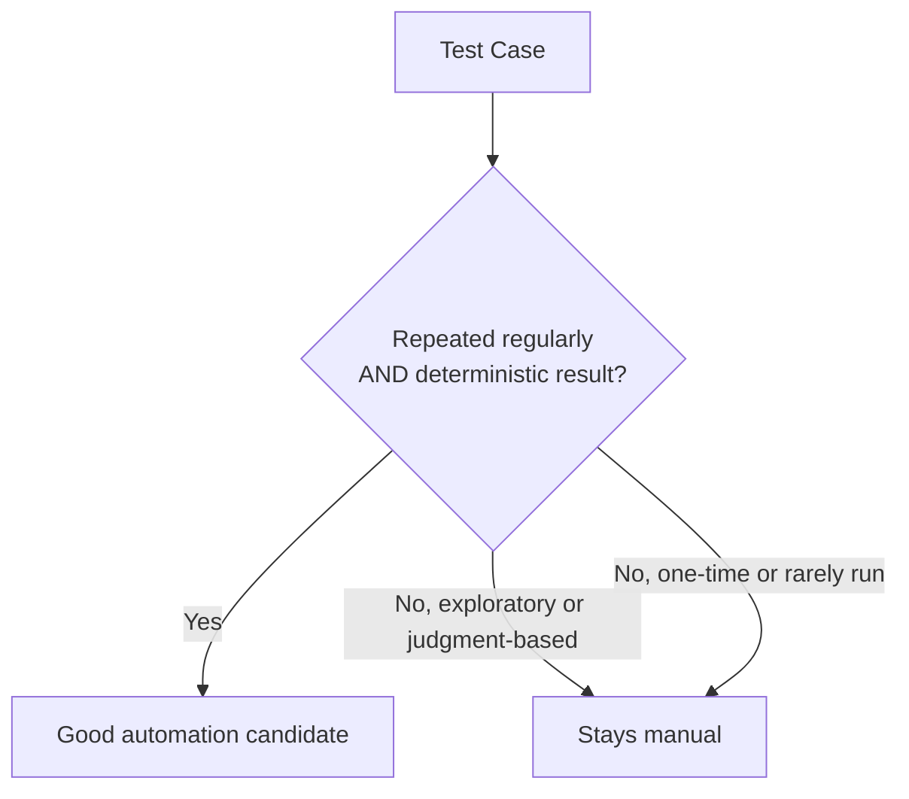

# Introduction to Automation Testing

**Prerequisites**: You should already have completed [Manual Testing and Test Design](/learning-paths/manual-testing/test-design-fundamentals), especially [Test Case Organization and Naming](/learning-paths/manual-testing/test-case-organization-and-naming) and [Test Execution and Reporting Results](/learning-paths/manual-testing/test-execution-and-reporting-results).
**Leads to**: After this, you'll be ready for [Automation vs. Manual Testing](/learning-paths/automation/automation-vs-manual-testing).

A team that automates its entire regression suite in one enthusiastic sprint often ends up worse off than a team that automated nothing — not because automation doesn't work, but because a suite built on the wrong test cases, with no plan for maintenance, becomes a second full-time job nobody signed up for. This module is about what test automation actually is and the mindset that keeps it an asset instead of a liability.

## Why This Matters

**A team that automates everything at once.** A team fresh off reading about test automation's benefits spends a sprint automating their entire 400-case manual regression suite, script by script, as fast as they can write them. Three months later, half the suite fails on every run — not because the product broke, but because a redesigned button's selector changed, a loading spinner takes half a second longer in the staging environment, and nobody has time to fix 200 broken scripts while also shipping features. The team quietly stops trusting the suite's red X's, starts re-running failures manually "to check," and the automation that was supposed to save time now costs more of it than manual testing ever did.

**A team that automates deliberately.** A different team starts by asking which of their 400 manual test cases actually deserve automation — the ones run every release, with stable, deterministic expected results — and automates 40 of them first, with a plan for who maintains them. Three months later, that smaller suite still passes reliably, catches real regressions, and the team trusts every red X enough to act on it without re-checking by hand. They automate the next batch once the first batch has proven itself, not before.

Both teams "did test automation." Only one of them built something that's still useful in three months. The difference isn't tooling — it's the mindset this module exists to build before any tool gets touched.

## What Test Automation Covers

**Test automation** means using software to execute a test, compare the actual result against an expected result, and report pass or fail — without a human manually performing those steps each time. It doesn't automate *testing* (the thinking, the test design, the judgment about what's worth checking) — it automates the *execution* of a test that a human has already designed. This distinction matters immediately: [Test Design Fundamentals](/learning-paths/manual-testing/test-design-fundamentals)'s entire toolkit (BVA, Equivalence Partitioning, Decision Tables, State Transitions) still applies in full — automation changes how a designed test gets *run*, not how it gets *designed*.

**What automation is genuinely good at**: running the same, deterministic check repeatedly, fast, without fatigue or inconsistency — exactly the profile of regression testing, where the same set of checks needs to pass release after release. A human executing the same 40 test cases for the tenth release in a row will eventually skip a step, misread a result, or lose focus; a script won't, provided it was built correctly.

**What automation is not good at**: judgment calls, anything genuinely exploratory, or anything where "does this look right" requires human perception and context — a script checks the exact conditions it was told to check, and nothing else. [Exploratory Testing Fundamentals](/learning-paths/manual-testing/exploratory-testing-fundamentals) covers a testing mode automation structurally cannot replace, not because tooling isn't good enough yet, but because exploratory testing's entire value is a human noticing something nobody thought to check for in advance.

| | Automated Execution | Manual Execution |
|---|---|---|
| **Best at** | Repeating a fixed check, fast, consistently, at any scale | Judgment, exploration, anything requiring human perception |
| **Cost shape** | High upfront (building it), low marginal (running it again) | Low upfront, but the same cost every single time it runs |
| **What breaks it** | Anything the script wasn't told to check for; UI/API changes not designed for automation-friendliness | Human fatigue and inconsistency over many repeated runs |

## When Automation Matters Most

- **Regression suites run on every release** — exactly the repeated, deterministic profile automation is built for, and where manual execution's per-run cost adds up fastest.
- **Checks that need to run at a scale or speed no human can match** — hundreds of API requests, a suite that needs to run on every commit within minutes, not hours.
- **Stable features unlikely to change often** — automation built against a UI or API still actively being redesigned needs constant rework, often costing more than it saves during that period.

Automation matters less for a feature still being actively designed, a one-time check that will never run again, or anything genuinely exploratory — forcing automation onto these wastes effort building something that either needs rebuilding immediately or was never going to pay off. [Selecting the Right Test Cases for Automation](/learning-paths/automation/selecting-the-right-test-cases-for-automation) covers this decision in full depth.

## How This Works on a Real Project

AtlasBank's QA team is planning automation for the Internet Banking platform ahead of a major release cadence increase — from monthly to weekly releases. A team lead, excited by the deadline pressure, proposes automating the entire 300-case manual regression suite in the two weeks before the first weekly release.

A more experienced engineer on the team pushes back with a specific, narrower proposal instead: start with the 35 test cases covering login, balance display, and fund transfer — AtlasBank's most business-critical, most stable, most frequently-run checks — and treat everything else as still manual for now. The reasoning: these 35 cases are run on literally every release, have completely deterministic expected results (a balance is either correct or it isn't), and the underlying screens aren't scheduled to change for at least two quarters. The remaining 265 cases include a mix of screens still being redesigned, cases run only quarterly, and several genuinely exploratory checks that were never really candidates for automation in the first place — attempting to automate all of them in two weeks would mean building most of the suite too fast to build it well.

Six months later, the 35-case suite is still passing reliably and has caught three real regressions before release. The team is now automating its second batch, chosen the same deliberate way — not because they ran out of enthusiasm for the first approach, but because it worked.

## Common Mistakes

**Mistake 1: Treating "automate everything" as the goal.**
As the opening example shows, automating indiscriminately produces a large suite that's expensive to maintain and, once it starts failing unreliably, gets ignored — the opposite of the confidence automation is supposed to provide.

**Mistake 2: Automating a feature that's still being actively redesigned.**
Automation built against a moving target needs constant rework — the AtlasBank example specifically excluded screens with planned near-term changes for exactly this reason.

**Mistake 3: Assuming automation replaces manual testing entirely.**
Automation replaces *repeated execution* of *already-designed* tests — it doesn't replace test design, judgment, or exploratory testing, all of which remain genuinely human skills.

**Mistake 4: Starting with the largest, most ambitious batch instead of a small, proven one.**
A smaller, well-chosen first batch that actually stays reliable builds real trust and a real maintenance practice — a huge first batch that breaks constantly burns both.

## Best Practices

**Practice 1: Start with a small, deliberately chosen batch, not the whole suite.**
The AtlasBank example's 35-case first batch, chosen for stability and frequency, is the pattern worth repeating — prove the approach works before scaling it.

**Practice 2: Reserve automation for genuinely repeated, deterministic checks.**
This is the single filter that separates good automation candidates from cases that will always be better run manually or explored freshly.

**Practice 3: Treat automation as a second engineering deliverable, not a one-time task.**
A script that passes once and is never revisited isn't automation — it's a snapshot. Planning for maintenance from the start is what separates the two teams in this module's opening example.

**Practice 4: Keep test design and test automation as distinct skills, applied in that order.**
Design the test using the same discipline as any manual test case; only then decide whether and how to automate its execution.

:::note From the Field
A retail company's automation initiative was measured, internally, by "number of automated test cases" as its headline success metric. The team optimized for exactly that number — automating hundreds of simple, low-value checks (does this page load, does this button exist) that were fast to write and inflated the count, while the handful of genuinely complex, high-risk checkout flows that actually needed automation's reliability stayed manual, untested on most releases because they were the hardest and slowest to automate. A production incident in checkout — the one area with the least automated coverage — traced directly back to this metric optimizing for the wrong thing.
:::

:::tip Senior QA Insight
A newer engineer measures automation progress by how many test cases have been automated. A senior engineer measures it by how much manual regression time has actually been eliminated *and* how much the team still trusts the suite's results — a large count of automated checks that nobody trusts, or that don't cover the actual risk, is worse than a small count that does.
:::

## Mini Challenge

**Scenario**: AtlasBank's QA team has a 60-case manual regression suite for the Loan Portal. 20 cases cover the loan-application form (redesigned twice in the last year, another redesign planned next quarter). 15 cases cover loan-status lookup (stable for two years, run on every release). 25 cases are exploratory checks with no fixed expected result, run once per quarter by different testers each time.

**Your task**: Decide which of these three groups is the strongest automation candidate, which is the weakest, and state the specific reasoning for each — not just a ranking.

## Key Takeaways

- Test automation automates the *execution* of an already-designed test, not the test design or judgment itself — [Test Design Fundamentals](/learning-paths/manual-testing/test-design-fundamentals)'s toolkit still applies in full.
- Automation is best suited to repeated, deterministic checks — regression suites are the clearest fit, exploratory testing structurally isn't a fit at all.
- A large, hastily-built suite that fails unreliably erodes trust faster than a small, deliberately-chosen suite builds it.
- Automation is an ongoing engineering deliverable requiring maintenance, not a one-time task that's "done" once it first passes.

---

## What You Just Learned

- What test automation actually is, and what it deliberately does not replace
- Why "automate everything at once" tends to produce a suite nobody trusts, using a real contrast between two teams' approaches
- The specific profile of a good automation candidate: repeated, deterministic, stable
- How AtlasBank's QA team chose a small, deliberate first automation batch and why it worked

**Next:** [Automation vs. Manual Testing](/learning-paths/automation/automation-vs-manual-testing)

## Related Topics

- [Test Design Fundamentals](/learning-paths/manual-testing/test-design-fundamentals) — The test-design discipline this path builds on, not replaces
- [Exploratory Testing Fundamentals](/learning-paths/manual-testing/exploratory-testing-fundamentals) — The testing mode automation structurally cannot replace
- [Automation vs. Manual Testing](/learning-paths/automation/automation-vs-manual-testing) — Where this module's distinction gets developed into a full decision framework

## Interview Questions

**Q1: What's the difference between automating a test and automating testing?**

*What to look for*: A candidate who clearly separates test *design* (a human skill) from test *execution* (what automation actually does), and who doesn't claim automation replaces judgment or exploratory testing entirely.

:::note Common Interview Mistake
Many candidates answer "automation makes testing faster" without qualifying what it actually replaces. That's incomplete — a strong answer specifically names that automation replaces repeated *execution* of already-designed tests, not test design or exploratory judgment, and can name a testing activity (like exploratory testing) automation doesn't touch at all.
:::

**Q2: How would you decide what to automate first on a team with no existing automation?**

*What to look for*: A candidate who describes starting small and deliberately — stable, frequently-run, deterministic cases first — rather than proposing to automate an entire existing manual suite at once.

---

## Glossary

**Test Automation**: Using software to execute a test, compare the actual result against an expected result, and report pass or fail, without manual human execution each time.

**Regression Suite**: A set of tests re-run on each release to confirm existing functionality still works — the most common and clearest fit for automation.

**Automation Candidate**: A test case whose characteristics (repeated regularly, deterministic expected result, stable underlying feature) make it well-suited to automation.

## Quick Revision

Remember these five points:

✓ Automation replaces repeated *execution* of an already-designed test — not test design or judgment.
✓ The clearest automation fit: repeated, deterministic, stable checks — regression suites specifically.
✓ Exploratory testing structurally cannot be automated — it depends on human perception and judgment.
✓ A large, hastily-automated suite that fails unreliably erodes trust faster than a small, reliable one builds it.
✓ Automation requires ongoing maintenance — it's an engineering deliverable, not a one-time task.
