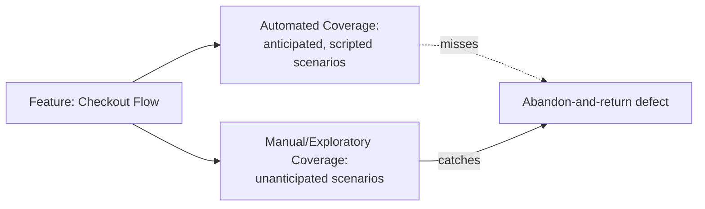

# Automation vs. Manual Testing

**Prerequisites**: You should already understand [Introduction to Automation Testing](/learning-paths/automation/introduction-to-automation-testing).
**Leads to**: After this, you'll be ready for [Selecting the Right Test Cases for Automation](/learning-paths/automation/selecting-the-right-test-cases-for-automation).

"Should we automate this or test it manually" is usually the wrong question, asked as if the two compete for the same job. The more useful question is which layer of risk a specific check is actually protecting against — because automation and manual testing are strong in different, complementary places, not interchangeable options for the same work.

## Why This Matters

**A team that treats automation as strictly better.** A team decides that, going forward, "manual testing" means untested — anything not automated doesn't get checked before release, since automation is treated as the modern, correct approach and manual testing as a legacy habit to phase out. A new checkout flow ships with full automated coverage of the happy path (valid card, valid address, successful payment) and zero manual exploratory time. Two weeks later, real customers report a confusing, broken state when they abandon checkout partway through and return later — a scenario no automated script was written for, and nobody manually explored the flow enough to notice it before release.

**A team that treats them as complementary.** A different team automates the same happy-path checkout scenarios — genuinely valuable, since they run on every release — and *also* schedules a short exploratory session specifically on the new flow before release, per [When to Use Structured vs. Exploratory Testing](/learning-paths/manual-testing/when-to-use-structured-vs-exploratory-testing)'s own reasoning about brand-new features with no usage history yet. The exploratory session finds the exact abandon-and-return defect the first team's automated suite structurally could never have found, because nobody had thought to write a script for a scenario nobody anticipated.

Automation didn't fail in the first scenario — it did exactly what it was built to do. The team's mistake was assuming it did everything, leaving nothing for the layer that actually catches the unanticipated.

## What This Comparison Covers

**What automation is structurally strong at**: executing the same deterministic check, fast, at scale, without fatigue — a direct extension of [Introduction to Automation Testing](/learning-paths/automation/introduction-to-automation-testing)'s core distinction. It's also strong at things a human genuinely struggles with: running the exact same 200-step sequence a thousand times identically, or checking a numeric calculation's precision to the cent, every single time, without a lapse in attention.

**What manual testing is structurally strong at**: anything requiring human judgment, perception, or genuine exploration — noticing that a page *feels* slow even though no explicit timing check failed, noticing a confusing layout even though every element technically rendered, or finding the exact kind of unanticipated scenario this module's opening example shows. [Exploratory Testing Fundamentals](/learning-paths/manual-testing/exploratory-testing-fundamentals) covers this mode in full; the point here is narrower — this isn't a weaker version of automation, it's a genuinely different capability.

| | Automation | Manual Testing |
|---|---|---|
| **Finds defects in** | What was anticipated and scripted for | What wasn't anticipated, requires judgment, or is genuinely new |
| **Cost per repeated run** | Very low, once built | The same cost every time |
| **Cost to build/perform once** | High (design + implementation) | Low (design only) |
| **Degrades when** | The underlying feature changes faster than the suite is maintained | The tester is fatigued, rushed, or the feature is too large for the time available |

**The real question isn't "automation or manual"** — it's which risk a specific check is actually protecting against, and which approach is structurally capable of catching it. A regression check on a stable, high-traffic flow is an automation question. A first look at a brand-new, unfamiliar feature is a manual, likely exploratory, question. Most real test strategies need both, applied to different parts of the same product.

## When Each Approach Matters Most

- **Automation matters most** on stable, frequently-run, deterministic checks — exactly [Introduction to Automation Testing](/learning-paths/automation/introduction-to-automation-testing)'s own automation-candidate criteria.
- **Manual testing matters most** on anything brand-new, anything requiring a genuine "does this feel right" judgment, and anything where the actual risk is in a scenario nobody has thought to anticipate yet.
- **Both matter together** on any release-critical flow with real usage — a checkout flow, a login flow, a fund transfer — where regression risk (automation's job) and unanticipated-scenario risk (manual/exploratory's job) are both genuinely present at once.

Treating this as a strict either/or, in either direction, misses real coverage — assuming automation alone is sufficient misses the unanticipated; assuming manual testing alone is sufficient means paying full human cost on every single release for checks that would run identically, faster, as a script.

## How This Works on a Real Project

AtlasBank's mobile app team is preparing a new biometric-login feature (fingerprint/face unlock as an alternative to a password). The team automates the core happy path immediately — biometric success unlocks the app, biometric failure falls back to password entry — since these are deterministic, testable outcomes that will run on every future release once the feature ships.

Before release, a tester also spends a half-day exploratory session specifically on the new feature, following [Exploratory Testing Fundamentals](/learning-paths/manual-testing/exploratory-testing-fundamentals)'s charter-based approach rather than a fixed script, deliberately trying sequences nobody scripted for: enabling biometric login, then changing the registered fingerprint on the device itself; force-quitting the app mid-biometric-prompt; switching between biometric and password entry rapidly. This session finds a real defect: force-quitting the app during the biometric prompt leaves the account in a state where the *next* login attempt — even a normal password login — is silently rejected, requiring a full app reinstall to recover. No automated script would have found this, because nobody would have thought to write "force-quit during a biometric prompt" as an automated test case before a human's exploratory instinct suggested trying it.

The fix ships before release specifically because both layers ran — the automated suite would have caught nothing here (it wasn't testing a scenario built to fail this way), and the exploratory session's value was exactly in generating a scenario nobody had scripted.

## Common Mistakes

**Mistake 1: Treating manual testing as the "legacy" approach automation is meant to replace.**
As the opening example shows, this leaves an entire risk category — the unanticipated — completely uncovered, not because automation failed at its job, but because nothing else was covering the job automation was never meant to do.

**Mistake 2: Treating every check as a candidate for one approach without asking what risk it protects against.**
The real question is which risk category a specific check addresses — deterministic regression (automation) or unanticipated/judgment-based (manual) — not a blanket policy applied to everything.

**Mistake 3: Assuming a feature is "covered" once it has automated tests, with no manual/exploratory pass at all.**
The AtlasBank biometric example shows this directly — full automated happy-path coverage, with a real, serious defect still shipping-adjacent until a manual exploratory session specifically looked for what wasn't scripted.

**Mistake 4: Running full manual regression on stable, unchanged features indefinitely, out of habit.**
The inverse mistake — a stable, deterministic, frequently-run check that's never been automated is paying full human cost repeatedly for something a script would do identically, faster, and more consistently.

## Best Practices

**Practice 1: For every release-critical flow, plan for both automated regression coverage and a manual/exploratory pass, not one or the other.**
The AtlasBank biometric-login example shows both catching genuinely different things on the same feature.

**Practice 2: Ask which risk category a check protects against before deciding how to test it.**
Deterministic, repeated, anticipated risk → automation. Unanticipated, judgment-based, exploratory risk → manual. Most real features have both risk categories present.

**Practice 3: Revisit the automation/manual split as a feature matures.**
A brand-new feature leans manual/exploratory at first (nothing stable enough to automate yet, high unanticipated risk); a mature, stable feature leans automated (the unanticipated-risk surface has mostly already been found and fixed).

**Practice 4: Don't measure "coverage" by automated test count alone.**
A team that only tracks automated coverage numbers can look fully covered on paper while missing exactly the unanticipated-scenario risk category entirely, as this module's opening example shows.

:::note From the Field
An insurance company's claims-processing team proudly reported 95% automated test coverage on their new claims-submission API ahead of a major release — every documented scenario in the spec had an automated test. A real customer submitted a claim with a file attachment exactly at the platform's maximum allowed size, uploaded from a slow mobile connection that timed out partway through, leaving a partially-uploaded file the system accepted as complete and processed as if valid. No automated test covered this exact combination, because nobody writing test cases from the spec had thought to combine "maximum file size" with "slow connection causing partial upload" — a combination only a tester manually poking at edge conditions, rather than working from the documented spec, was likely to stumble onto.
:::

:::tip Senior QA Insight
A newer engineer treats "we have automated tests for this" as equivalent to "this is tested." A senior engineer asks a follow-up question automatically: what automated tests *don't* cover here, and does anything need a manual or exploratory pass to close that gap — treating automated coverage as one layer of a strategy, not the whole strategy.
:::

## Mini Challenge

**Scenario**: AtlasBank is launching a redesigned transaction-history screen with infinite scroll (loading more transactions as the user scrolls down) replacing the old paginated version.

**Your task**: List two things worth automating immediately (deterministic, repeatable) and two things worth a manual/exploratory pass specifically because of the redesign (unanticipated risk, genuine judgment). State your reasoning for each.

## Key Takeaways

- Automation and manual testing are complementary, not competing — each catches real defects the other structurally cannot.
- Automation is strong on deterministic, repeated, anticipated checks; manual testing (especially exploratory) is strong on unanticipated scenarios and judgment calls.
- A feature can have full automated happy-path coverage and still ship a real defect that only a manual/exploratory pass would catch — automated coverage numbers alone don't mean "tested."
- The automation/manual split should shift as a feature matures — more manual/exploratory when new and unstable, more automated once stable and repeatedly run.

---

## What You Just Learned

- Why "automation vs. manual testing" is usually the wrong framing, and what question to ask instead
- The specific, structural strengths of each approach, and where they genuinely don't overlap
- How a real defect (AtlasBank's biometric force-quit bug) was caught specifically because a manual exploratory pass ran alongside full automated coverage, not instead of it
- Why automated coverage numbers alone can create false confidence about how "tested" a feature actually is

**Next:** [Selecting the Right Test Cases for Automation](/learning-paths/automation/selecting-the-right-test-cases-for-automation)

## Related Topics

- [Introduction to Automation Testing](/learning-paths/automation/introduction-to-automation-testing) — The automation-candidate criteria this module builds directly on
- [Exploratory Testing Fundamentals](/learning-paths/manual-testing/exploratory-testing-fundamentals) — The manual testing mode this module's unanticipated-risk examples both rely on
- [When to Use Structured vs. Exploratory Testing](/learning-paths/manual-testing/when-to-use-structured-vs-exploratory-testing) — The decision framework this module's "both, applied to different risk" conclusion directly extends

## Interview Questions

**Q1: When would you choose manual testing over automation, or vice versa?**

*What to look for*: A candidate who frames this around which risk category a specific check addresses — deterministic/repeated vs. unanticipated/judgment-based — rather than a blanket preference for one approach, ideally with a concrete example of each.

:::note Common Interview Mistake
Many candidates answer "automation is faster so you should automate as much as possible." That misses the actual distinction — a strong answer explains that automation and manual testing catch structurally different things, and that full automated coverage doesn't mean a feature is fully tested, citing what automation specifically cannot catch (the unanticipated).
:::

**Q2: A feature has 100% automated test coverage of its documented requirements and still shipped a customer-facing defect. How is that possible?**

*What to look for*: A candidate who explains that automated tests only catch what was anticipated and scripted for — a defect in an unanticipated scenario, combination, or edge condition is invisible to a suite that never tested for it, regardless of how complete its documented-requirement coverage is.

---

## Glossary

**Happy Path**: The primary, expected sequence of steps a user follows when everything goes as intended — often the first and most obvious thing to automate, but not sufficient coverage on its own.

**Unanticipated Scenario**: A real usage pattern or edge condition nobody thought to write a test case for in advance — the specific risk category exploratory and manual testing are structurally suited to catch that automation is not.

## Quick Revision

Remember these five points:

✓ Automation and manual testing are complementary — each catches real defects the other structurally cannot.
✓ Automation excels at deterministic, repeated, anticipated checks; manual/exploratory testing excels at unanticipated scenarios and judgment calls.
✓ Full automated coverage of documented requirements does not mean a feature is fully tested.
✓ Ask which risk category a check protects against before deciding how to test it.
✓ Shift the automation/manual balance as a feature matures — more manual early, more automated once stable.
