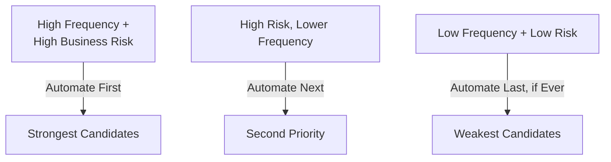

# Selecting the Right Test Cases for Automation

**Prerequisites**: You should already understand [Automation vs. Manual Testing](/learning-paths/automation/automation-vs-manual-testing) and the rest of [Section 1](/learning-paths/automation/section-1-review).
**Leads to**: After this, you'll be ready for [Automation Framework Fundamentals](/learning-paths/automation/automation-framework-fundamentals).

The previous two modules established *that* some test cases are better automation candidates than others. This module makes that judgment concrete — a specific set of criteria you can actually apply to a real test case, not just "repeated and deterministic" as a vague filter.

## Why This Matters

**A team that automates by convenience.** A team building their first automation suite picks test cases by what's easiest to script — simple UI checks, pages with clean, stable selectors, flows with few steps. Three months in, the suite covers dozens of low-risk, cosmetic checks (does this label say the right thing, does this button appear) and none of the genuinely complex, business-critical flows, because those were harder to automate and got deprioritized every sprint in favor of easier wins. A real defect ships in the exact area with zero automated coverage — the complex flow nobody wanted to tackle first.

**A team that automates by risk and value.** A different team explicitly ranks candidates by a combination of business risk and repetition frequency before considering how easy each one is to build. The genuinely complex, high-risk flows get prioritized even though they're harder to automate — because a defect there costs far more than a defect in a cosmetic label check, and being harder to build doesn't make a check less worth having.

The first team optimized for what was easy to say yes to. The second optimized for what actually reduces risk. Only one of these produces a suite that's protecting the business from something that would actually hurt if it broke.

## What This Module Covers

**The core criteria**, extending [Introduction to Automation Testing](/learning-paths/automation/introduction-to-automation-testing)'s repeated-and-deterministic filter into a fuller framework:

| Criterion | Strong Candidate | Weak Candidate |
|---|---|---|
| **Frequency** | Run on every release, or very often | Run once, or rarely (quarterly, one-off) |
| **Stability** | The underlying feature isn't scheduled to change soon | Actively being redesigned |
| **Determinism** | A clear, unambiguous pass/fail result | Requires human judgment ("does this look right") |
| **Business risk if it breaks** | High — a defect here costs real money, trust, or compliance standing | Low — cosmetic, or low-traffic |
| **Data setup cost** | Reasonable, repeatable, ideally automatable itself | Requires extensive, hard-to-reproduce manual setup each time |

No single criterion decides alone — a test case run frequently but with low business risk (a cosmetic check on a rarely-visited settings page) is a weaker candidate than the frequency alone suggests; a test case with high business risk but genuinely requiring human judgment (does this recommendation feel relevant) isn't a good automation candidate regardless of how much it matters, because determinism is missing entirely.

**The specific anti-criteria** — signs a test case should stay manual even if some other criteria look favorable:

- **Requires subjective visual judgment** ("does this layout look right," as opposed to "does this specific pixel-measurable property match an expected value") — automatable in principle with visual-regression tooling, but a genuinely different, more specialized technique than the general test automation this path covers.
- **The underlying feature is actively being redesigned** — automation built now needs rework before it's even proven itself once.
- **Genuinely exploratory in nature** — no fixed expected result to assert against, which structurally cannot be automated at all, not just impractically.
- **Extremely rare execution** (once a year, or truly one-time) — the upfront cost of building and maintaining automation rarely pays back for something run this infrequently.

**A simple prioritization approach**: score each candidate on frequency and business risk (both roughly high/medium/low), and start with the intersection of high-frequency *and* high-risk cases — exactly the AtlasBank login/balance/transfer example from [Introduction to Automation Testing](/learning-paths/automation/introduction-to-automation-testing). Medium-frequency, high-risk cases come next; low-frequency, low-risk cases come last, if ever.

## When This Framework Matters Most

- **Building a first automation suite from scratch** — exactly where the "automate by convenience" trap in the opening example is easiest to fall into, since there's no existing suite yet to anchor prioritization against.
- **Deciding what to automate next**, once an initial batch is stable — the same frequency-and-risk ranking applies to every subsequent batch, not just the first.
- **Pushing back on a request to automate something specific** — having concrete criteria makes it possible to explain *why* a particular request is a weak candidate, rather than a vague "that's hard to automate."

This framework matters less once a team has a mature, well-established suite and is deciding between two similarly strong candidates — at that point, other factors (implementation cost, team capacity) reasonably start to matter more than re-deriving frequency and risk from scratch each time.

## How This Works on a Real Project

AtlasBank's QA team is deciding what to automate next, having already covered login, balance, and transfer (from [Introduction to Automation Testing](/learning-paths/automation/introduction-to-automation-testing)'s example). Three candidates are proposed: (1) the "update profile photo" feature, run occasionally by users, cosmetic and low-risk if it breaks; (2) the beneficiary-management feature (add/edit/remove a transfer recipient), run frequently and directly gating whether a fund transfer can happen at all; (3) a currently-being-redesigned "spending insights" dashboard, scheduled for a significant UI overhaul next quarter.

Applying the framework: candidate 1 scores low on business risk (a broken profile photo is annoying, not costly) despite reasonable frequency — a weak candidate. Candidate 3 fails the stability criterion outright — building automation against a UI scheduled for near-term overhaul means near-certain rework before it's proven itself. Candidate 2 scores high on both frequency (used before most transfers) and business risk (a broken beneficiary flow blocks the transfer feature entirely, AtlasBank's most critical function) — the clear next priority.

The team automates candidate 2 next, explicitly deprioritizing candidate 1 (documented as "revisit once core flows are covered, low priority") and candidate 3 (documented as "revisit after the planned redesign ships, not before") — both real decisions, made visible and revisable, not simply forgotten.

## Common Mistakes

**Mistake 1: Choosing automation candidates by ease of implementation rather than risk and value.**
As the opening example shows, this produces a suite covering what's convenient rather than what actually protects the business — real risk goes uncovered while low-value checks accumulate.

**Mistake 2: Treating frequency alone as sufficient justification.**
A frequently-run but low-risk cosmetic check is a weaker candidate than its frequency alone suggests — business risk has to be weighed alongside it, not instead of it.

**Mistake 3: Automating a feature mid-redesign because "we'll need it eventually anyway."**
The AtlasBank spending-insights example shows why this backfires — automation built against a moving target needs rework before it's even proven stable once, effectively paying the build cost twice.

**Mistake 4: Not documenting why a candidate was deprioritized.**
An undocumented "we decided not to automate this yet" is easy to forget or re-litigate later — the AtlasBank example's explicit, revisable deprioritization notes are what makes the decision durable and reviewable.

## Best Practices

**Practice 1: Score candidates on frequency and business risk together, not either alone.**
This is the specific mechanism that catches the opening example's mistake — a check that's easy or frequent isn't automatically valuable to automate.

**Practice 2: Explicitly check the anti-criteria (subjective judgment, active redesign, genuine exploration, extreme rarity) before committing to a candidate.**
Any one of these is often enough to disqualify an otherwise-plausible candidate.

**Practice 3: Document deprioritized candidates with a specific reason and a revisit condition.**
"Not now, because X; revisit when Y" — turns a decision into something reviewable later, rather than a silent gap nobody remembers making a choice about.

**Practice 4: Re-run this prioritization for every new batch, not just the first.**
Priorities shift as features stabilize or change — the AtlasBank example's redesigned dashboard becomes a strong candidate the moment its redesign ships and stabilizes.

:::note From the Field
A logistics company's automation team, under pressure to show fast progress, automated 150 test cases in their first quarter — nearly all UI-presence and basic-navigation checks selected purely because they were quick to script. A warehouse-inventory reconciliation feature, genuinely complex and central to the business, stayed manual because nobody wanted to tackle it first. A reconciliation defect that silently double-counted returned inventory went undetected for six weeks — caught eventually by a warehouse manager noticing a physical count didn't match the system, not by any of the 150 automated checks, none of which touched the feature that actually mattered most.
:::

:::tip Senior QA Insight
A newer engineer picks the next automation candidate by asking "how hard is this to build." A senior engineer asks "what does this protect against, and how much would it cost if that broke" first — implementation difficulty is a real factor, but it's the second question, not the first, and a senior engineer is willing to take on a harder build when the risk it covers genuinely justifies it.
:::

## Mini Challenge

**Scenario**: AtlasBank has three more automation candidates to rank: (1) the KYC document-upload flow, run by every new customer once, high compliance risk if it silently fails; (2) the "download statement as PDF" feature, run frequently, low risk if it breaks (an annoyance, not a financial or compliance issue); (3) an internal admin tool used by three employees, run daily, moderate risk if it breaks (slows down an internal process, no customer impact).

**Your task**: Rank these three candidates and justify the ranking using the frequency-and-risk framework — note that candidate 1's low *frequency per individual customer* doesn't necessarily mean low priority, and explain why.

## Key Takeaways

- A good automation candidate scores well on frequency, stability, determinism, and business risk together — no single criterion decides alone.
- Specific anti-criteria (subjective judgment, active redesign, genuine exploration, extreme rarity) can disqualify an otherwise-plausible candidate.
- Prioritizing by ease of implementation instead of risk and value produces a suite that covers what's convenient, not what actually matters.
- Documenting deprioritized candidates with a specific reason and revisit condition keeps the decision reviewable, not silently forgotten.

---

## What You Just Learned

- A concrete, multi-criteria framework for evaluating automation candidates, beyond "repeated and deterministic"
- The specific anti-criteria that disqualify a candidate even when other factors look favorable
- How to prioritize a batch of candidates using frequency and business risk together
- How AtlasBank's team chose its next automation priority by applying this framework to three real candidates

**Next:** [Automation Framework Fundamentals](/learning-paths/automation/automation-framework-fundamentals)

## Related Topics

- [Introduction to Automation Testing](/learning-paths/automation/introduction-to-automation-testing) — The repeated-and-deterministic filter this module's fuller framework builds on
- [Risk-Based Testing Fundamentals](/learning-paths/foundations/risk-based-testing-fundamentals) — The risk-weighting principle this module applies specifically to automation prioritization
- [Automation Framework Fundamentals](/learning-paths/automation/automation-framework-fundamentals) — Where this module's selected candidates start becoming actual automated tests

## Interview Questions

**Q1: How would you decide which test cases to automate first on a new project?**

*What to look for*: A candidate who names concrete criteria (frequency, stability, determinism, business risk) applied together, not a single factor like "whatever's easiest" or "whatever's most important" alone — ideally with an example of a candidate that looks strong on one axis but weak on another.

:::note Common Interview Mistake
Many candidates answer "I'd automate the most critical features first" without naming what makes a feature a *good automation candidate* specifically, as opposed to just an important one. That's incomplete — a strong answer distinguishes business importance from automation-suitability, since a genuinely critical feature that's still being redesigned or requires subjective judgment is still a weak candidate right now.
:::

**Q2: When would you decide NOT to automate a test case, even if it's important?**

*What to look for*: A candidate who names at least one specific anti-criterion — active redesign, subjective judgment, genuine exploration, extreme rarity — rather than a vague "if it's too hard."

---

## Glossary

**Anti-Criteria**: Specific characteristics of a test case (subjective judgment required, active redesign, genuine exploration, extreme rarity) that disqualify it as a strong automation candidate even when other factors look favorable.

**Business Risk (Automation Context)**: The real cost — financial, compliance, trust — if the specific behavior a test case checks were to break in production, used alongside frequency to prioritize automation candidates.

## Quick Revision

Remember these five points:

✓ A good automation candidate scores well on frequency, stability, determinism, and business risk together.
✓ Frequency alone isn't sufficient — a frequently-run but low-risk check is still a weak candidate.
✓ Anti-criteria (subjective judgment, active redesign, genuine exploration, extreme rarity) can disqualify a candidate outright.
✓ Prioritize by risk and value, not ease of implementation — the easiest candidates aren't always the most worth automating.
✓ Document deprioritized candidates with a specific reason and revisit condition, so the decision stays reviewable.
