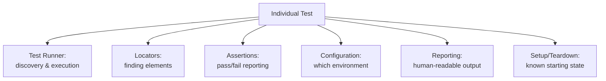

# Automation Framework Fundamentals

**Prerequisites**: You should already understand [Selecting the Right Test Cases for Automation](/learning-paths/automation/selecting-the-right-test-cases-for-automation) and the rest of [Section 1](/learning-paths/automation/section-1-review).
**Leads to**: After this, you'll be ready for [Page Object Model](/learning-paths/automation/page-object-model).

Section 1 established *which* test cases deserve automation. This module is about what actually holds automated tests together once you have more than a handful of them — a framework isn't a specific tool, it's a set of structural decisions every real automation effort has to make, whether deliberately or by accident.

## Why This Matters

**A team with scripts but no framework.** A team automates its first 20 test cases, each one a standalone script — its own login logic copy-pasted at the top, its own way of finding page elements, its own ad hoc way of deciding pass or fail, written by whoever got to that test case first. It works, at 20 scripts. At 80 scripts, a single login-page change means updating login logic in dozens of separate places, some of which get missed. At 150 scripts, nobody can predict how a test will report failure, because each script invented its own approach. The team has automated tests — they don't have an automation framework, and the difference is now costing them real time on every single change.

**A team with a real framework from early on.** A different team, at just 5 scripts, extracts shared login logic into one reusable place, adopts one consistent way of locating elements, and standardizes how a failure gets reported. At 150 scripts, a login-page change is a single update in one place. Every script fails and reports in a consistent, predictable way, regardless of who wrote it or when.

Both teams eventually have "a lot of automated tests." Only one of them has something that scales without collapsing under its own maintenance weight.

## What a Framework Actually Is

**A test automation framework** is the set of shared conventions and reusable structure that every individual test in a suite builds on top of, rather than reinventing per test. It's a design decision, not a specific product — Playwright, Selenium, Cypress, TestNG, and JUnit are all *tools* you can build a framework with, but none of them hand you a framework automatically just by installing them. Two teams using the identical tool can still end up with (or without) a real framework, purely based on the structural decisions layered on top.

**The concerns every framework has to address**, independent of tool:

| Concern | The Question It Answers | What Goes Wrong Without It |
|---|---|---|
| **Test runner** | How are tests discovered, executed, and organized into suites? | Tests run inconsistently, or can't be run as a targeted subset |
| **Locators/selectors** | How does a test find the element it needs to interact with? | The opening example's login-page problem — one convention change means updating every test individually |
| **Assertions** | How does a test decide and report pass vs. fail? | Inconsistent, hard-to-interpret failure output across different tests |
| **Configuration** | How does a test know which environment (staging, production-like) to run against? | Hardcoded URLs/credentials scattered across every script |
| **Reporting** | How does a human find out what happened after a run? | A pile of console output nobody can act on quickly |
| **Reusable setup/teardown** | How does a test get into a known starting state, and clean up after? | Duplicated setup logic, or tests that interfere with each other |

**Concept before tool**: every one of these concerns exists regardless of whether you're using Playwright, Selenium, Cypress, or something else entirely — the specific syntax differs, but the underlying decision ("where does shared login logic live, once, for every test that needs it") is the same decision in every framework. This module teaches the decision; later modules ([Page Object Model](/learning-paths/automation/page-object-model), [Data-Driven Testing](/learning-paths/automation/data-driven-testing)) teach specific, well-established patterns for making it well.

**A brief, deliberately tool-agnostic comparison**, since you'll likely encounter more than one of these in a real career:

- **Playwright** and **Cypress** are both modern, JavaScript/TypeScript-first tools with built-in automatic-waiting behavior (covered in depth in [Synchronization and Wait Strategies](/learning-paths/automation/synchronization-and-wait-strategies)) and strong developer-experience tooling.
- **Selenium** is the longest-established, language-agnostic (Java, Python, C#, JavaScript, and others) standard, with the widest tool and community ecosystem, but requires more manual handling of waiting and synchronization by default.
- **TestNG** and **JUnit** are test-runner/organization frameworks (primarily for Java), often used *alongside* Selenium (which only handles browser interaction, not test organization) — a reminder that "the framework" is frequently a combination of tools addressing different concerns from the table above, not one single product.

No single tool is "correct" — the right choice depends on the team's existing language stack, the application under test, and factors outside this module's scope. What doesn't change across any of these choices is the underlying structural decisions this module covers.

## When Framework Investment Matters Most

- **The moment a second test case is written** — the opening example's problem starts compounding from the very first duplicated login block, not at some later "we have too many tests now" threshold.
- **Any team planning to scale past a handful of tests** — a framework's cost pays back specifically through the maintenance it prevents at scale; a genuinely tiny, one-off script doesn't need the full structure.
- **Any team with more than one contributor writing tests** — shared conventions matter most when different people, with different habits, are all adding to the same suite.

Framework investment matters less for a single, truly disposable script that will run once and be deleted — building full framework structure around something that won't exist next week is its own kind of waste, echoing [Test Design Fundamentals](/learning-paths/manual-testing/test-design-fundamentals)'s own context-dependent judgment about when rigor earns its cost.

## How This Works on a Real Project

AtlasBank's automation team, having selected their first batch of candidates (login, balance, transfer, from earlier modules), makes a deliberate framework decision before writing a single test: login logic lives in exactly one reusable function, called by every test that needs an authenticated session, rather than repeated inline. Three weeks later, AtlasBank's login flow changes — a new required "remember this device" checkbox appears on first login from a new browser. Because login logic lived in one place, the fix is a single, contained update, and every one of the (by now) 40 tests using it works correctly on the very next run, with zero per-test changes required.

Contrast this with what the team explicitly avoided: had login logic been copy-pasted into each of the 40 tests individually (the pattern this module's opening example describes), the same UI change would have meant hunting down and fixing 40 separate copies, several of which would likely be missed on the first pass — exactly the kind of drift that erodes trust in a suite's results, the same failure mode [Introduction to Automation Testing](/learning-paths/automation/introduction-to-automation-testing) opened this whole path with.

## Common Mistakes

**Mistake 1: Treating "we picked a tool" as equivalent to "we have a framework."**
As this module's core distinction shows, a tool provides the mechanism; the structural decisions (where shared logic lives, how failures report) are a separate, deliberate choice the tool doesn't make for you.

**Mistake 2: Deferring framework structure until "we have enough tests to justify it."**
The opening example shows the real cost starts compounding from the second test, not some later threshold — retrofitting structure onto 80 already-duplicated scripts is far more expensive than establishing it at 5.

**Mistake 3: Duplicating shared logic (like login) across individual test scripts.**
This is the single most common, most costly version of "no real framework" — the AtlasBank contrast shows exactly what this costs the moment the underlying feature changes.

**Mistake 4: Choosing a tool based on trend or familiarity alone, without considering the team's actual language stack and application.**
A tool mismatched to the team's existing skills or the application under test can undermine even good framework structure — tool choice and framework structure are related but separate decisions.

## Best Practices

**Practice 1: Establish shared conventions (locators, assertions, reporting) before or alongside the very first test, not after the tenth.**
The earlier this structure exists, the less has to be retrofitted later — exactly the AtlasBank team's approach.

**Practice 2: Put any logic used by more than one test in exactly one reusable place.**
This is the single practice that prevented AtlasBank's login-change problem from becoming a 40-script hunt.

**Practice 3: Separate "how do I find/interact with this element" from "what does this specific test verify."**
This separation is the seed of the Page Object Model, covered in full in the next module — worth internalizing the underlying reason now.

**Practice 4: Pick a tool based on your team's actual language stack and the application under test, not based on which is currently trending.**
The concept-first framing in this module exists specifically so tool choice doesn't have to be treated as an identity decision — the underlying structure transfers regardless of which tool you land on.

:::note From the Field
A mid-sized SaaS company's automation suite grew to over 300 tests over two years, built by a rotating cast of contributors with no established framework conventions — each contributor had picked their own locator strategy, their own way of waiting for elements, their own assertion style. A single, unrelated CSS framework upgrade changed how form elements were rendered in the DOM, breaking roughly 40% of the suite simultaneously, in dozens of subtly different ways depending on each test's individual locator approach. The fix took three engineers two full weeks — not because the underlying change was complex, but because there was no single, shared place to fix the locator logic once.
:::

:::tip Senior QA Insight
A newer engineer picks a tool first, then starts writing tests, treating framework structure as something to figure out along the way. A senior engineer decides the structural conventions — where shared logic lives, how failures get reported — before or alongside the very first test, treating the tool as the least important decision in the room, not the first one.
:::

## Mini Challenge

**Scenario**: You're starting automation for AtlasBank's Admin Portal from scratch. Three engineers will contribute tests over the next month, each more comfortable with a different automation tool.

**Your task**: List three specific structural decisions (from this module's six framework concerns) you'd establish and document *before* any of the three engineers writes their first test, and explain why each one specifically prevents a version of this module's opening example's problem.

## Key Takeaways

- A framework is a set of structural decisions (test runner, locators, assertions, configuration, reporting, reusable setup) — not a specific tool. Installing Playwright or Selenium doesn't automatically give you one.
- These structural concerns exist in every framework, regardless of tool — the specific syntax differs, the underlying decision doesn't.
- Framework cost starts compounding from the second test case, not at some later "we have too many tests" threshold.
- Duplicated shared logic (especially login) across individual scripts is the single most common, most costly sign of a missing framework.

---

## What You Just Learned

- What a test automation framework actually is, and why choosing a tool doesn't automatically give you one
- The six structural concerns every framework has to address, independent of Playwright, Selenium, Cypress, or any other tool
- Why framework investment pays back starting from the second test case, not some later threshold
- How a real login-logic duplication problem was avoided by establishing shared structure early, and what it would have cost otherwise

**Next:** [Page Object Model](/learning-paths/automation/page-object-model)

## Related Topics

- [Introduction to Automation Testing](/learning-paths/automation/introduction-to-automation-testing) — The suite-trust erosion problem this module's framework structure directly prevents
- [Page Object Model](/learning-paths/automation/page-object-model) — The specific, well-established pattern for the locator-separation concept this module introduces
- [Data-Driven Testing](/learning-paths/automation/data-driven-testing) — Another framework-level concern (how test data is supplied) this module's structural thinking extends to

## Interview Questions

**Q1: What's the difference between "using a test automation tool" and "having a test automation framework"?**

*What to look for*: A candidate who clearly separates the tool (Playwright, Selenium, etc. — the mechanism) from the framework (shared conventions for locators, assertions, reporting, reusable logic — the structure), rather than treating the two as synonymous.

:::note Common Interview Mistake
Many candidates answer by naming a specific tool ("we used Playwright, so we had a framework") without describing any actual structural decisions. That conflates the tool with the framework. A strong answer names at least one concrete structural convention — like where shared login logic lives — independent of which tool was used.
:::

**Q2: A team's automated suite breaks extensively after an unrelated UI change. What framework-level issue would you suspect first?**

*What to look for*: A candidate who suspects duplicated, non-centralized logic (especially locators or login) as the likely root cause, citing that a well-structured framework would contain the fix to one place rather than dozens.

---

## Glossary

**Test Automation Framework**: The shared structural conventions (test runner, locators, assertions, configuration, reporting, reusable setup/teardown) a suite of automated tests builds on, distinct from any specific tool used to implement it.

**Locator**: The mechanism a test uses to find a specific element on a page or in an application, to interact with or verify it.

**Test Runner**: The component responsible for discovering, executing, and organizing tests into suites — often a separate concern from the tool handling actual application interaction (e.g., TestNG/JUnit as a runner alongside Selenium for browser interaction).

## Quick Revision

Remember these five points:

✓ A framework is a set of structural decisions, not a specific tool — installing one doesn't automatically give you the other.
✓ Six concerns every framework addresses: test runner, locators, assertions, configuration, reporting, reusable setup/teardown.
✓ Framework cost starts compounding from the second test case, not some later threshold.
✓ Duplicated shared logic (especially login) is the most common, most costly sign of a missing framework.
✓ Choose a tool based on your team's actual language stack and application — the underlying structural concepts transfer regardless.
