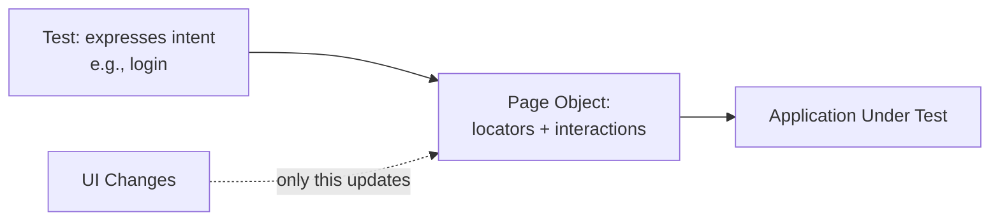

# Page Object Model

**Prerequisites**: You should already understand [Automation Framework Fundamentals](/learning-paths/automation/automation-framework-fundamentals).
**Leads to**: After this, you'll be ready for [Data-Driven Testing](/learning-paths/automation/data-driven-testing).

The previous module named the underlying problem in the abstract — shared logic duplicated across tests is expensive to maintain. Page Object Model is the specific, decades-proven pattern the automation industry converged on to solve exactly this problem for one particular kind of shared logic: how a test finds and interacts with the elements on a page.

## Why This Matters

**A suite without Page Object Model.** A team's 60 automated tests for AtlasBank's Internet Banking platform each contain their own inline element-locating code — the login button is found one way in test 3, a slightly different way in test 17, and a third way in test 42, because three different people wrote them at different times with no shared reference. AtlasBank redesigns the login form, changing the button's underlying markup. Every test that logs in — nearly all 60 of them — breaks, and fixing it means finding and updating dozens of individually-written, inconsistent locator expressions, several of which are subtly different from each other in ways that make find-and-replace unreliable.

**A suite with Page Object Model.** A different team's 60 tests never locate the login button directly at all — every test calls a single, shared `LoginPage.clickLoginButton()` method, defined in exactly one place. When AtlasBank redesigns the login form, one person updates the locator inside that one method, once. All 60 tests pass on the next run without a single one of them being touched.

The difference isn't the number of tests, or even primarily the tool — it's whether "how do I click the login button" is answered once, in one place, or answered separately, inconsistently, sixty times over.

## What Page Object Model Covers

**The core idea**: create one class (or module, depending on language) per page or major component of the application under test — a "page object" — containing every locator and interaction method relevant to that page. Tests then call methods on the page object (`loginPage.login(username, password)`) instead of containing raw locator logic themselves. This is a direct, specific application of [Automation Framework Fundamentals](/learning-paths/automation/automation-framework-fundamentals)'s locator-separation concern.

**What belongs in a page object**: locators for that page's elements, and methods representing meaningful *actions* a user could take on that page (`login()`, `submitTransferForm()`, `openAccountDetails()`). **What does not belong in a page object**: test assertions, or test-specific logic. A page object describes *how to interact with the page*; it stays silent on *what a specific test expects to be true* — that judgment belongs in the test itself.

```text
// Conceptual shape — not tied to a specific tool's exact syntax

class LoginPage {
  usernameField = locator for username input
  passwordField = locator for password input
  loginButton = locator for login button

  function login(username, password):
    fill usernameField with username
    fill passwordField with password
    click loginButton
}

// In a test:
loginPage.login("test-user@example.com", "correct-password")
assert current page is the AtlasBank dashboard
```

The test itself stays readable and focused on intent ("log in, then assert you land on the dashboard") — none of the underlying locator detail leaks into what the test is actually trying to verify. This separation is what let AtlasBank's second team fix a login redesign in one place, since every test's *intent* ("log in") was never coupled to *how* that intent gets executed.

**Page objects can compose** — a `DashboardPage` object might include a shared `NavigationBar` component object used across many pages, rather than duplicating navigation-bar locators inside every page object that has one. This mirrors [Automation Framework Fundamentals](/learning-paths/automation/automation-framework-fundamentals)'s core "shared logic lives in exactly one place" principle, applied recursively.



## When Page Object Model Matters Most

- **Any page or component interacted with by more than one test** — the login page, used by nearly every test in AtlasBank's suite, is the clearest case; the maintenance savings scale directly with how many tests share that interaction.
- **Applications under active development**, where UI changes are expected — Page Object Model's entire value proposition is containing the blast radius of exactly this kind of change.
- **Teams with more than one contributor**, where consistent interaction logic matters as much as consistent conventions elsewhere in the framework.

Page Object Model matters less for a genuinely one-off test interacting with a page nothing else touches — the pattern's cost (an extra class, an extra layer of indirection) is real, and it should be paying for itself through reuse, not applied reflexively to every single test regardless of whether anything is actually shared.

## How This Works on a Real Project

AtlasBank's automation team builds a `TransferPage` object for the fund-transfer feature, with methods like `selectBeneficiary()`, `enterAmount()`, and `submitTransfer()`. Fifteen different tests use this page object — testing valid transfers, boundary amounts, invalid beneficiaries, and more, each test expressing its own specific scenario while all sharing the same underlying interaction methods.

AtlasBank later adds a mandatory "confirm transfer details" step between submission and completion — a genuine workflow change, not just a locator change. Because `submitTransfer()` is the single method every test calls to complete a transfer, the team updates that one method to also handle the new confirmation step. All fifteen tests continue to pass without any test-level changes, because none of them needed to know *how* a transfer gets submitted — only that calling `submitTransfer()` accomplishes it. Had this logic been duplicated across fifteen individual tests instead, the same workflow change would have required fifteen separate, coordinated updates, each one a chance to introduce an inconsistency.

## Common Mistakes

**Mistake 1: Putting test assertions inside page object methods.**
A page object describes how to interact with a page, not what a specific test expects — mixing the two makes page objects less reusable across tests with different expectations, and muddies what the page object is actually responsible for.

**Mistake 2: Creating a page object per test instead of per page.**
This defeats the entire purpose — if a login page object only serves one test, there's no shared maintenance benefit, just added indirection for its own sake.

**Mistake 3: Letting locators leak into test files directly, "just this once."**
Every exception erodes the guarantee that a UI change only requires updating one place — the AtlasBank contrast in this module's opening example shows exactly what a suite full of small exceptions costs at scale.

**Mistake 4: Not composing shared components (like a navigation bar) across page objects.**
Duplicating a shared component's locators across every page object that includes it reintroduces the exact duplication problem Page Object Model exists to solve, just one layer down.

## Best Practices

**Practice 1: Name page object methods after user intent, not implementation detail.**
`login()`, not `fillUsernameFieldThenPasswordFieldThenClickButton()` — the method name should describe what a user is trying to do, keeping tests readable and insulated from implementation changes.

**Practice 2: Keep assertions in the test, interactions in the page object.**
This is the specific discipline that keeps page objects reusable across many different tests with different expectations about the same page.

**Practice 3: Compose shared components rather than duplicating their locators per page.**
A shared navigation bar, header, or footer component object, included by every page object that needs it, extends the same one-place-to-fix principle recursively.

**Practice 4: Create a page object once real reuse exists, not preemptively for every page regardless of test count.**
Matches [Automation Framework Fundamentals](/learning-paths/automation/automation-framework-fundamentals)'s own framework-investment judgment — the pattern earns its cost through reuse.

:::note From the Field
A travel-booking company's automation suite had no page objects at all — three years of accumulated tests, each with inline locators, spread across nearly 200 files. A routine rebrand (updated button styles, renamed CSS classes, restructured page layout) across the entire site broke an estimated 70% of the suite simultaneously. Migrating to a proper Page Object Model afterward — extracting the now-duplicated locator logic into shared page objects — took the team six weeks, done under pressure, instead of being a gradual, low-stress investment made incrementally as tests were originally written.
:::

:::tip Senior QA Insight
A newer engineer, writing their fifth test against the same page, copies and slightly modifies the locator logic from test four because it's faster than stopping to refactor. A senior engineer treats the *second* time a locator gets reused — not the tenth — as the signal to extract it into a page object immediately, because the cost of extracting later only grows with every additional test written against the un-extracted logic.
:::

## Mini Challenge

**Scenario**: You're building automation for AtlasBank's beneficiary-management feature: add beneficiary, edit beneficiary, delete beneficiary — three related actions on the same underlying page, each currently planned as a separate test.

**Your task**: Sketch (in plain language, not code) what methods a `BeneficiaryPage` object should expose for these three tests to share, and identify one thing that should stay in the individual tests rather than move into the page object.

## Key Takeaways

- Page Object Model separates *how to interact with a page* (the page object) from *what a specific test expects* (the test itself) — this is the specific mechanism that contains a UI change's cost to one place.
- A page object contains locators and user-intent-named interaction methods; assertions belong in the test, not the page object.
- Shared components (like navigation) should be composed across page objects, not duplicated within each one.
- The pattern earns its cost through reuse — extract a page object once a locator is genuinely shared, not preemptively for every page regardless of actual reuse.

---

## What You Just Learned

- What Page Object Model is, and the specific maintenance problem it exists to solve
- What belongs in a page object (locators, intent-named actions) versus what stays in the test (assertions)
- How component composition extends the same "fix it in one place" principle to shared elements like navigation
- How a real UI workflow change was absorbed by fifteen tests without any test-level changes, because they shared one page object

**Next:** [Data-Driven Testing](/learning-paths/automation/data-driven-testing)

## Related Topics

- [Automation Framework Fundamentals](/learning-paths/automation/automation-framework-fundamentals) — The locator-separation concern this module implements as a specific, concrete pattern
- [Data-Driven Testing](/learning-paths/automation/data-driven-testing) — A related framework-level concern (how test data is supplied) this module's separation-of-concerns thinking extends to
- [Test Case Organization and Naming](/learning-paths/manual-testing/test-case-organization-and-naming) — The organizational discipline this module applies specifically to interaction logic rather than test case naming

## Interview Questions

**Q1: What is the Page Object Model, and what problem does it solve?**

*What to look for*: A candidate who explains the separation between page interaction logic and test assertions, and names the specific maintenance benefit — a UI change requires updating one place instead of every test that touches that element — rather than a vague "it's a design pattern for automation."

:::note Common Interview Mistake
Many candidates describe Page Object Model as "putting locators in a separate file" without explaining *why* that matters. That's incomplete — a strong answer explains the actual mechanism: tests express intent, page objects contain implementation detail, so a UI change is absorbed in one place instead of propagating to every test.
:::

**Q2: Where should test assertions live in a Page Object Model — the page object or the test?**

*What to look for*: A candidate who clearly states assertions belong in the test, not the page object, and explains why — mixing them reduces a page object's reusability across tests with different expectations about the same page.

---

## Glossary

**Page Object**: A class or module representing one page or component of an application under test, containing its locators and user-intent-named interaction methods, used by tests instead of raw locator logic.

**Component Object**: A page object representing a shared UI element (like a navigation bar) used across multiple pages, composed into each page object that includes it rather than duplicated.

## Quick Revision

Remember these five points:

✓ Page Object Model separates *how to interact with a page* from *what a test expects to be true*.

✓ A page object contains locators and intent-named action methods; assertions stay in the test.

✓ A UI change only requires updating the page object, not every test that uses it — the core maintenance benefit.

✓ Compose shared components (navigation, headers) across page objects rather than duplicating their locators.

✓ Extract a page object once genuine reuse exists — the second time a locator repeats, not preemptively for every page.
