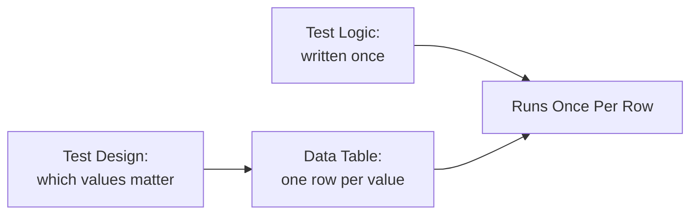

# Data-Driven Testing

**Prerequisites**: You should already understand [Page Object Model](/learning-paths/automation/page-object-model) and the rest of [Section 2](/learning-paths/automation/section-2-review).
**Leads to**: After this, you'll be ready for [Synchronization and Wait Strategies](/learning-paths/automation/synchronization-and-wait-strategies).

[Page Object Model](/learning-paths/automation/page-object-model) separated *how to interact with a page* from *what a test verifies*. This module separates a related but distinct concern: the test *logic* (the sequence of steps) from the *data* driving it — so testing ten input combinations doesn't mean writing the same test ten times over.

## Why This Matters

**A suite with data copy-pasted into logic.** A team automating [Boundary Value Analysis](/learning-paths/manual-testing/boundary-value-analysis)'s standard boundary set for AtlasBank's transfer-amount field writes six nearly-identical tests — one for $0.00, one for $0.01, one for the daily-limit boundary, and so on — each test copy-pasted from the last with only the input amount and expected outcome changed. A business rule changes: the daily limit itself increases. Now six separate tests need their hardcoded values found and updated, and a seventh boundary case the team wants to add means copying the pattern an eighth time.

**A suite with data separated from logic.** A different team writes the transfer-boundary test *once* — the steps (enter an amount, submit, check outcome) — and drives it with a table of input/expected-outcome pairs, one row per boundary value. The same daily-limit change means updating one row in one table. Adding a new boundary case means adding one row, not copying an entire test.

Both teams end up covering the same six (or seven) boundary values. Only one of them can change or extend that coverage without touching the actual test logic at all.

## What Data-Driven Testing Covers

**The core idea**: write the test's *steps* once, then supply a set of *data* — inputs and their expected outcomes — that the same steps run against, once per data row. This is a direct application of [Boundary Value Analysis](/learning-paths/manual-testing/boundary-value-analysis) and [Equivalence Partitioning](/learning-paths/manual-testing/equivalence-partitioning)'s own output: those techniques generate a *set* of values worth testing — data-driven testing is the automation-side mechanism for running the same check against every value in that set, without writing the check itself more than once.

```text
// Conceptual shape — not tied to a specific tool's exact syntax

testData = [
  { amount: 0.00,      expectedResult: "rejected, below minimum" },
  { amount: 0.01,      expectedResult: "accepted" },
  { amount: 9999.99,   expectedResult: "accepted" },
  { amount: 10000.00,  expectedResult: "rejected, exceeds daily limit" },
]

for each row in testData:
  enter row.amount into transfer form
  submit
  assert outcome matches row.expectedResult
```

The test logic (enter, submit, assert) appears exactly once. Every row in `testData` exercises it independently — this is precisely the mechanism that let the second AtlasBank team in this module's opening example update one row instead of six separate test files.

**Where test data can live**: inline in the test file (fine for a small, stable set), a separate structured file (CSV, JSON, a spreadsheet) for a larger or more frequently-changed set, or a dedicated test-data-management source for genuinely large or shared datasets. The right choice depends on scale and how often the data changes — not a fixed rule, but the underlying separation (logic in the test, values in the data) holds regardless of where the data physically lives.

**Data-driven testing and test design are distinct steps, in a specific order**: [Boundary Value Analysis](/learning-paths/manual-testing/boundary-value-analysis) and [Equivalence Partitioning](/learning-paths/manual-testing/equivalence-partitioning) decide *which* values are worth testing — that thinking doesn't change because automation is involved. Data-driven testing is purely about *how* those already-chosen values get run efficiently once you have more than one or two.



## When Data-Driven Testing Matters Most

- **Any test exercising a boundary set or equivalence class** — [Boundary Value Analysis](/learning-paths/manual-testing/boundary-value-analysis)'s standard six-value boundary set is close to a canonical example of data worth separating from logic.
- **Any input space likely to grow** — a new boundary case, a new equivalence class, a new locale or currency — where adding a data row is far cheaper than duplicating an entire test.
- **Any business rule likely to change its specific values** (a limit, a threshold, a rate) without changing the underlying logic being tested — the AtlasBank daily-limit example directly.

Data-driven testing matters less for a test genuinely run against exactly one fixed input with no realistic variation ever expected — the separation adds a layer of indirection that should be earning its keep through actual reuse, the same judgment [Page Object Model](/learning-paths/automation/page-object-model) applies to extracting a page object.

## How This Works on a Real Project

AtlasBank's automation team builds a data-driven test for the international-transfer currency-conversion feature, covering multiple source/target currency pairs (USD→EUR, USD→GBP, EUR→GBP, and others) — each pair needing the same underlying steps (enter amount, select currencies, submit, verify the converted amount matches the expected rate calculation) but genuinely different expected numeric outcomes per pair.

AtlasBank adds support for three new currency pairs ahead of a market expansion. Because the test logic and data are separated, adding coverage for the new pairs means adding three new rows to the data table — realistic, non-round amounts per [Test Data Design](/learning-paths/manual-testing/test-data-design)'s own lesson about avoiding clean numbers that hide rounding defects — with zero changes to the test logic itself. The team also catches a real defect this way: one specific currency pair's row reveals a rounding-direction inconsistency the other pairs' rows didn't expose, precisely because a wide, realistic data set was cheap to build and run once the logic/data separation was already in place.

## Common Mistakes

**Mistake 1: Duplicating test logic for each data variation instead of separating data out.**
The opening example's six near-identical tests show the exact cost this creates — the same business-rule change requiring updates in multiple places instead of one.

**Mistake 2: Using only clean, round values in the data set.**
Exactly [Test Data Design](/learning-paths/manual-testing/test-data-design)'s own lesson, now applied to automated data-driven tests — a rounding or precision defect can hide behind convenient, round test data regardless of whether the test is manual or automated.

**Mistake 3: Treating data-driven testing as a replacement for test design.**
The data rows still need to come from deliberate technique (Boundary Value Analysis, Equivalence Partitioning) — data-driven testing is the *execution* mechanism, not a substitute for deciding which values matter in the first place.

**Mistake 4: Storing test data somewhere disconnected from version control or hard to review.**
Test data driving an automated suite deserves the same review and change-tracking discipline as the test logic itself — a data change is a real, reviewable change to what's being verified.

## Best Practices

**Practice 1: Separate test logic from test data as soon as a test runs against more than one input.**
Mirrors [Page Object Model](/learning-paths/automation/page-object-model)'s own "extract on genuine reuse" judgment — the second data variation is usually the right moment.

**Practice 2: Derive the data set from deliberate test design technique, not ad hoc guessing.**
Boundary Value Analysis and Equivalence Partitioning tell you which values belong in the table — data-driven testing just makes running them efficient.

**Practice 3: Include realistic, non-round values in the data set for anything involving a calculation.**
The AtlasBank currency-conversion example's real defect was only visible because the data set included a genuinely messy, realistic value, not just clean round numbers.

**Practice 4: Keep test data in version control, reviewed the same way as code.**
A silently-changed expected value in a data table is just as real a change to test correctness as a change to the test logic itself.

:::note From the Field
An e-commerce company's discount-code testing was implemented as eleven separate, copy-pasted test scripts — one per discount type (percentage off, flat amount off, free shipping, and others) — each with the discount logic essentially duplicated eleven times with minor variations. A tax-calculation change affecting how discounts interact with tax required updating the shared calculation-verification logic in all eleven scripts individually; two were missed in the first pass, both later failing in a way that took a confusing week to trace back to the same root cause already fixed in the other nine. A subsequent migration to a single data-driven test, with eleven rows instead of eleven scripts, meant the next tax-rule change was a one-line logic update, applied automatically to every discount type at once.
:::

:::tip Senior QA Insight
A newer engineer, asked to add a new test case for a slightly different input, instinctively copies the most similar existing test and modifies it. A senior engineer's first question is whether this new case is really a new *scenario* (different logic, deserving its own test) or just a new *value* for a scenario that already has a data-driven test — and adds a data row instead of a new test file whenever it's the latter.
:::

## Mini Challenge

**Scenario**: AtlasBank's KYC document-upload feature needs to be tested against several file types (PDF, JPEG, PNG — all valid) and several invalid cases (a `.exe` file, a file exceeding the size limit, a file with no extension).

**Your task**: Sketch what a data table for this scenario would look like (columns and a few example rows), and identify which test-design technique from Manual Testing you'd use to make sure the invalid cases are genuinely representative, not arbitrary.

## Key Takeaways

- Data-driven testing separates test *logic* (written once) from test *data* (supplied as a set of rows) — directly reducing the cost of adding or changing coverage.
- The data set itself should come from deliberate test design technique (Boundary Value Analysis, Equivalence Partitioning), not ad hoc guessing — data-driven testing is the execution mechanism, not a substitute for design.
- Realistic, non-round data values matter as much in an automated data table as in manual testing — a clean value can hide a real calculation defect.
- Test data deserves the same version control and review discipline as test logic — a silent data change is a real change to what's being verified.

---

## What You Just Learned

- What data-driven testing is, and how it separates test logic from the data driving it
- How Boundary Value Analysis and Equivalence Partitioning feed directly into a data-driven test's data set
- Why realistic, non-round data values matter in an automated data table, using a real currency-conversion example
- How a real, costly maintenance problem (eleven duplicated discount-code scripts) was resolved by migrating to a single data-driven test

**Next:** [Synchronization and Wait Strategies](/learning-paths/automation/synchronization-and-wait-strategies)

## Related Topics

- [Page Object Model](/learning-paths/automation/page-object-model) — The related separation-of-concerns pattern this module extends to test data specifically
- [Boundary Value Analysis](/learning-paths/manual-testing/boundary-value-analysis) — Where the values that belong in a data-driven test's data set actually come from
- [Test Data Design](/learning-paths/manual-testing/test-data-design) — The realistic, non-round test data principle this module applies directly to automated data tables

## Interview Questions

**Q1: What is data-driven testing, and what problem does it solve?**

*What to look for*: A candidate who explains the separation between test logic (written once) and test data (a set of input/expected-outcome rows), and names the specific benefit — adding or changing coverage means changing data, not duplicating test logic.

:::note Common Interview Mistake
Many candidates describe data-driven testing as "testing with different data" without explaining the actual separation mechanism. That's incomplete — a strong answer specifically contrasts it against duplicating test logic per input value, and names the maintenance cost that duplication creates.
:::

**Q2: How does data-driven testing relate to techniques like Boundary Value Analysis?**

*What to look for*: A candidate who explains that BVA and similar techniques determine *which* values are worth testing, while data-driven testing is the *execution* mechanism for running the same test logic against that whole set efficiently — not a replacement for test design.

---

## Glossary

**Data-Driven Testing**: An automation pattern where test logic is written once and executed once per row in a supplied data set, each row containing an input and its expected outcome.

**Test Data Set**: The collection of input/expected-outcome pairs driving a data-driven test, ideally derived from deliberate test design technique rather than ad hoc selection.

## Quick Revision

Remember these five points:

✓ Data-driven testing separates test logic (written once) from test data (a set of rows) — reducing the cost of adding or changing coverage.

✓ The data set should come from deliberate test design technique (BVA, Equivalence Partitioning), not guessing.

✓ Use realistic, non-round values in the data set — clean values can hide real calculation defects.

✓ Test data deserves version control and review discipline equal to test logic.

✓ Separate data from logic once a test runs against more than one input — the same "extract on genuine reuse" judgment as Page Object Model.
