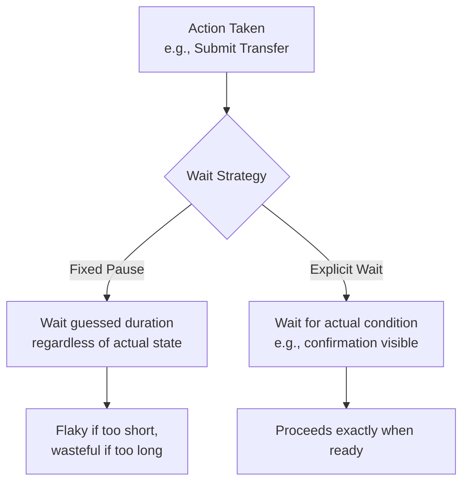

# Synchronization and Wait Strategies

**Prerequisites**: You should already understand [Data-Driven Testing](/learning-paths/automation/data-driven-testing) and the rest of [Section 2](/learning-paths/automation/section-2-review).
**Leads to**: After this, you'll be ready for [Test Stability and Flaky Tests](/learning-paths/automation/test-stability-and-flaky-tests).

A script and the application it's testing run at different speeds, and the gap between them is where more automation failures come from than any other single cause. This module is about that gap — why it exists, why the obvious fix makes it worse, and what actually closes it.

## Why This Matters

**A test with a hardcoded pause.** A test clicks "Submit Transfer" and then waits exactly two seconds before checking for a confirmation message, because two seconds was "usually enough" when the test was first written. On a fast test environment, the confirmation actually appears in 400 milliseconds — the test wastes 1.6 seconds every single run, multiplied across hundreds of tests, adding real minutes to every suite run. On a slower, more loaded environment (a shared CI server under heavy use, for instance), the confirmation sometimes takes 2.5 seconds — and the test fails, not because the feature is broken, but because the fixed pause guessed wrong.

**A test with an explicit wait.** A different test, after clicking "Submit Transfer," waits specifically for the confirmation message to actually appear — however long that genuinely takes, up to a defined maximum. On the fast environment, it proceeds the moment the confirmation shows, in 400 milliseconds, no wasted time. On the slower environment, it waits the full 2.5 seconds it actually needs and still passes, because it was never guessing a fixed duration in the first place — it was waiting for the actual condition.

Both tests are checking the same thing. Only one of them is testing the application's actual behavior instead of testing whether a guessed number happened to be big enough this time.

## What Synchronization Covers

**The core problem**: a browser or application takes a real, variable amount of time to respond to an action — a page load, an API call completing, an animation finishing, data rendering. A test script, left unmanaged, runs far faster than any of this and will try to interact with or check something that isn't ready yet, producing a failure that has nothing to do with whether the application actually works.

**Hardcoded (fixed) waits** — pausing execution for a fixed duration, guessed to be "long enough" — solve the problem inconsistently and expensively: too short, and the test fails on a slow run; too long, and every test run wastes the difference, adding up across a whole suite. This is the opening example's core failure mode, and it's the most common anti-pattern in automation specifically because it's the easiest thing to reach for first.

**Explicit waits** — waiting for a *specific, checkable condition* to become true (an element appearing, becoming clickable, a specific text appearing, a network request completing) up to a defined maximum timeout — solve the problem correctly: the test proceeds the moment the real condition is met, never wastes time waiting longer than necessary, and still gives the application a genuine chance to respond under real, variable load.

**Implicit waits** (a global, ambient "wait up to N seconds before giving up on any interaction" setting, offered by some tools) sit in between — better than a hardcoded pause, but coarser and less precise than an explicit wait targeted at a specific condition, and can behave unpredictably when combined with explicit waits in the same test.

Modern tools (Playwright and Cypress, specifically) build a form of automatic waiting into most interactions by default — the tool itself waits for an element to be actionable before interacting with it, reducing (but not eliminating) the need to write explicit waits by hand. Older or more manual tooling (a typical Selenium setup) more often requires the test author to write explicit waits deliberately. This is a real, meaningful difference between tools, but the underlying *concept* — wait for the actual condition, not a guessed duration — is identical regardless of which tool handles more of it automatically.

| Wait Type | What It Waits For | Risk |
|---|---|---|
| **Hardcoded/fixed pause** | A guessed duration | Too short: flaky failure. Too long: wasted time, every run |
| **Implicit wait** | Any interaction, up to a global timeout | Coarse; can interact unpredictably with explicit waits |
| **Explicit wait** | A specific, checkable condition | Requires knowing which condition actually matters — the only correct default |

## When Synchronization Matters Most

- **Any interaction following an action with variable response time** — a form submission, a page navigation, an API-backed data load — essentially most real interactions in a modern application.
- **Any test run across environments with different performance characteristics** — a local machine versus a shared CI server under load, exactly the opening example's fast-versus-slow environment contrast.
- **Any element that appears, changes, or becomes interactive asynchronously** — a loading spinner resolving, content streaming in, an animation completing.

Synchronization matters less for truly instantaneous, synchronous operations with no real network or rendering delay — though in practice, genuinely instantaneous interactions are rare enough in real applications that explicit waiting is closer to a safe default than an exception.

## How This Works on a Real Project

AtlasBank's automation suite includes a test for the fund-transfer confirmation flow, originally written with a hardcoded three-second pause after submission before checking for the confirmation message — "three seconds is always enough," based on how the feature behaved when the test was first written. Months later, the team adds a new compliance check that runs synchronously before the confirmation displays for certain transfer amounts — adding real, variable processing time the original three-second guess never accounted for. The test starts failing intermittently, only for compliance-checked transfers, and only on the team's shared CI environment, which runs slower under concurrent load than any individual engineer's local machine.

The team's fix isn't to increase the guessed pause to five seconds — a rescue that would eventually fail again the next time processing time changes, and that wastes real time on every fast-path transfer in the meantime. Instead, they replace the fixed pause with an explicit wait for the confirmation message's actual appearance, with a generous maximum timeout. The test now passes reliably in 800ms for the fast path and correctly waits out the full compliance-check duration for the slower path — both real, different durations, both handled correctly, without the test ever having to guess either one in advance.

## Common Mistakes

**Mistake 1: Reaching for a hardcoded pause as the default fix for a timing-related failure.**
As the opening and AtlasBank examples both show, this treats a symptom (this particular run was too slow) rather than the actual cause (the test isn't waiting for the real condition) — and it will eventually fail again under different timing.

**Mistake 2: Increasing a hardcoded pause's duration instead of switching to an explicit wait.**
A longer guess is still a guess — it reduces how often the test fails without addressing why it was guessing in the first place, and wastes more time on every fast run in the meantime.

**Mistake 3: Mixing implicit and explicit waits inconsistently within the same test suite.**
This can produce unpredictable combined timeout behavior, depending on the specific tool — a real, documented risk worth avoiding by picking one primary strategy deliberately.

**Mistake 4: Waiting for the wrong condition.**
Waiting for a page's URL to change, when the actual risk is whether the page's *content* has finished rendering, can still produce a false-positive pass — the wait needs to target the condition that actually matters for what the test checks next.

## Best Practices

**Practice 1: Default to explicit waits targeting the specific condition that actually matters.**
Not "wait three seconds," but "wait until the confirmation message is visible" — the AtlasBank fix, and the correct default in nearly every case.

**Practice 2: Set a generous maximum timeout on explicit waits, not a tight one.**
The maximum is a safety net for genuine failure, not a performance optimization — a wait that proceeds the instant its condition is met costs nothing extra even with a generous ceiling.

**Practice 3: When a test fails intermittently, suspect a timing issue before suspecting the application.**
An intermittent, environment-dependent failure (passes locally, fails on CI) is a strong signal worth checking against this module's content before assuming a real product defect — covered further in [Test Stability and Flaky Tests](/learning-paths/automation/test-stability-and-flaky-tests).

**Practice 4: Know whether your tool waits automatically, and for what, before adding waits by hand.**
Modern tools like Playwright and Cypress handle a meaningful amount of waiting automatically — adding redundant explicit waits on top isn't wrong, but understanding what's already handled avoids unnecessary complexity.

:::note From the Field
A financial services company's regression suite had a hardcoded 5-second pause after every page navigation, added early on "just to be safe." As the suite grew to 200 tests, this added over 16 minutes of pure, unnecessary waiting to every full run — time spent waiting for nothing, since most pages loaded in under a second. Replacing the fixed pauses with explicit waits for actual page-ready conditions cut the full suite's runtime by more than 70%, with zero loss of reliability — the tests that had genuinely needed more than 5 seconds occasionally, and had been silently flaky because of it, also started passing consistently for the first time.
:::

:::tip Senior QA Insight
A newer engineer, seeing a flaky, timing-related test failure, adds or increases a pause to make it pass more often. A senior engineer asks what specific condition the test actually needs to be true before proceeding, and waits for that condition directly — because a longer guess still fails eventually, while waiting for the real condition doesn't have a "eventually" to fail at.
:::

## Mini Challenge

**Scenario**: A test for AtlasBank's beneficiary list clicks "Add Beneficiary," fills in details, submits, and then needs to verify the new beneficiary appears in the list — but the list refreshes via an asynchronous background call after submission, taking anywhere from 200ms to 3 seconds depending on server load.

**Your task**: Describe what an explicit wait for this scenario should actually wait for (be specific about the condition, not just "wait for the list"), and explain why a 1-second hardcoded pause would be a worse choice even though it might pass most of the time.

## Key Takeaways

- Timing mismatches between a test script and the application it's testing are among the most common causes of automation failure — not logic errors.
- A hardcoded pause guesses a duration and fails when the guess is wrong in either direction — too short causes flakiness, too long wastes time on every run.
- An explicit wait targets the actual condition that needs to be true, proceeding exactly when it's met, regardless of how long that genuinely takes.
- An intermittent, environment-dependent test failure is a strong signal to suspect a timing issue before suspecting the application itself.

---

## What You Just Learned

- Why timing, not logic, causes most automation failures
- The real difference between a hardcoded pause, an implicit wait, and an explicit wait — and why explicit waits are the correct default
- How modern tools like Playwright and Cypress handle some waiting automatically, without eliminating the underlying concept
- How a real, costly hardcoded-pause problem (16 minutes of pure waiting per suite run) was fixed by switching to explicit, condition-based waits

**Next:** [Test Stability and Flaky Tests](/learning-paths/automation/test-stability-and-flaky-tests)

## Related Topics

- [Data-Driven Testing](/learning-paths/automation/data-driven-testing) — The prior module's separation-of-concerns thinking, now applied to timing as another concern worth handling deliberately
- [Test Stability and Flaky Tests](/learning-paths/automation/test-stability-and-flaky-tests) — Where this module's timing issues, unaddressed, become the leading cause of the next module's core problem
- [Page Object Model](/learning-paths/automation/page-object-model) — Where explicit wait logic for a specific element often belongs, alongside that element's locator

## Interview Questions

**Q1: What's the difference between a hardcoded wait and an explicit wait, and why does it matter?**

*What to look for*: A candidate who explains that a hardcoded wait guesses a fixed duration (risking flakiness if too short, wasted time if too long) while an explicit wait targets a specific, checkable condition and proceeds exactly when it's met — ideally citing a concrete example of each.

:::note Common Interview Mistake
Many candidates answer "explicit waits are better because they're more precise" without explaining the actual failure mode a hardcoded wait creates. That's incomplete — a strong answer names both directions of the problem: too short causes flaky failures, too long wastes real time on every single run, at scale.
:::

**Q2: A test passes reliably on your local machine but fails intermittently in CI. What would you investigate first?**

*What to look for*: A candidate who names timing/synchronization as a leading suspect for this specific symptom (environment-dependent, intermittent) before jumping to "the application has a bug," and who can explain why CI environments commonly expose timing issues local environments don't.

---

## Glossary

**Synchronization (Automation Context)**: Coordinating a test script's execution with the actual, variable timing of the application under test, so the test never acts on or checks something before it's genuinely ready.

**Explicit Wait**: Waiting for a specific, checkable condition (an element visible, a request complete) to become true, up to a defined maximum timeout — the correct default wait strategy.

**Hardcoded (Fixed) Wait**: Pausing execution for a fixed, guessed duration regardless of actual application state — a common anti-pattern that's either too short (flaky) or too long (wasteful) depending on real, variable conditions.

## Quick Revision

Remember these five points:

✓ Timing mismatches, not logic errors, are the leading cause of automation failure.

✓ A hardcoded pause guesses a duration — too short causes flakiness, too long wastes time every run.

✓ An explicit wait targets the actual condition and proceeds the moment it's true — the correct default.

✓ Modern tools (Playwright, Cypress) automate some waiting, but the underlying concept still applies.

✓ An intermittent, environment-dependent failure is a strong signal to suspect timing before suspecting the application.
