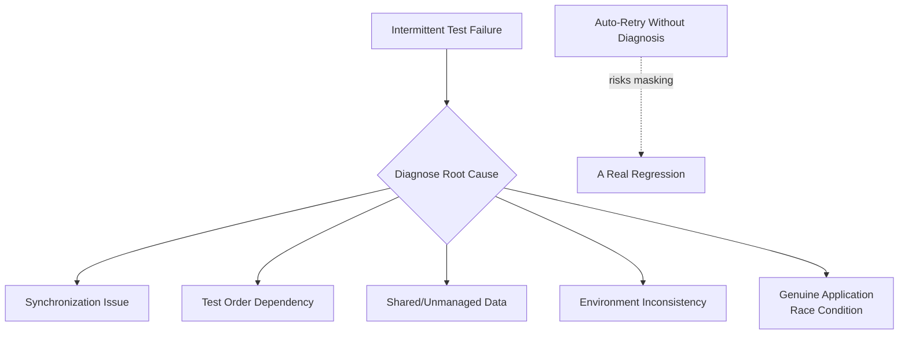

# Test Stability and Flaky Tests

**Prerequisites**: You should already understand [Synchronization and Wait Strategies](/learning-paths/automation/synchronization-and-wait-strategies).
**Leads to**: After this, you'll be ready for [Assertions and Verification Strategies](/learning-paths/automation/assertions-and-verification-strategies).

A test that fails consistently is a nuisance with a clear next step: fix it. A test that fails *sometimes*, for no apparent reason, is worse — it doesn't get fixed, it gets re-run until it passes, and every test around it slowly loses credibility along with it. This module is about why that happens and what actually stops it.

## Why This Matters

**A team that retries flaky tests.** A team's CI pipeline has a handful of tests that fail roughly one run in ten, for no consistent reason anyone has diagnosed. Rather than investigate, the team configures the pipeline to automatically retry any failed test up to three times before reporting a real failure — the flaky tests now "pass" almost every time, and the red X's the team does see are treated as real. Months later, a genuine regression in the fund-transfer flow is masked by this exact retry logic — the feature fails on the first two attempts (correctly) and happens to pass on the third attempt due to an unrelated timing coincidence, and the retry logic reports success. The defect ships.

**A team that treats flakiness as a defect in the test.** A different team treats any intermittent failure as a real problem to diagnose immediately — not with the application, necessarily, but potentially with the test itself. Investigating one of these failures traces it to a missing explicit wait (exactly [Synchronization and Wait Strategies](/learning-paths/automation/synchronization-and-wait-strategies)' core lesson) rather than retrying past it. Once fixed, the test either reliably passes or reliably fails — and every failure from that point on is trustworthy information, not noise to filter out.

The first team's retry logic didn't make their tests more reliable — it made a real defect invisible by design, dressed up as a productivity improvement.

## What Test Stability Covers

**A flaky test** is one that produces different results (pass/fail) across multiple runs against the *same, unchanged code* — the defining characteristic isn't that it fails, it's that its result is inconsistent for no legitimate reason. This is fundamentally different from a test that fails because a real regression was introduced — that's the test doing its job correctly.

**The real cost of flakiness isn't the individual failed run — it's trust.** Once a team learns that test X "just does that sometimes," every future failure from test X gets treated with suspicion instead of urgency. This is genuinely dangerous: the one time test X fails for a real reason looks identical to every other time it failed for no reason, and a team trained to dismiss it will dismiss the real one too — exactly the opening example's masked regression.

**Common root causes of flakiness**, most of which trace back to earlier modules in this path:

| Root Cause | What It Looks Like | Where It's Covered |
|---|---|---|
| Missing or wrong synchronization | Intermittent failure, worse on slower/loaded environments | [Synchronization and Wait Strategies](/learning-paths/automation/synchronization-and-wait-strategies) |
| Test order dependency | A test passes alone, fails when run after a specific other test | Shared state not properly isolated between tests |
| Shared, unmanaged test data | Two tests modifying the same underlying data concurrently | Related to [Data-Driven Testing](/learning-paths/automation/data-driven-testing)'s data-management discipline |
| Environment inconsistency | Passes locally, fails in CI (or vice versa) | Configuration differences between environments |
| Genuine application race conditions | The application itself behaves non-deterministically under certain timing | A real product defect, not a test-authoring problem |

**Retrying past a failure is not the same as fixing flakiness.** A retry mechanism can be a reasonable, deliberate *mitigation* for a known, understood, low-risk source of flakiness while a proper fix is scheduled — but used as the default response to any intermittent failure, without diagnosis, it does exactly what the opening example shows: it can mask a real regression as readily as it masks a real test defect.

## When Test Stability Work Matters Most

- **Any test with an inconsistent pass/fail history** — the moment a test's result stops being predictable against unchanged code, its value as a signal starts degrading, and the cost compounds the longer it's left undiagnosed.
- **Before enabling any automatic retry mechanism** — understanding *why* a test is flaky first is what separates a deliberate, informed mitigation from the opening example's blind masking.
- **Any suite where "just re-run it" has become a normal team habit** — this is a strong, specific signal that trust in the suite has already started eroding, worth treating as an active problem, not background noise.

Deep stability investigation matters less for a test that failed exactly once, with a clear, understood, one-time cause (a genuine environment outage, for instance) — not every single failure needs a full root-cause investigation, but a *pattern* of unexplained intermittent failure always does.

## How This Works on a Real Project

AtlasBank's automation suite has a test for the beneficiary-list feature that fails roughly 15% of the time, always with the same symptom: the newly-added beneficiary isn't found in the list when checked. The team's first instinct is to add a retry — re-check the list up to three times before failing. A more careful engineer pushes back and asks for a real diagnosis first.

Investigation finds two contributing causes, not one: first, a missing explicit wait for the list's asynchronous refresh after submission (a direct [Synchronization and Wait Strategies](/learning-paths/automation/synchronization-and-wait-strategies) issue) — the test was checking the list before it had genuinely refreshed. Second, and more seriously: this test runs in the same suite as another test that also adds and then deletes a beneficiary with a similar name, and when both tests happen to run close together (order isn't fully controlled in the current suite), a race condition in AtlasBank's own backend occasionally processes the delete before the add fully commits — a genuine, real application defect, not a test-authoring problem, that the flaky test had been intermittently exposing the entire time.

Had the team simply added a retry instead of diagnosing, the synchronization fix might have accidentally reduced the flakiness rate enough to look "fixed" — while the real backend race condition kept quietly causing occasional data loss for real beneficiaries, indistinguishable from ordinary test noise until a customer eventually reported it.

## Common Mistakes

**Mistake 1: Treating a retry mechanism as a fix for flakiness rather than a stopgap.**
As the opening example shows, blind retries can mask a real regression exactly as readily as they mask a genuine test-authoring defect — the two look identical from the outside.

**Mistake 2: Assuming flakiness is always a test-authoring problem, never a real application defect.**
The AtlasBank beneficiary example's second root cause — a genuine backend race condition — shows flakiness can be a real, valuable signal about the application itself, not just the test.

**Mistake 3: Diagnosing only the first, most obvious cause and stopping there.**
The AtlasBank example had two distinct contributing causes; fixing only the synchronization issue would have reduced but not eliminated the flakiness, and left the more serious backend defect undiscovered.

**Mistake 4: Letting "just re-run it" become a normalized team habit without treating it as an active signal.**
Once dismissing intermittent failures becomes routine, the team's ability to distinguish a real regression from noise erodes — exactly the cost this module's opening example describes.

## Best Practices

**Practice 1: Diagnose an intermittent failure's root cause before reaching for a retry mechanism.**
This is the single practice that would have caught AtlasBank's real backend defect instead of masking it.

**Practice 2: Treat a pattern of intermittent failure as seriously as a consistent one.**
A test that fails 15% of the time isn't "mostly fine" — it's actively eroding trust in every result around it, at a rate proportional to how often it runs.

**Practice 3: Check for test order dependency specifically when a test's flakiness correlates with what else is running.**
The AtlasBank example's race condition only appeared when two specific tests ran close together — a clue easy to miss without deliberately checking for order-dependence.

**Practice 4: When a retry mechanism is used deliberately, document exactly why and treat it as a temporary mitigation, not a permanent fix.**
A documented, understood retry ("mitigating known issue X, tracked in ticket Y, until real fix ships") is a defensible engineering decision; an undocumented blanket retry policy is the opening example's mistake.

:::note From the Field
A media streaming company's checkout automation suite had a 20% flake rate on its payment-confirmation test for over a year, dismissed by the team as "just how that test is." A real payment-processing regression, introduced during an unrelated infrastructure migration, was masked by this exact reputation — the test failed consistently after the migration, but the team's on-call engineer, seeing the well-known flaky test fail, assumed it was the usual noise and didn't investigate for two days. Real customer payments failed silently during that window. The postmortem's primary recommendation wasn't a better payment system — it was a policy that any test flaky enough to be dismissed by reputation gets root-caused and fixed or explicitly quarantined, never left in an ambiguous "everyone knows about it" state.
:::

:::tip Senior QA Insight
A newer engineer, seeing a test fail intermittently, re-runs it and moves on once it passes. A senior engineer treats every intermittent failure as a data point worth logging even when it eventually passes — because a pattern only becomes visible across multiple occurrences, and the senior engineer has seen enough real regressions hide behind "it's probably just flaky" to never fully trust that assumption without evidence.
:::

## Mini Challenge

**Scenario**: AtlasBank's login test fails intermittently, but only when run as part of the full suite — it passes reliably every time when run alone.

**Your task**: Name the specific root-cause category (from this module's table) this symptom most strongly suggests, and describe one concrete step you'd take to confirm or rule it out.

## Key Takeaways

- A flaky test's real cost is eroded trust — once a test is known to "just fail sometimes," its real failures get dismissed along with its false ones.
- Retrying a failed test automatically is a stopgap, not a fix — used as the default response, it can mask a real regression as readily as a real test defect.
- Flakiness root causes commonly include missing synchronization, test order dependency, shared unmanaged data, environment inconsistency, and — sometimes — a genuine application race condition worth discovering, not hiding.
- A pattern of intermittent failure deserves the same seriousness as a consistent one, proportional to how much trust it's actively eroding.

---

## What You Just Learned

- What makes a test "flaky" specifically, and why its cost is about trust, not just the individual failed run
- The common root causes of flakiness, and how several trace directly back to earlier modules in this path
- Why an undiagnosed retry mechanism can mask a real regression, using a concrete before/after contrast
- How a real, two-cause flaky test (a synchronization gap and a genuine backend race condition) was properly diagnosed instead of retried past

**Next:** [Assertions and Verification Strategies](/learning-paths/automation/assertions-and-verification-strategies)

## Related Topics

- [Synchronization and Wait Strategies](/learning-paths/automation/synchronization-and-wait-strategies) — The single most common root cause of the flakiness this module addresses
- [Assertions and Verification Strategies](/learning-paths/automation/assertions-and-verification-strategies) — Where this module's diagnosis discipline extends to what a test actually checks, not just when it checks it
- [Test Execution and Reporting Results](/learning-paths/manual-testing/test-execution-and-reporting-results) — The precise, trustworthy reporting discipline this module's "don't mask real failures" lesson directly echoes

## Interview Questions

**Q1: What's a flaky test, and why is it a serious problem rather than a minor annoyance?**

*What to look for*: A candidate who names the trust-erosion mechanism specifically — once a test is known to be unreliable, its real failures get dismissed along with the false ones — rather than just describing flakiness as "annoying" or "wastes time."

:::note Common Interview Mistake
Many candidates answer "flaky tests waste time because you have to re-run them." That's true but misses the more serious cost — a strong answer explains that flaky tests erode trust in the whole suite, and can specifically mask a real regression behind a reputation for unreliability.
:::

**Q2: Would you recommend automatically retrying failed tests in CI? Why or why not?**

*What to look for*: A candidate who doesn't give a flat yes or no, but explains that retries can be a reasonable, deliberate, documented mitigation for a known cause while a real fix is pending — but are dangerous as an undiagnosed, default response to any failure, since they can mask a genuine regression.

---

## Glossary

**Flaky Test**: A test that produces inconsistent pass/fail results across multiple runs against the same, unchanged code — distinct from a test that fails consistently due to a real regression.

**Test Order Dependency**: A defect where a test's outcome depends on what other tests ran before it, typically due to shared, improperly isolated state.

**Race Condition**: A defect where the outcome of concurrent operations depends on unpredictable timing — can exist in test infrastructure or, as this module's AtlasBank example shows, in the application under test itself.

## Quick Revision

Remember these five points:

✓ A flaky test's real cost is eroded trust — its real failures get dismissed along with its false ones.

✓ Automatically retrying failures without diagnosis can mask a real regression exactly as easily as a real test defect.

✓ Common root causes: missing synchronization, test order dependency, shared unmanaged data, environment inconsistency, genuine application race conditions.

✓ Flakiness can be a real, valuable signal about the application, not just a test-authoring problem.

✓ A pattern of intermittent failure deserves the same seriousness as a consistent one.
