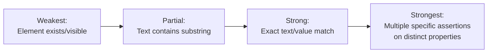

# Assertions and Verification Strategies

**Prerequisites**: You should already understand [Test Stability and Flaky Tests](/learning-paths/automation/test-stability-and-flaky-tests) and the rest of [Section 3](/learning-paths/automation/section-3-review).
**Leads to**: After this, you'll be ready for [Test Reporting](/learning-paths/automation/test-reporting).

A test can run perfectly, hit no timing issues, and still be worthless — if what it actually checks isn't precise enough to catch a real defect. This module closes Section 3 by moving from *when* a test checks something (synchronization) and *whether* it checks consistently (stability) to *what* it actually verifies, and how imprecise that can quietly be.

## Why This Matters

**A test with a weak assertion.** A test for AtlasBank's fund-transfer confirmation checks only that a confirmation *element exists* on the page after submission — `assert confirmationElement.isVisible()`. The element is visible. The test passes. What the test never checks: the confirmation message's actual text, which — due to a real defect — says "Transfer Failed" instead of "Transfer Successful." The element genuinely exists and is genuinely visible; it just says the wrong thing, and the test's assertion was never precise enough to notice.

**A test with a precise assertion.** A different test checks the confirmation element's exact text content, not just its presence: `assert confirmationElement.text() == "Transfer of $250.00 to Jane Doe successful"`. The same defect — a "Transfer Failed" message shown after an actually-successful transfer — fails this test immediately, because the assertion was written to verify the *specific, correct outcome*, not just that something rendered.

Both tests technically "verified" the confirmation screen. Only one of them verified anything a real customer would actually care about.

## What This Module Covers

**An assertion** is the specific check a test performs to decide pass or fail — the point where a test's expected result, from [Writing Clear Test Cases](/learning-paths/manual-testing/writing-clear-test-cases)'s own discipline, actually gets evaluated in code. Everything before the assertion (navigating, clicking, filling forms) sets up the conditions; the assertion is where the test actually decides anything.

**Assertion precision exists on a spectrum**, and weaker assertions are a common, easy trap:

| Assertion Strength | What It Checks | What It Misses |
|---|---|---|
| **Presence only** | An element exists / is visible | The element's actual content, value, or state |
| **Partial match** | Text *contains* a substring | The rest of the text could be wrong or incomplete |
| **Exact match** | Text/value matches precisely | Nothing, for what it checks — but only checks the one thing asserted |
| **Multiple, specific assertions** | Several distinct, precise properties (text, status, related state) | Whatever wasn't explicitly asserted at all |

This mirrors [Writing Clear Test Cases](/learning-paths/manual-testing/writing-clear-test-cases)'s own senior-tester standard directly — stating everything worth checking as the expected result, not just the headline outcome. A test asserting only that a page "loaded" is the automation-layer version of a test case whose expected result only states the obvious, primary outcome and misses everything else worth checking.

**Hard assertions vs. soft assertions**: a hard assertion stops the test immediately on failure — appropriate when a failed check makes every subsequent step meaningless (if login fails, checking the dashboard afterward tells you nothing useful). A soft assertion records a failure but lets the test continue, collecting multiple results before reporting — appropriate when several independent things are worth checking in one test run, and knowing about all of them (not just the first failure) is genuinely useful. Using hard assertions everywhere means a test stops at the first problem and never reports what else might also be wrong; using soft assertions everywhere means a test can continue in a nonsensical state after an early step that should have stopped everything.

**What to actually assert on**: prefer checking the specific data or state a user would actually care about (exact text, a specific value, a specific status) over a weaker, easier-to-write proxy (an element merely existing, a page merely not showing an error). The gap between these two is exactly what let this module's opening example's real defect through.

## When Assertion Precision Matters Most

- **Any confirmation, success, or status message** — exactly this module's opening example, where the presence of *a* message is a weaker check than the presence of the *correct* message.
- **Any numeric or calculated value** — a balance, a total, a converted currency amount — where an exact-match assertion is the only kind that actually verifies correctness, not just that a number rendered.
- **Any test result a real business decision depends on** — the more consequential the check, the more a weak assertion's blind spot actually costs.

Precision matters somewhat less for a genuinely low-stakes presence check where the content truly doesn't vary — confirming a static footer element exists, for instance — though even there, a slightly more specific assertion rarely costs much more to write.

## How This Works on a Real Project

AtlasBank's automation suite includes a test for the account-statement download feature, originally asserting only that a PDF file download was *triggered* — `assert downloadEvent.occurred()`. This passes reliably for months. A backend change introduces a defect where, for accounts with a specific rare combination of transaction types, the generated PDF is truncated mid-page, missing the final several transactions entirely — the download still triggers correctly, so the existing assertion never notices.

The defect ships and is only caught when a customer, reconciling their own records, reports a statement missing transactions they knew existed. The team's fix isn't just the backend defect — it's also strengthening the test's assertion to verify the downloaded file's actual transaction count matches the account's known transaction count for the test period, not just that a download occurred. The next time a similar truncation defect is introduced (a related change, six months later, has a comparable bug), the strengthened test catches it immediately, before release.

## Common Mistakes

**Mistake 1: Asserting only that something exists or "no error appeared," rather than the actual expected content.**
This module's opening and AtlasBank examples both show the same real gap — an assertion that's technically true while missing the actual defect.

**Mistake 2: Using a partial-match (contains) assertion where an exact match is actually required.**
A partial match can pass on text that's subtly wrong beyond the matched substring — weaker than it often appears at first glance.

**Mistake 3: Using hard assertions everywhere, even when several independent things are worth checking in one test run.**
This means a test only ever reports the first problem it hits, potentially hiding other real issues that a soft assertion approach would have also caught in the same run.

**Mistake 4: Using soft assertions after a step that should genuinely stop the test if it fails.**
The inverse mistake — continuing to check dashboard state after a login assertion has already failed produces confusing, meaningless follow-on results.

## Best Practices

**Practice 1: Assert on the specific data or state a user would actually care about, not just a proxy for it.**
The AtlasBank statement example's fix — checking actual transaction count, not just "a download happened" — is the pattern worth defaulting to.

**Practice 2: Use exact-match assertions for anything with a genuinely correct, specific expected value.**
Numeric values, confirmation text, status codes — anywhere a partial match could hide a real, specific error.

**Practice 3: Choose hard vs. soft assertions deliberately, based on whether a failure makes subsequent steps meaningless.**
Not a default choice made once for an entire suite — a per-step judgment about whether continuing after this specific failure still produces useful information.

**Practice 4: When a real defect escapes automated testing, ask whether the assertion was too weak before assuming the test simply wasn't run.**
The AtlasBank example's real fix was strengthening the assertion, not just re-running the same weak check more often.

:::note From the Field
A subscription-billing company's automated test for a "plan downgrade" feature asserted only that the page redirected to a "downgrade confirmed" URL after submission — a presence/navigation check, not a content check. A real defect caused the backend to occasionally process a downgrade request as a *cancellation* instead, while still redirecting the user to the same generic confirmation URL regardless of which actually happened. The test passed on every run, since the URL-based assertion couldn't distinguish the two outcomes. The defect was only caught when a customer support ticket volume spike revealed a cluster of unintended cancellations, weeks after the defect shipped.
:::

:::tip Senior QA Insight
A newer engineer writes an assertion that makes the test pass for the happy-path scenario they're currently looking at, and stops there. A senior engineer asks what specific *wrong* outcome this assertion would actually catch — and if they can't name one, treats that as a sign the assertion isn't precise enough yet, not as a reason to move on.
:::

## Mini Challenge

**Scenario**: A test for AtlasBank's card-freeze feature currently asserts only that, after clicking "Freeze Card," no error message appears on the page.

**Your task**: Identify a specific, realistic defect this assertion would fail to catch, and rewrite the assertion (in plain language) to actually catch it.

## Key Takeaways

- An assertion's precision determines what a test can actually catch — presence-only checks miss incorrect content that a more specific assertion would catch immediately.
- This mirrors [Writing Clear Test Cases](/learning-paths/manual-testing/writing-clear-test-cases)'s own lesson about stating a complete expected result, not just the headline outcome — now applied at the code level.
- Hard assertions (stop immediately) and soft assertions (collect multiple results) each have a real, deliberate use — the choice depends on whether a failure makes subsequent steps meaningless.
- When a real defect escapes an existing automated test, the assertion's precision is worth checking before assuming the test simply didn't run.

---

## What You Just Learned

- What an assertion is, and how assertion precision exists on a real spectrum from weak to strong
- The difference between hard and soft assertions, and when each is the deliberately correct choice
- How to assert on what a user would actually care about, not just a weaker, easier-to-write proxy
- How a real defect (a truncated account statement) escaped a presence-only assertion, and how strengthening the assertion caught the next similar defect before release

**Next:** [Test Reporting](/learning-paths/automation/test-reporting)

## Related Topics

- [Writing Clear Test Cases](/learning-paths/manual-testing/writing-clear-test-cases) — The complete-expected-result discipline this module applies directly to automated assertions
- [Test Stability and Flaky Tests](/learning-paths/automation/test-stability-and-flaky-tests) — The prior module's diagnosis discipline, now extended to what a test verifies, not just when
- [Test Reporting](/learning-paths/automation/test-reporting) — Where this module's precise pass/fail results become the actual information a human acts on

## Interview Questions

**Q1: What's the difference between checking that an element exists and checking that it has the correct content — and why does that distinction matter?**

*What to look for*: A candidate who explains that presence checks can pass even when the actual content is wrong, citing a concrete example (like a confirmation message showing the wrong text while still technically being "present"), and who names exact-match assertions as the fix.

:::note Common Interview Mistake
Many candidates describe assertions generically ("I'd assert the expected result") without naming what specifically makes an assertion weak versus strong. That's incomplete — a strong answer names presence-only checks as a specific, common trap and explains what real defect class they miss.
:::

**Q2: When would you use a soft assertion instead of a hard assertion?**

*What to look for*: A candidate who explains that soft assertions make sense when several independent things are worth checking in one test run and a failure in one doesn't make the others meaningless — and who recognizes hard assertions are still correct when a failure should genuinely stop the test (like a failed login before checking dashboard content).

---

## Glossary

**Assertion**: The specific check a test performs to determine pass or fail, evaluating the actual result against an expected one.

**Hard Assertion**: An assertion that stops test execution immediately on failure, appropriate when subsequent steps would be meaningless after that failure.

**Soft Assertion**: An assertion that records a failure but allows the test to continue, collecting multiple results before reporting — appropriate when several independent checks are worth completing in one run.

## Quick Revision

Remember these five points:

✓ Assertion precision determines what a test can actually catch — presence-only checks miss incorrect content.
✓ Assert on what a user would actually care about (exact text, specific values), not a weaker proxy.
✓ Use exact-match assertions wherever a genuinely correct, specific value exists to check against.
✓ Choose hard vs. soft assertions deliberately — based on whether a failure makes subsequent steps meaningless.
✓ When a real defect escapes an automated test, check the assertion's precision before assuming the test wasn't run.
