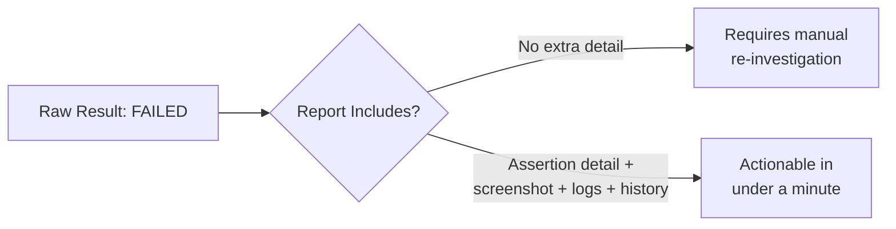

# Test Reporting

**Prerequisites**: You should already understand [Assertions and Verification Strategies](/learning-paths/automation/assertions-and-verification-strategies) and the rest of [Section 3](/learning-paths/automation/section-3-review).
**Leads to**: After this, you'll be ready for [CI/CD Integration](/learning-paths/automation/cicd-integration).

A test suite that runs reliably and asserts precisely still fails its actual job if nobody can quickly understand what a failure means. This module is about the last, easy-to-neglect step: turning a raw pass/fail result into something a human can act on without re-running the test themselves just to find out what happened.

## Why This Matters

**A suite with minimal reporting.** AtlasBank's CI pipeline reports failures as a bare list: `test_transfer_boundary_9999_99: FAILED`. An engineer investigating has to open the test's source code, re-run it locally, and manually add logging just to find out what actually went wrong — was it an assertion failure, an element not found, a timeout, an unrelated setup error? Twenty minutes later, they discover the failure was a stale test-environment configuration issue, unrelated to the code change that triggered the run. The same twenty minutes gets spent, by a different engineer, the next time this happens, because nothing was captured that would have made the second investigation faster than the first.

**A suite with real reporting.** A different pipeline's failure report includes the exact assertion that failed, the expected versus actual values, a screenshot at the moment of failure, and the browser console log from that run. The same engineer sees, within thirty seconds of opening the report, that the expected balance was $250.00 and the actual was $0.00 — immediately recognizable as an environment/data-setup issue (the test account had no funds in this run), not a real product defect. No re-run, no manual investigation, no twenty minutes.

Both failures were the exact same underlying issue. Only one report actually told anyone what it was.

## What Test Reporting Covers

**A test report exists to answer one question fast**: did this fail because of a real product defect, a test/environment problem, or something else — without requiring the reader to re-run the test or read its source code first. Everything a good report includes serves that one question.

**What a genuinely useful failure report includes**:

- **The exact assertion that failed**, with expected vs. actual values shown explicitly — not just "assertion failed," but *which* assertion and *what it expected versus got*, directly extending [Assertions and Verification Strategies](/learning-paths/automation/assertions-and-verification-strategies)'s precision principle into the report itself.
- **A screenshot (or video) at the moment of failure**, for UI-based tests — often the single fastest way to distinguish "the feature is genuinely broken" from "the test's locator is stale" at a glance.
- **Relevant logs** — console errors, network request/response detail, application logs where accessible — giving investigation a head start instead of a blank page.
- **Test duration and history** — whether this specific test has failed before, and how often, connects directly to [Test Stability and Flaky Tests](/learning-paths/automation/test-stability-and-flaky-tests)'s own diagnosis discipline; a report showing "this test has failed intermittently 12 times this month" is a different, more useful signal than a report showing only today's isolated failure.
- **Clear pass/fail/skip categorization at the suite level**, not just per-test — a human scanning results needs to see the shape of a run (98 passed, 2 failed, 1 skipped) before drilling into any individual failure.

**Reporting and CI/CD integration are related but distinct concerns**: reporting is about making a *single run's* results genuinely actionable; [CI/CD Integration](/learning-paths/automation/cicd-integration) (the next module) is about *when* and *how* that run actually happens as part of a delivery pipeline. A well-reported test run that never runs automatically isn't much better than a well-integrated pipeline whose results nobody can interpret — both halves matter, and this module covers the first.

## When Reporting Quality Matters Most

- **Any suite run automatically, without a human watching it execute** — exactly [CI/CD Integration](/learning-paths/automation/cicd-integration)'s scenario, where the report is the *only* information available after the fact.
- **Any suite large enough that re-running individual failures locally is genuinely expensive** — the larger the suite, the more a bare "FAILED" costs in aggregate investigation time.
- **Any team where the person investigating a failure often isn't the person who wrote the test** — a report has to stand on its own, since the original author's context can't be assumed.

Minimal reporting matters less for a very small, locally-run suite, actively watched by the person who wrote it, where a failure's context is already fully visible in the terminal — though even there, a habit of capturing more detail pays off the moment that assumption stops holding.

## How This Works on a Real Project

AtlasBank's automation suite originally reports failures with nothing beyond a test name and a generic "assertion failed" message. A production-adjacent incident — a real defect in the transfer-confirmation flow — takes the on-call engineer nearly forty minutes to confirm was even a real product issue, because the bare failure report gave no way to distinguish it from the suite's occasional, already-known environment flakiness without a full local re-run.

The team invests a focused sprint in reporting: every failure now captures the exact assertion (expected vs. actual), a full-page screenshot at the moment of failure, and the test's own recent pass/fail history. The next time a similar defect appears, the on-call engineer opens the report, sees the expected confirmation text ("Transfer Successful") against the actual captured text ("Transfer Failed"), confirms this test has a clean, consistent pass history with no prior flakiness — and escalates the real defect within two minutes, not forty, purely because the report itself now contained enough to make the call without re-running anything.

## Common Mistakes

**Mistake 1: Reporting only a bare pass/fail with a generic failure message.**
As the opening and AtlasBank examples both show, this pushes real investigation cost onto every single person who encounters the failure, repeatedly, instead of paying it once when the report is built.

**Mistake 2: Not capturing a screenshot or equivalent state snapshot for UI-based test failures.**
A screenshot is often the single fastest way to distinguish a genuine product defect from a stale locator or environment issue — skipping it means guessing instead of looking.

**Mistake 3: Treating every failure as equally worth full investigation, with no failure-history context.**
A report that doesn't surface whether a test has a history of intermittent failure forces every investigation to start from zero, even for a test with a well-understood, already-tracked flakiness pattern.

**Mistake 4: Making a report technically complete but genuinely hard to scan quickly.**
A report with all the right detail buried in an unstructured wall of text is barely better than no detail at all — the goal is fast comprehension, not just data completeness.

## Best Practices

**Practice 1: Capture expected vs. actual values explicitly in every assertion failure, not just "assertion failed."**
This is the single detail that let AtlasBank's on-call engineer make a two-minute call instead of a forty-minute one.

**Practice 2: Capture a screenshot (or equivalent) at the moment of failure for UI-based tests, by default.**
Cheap to add, consistently valuable for fast triage — treat this as a default, not an occasional addition.

**Practice 3: Surface a test's recent failure history alongside its current result.**
Directly connects to [Test Stability and Flaky Tests](/learning-paths/automation/test-stability-and-flaky-tests)'s diagnosis discipline — a report that shows history helps distinguish a new, real problem from known, already-tracked flakiness at a glance.

**Practice 4: Design reports for the person who didn't write the test, not just the original author.**
A report that assumes context only the original author has will eventually be read by someone who doesn't have it — design for that reader by default.

:::note From the Field
A healthcare software company's nightly regression suite reported results as a single aggregate number — "142/150 passed" — with no detail on which 8 failed or why, posted to a team chat channel every morning. The team developed a habit of treating any morning with fewer than roughly 10 failures as "probably fine, check later," since investigating required manually opening the CI system and cross-referencing test names against recent code changes. A genuine regression sat unnoticed for four days inside that "probably fine" range before a customer report forced investigation — the report format itself had made a real failure indistinguishable from routine noise until someone was forced to look closely.
:::

:::tip Senior QA Insight
A newer engineer treats reporting as an afterthought — get the test passing first, worry about what the failure output looks like later, if ever. A senior engineer treats a failure report as a deliverable in its own right, written for a reader who wasn't in the room when the test was built, because the value of catching a real regression is close to zero if nobody can act on the report fast enough to matter.
:::

## Mini Challenge

**Scenario**: AtlasBank's current CI reports look like `FAIL: test_beneficiary_add (AssertionError)` with no further detail, and the team wants to improve them before the suite triples in size next quarter.

**Your task**: List the three additions from this module you'd prioritize first, and justify the order — which addition reduces investigation time the most for the least implementation effort.

## Key Takeaways

- A test report's job is answering "real defect or something else" fast, without requiring a re-run or reading the test's source code.
- Capturing expected vs. actual values, a screenshot at failure, relevant logs, and failure history together turn a bare result into something genuinely actionable.
- Reporting and CI/CD integration are related but distinct — a well-reported run and a well-automated pipeline both matter, and neither substitutes for the other.
- Design reports for a reader who wasn't present when the test was written — that assumption eventually gets tested for real.

---

## What You Just Learned

- What a genuinely useful test report includes, and why each element specifically speeds up investigation
- The difference between test reporting and CI/CD integration as related but distinct concerns
- Why failure history matters as much as a single run's result, connecting directly to flaky-test diagnosis
- How a real defect went from a forty-minute investigation to a two-minute one purely through better report content, with no change to the test itself

**Next:** [CI/CD Integration](/learning-paths/automation/cicd-integration)

## Related Topics

- [Assertions and Verification Strategies](/learning-paths/automation/assertions-and-verification-strategies) — The precision principle this module extends from what a test checks into what a report actually shows
- [Test Stability and Flaky Tests](/learning-paths/automation/test-stability-and-flaky-tests) — Where this module's failure-history reporting directly supports faster, more confident diagnosis
- [CI/CD Integration](/learning-paths/automation/cicd-integration) — Where this module's reports become part of an automated delivery pipeline's own decision-making

## Interview Questions

**Q1: What makes a test failure report actually useful, beyond just saying "pass" or "fail"?**

*What to look for*: A candidate who names specific, concrete elements — expected vs. actual values, a screenshot, relevant logs, failure history — rather than a vague "more detail is better," and who can explain what each specific element speeds up.

:::note Common Interview Mistake
Many candidates answer "you should log more information" without naming anything specific. That's too vague to demonstrate real understanding. A strong answer names concrete report elements and ties each one to a specific investigation question it answers.
:::

**Q2: How does test reporting relate to diagnosing flaky tests?**

*What to look for*: A candidate who connects failure-history reporting to faster, more confident flakiness diagnosis — recognizing a test's pattern of past failures, visible in the report, is what lets a reader distinguish "known, already-tracked issue" from "new, real regression" quickly.

---

## Glossary

**Actionable Report**: A test failure report containing enough detail (expected vs. actual, screenshot, logs, history) that a reader can determine next steps without re-running the test or reading its source code first.

**Failure History**: A record of a specific test's recent pass/fail pattern over time, used to distinguish a new, real failure from an already-known, tracked source of flakiness.

## Quick Revision

Remember these five points:

✓ A test report's job is answering "real defect or something else" fast, without a re-run.
✓ Capture expected vs. actual values explicitly for every assertion failure.
✓ Capture a screenshot (or equivalent) at the moment of failure for UI-based tests, by default.
✓ Surface a test's recent failure history alongside its current result.
✓ Design reports for a reader who wasn't present when the test was written.
