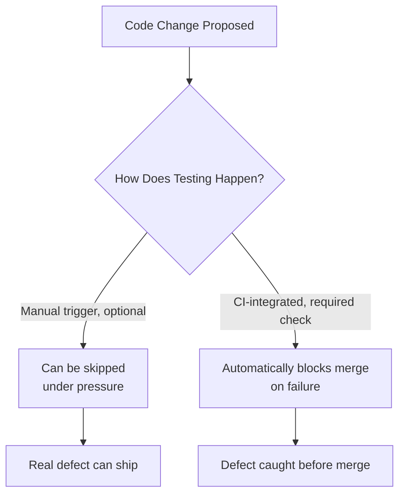

# CI/CD Integration

**Prerequisites**: You should already understand [Test Reporting](/learning-paths/automation/test-reporting).
**Leads to**: After this, you'll be ready for [Parallel Execution](/learning-paths/automation/parallel-execution).

An automated suite that exists but only runs when a human remembers to trigger it manually provides almost none of automation's actual promise — the whole point of automating execution was removing the dependency on a human doing something reliably, every time. This module is about closing that gap: making the suite run itself, as a real part of how code actually ships.

## Why This Matters

**A team with manually-triggered automation.** A team has a solid, well-built automated suite — good framework, Page Object Model, data-driven tests, precise assertions, useful reports — that engineers are expected to run manually before merging a change. Under deadline pressure, a change ships with the suite skipped "just this once, it's a small fix." The small fix breaks the fund-transfer flow. Nobody notices until a customer reports it, because the one manual step that would have caught it was the one step skipped when it mattered most.

**A team with CI-integrated automation.** A different team's identical suite runs automatically on every single code change, with no manual trigger required and no way to merge without it passing. The same "small fix" breaks the same flow — and the pipeline blocks the merge automatically, showing the exact failure (per [Test Reporting](/learning-paths/automation/test-reporting)'s own standard) before the change ever reaches production, regardless of deadline pressure or who forgot what.

The suite itself was identical in both scenarios. The only difference was whether running it depended on a human remembering to, under pressure, every single time.

## What CI/CD Integration Covers

**Continuous Integration (CI)** means every code change is automatically built and tested as soon as it's proposed — not on a schedule, not when someone remembers, but triggered directly by the change itself. **Continuous Delivery/Deployment (CD)** extends this to automatically preparing (delivery) or actually releasing (deployment) a change once it passes. This module focuses on the testing side of CI specifically — how an automated suite becomes a real, unskippable part of that pipeline.

**The core mechanism**: a CI pipeline (built with a tool like GitHub Actions, Jenkins, or similar) is configured to automatically run the test suite whenever a defined trigger occurs — typically, a new commit pushed or a pull request opened. The pipeline reports results back (ideally using [Test Reporting](/learning-paths/automation/test-reporting)'s own standard for what a useful report includes) and, critically, can be configured to **block** the change from merging or deploying if the suite fails — this is what makes the gate real, not just informational.

```text
// Conceptual shape — not tied to a specific tool's exact configuration syntax

on: pull_request_opened OR commit_pushed
steps:
  1. Check out the code
  2. Install dependencies
  3. Run the automated test suite
  4. Report results (pass/fail, with detail per Test Reporting's standard)
  5. If suite failed: block merge
     If suite passed: allow merge (or proceed to next pipeline stage)
```

**What "blocking" actually requires, concretely**: most source-control platforms support marking a specific CI check as "required" before a merge is allowed — this is the actual mechanism that turns "we're supposed to run tests" (a policy, easily skipped under pressure, exactly the opening example's failure) into "you structurally cannot merge without tests passing" (an enforced gate). This single configuration detail is often the real difference between automation that protects a codebase and automation that merely exists alongside it.

**Where flaky tests and CI collide especially hard**: a CI gate that blocks merges makes [Test Stability and Flaky Tests](/learning-paths/automation/test-stability-and-flaky-tests)'s lesson considerably more urgent — a flaky test blocking a real, correct change under deadline pressure creates exactly the temptation (bypass the gate "just this once") that undoes the entire point of having an enforced gate at all. A CI-integrated suite has to be genuinely reliable, not just automated, or the gate itself becomes something people learn to route around.



## When CI Integration Matters Most

- **Any team where more than one person can merge code** — the opening example's "just this once" temptation exists precisely because a manual step depends on individual discipline under pressure, which a required CI check removes as a variable entirely.
- **Any codebase where a regression has real, costly consequences** — the more a defect would cost in production, the more valuable it is that catching it doesn't depend on anyone remembering a manual step.
- **Any suite mature and stable enough to be trusted as a gate** — per the flaky-test collision above, integrating a genuinely unreliable suite as a blocking gate can do more harm (blocking good changes, training people to bypass it) than leaving it optional.

CI integration matters somewhat less, at least as a blocking gate, for a suite still being actively built and stabilized — running it informationally (reporting results without blocking) during that period is a reasonable intermediate step before promoting it to a required, blocking check once it's proven reliable.

## How This Works on a Real Project

AtlasBank's automation team has a stable, reliable suite (having worked through Sections 1–3's foundations) but it currently runs only when an engineer manually triggers it before merging — and, under a release deadline, one engineer skips it for a change they're confident is low-risk. The change contains a real regression in the beneficiary-deletion flow that the suite would have caught immediately.

The team's response isn't just fixing the regression — it's configuring the suite as a required CI check on every pull request, removing the "manually remember to run this" step from the process entirely. Three months later, another engineer, under similar deadline pressure, pushes a change with a similar kind of regression — and the pipeline blocks the merge automatically, showing the exact failed assertion and a screenshot per [Test Reporting](/learning-paths/automation/test-reporting)'s standard. The engineer fixes the regression before it ever reaches production, not because they remembered to run anything manually, but because the pipeline structurally didn't give them the option to skip it.

## Common Mistakes

**Mistake 1: Treating "engineers are supposed to run tests before merging" as equivalent to actual enforcement.**
As the opening example shows, a policy depending on individual discipline under pressure will eventually be skipped exactly when it matters most — a required CI check removes that dependency structurally.

**Mistake 2: Integrating a genuinely unreliable, flaky suite as a hard-blocking gate before it's stabilized.**
This risks the suite becoming an obstacle people route around (bypassing the check, disabling it "temporarily") rather than a trusted gate — stabilize first, per Section 3, then promote to blocking.

**Mistake 3: Running the suite in CI but not actually configuring it as a required, merge-blocking check.**
A suite that runs and reports failures, but doesn't structurally prevent merging on failure, is closer to Test Reporting alone than genuine CI/CD integration — the blocking configuration is what makes the gate real.

**Mistake 4: Running the full suite on every single trigger without considering runtime cost.**
A suite that takes an hour to run on every commit creates real friction that eventually gets bypassed out of impatience — [Parallel Execution](/learning-paths/automation/parallel-execution) covers the specific mechanism for addressing this without weakening the gate itself.

## Best Practices

**Practice 1: Configure the test suite as a required check, not just an informational one, once it's proven stable.**
This single configuration detail is what actually removes the human-discipline dependency the opening example's failure traces back to.

**Practice 2: Stabilize a suite (Section 3's full discipline) before promoting it to a hard-blocking gate.**
An unreliable gate trains people to bypass gates in general, undermining the entire practice — reliability has to come first.

**Practice 3: Trigger the suite automatically on every relevant code change, not on a schedule or manual button.**
A nightly-only run still leaves a full day's window where a regression can merge and ship before being caught — automatic, change-triggered runs close that gap.

**Practice 4: Treat a flaky test blocking a real, correct change as an urgent problem, not an annoyance to route around.**
Per [Test Stability and Flaky Tests](/learning-paths/automation/test-stability-and-flaky-tests), the temptation to bypass a blocking gate under pressure is exactly the moment discipline matters most — fix the flaky test, don't disable the gate.

:::note From the Field
A fintech startup's engineering team had a comprehensive, well-built automated suite that ran only when manually triggered via a button in their CI tool's dashboard — technically "in CI," but not configured as a required check, and not triggered automatically. Over several months, the team gradually stopped clicking the button under routine time pressure, since nothing structurally required it. A significant regression in interest calculation shipped and went undetected for three weeks, caught only during an unrelated audit — not because the suite couldn't have caught it (it would have, immediately, had it run), but because "the suite exists" and "the suite runs" had quietly drifted apart with nothing enforcing the connection between them.
:::

:::tip Senior QA Insight
A newer engineer considers the job done once a suite is built, reliable, and technically capable of running in CI. A senior engineer verifies the specific, unglamorous configuration detail that makes it a *required* check — because a suite that merely *can* run in CI, without being configured to actually block on failure, provides almost none of the protection its build effort was meant to buy.
:::

## Mini Challenge

**Scenario**: AtlasBank's automation team has a stable, reliable Section 1–3-quality suite that currently runs automatically on every pull request but is configured as informational only — results are visible, but a failing suite doesn't prevent merging.

**Your task**: Identify the single configuration change needed to make this a real gate, and describe one legitimate reason the team might have deliberately chosen informational-only as an intermediate step, rather than an oversight.

## Key Takeaways

- Automation that depends on a human manually remembering to run it provides almost none of automation's actual promise — the point was removing that dependency.
- A CI-integrated suite becomes a real gate specifically through being configured as a required, merge-blocking check — not just by running automatically and reporting results.
- A genuinely unreliable suite shouldn't be promoted to a hard-blocking gate before it's stabilized, per Section 3's discipline — an unreliable gate trains people to bypass gates in general.
- The temptation to bypass a blocking gate under deadline pressure is exactly the moment the gate's value is being tested — fixing the underlying flakiness beats disabling the gate.

---

## What You Just Learned

- What CI/CD integration actually means for automated testing, and the specific mechanism (a required, blocking check) that makes a suite a real gate
- Why running automatically and reporting results isn't the same as actually blocking a bad change
- Why suite stability (Section 3) needs to come before promoting a suite to a hard-blocking gate
- How a real regression was caught before production specifically because a suite was configured as required, not just automatic

**Next:** [Parallel Execution](/learning-paths/automation/parallel-execution)

## Related Topics

- [Test Reporting](/learning-paths/automation/test-reporting) — The report standard a CI pipeline should surface when a required check fails
- [Test Stability and Flaky Tests](/learning-paths/automation/test-stability-and-flaky-tests) — Why suite reliability has to come before promoting it to a hard-blocking CI gate
- [Parallel Execution](/learning-paths/automation/parallel-execution) — The specific mechanism for keeping a CI-integrated suite fast enough that its gate doesn't become friction people route around

## Interview Questions

**Q1: What's the difference between "running tests in CI" and "using tests as a CI gate"?**

*What to look for*: A candidate who explains that running and reporting is not the same as actually blocking a merge on failure — the specific "required check" configuration is what makes the gate real, and a suite that only reports informationally doesn't structurally prevent a bad change from merging.

:::note Common Interview Mistake
Many candidates answer "CI/CD integration means the tests run automatically" without mentioning blocking/gating at all. That's incomplete — a strong answer specifically names the required-check mechanism as what turns automatic execution into actual enforcement.
:::

**Q2: A flaky test is blocking a real, correct change from merging under deadline pressure. What would you do?**

*What to look for*: A candidate who resists the temptation to simply disable or bypass the gate, and instead treats this as an urgent signal to fix the underlying flakiness (per Section 3's diagnosis discipline) — recognizing that routinely bypassing gates under pressure undermines the entire practice.

---

## Glossary

**Continuous Integration (CI)**: The practice of automatically building and testing every code change as soon as it's proposed, rather than on a schedule or by manual trigger.

**Required Check**: A CI status check configured to block a merge or deployment if it fails — the specific mechanism that turns automated testing into an actual, enforced gate rather than an optional, informational step.

**CI Pipeline**: The automated sequence of steps (build, test, report, gate) triggered by a code change, implemented with tools like GitHub Actions or Jenkins.

## Quick Revision

Remember these five points:

✓ Automation depending on a human manually remembering to run it provides almost none of automation's real protection.

✓ A required, merge-blocking check is the specific mechanism that makes a CI-integrated suite a real gate, not just automatic execution.

✓ Stabilize a suite before promoting it to a hard-blocking gate — an unreliable gate trains people to bypass gates in general.

✓ Trigger the suite automatically on every relevant code change, not on a schedule or manual button.

✓ A flaky test blocking a real change under pressure should be fixed, not routed around by disabling the gate.
