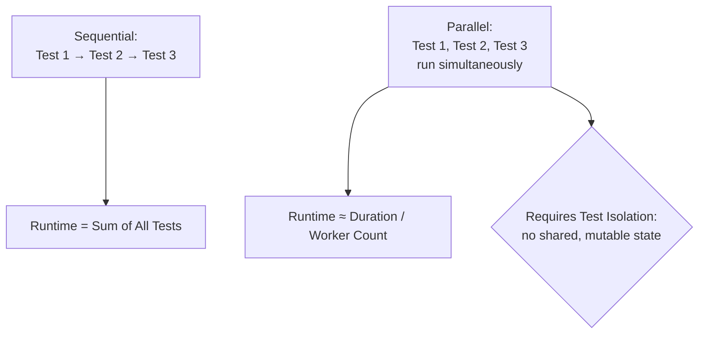

# Parallel Execution

**Prerequisites**: You should already understand [CI/CD Integration](/learning-paths/automation/cicd-integration) and the rest of [Section 4](/learning-paths/automation/section-4-review).
**Leads to**: This completes Sections 1–4 of Automation Testing. From here, continue to [Choosing and Comparing Automation Tools](/learning-paths/automation/choosing-and-comparing-automation-tools), the first module of Section 5.

[CI/CD Integration](/learning-paths/automation/cicd-integration) closed with a real tension: a slow suite creates friction people eventually route around, even when it's correctly configured as a blocking gate. Parallel execution is the primary answer — running many tests at the same time instead of one after another — and it comes with a real cost this module doesn't skip past.

## Why This Matters

**A suite run sequentially.** AtlasBank's automation suite grows to 400 tests, each taking an average of 3 seconds — 20 minutes total, run one test after another. As the suite grows toward 800 tests over the following year, the runtime grows toward 40 minutes. Engineers start treating the CI gate as something to kick off and go get coffee for, then come back to — and under real deadline pressure, a 40-minute gate becomes exactly the kind of friction [CI/CD Integration](/learning-paths/automation/cicd-integration) warned gets bypassed.

**A suite run in parallel.** The same 800 tests, distributed across 8 parallel workers, complete in roughly 5 minutes instead of 40 — each worker running its own subset of the suite simultaneously rather than the whole team waiting for one long, sequential chain. The gate stays fast enough that nobody's tempted to treat it as an interruption worth avoiding.

The tests themselves didn't get any faster individually — the *strategy* for running them changed, and that alone is often the single biggest lever for keeping a growing suite's runtime under control.

## What Parallel Execution Covers

**The core idea**: instead of running test 1, waiting for it to finish, then running test 2, and so on, multiple tests run *simultaneously*, typically distributed across multiple workers, processes, or machines. The total runtime approaches (suite runtime ÷ number of parallel workers), rather than the full sum of every individual test's duration.

**The real cost parallel execution introduces**: tests that were fine running one at a time can fail unpredictably when running simultaneously, specifically if they share state — the same underlying risk [Test Stability and Flaky Tests](/learning-paths/automation/test-stability-and-flaky-tests) named as test order dependency, now happening not because of *sequence* but because of genuine *concurrency*. Two tests that both create a beneficiary named "Test Beneficiary" and then check the beneficiary list's exact contents will interfere with each other if they run at the same moment, each seeing the other's data unexpectedly.

**Test isolation is the specific requirement parallel execution demands**: every test needs its own independent data and state, not shared with any other test that might run concurrently. This usually means each test creates its own unique test data (a uniquely-generated beneficiary name, a dedicated test account) rather than relying on a shared, common starting state that assumes exclusive access.

| | Sequential Execution | Parallel Execution |
|---|---|---|
| **Runtime** | Sum of every test's duration | Roughly (total duration ÷ worker count) |
| **Shared state risk** | Low — one test finishes before the next starts | High — genuine concurrency can expose real interference |
| **Requirement** | None beyond ordinary test isolation | Strict test isolation — no shared, mutable state assumed exclusive |

**A suite not designed for isolation can appear to work sequentially and fail unpredictably once parallelized** — this is a real, common transition risk, not a hypothetical: a suite built and stabilized under Section 3's discipline while running sequentially can still harbor hidden shared-state assumptions that never surfaced until parallel execution exposed them for the first time.

## When Parallel Execution Matters Most

- **Any suite large enough that sequential runtime meaningfully affects how the CI gate gets treated** — the specific friction [CI/CD Integration](/learning-paths/automation/cicd-integration) warned about growing worse as a suite scales.
- **Any suite already following strict test isolation** (each test independently sets up and cleans up its own data) — parallelization is close to a straightforward runtime win here, since the hard requirement is already met.
- **Any team frequently waiting on CI results as a bottleneck to shipping** — the direct, practical motivation most teams actually adopt parallel execution for.

Parallel execution matters less, or is riskier to adopt immediately, for a suite with known or suspected shared-state assumptions that were never rigorously tested — parallelizing before addressing isolation can introduce a wave of new, genuinely confusing flakiness, actively working against [Test Stability and Flaky Tests](/learning-paths/automation/test-stability-and-flaky-tests)'s hard-won discipline rather than building on it.

## How This Works on a Real Project

AtlasBank's automation team, facing a 35-minute sequential CI runtime, moves to parallel execution across 6 workers — expecting roughly a 6x speedup. Instead, several tests start failing intermittently that had never failed before, all related to beneficiary management. Investigation finds the root cause: multiple tests were relying on a shared, fixed test account with a hardcoded beneficiary name ("Test Beneficiary 1") — safe when run sequentially, since each test finished before the next started, but genuinely broken under real concurrency, where two workers could create, check, and delete beneficiaries with the same name at the same moment.

The fix isn't reverting to sequential execution — it's fixing the actual isolation gap: each test now generates its own uniquely-named beneficiary and uses its own dedicated test account rather than a shared one. Once isolation is genuinely correct, parallel execution delivers close to the expected speedup, and the intermittent failures disappear — because the underlying concurrency risk, not the parallelization itself, was the real problem the transition had surfaced.

## Common Mistakes

**Mistake 1: Parallelizing a suite before verifying genuine test isolation.**
The AtlasBank example shows exactly this risk — shared, mutable test state that was invisible under sequential execution becomes a real, confusing source of failure the moment genuine concurrency is introduced.

**Mistake 2: Assuming a speedup will be exactly proportional to worker count.**
Real speedup is usually somewhat less than the naive (runtime ÷ workers) estimate, due to setup overhead, shared infrastructure limits (like a database connection pool), and uneven test durations across workers — a reasonable estimate, not a guarantee.

**Mistake 3: Treating a new parallel-execution failure as a flaky test to retry, rather than a genuine isolation defect to fix.**
This repeats [Test Stability and Flaky Tests](/learning-paths/automation/test-stability-and-flaky-tests)'s exact warning — a new failure pattern specifically correlated with parallelization is a strong, specific diagnostic clue, not something to mask with a retry.

**Mistake 4: Sharing a fixed, hardcoded test account or dataset across tests, assuming exclusive access.**
The single most common concrete cause of parallel-execution failures — any test relying on "the" test account rather than "a" uniquely-generated one is a latent isolation risk waiting for real concurrency to expose it.

## Best Practices

**Practice 1: Verify genuine test isolation — unique, independently-managed data per test — before parallelizing, not after.**
Catching this proactively avoids the AtlasBank team's confusing transition entirely.

**Practice 2: Generate unique test data per test run (a uniquely-named beneficiary, a dedicated account) rather than relying on shared, fixed fixtures.**
This is the specific, concrete fix for the most common parallel-execution failure cause.

**Practice 3: Treat a failure that only appears under parallel execution as a genuine isolation defect, not routine flakiness.**
A failure pattern correlated specifically with concurrency is diagnostic information worth acting on directly, per Section 3's own discipline.

**Practice 4: Expect and plan for less-than-linear speedup, accounting for shared infrastructure limits.**
A realistic expectation avoids the disappointment (and potential over-provisioning) of assuming a naive, purely proportional speedup.

:::note From the Field
A retail company parallelized their 600-test suite across 10 workers without auditing test isolation first, expecting a straightforward 10x speedup. Instead, nearly a third of the suite began failing intermittently — traced, after a confusing week of investigation, to a shared product-inventory count that multiple tests read and modified concurrently, each assuming exclusive access. The team's first instinct was to add retries to mask the new failures and preserve the speed win; a more experienced engineer insisted on the real fix instead — each test creating its own isolated product record — which took another two weeks but eliminated the new failures entirely, rather than merely hiding them behind a retry count that would have quietly widened over time.
:::

:::tip Senior QA Insight
A newer engineer, seeing new failures appear right after enabling parallel execution, assumes the parallelization itself is unreliable or the tool is buggy. A senior engineer recognizes this timing correlation as strong evidence of a pre-existing test isolation defect that sequential execution had simply never been able to expose — and goes looking for shared state, not a tooling problem.
:::

## Mini Challenge

**Scenario**: AtlasBank is about to parallelize a 200-test suite for the first time. Several tests currently log in using the same hardcoded test account (`qa-test-user@atlasbank.com`) and check that account's transaction history afterward.

**Your task**: Identify the specific isolation risk this creates under parallel execution, and describe the concrete fix — not just "make it isolated," but what would actually need to change about how these tests set up their data.

## Key Takeaways

- Parallel execution distributes tests across multiple workers running simultaneously, reducing total runtime roughly proportional to worker count.
- The real cost is a strict new requirement: genuine test isolation — no test can assume exclusive access to shared, mutable state.
- A suite that works fine sequentially can fail unpredictably once parallelized, if it harbors hidden shared-state assumptions sequential execution never exposed.
- A new failure pattern correlated specifically with parallelization is a genuine isolation defect worth fixing directly, not routine flakiness to retry past.

---

## What You Just Learned

- What parallel execution is, and the specific speedup it offers a growing suite
- Why test isolation is a strict requirement for parallel execution, not just a nice-to-have
- How a suite that passed reliably under sequential execution can expose hidden shared-state defects once genuinely parallelized
- How a real, confusing wave of new failures was correctly diagnosed as a test-isolation defect and fixed at the root, rather than masked with retries

**Next:** [Choosing and Comparing Automation Tools](/learning-paths/automation/choosing-and-comparing-automation-tools)

## Related Topics

- [CI/CD Integration](/learning-paths/automation/cicd-integration) — The suite-speed friction this module's parallelization directly addresses
- [Test Stability and Flaky Tests](/learning-paths/automation/test-stability-and-flaky-tests) — The diagnosis discipline this module applies specifically to concurrency-caused failures
- [Data-Driven Testing](/learning-paths/automation/data-driven-testing) — The test-data management discipline this module's isolation requirement builds on directly

## Interview Questions

**Q1: What's the main benefit of parallel test execution, and what's the main new risk it introduces?**

*What to look for*: A candidate who names the runtime benefit (roughly proportional to worker count) clearly, but who also names test isolation as a genuine new requirement, not just a minor caveat — ideally with a concrete example of shared state causing a concurrency-specific failure.

:::note Common Interview Mistake
Many candidates describe parallel execution as a pure win ("it makes tests run faster") without mentioning the isolation requirement at all. That's incomplete — a strong answer names the specific new risk (tests interfering with each other's shared state) and what's required to avoid it (unique, independently-managed test data per test).
:::

**Q2: A suite passes reliably sequentially but starts failing intermittently after being parallelized. What would you investigate first?**

*What to look for*: A candidate who suspects test isolation — shared, mutable state between tests — as the likely cause, rather than assuming the parallelization tooling itself is unreliable, citing that sequential execution can mask this exact class of defect indefinitely.

---

## Glossary

**Parallel Execution**: Running multiple tests simultaneously, typically distributed across multiple workers or processes, reducing total suite runtime roughly in proportion to the number of parallel workers.

**Test Isolation**: The property that a test's data and state are fully independent of every other test, with no assumption of exclusive access to shared, mutable resources — a strict requirement for reliable parallel execution.

## Quick Revision

Remember these five points:

✓ Parallel execution reduces total runtime roughly proportional to worker count, without making individual tests faster.
✓ Genuine test isolation — no shared, mutable state assumed exclusive — is a strict requirement, not optional.
✓ A suite that passes reliably sequentially can fail unpredictably once parallelized, exposing previously-hidden shared-state defects.
✓ A new failure pattern correlated with parallelization is a genuine isolation defect, not routine flakiness to retry past.
✓ Expect less-than-linear speedup in practice, due to setup overhead and shared infrastructure limits.
