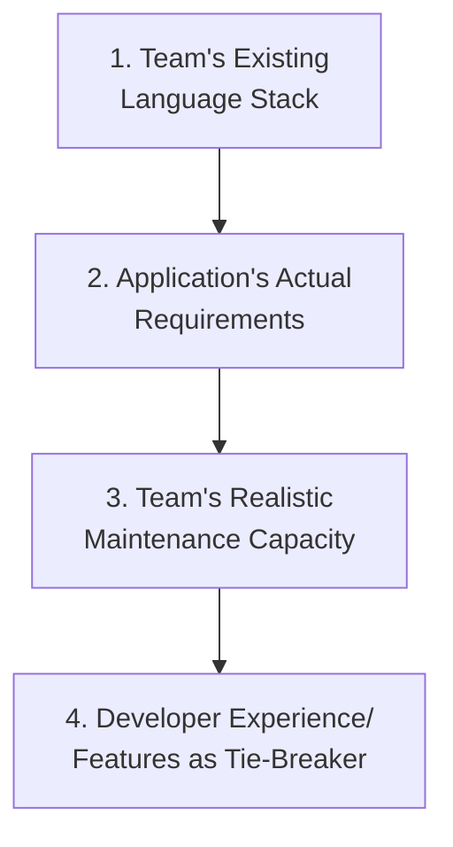

# Choosing and Comparing Automation Tools

**Prerequisites**: You should already understand every module in Sections 1–4 of this path, especially [Automation Framework Fundamentals](/learning-paths/automation/automation-framework-fundamentals).
**Leads to**: After this, you'll be ready for [Maintaining Automation at Scale](/learning-paths/automation/maintaining-automation-at-scale).

Sections 1 through 4 deliberately taught every concept — frameworks, Page Object Model, synchronization, CI integration — without favoring one tool, because the underlying decisions are identical regardless of which tool implements them. This module is where tool choice itself finally gets its own deliberate treatment: not which tool is "best," but which tool fits a specific team and application.

## Why This Matters

**A team that chooses by trend.** A team starting automation from scratch picks Playwright because it's the tool generating the most conference talks and blog posts that year. Six months in, the team discovers their application under test is a legacy internal tool still requiring Internet Explorer-compatible testing for a subset of enterprise customers — a real constraint Playwright doesn't support, and one nobody checked before committing. The team now maintains two separate automation stacks, one for modern browsers and one bolted on for the legacy requirement, a maintenance burden a five-minute constraint check at the start would have avoided entirely.

**A team that chooses by fit.** A different team, facing the identical legacy-browser requirement, checks their actual constraints before choosing anything — discovers the IE-compatibility requirement immediately, and selects Selenium specifically because of its broader browser-support history, accepting its more manual synchronization handling ([Synchronization and Wait Strategies](/learning-paths/automation/synchronization-and-wait-strategies)'s own distinction) as a reasonable trade-off for a real, concrete constraint.

Neither team is "wrong" to consider Playwright — it's an excellent tool for a huge share of real applications. The first team's mistake wasn't the tool, it was skipping the fit-check a trending tool doesn't exempt anyone from.

## What This Module Covers

**The decision that actually matters**: what does your team's existing language stack look like, what does your application under test actually require (browser support, mobile app testing, API-only, legacy compatibility), and what does your team's existing skill set support — in that order, before comparing feature lists.

**A grounded, current comparison** (concept-first, as established throughout this path — every tool below implements the same underlying concepts Sections 1–4 already taught):

| Tool | Language Support | Strengths | Real Constraints |
|---|---|---|---|
| **Playwright** | JavaScript/TypeScript, Python, Java, .NET | Strong built-in auto-waiting, multi-browser (Chromium, Firefox, WebKit), fast, modern developer experience | Newer ecosystem than Selenium; less legacy-browser support |
| **Cypress** | JavaScript/TypeScript | Excellent developer experience, strong auto-waiting, great debugging tools | Historically more constrained cross-browser/cross-tab support than Playwright, though this has narrowed over time — verify current support against your specific needs, not assumption |
| **Selenium** | Java, Python, C#, JavaScript, Ruby, and others | Widest language support, longest track record, broadest real-world browser/environment compatibility, largest community | More manual synchronization handling by default; generally more setup/boilerplate than Playwright or Cypress |
| **TestNG / JUnit** | Java | Not competitors to the above — test *runners*/organizers, commonly paired *with* Selenium (which only handles browser interaction, not test organization, exactly [Automation Framework Fundamentals](/learning-paths/automation/automation-framework-fundamentals)'s own distinction) | Doesn't do browser automation itself; solves a different, complementary concern |

**The specific questions worth asking, in order**:

1. **What language does the team already know well?** A tool matching existing skill reduces onboarding cost and ongoing maintenance friction more than any feature comparison.
2. **What does the application under test actually require?** Legacy browser support, mobile-specific testing, or API-only testing each rule some tools in or out before "which is nicer to use" is even relevant.
3. **What does the team's realistic maintenance capacity look like?** A tool with a smaller community and less documentation is a real, ongoing cost if the team can't self-support through unusual problems.
4. **Only then**, developer experience, community size, and specific feature sets — genuinely important, but the tie-breaker among already-qualified options, not the first filter.

## When Deliberate Tool Selection Matters Most

- **Starting automation from scratch** — exactly this module's opening scenario, where the cost of a mismatched choice compounds over the entire suite's future lifetime.
- **Any application with a real, non-obvious constraint** — legacy browser support, a native mobile component, a highly specialized environment — where the constraint should be checked before any tool preference is indulged.
- **A team with a strong existing language stack** — the productivity cost of introducing a mismatched language for automation specifically is real and ongoing, not a one-time learning curve.

Tool selection matters less as an urgent decision for a team already deep into a stable, working automation practice with an established tool — re-litigating tool choice without a genuine new constraint or problem is its own kind of wasted effort, echoing this path's own [Selecting the Right Test Cases for Automation](/learning-paths/automation/selecting-the-right-test-cases-for-automation) judgment about not chasing change without a real reason.

## How This Works on a Real Project

AtlasBank's automation team is starting fresh coverage for a new internal Admin Portal, built entirely with a modern JavaScript frontend framework. The team's existing engineering skill set is strongly TypeScript-based across the rest of the organization, and the Admin Portal has no legacy-browser requirement (internal tool, modern browsers only, no external customer constraints). Applying this module's order of operations: language fit strongly favors Playwright or Cypress over Selenium (matching the team's TypeScript strength); the application's requirements rule out nothing (no legacy constraint); the team's maintenance capacity is solid for either modern option. The final tie-breaker comes down to Playwright's slightly broader cross-browser support (the Admin Portal, while internal, is used by staff across Chrome, Firefox, and Safari) — a genuine, specific reason, checked last, not first.

Contrast this with AtlasBank's earlier, separate decision for the customer-facing Internet Banking platform (referenced throughout Sections 1–4): that application's real constraint — supporting a small but real population of customers still on older browser versions for accessibility/compliance reasons — meant Selenium's broader legacy support was the correct choice there, despite the same team's TypeScript strength favoring Playwright in the abstract. Same team, same underlying skill set, two different correct tool choices, because the applications' actual constraints differed.

## Common Mistakes

**Mistake 1: Choosing a tool by popularity or trend before checking real constraints.**
The opening example's legacy-browser discovery, six months too late, shows exactly what this costs — a constraint check takes minutes; retrofitting around a wrong choice takes months.

**Mistake 2: Assuming the same tool choice applies to every application a team builds.**
The AtlasBank Admin Portal vs. Internet Banking contrast shows the same team correctly reaching different conclusions for different applications — tool choice is per-application-constrained, not a single organizational identity decision.

**Mistake 3: Treating developer experience and feature comparisons as the first filter instead of the tie-breaker.**
These are genuinely important, but only among options that already fit the team's language and the application's real requirements — leading with them skips the filters that actually rule options out.

**Mistake 4: Introducing a language mismatch for automation specifically, against the team's existing strength, without a strong justifying reason.**
A team strong in one language taking on a second, automation-only language adds real, ongoing friction that should be justified by a genuine requirement, not assumed away.

## Best Practices

**Practice 1: Check the application's real constraints (legacy browser support, mobile, API-only) before comparing tool features.**
This is the single check that would have saved the opening example's team six months of dual-stack maintenance.

**Practice 2: Favor the team's existing language stack unless a specific, real requirement says otherwise.**
Reduces onboarding cost and keeps automation maintainable by more of the team, not just automation specialists.

**Practice 3: Re-evaluate tool fit per application, not once for the whole organization.**
The AtlasBank Admin Portal/Internet Banking contrast shows why a single, blanket tool mandate can be the wrong call for a genuinely different application.

**Practice 4: Treat community size and documentation depth as a real, ongoing maintenance factor, not just a nice-to-have.**
A smaller ecosystem is a real cost when the team hits an unusual problem with no existing answer to search for.

:::note From the Field
A mid-sized logistics company standardized on a single automation tool organization-wide after a successful pilot on their web dashboard, without re-checking fit for a later project: automating a native mobile warehouse-scanning app. The chosen tool had no meaningful mobile-app automation support at all — a fundamental mismatch, not a minor limitation — discovered only after a full sprint had already been spent trying to force it to work. The eventual fix required adopting a genuinely different, mobile-specific tool for that one application, while keeping the original tool for web — exactly the per-application evaluation this module recommends, arrived at the expensive way instead of the cheap way.
:::

:::tip Senior QA Insight
A newer engineer asks "which automation tool is the best one." A senior engineer asks "best for what, given our team and this specific application" — recognizing that a genuinely excellent tool for one team's web-based dashboard can be a genuinely poor fit for a different team's legacy or mobile-heavy application, with no contradiction between the two judgments.
:::

## Mini Challenge

**Scenario**: A small startup with an all-Python engineering team is building automation for their new web application, which has no legacy browser requirements and no mobile component.

**Your task**: Apply this module's order-of-operations framework to this scenario, and name the tool this reasoning points toward, explaining which specific factor was decisive.

## Key Takeaways

- Tool selection should follow an order: team language fit, application requirements, team maintenance capacity, then developer experience/features as the tie-breaker — not the reverse.
- A genuinely excellent, trending tool can still be the wrong fit for a specific team or application with a real, unaddressed constraint.
- The same team can correctly choose different tools for different applications, if those applications' real constraints genuinely differ.
- Community size and documentation depth are a real, ongoing maintenance factor, not a minor consideration.

---

## What You Just Learned

- A concrete, ordered framework for choosing an automation tool deliberately
- A grounded comparison of Playwright, Cypress, Selenium, and TestNG/JUnit's actual roles and constraints
- Why the same team can correctly reach different tool conclusions for different applications
- How a real six-month dual-stack maintenance cost was caused by skipping a five-minute constraint check

**Next:** [Maintaining Automation at Scale](/learning-paths/automation/maintaining-automation-at-scale)

## Related Topics

- [Automation Framework Fundamentals](/learning-paths/automation/automation-framework-fundamentals) — The tool-agnostic structural concerns this module's tool comparison builds on
- [Synchronization and Wait Strategies](/learning-paths/automation/synchronization-and-wait-strategies) — Where this module's Playwright/Cypress-vs-Selenium synchronization-handling difference was first introduced
- [Maintaining Automation at Scale](/learning-paths/automation/maintaining-automation-at-scale) — Where a chosen tool's suite needs ongoing care long after the initial selection

## Interview Questions

**Q1: How would you choose between Playwright, Selenium, and Cypress for a new automation project?**

*What to look for*: A candidate who names a genuine, ordered decision process — team language fit, application requirements, maintenance capacity, then feature comparison — rather than a flat preference for one tool regardless of context.

:::note Common Interview Mistake
Many candidates answer with a fixed personal favorite ("I always use Playwright, it's the best") without connecting it to any specific team or application context. That misses the actual skill being assessed. A strong answer explains the decision *process*, and can name a scenario where their usual preference wouldn't be the right choice.
:::

**Q2: What's the difference between Selenium and TestNG/JUnit — are they competitors?**

*What to look for*: A candidate who correctly identifies these as solving different, complementary concerns — Selenium handles browser interaction, TestNG/JUnit handle test organization/execution — rather than treating them as interchangeable alternatives.

---

## Glossary

**Tool Fit**: How well a specific automation tool matches a team's existing language stack, an application's real technical requirements, and the team's realistic maintenance capacity.

**Legacy Browser Support**: A real application constraint (older browser versions still requiring compatibility) that can rule out certain modern automation tools regardless of their other strengths.

## Quick Revision

Remember these five points:

✓ Choose a tool in order: team language fit, application requirements, maintenance capacity, then features as a tie-breaker.

✓ A trending, excellent tool can still be the wrong fit for a specific team or application with an unaddressed constraint.

✓ The same team can correctly choose different tools for different applications with genuinely different requirements.

✓ Selenium and TestNG/JUnit solve different, complementary concerns — not competing alternatives.

✓ Community size and documentation depth are a real, ongoing maintenance factor worth weighing deliberately.
