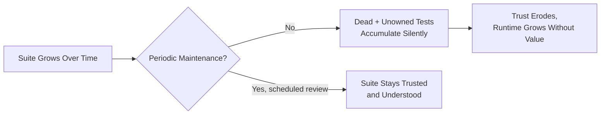

# Maintaining Automation at Scale

**Prerequisites**: You should already understand [Choosing and Comparing Automation Tools](/learning-paths/automation/choosing-and-comparing-automation-tools).
**Leads to**: After this, you'll be ready for [Applying Automation: AtlasBank Fund Transfer Suite](/learning-paths/automation/applying-automation-fund-transfer-suite).

Every module so far has been about building automation well. This module is about something Sections 1–4 never addressed directly: what happens to a well-built suite a year later, after dozens of contributors, hundreds of added tests, and features that no longer exist the way they did when their tests were written.

## Why This Matters

**A suite that only grows.** AtlasBank's automation suite reaches 600 tests over two years, built following every practice from Sections 1–4 — solid framework, Page Object Model, data-driven tests, reliable, well-asserted, CI-integrated. Nobody ever removes a test. A feature that was fully redesigned eight months ago still has 40 tests written against its old behavior — some fail consistently and get ignored as "known broken, that feature changed," some were quietly updated by whoever touched them next, and a few still pass by coincidence, testing something that no longer matches how the feature actually works. The suite takes longer to run, is harder to trust, and nobody is confident anymore about which of the 600 tests are actually meaningful.

**A suite that's actively maintained.** A different team treats their suite as something requiring the same ongoing care as production code — when the same feature gets redesigned, its 40 old tests are deliberately reviewed in the same sprint: some updated, most consolidated into a smaller, more accurate set matching the new behavior, a few deleted outright because they tested something that no longer exists. Two years in, this team's suite is larger in absolute feature coverage but has fewer total tests than if every version of every feature's tests had simply accumulated — and every test in it is understood to still mean something.

Both suites represent real, sustained investment. Only one of them is still an asset instead of a slowly accumulating liability.

## What This Module Covers

**Automation technical debt** is the accumulated cost of tests that no longer earn their keep — dead tests (testing behavior that no longer exists), unowned tests (nobody remembers why they exist or who to ask), and tests kept "just in case" long after their original justification expired. Like any technical debt, it's invisible day to day and expensive in aggregate, exactly the shape of AtlasBank's first team's 600-test suite.

**Dead tests** specifically: a test testing behavior the application no longer has, often surviving because deleting a test feels riskier than it actually is — "what if we need it later" outweighs "it's testing something that doesn't exist," even though a dead test provides zero actual protection while still costing runtime and cognitive overhead on every single run.

**Unowned tests**: as a suite grows past what any one person can hold in their head, individual tests lose their connection to a specific person who understands *why* they exist and what real risk they cover — exactly the shape [Selecting the Right Test Cases for Automation](/learning-paths/automation/selecting-the-right-test-cases-for-automation) wanted every automated test to have from the start (a specific, deliberate reason to exist), quietly eroding over time without active maintenance.

**A periodic maintenance practice, not just reactive fixing**: the healthiest suites treat maintenance as a scheduled, recurring activity — reviewing failing or skipped tests regularly, revisiting test relevance whenever the feature it covers changes meaningfully, and treating "delete this test" as a legitimate, normal outcome of that review, not a last resort.

| Signal | What It Suggests | Action |
|---|---|---|
| A test has failed consistently for weeks, ignored as "known broken" | Likely dead — testing outdated behavior | Review and delete or update |
| Nobody on the current team can explain what a passing test actually verifies | Unowned, possibly no longer meaningful | Review, document, or remove |
| A feature was significantly redesigned | Its existing tests are now a maintenance decision point | Deliberately review, don't just leave as-is |
| Suite runtime keeps growing faster than real feature coverage | Accumulation without pruning | Audit for dead/redundant tests, not just add parallel workers |

## When Active Maintenance Matters Most

- **Any suite that's been running long enough to outlive its original authors or the features it was first written against** — the specific window where dead and unowned tests accumulate fastest.
- **Immediately after any significant feature redesign** — exactly the AtlasBank example's trigger point, where old tests need a deliberate decision, not silent neglect.
- **Any suite whose runtime is growing faster than the team's confidence in its results** — a strong, specific signal that accumulation, not genuine new coverage, is driving the growth.

Active maintenance matters less for a young, small suite still being actively built — the practices this module describes are genuinely about *sustaining* a mature suite, not something a five-test suite needs formalized yet.

## How This Works on a Real Project

AtlasBank's Loan Portal undergoes a significant redesign — the application-form flow changes from a single long page to a multi-step wizard. The automation team, following this module's practice, treats the redesign as a deliberate maintenance trigger rather than letting the old form's 25 tests simply start failing and get ignored. Reviewing them: 8 tests covered validation rules that still apply identically in the new wizard and get updated in place (same assertion, new page-object interactions); 12 tests covered step-sequencing behavior specific to the old single-page layout and no longer make sense at all — deleted, with their replacement coverage written fresh against the new wizard's actual step logic; 5 tests turn out to have been testing a validation rule removed from the product entirely two redesigns ago, never cleaned up — deleted outright, with zero replacement needed.

The result: the new wizard ships with fewer total tests than the old form had, genuinely better matched to its actual current behavior, and the team has a clear, current understanding of what every one of those tests verifies and why — rather than accumulating a fourth generation of untouched, increasingly irrelevant test files on top of the old ones.

## Common Mistakes

**Mistake 1: Treating test deletion as inherently risky, defaulting to keeping everything "just in case."**
As the opening example shows, a dead test provides zero actual protection while still costing real, ongoing overhead — the risk calculus usually favors deliberate removal, not indefinite retention.

**Mistake 2: Letting a feature redesign's old tests simply start failing without a deliberate review.**
The AtlasBank Loan Portal example shows the alternative — treating a redesign as an explicit trigger point for review, not something to quietly work around test failures for indefinitely.

**Mistake 3: Adding more parallel workers to address growing runtime without checking whether the growth is genuine new coverage or accumulated dead weight.**
[Parallel Execution](/learning-paths/automation/parallel-execution) genuinely helps runtime, but it treats a symptom — it doesn't address whether the suite's size still reflects real, current value.

**Mistake 4: Never scheduling maintenance as a deliberate, recurring activity, treating it only as something to do reactively when a problem becomes unavoidable.**
By the time a suite's health becomes an unavoidable problem, the accumulated debt is usually far more expensive to address than it would have been caught incrementally.

## Best Practices

**Practice 1: Treat a significant feature redesign as an explicit trigger to review that feature's existing tests.**
The single practice that prevented AtlasBank's Loan Portal redesign from adding a fourth generation of stale tests on top of three prior ones.

**Practice 2: Default toward deleting a test whose behavior no longer exists, rather than defaulting toward keeping it.**
A dead test's real cost (runtime, cognitive overhead, false sense of coverage) usually outweighs the rare case where deletion turns out to have been premature.

**Practice 3: Schedule periodic suite health review as a recurring activity, not just a reaction to an unavoidable problem.**
Catches accumulating debt incrementally, before it reaches the scale of AtlasBank's first, unmaintained 600-test example.

**Practice 4: When investigating a growing suite runtime, check for accumulated dead weight before reaching only for parallelization.**
Parallel execution helps regardless, but addressing the actual cause (unpruned, no-longer-relevant tests) is a more complete fix than speed alone.

:::note From the Field
A financial software company's automation suite, after four years and several engineering-team turnovers, had grown to over 1,200 tests with no formal ownership or periodic review process. An internal audit found that roughly 30% of the suite was testing features that had been removed, redesigned beyond recognition, or replaced entirely — nobody currently on the team could confidently say which third, since the knowledge of *why* each test existed had left with the engineers who'd originally written them. The cleanup project took six weeks and ultimately reduced the suite's size by nearly 400 tests while genuinely *increasing* the team's confidence in what remained, since every surviving test could now be explained by someone currently on the team.
:::

:::tip Senior QA Insight
A newer engineer sees a large automated test count and reads it as unambiguously good — more tests, more coverage. A senior engineer asks a different question: how much of this count is genuinely earning its keep right now, versus accumulated from features and versions that no longer exist — because raw test count, without active maintenance, tends to overstate real coverage more than it understates it.
:::

## Mini Challenge

**Scenario**: AtlasBank's card-management feature is being redesigned next quarter — from a single card-details page to separate physical-card and virtual-card management flows. The current suite has 30 tests against the existing single-page version.

**Your task**: Describe the specific review process you'd run against these 30 tests once the redesign ships, including what would make a specific test a candidate for updating in place, replacing entirely, or deleting outright.

## Key Takeaways

- Automation technical debt — dead tests, unowned tests, tests kept "just in case" — is invisible day to day and expensive in aggregate, the same shape as any other technical debt.
- A significant feature redesign is a deliberate trigger point for reviewing that feature's existing tests, not something to quietly work around indefinitely.
- Default toward deleting a test whose behavior no longer exists — its real ongoing cost usually outweighs the rare case where deletion turns out premature.
- Raw automated test count, without active maintenance, tends to overstate real coverage rather than understate it.

---

## What You Just Learned

- What automation technical debt is, and why it's invisible day to day and expensive in aggregate
- Why a feature redesign is the right trigger point to deliberately review its existing tests, not just let them fail quietly
- The specific signals (consistent ignored failures, no current owner, growing runtime without matching coverage growth) that indicate active maintenance is overdue
- How a real, four-year-old, 1,200-test suite's health was restored by a deliberate cleanup, reducing size while increasing genuine confidence

**Next:** [Applying Automation: AtlasBank Fund Transfer Suite](/learning-paths/automation/applying-automation-fund-transfer-suite)

## Related Topics

- [Selecting the Right Test Cases for Automation](/learning-paths/automation/selecting-the-right-test-cases-for-automation) — The original "does this deserve automation" judgment this module applies again, later, to tests already in the suite
- [Parallel Execution](/learning-paths/automation/parallel-execution) — A related but distinct lever for suite runtime, which this module argues shouldn't be the only response to growing suite size
- [Test Stability and Flaky Tests](/learning-paths/automation/test-stability-and-flaky-tests) — A related trust-erosion problem, now considered at the scale of a suite's entire lifecycle rather than one test's reliability

## Interview Questions

**Q1: How would you approach maintaining a large, multi-year automation suite as features change over time?**

*What to look for*: A candidate who describes a deliberate, periodic review practice — specifically naming feature redesigns as trigger points, and treating test deletion as a legitimate, normal outcome — rather than describing only reactive fixing of failures as they appear.

:::note Common Interview Mistake
Many candidates answer "I'd fix failing tests as they come up" without addressing dead or unowned tests that might still be passing while testing nothing meaningful. That's incomplete — a strong answer specifically names the risk of tests that pass by coincidence or test outdated behavior, not just tests that visibly fail.
:::

**Q2: Would you be comfortable deleting a test that's been in the suite for years? What would make you decide to?**

*What to look for*: A candidate who isn't reflexively opposed to deletion, and who names concrete criteria (the behavior no longer exists, nobody can explain its current purpose, it duplicates newer coverage) rather than treating any existing test as permanently untouchable.

---

## Glossary

**Automation Technical Debt**: The accumulated cost of tests that no longer earn their keep — dead tests, unowned tests, and tests retained without a current, clear justification.

**Dead Test**: A test verifying behavior the application no longer has, providing no real protection while still costing runtime and cognitive overhead on every run.

**Unowned Test**: A test whose original purpose and justification are no longer understood by anyone currently on the team.

## Quick Revision

Remember these five points:

✓ Automation technical debt (dead tests, unowned tests) is invisible day to day and expensive in aggregate.
✓ Treat a significant feature redesign as a deliberate trigger to review that feature's existing tests.
✓ Default toward deleting a test whose behavior no longer exists, rather than keeping it "just in case."
✓ Schedule periodic suite health review as a recurring activity, not just a reaction to an unavoidable problem.
✓ Raw test count, without active maintenance, tends to overstate real coverage rather than understate it.
