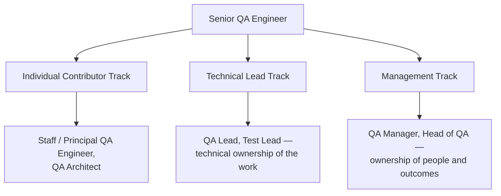

# QA Career Roadmap: IC vs. Technical Lead vs. Manager

**Prerequisites**: This path assumes you already have real QA experience — ideally a year or more applying the technique from [Manual Testing](/learning-paths/manual-testing/test-design-fundamentals) and at least one specialized domain (API, Automation, Performance, Security, Mobile, or AI for QA).
**Leads to**: After this, you'll be ready for [Developing Leadership Skills and Technical Credibility](/learning-paths/career-leadership/developing-leadership-skills-and-technical-credibility).

## Why This Matters

**A Senior QA Engineer who says yes to the first title offered.** A strong individual contributor is told they're "ready for the next step" and offered a QA Lead title. They accept without asking what the role actually involves. Six months in, they're spending most of their time in one-on-ones, performance reviews, and hiring — work they never wanted and aren't good at yet — while the hands-on testing and technical problem-solving they were actually excellent at, and actually enjoyed, has almost disappeared from their week. The title was a promotion on paper; day to day, it's a different job they didn't choose.

**A Senior QA Engineer who asks what the role actually is, first.** A peer at a similar level is offered a similarly titled "next step," but asks specific questions before accepting: how much of the week is spent on people management versus technical work, who they'd report to, what success looks like in six months, whether the role has direct reports from day one or grows into them. The answers reveal it's actually a Staff/Principal-track technical role with "Lead" in the title for org-chart reasons, not a management role. They accept with clear eyes, and six months in, the role matches what they were told it would be.

Both engineers were equally qualified. The difference is that one treated "next step" as a single ladder with one direction, and the other recognized that QA careers branch into genuinely different jobs past Senior — and asked which one was actually on offer.

## The Three Directions

Past Senior QA Engineer, a QA career branches into three distinct tracks, not one continuous ladder:

**Individual Contributor (IC) track — Staff/Principal QA Engineer, QA Architect**: continues doing deep technical work, but at increasing scope and influence — designing testing strategy for an entire product area, solving the hardest technical testing problems, setting technical standards other engineers follow. No direct reports. Influence comes from technical authority and the judgment built from solving hard problems repeatedly, not from organizational position.

**Technical Lead track — QA Lead, Test Lead**: a hybrid role. Still does real technical work, often the hardest problems on the team, but also owns technical direction for a team or project — deciding testing approach, reviewing others' technical decisions, unblocking the team technically. May or may not have formal direct reports; the defining trait is technical ownership of a team's *work*, not people-management ownership of the team's *careers*.

**Management track — QA Manager, Test Manager, Head of QA**: the job changes fundamentally. Success is now measured by the team's output and growth, not personal technical output. The daily work shifts to hiring, performance management, cross-functional alignment, budget and headcount, and organizational strategy. Deep hands-on testing work largely stops — not because it's forbidden, but because there genuinely isn't time for both a full management workload and full technical depth.

None of these tracks is a "higher" version of another — they're different jobs that happen to share a starting point. A title alone often doesn't tell you which one you're being offered, because organizations use "Lead" inconsistently: sometimes it means Technical Lead, sometimes it's really a first management role with a softer title.

## How to Tell Which Track You're Actually Being Offered

Before accepting a title change, ask directly:

- **What does a typical week look like?** A rough breakdown of hands-on technical work versus people-management work versus cross-functional coordination tells you more than any title.
- **Will I have direct reports, and from day one or eventually?** Direct reports are the clearest single signal you're on or entering the management track.
- **How is success measured for this role in six months?** "Shipped a testing strategy for X" points to IC or Technical Lead; "team's velocity and retention improved" points to Management.
- **Who do I go to for a hard technical problem, and who do I go to for a people problem?** If both answers are "you, now," that's a strong Technical Lead or Management signal.

## Common Mistakes

**Mistake 1: Assuming Management is the only real "next step" after Senior.**
Many organizations still present management as the default promotion path, even for engineers whose actual strengths and interests are technical — accepting by default, rather than by genuine preference, is how strong ICs end up in management roles they're unsuited for and unhappy in.

**Mistake 2: Accepting a title change without confirming what the role actually involves day to day.**
"QA Lead" means different things at different companies — confirm the actual weekly split of technical versus people work before accepting, not after.

**Mistake 3: Treating the IC track as a lesser or fallback option.**
A Staff or Principal QA Engineer with deep technical authority is not a consolation prize for "not becoming a manager" — at many organizations, it's an equally senior, equally well-compensated track that simply values different skills.

**Mistake 4: Choosing a track based on status rather than fit.**
A management title can look more prestigious from the outside, but a mismatch between the actual work and what someone is good at and enjoys tends to surface within months, not years — fit matters more than the perceived status of the title.

## Best Practices

**Practice 1: Get the week-to-week breakdown in writing or explicitly confirmed before accepting a role change.**
A verbal "mostly technical, some mentoring" from a hiring manager is worth confirming against what current people in the role actually report their week looking like.

**Practice 2: Talk to someone already in the role you're considering, not just the person offering it to you.**
The person offering the promotion has an interest in it sounding appealing — someone already doing the job day to day gives you a more accurate picture.

**Practice 3: Treat the choice as reversible, not permanent, but choose deliberately anyway.**
Careers do move between tracks — an engineer can move from Management back to IC, or the reverse — but a deliberate first choice, based on genuine fit, costs less than an accidental one you have to unwind.

**Practice 4: Revisit the question periodically, not only when a promotion is offered.**
What you want from your career can genuinely change over several years — an engineer who chose IC at 28 may want the Management track at 34, or the reverse, and neither is a failure of the earlier choice.

:::note From the Field
A Senior QA Engineer at a mid-size SaaS company was offered a "QA Lead" role after four years of strong individual work. Before accepting, she asked the hiring manager for a breakdown of how the two current QA Leads at the company actually spent their weeks — and found both were spending roughly 70% of their time on hiring, performance reviews, and cross-team coordination, despite the "Lead" title suggesting a technical role. She negotiated instead for a newly created Staff QA Engineer title with a clearly scoped technical mandate: owning testing strategy for the company's highest-risk product area, with no direct reports. Eighteen months later, she was the most senior technical voice on quality across the entire engineering org — a role she never would have grown into if she'd accepted the management-track "Lead" title by default.
:::

## Mini Challenge

**Scenario**: You're a Senior QA Engineer at a 40-person engineering organization. Your manager tells you, "We'd like to promote you to QA Lead next quarter."

**Your task**: Write down the four specific questions you'd ask before accepting, and for each one, describe what answer would tell you it's actually a Technical Lead role versus a Management role.

## Key Takeaways

- Past Senior QA Engineer, careers branch into three distinct tracks — Individual Contributor, Technical Lead, and Management — not one continuous ladder.
- Titles like "QA Lead" are used inconsistently across organizations and don't reliably signal which track a role actually belongs to.
- The clearest signals are the actual weekly split of technical versus people work, and whether the role includes direct reports.
- The IC track is a legitimate, equally senior destination, not a fallback for engineers who don't become managers.

## What You Just Learned

- The three tracks a QA career branches into after Senior QA Engineer
- Why title alone doesn't reliably indicate which track a role belongs to
- The specific questions to ask before accepting a title change
- Why choosing based on genuine fit, not perceived status, matters most

## Related Topics

- [Developing Leadership Skills and Technical Credibility](/learning-paths/career-leadership/developing-leadership-skills-and-technical-credibility) — What actually builds influence on each of these three tracks
- Running QA Teams (coming soon, Section 3) — What the Management track's daily work actually involves once you're in it
- [Evaluating and Negotiating an Offer](/learning-paths/interview-preparation/evaluating-and-negotiating-an-offer) — The same clarify-before-accepting discipline, applied to external offers rather than internal promotions

## Interview Questions

**Q1: How do you decide between a technical leadership track and a people management track in QA?**

*What to look for*: A candidate who names concrete decision factors (genuine interest in people development versus technical depth, honest self-assessment of what energizes them) rather than assuming management is automatically the more senior or more desirable choice.

**Q2: What would you ask before accepting a "QA Lead" title, and why?**

*What to look for*: Specific, practical questions about the actual weekly work split and direct-report status — a candidate who just says "I'd ask what the role involves" without naming concrete questions hasn't fully thought through how vague that title actually is in practice.

:::note Common Interview Mistake
Many candidates answer this as if Management is obviously the "better" or "more senior" choice, treating the IC track as a fallback. A strong answer treats both tracks as equally legitimate, senior destinations that suit different strengths — and shows the candidate has thought about which one genuinely fits them, not just which one sounds more impressive.
:::

**Q3: Describe a time you had to clarify what a role actually involved before accepting it.**

*What to look for*: A real example showing the candidate asks clarifying questions before big career decisions rather than assuming, and ideally a case where the clarification changed their decision or their approach to the role.

---

## Glossary

**Individual Contributor (IC) Track**: A career path that continues deep technical work at increasing scope and influence, without formal people-management responsibility.

**Technical Lead**: A hybrid role owning a team's technical direction and often doing hands-on work, distinct from owning the team's people-management outcomes.

**QA Manager**: A role where success is measured by team output, growth, and organizational outcomes rather than personal technical output.

## Quick Revision

Remember these five points:

✓ Past Senior QA Engineer, careers branch into three distinct tracks: Individual Contributor, Technical Lead, and Management.

✓ Title alone often doesn't indicate which track a role belongs to — "QA Lead" is used inconsistently across organizations.

✓ The clearest signals are the actual weekly split of technical versus people work, and whether the role has direct reports.

✓ The IC track (Staff/Principal QA Engineer, QA Architect) is a legitimate, senior destination, not a consolation prize.

✓ Choose based on genuine fit and interest, not the perceived status of the title — mismatches surface within months.
