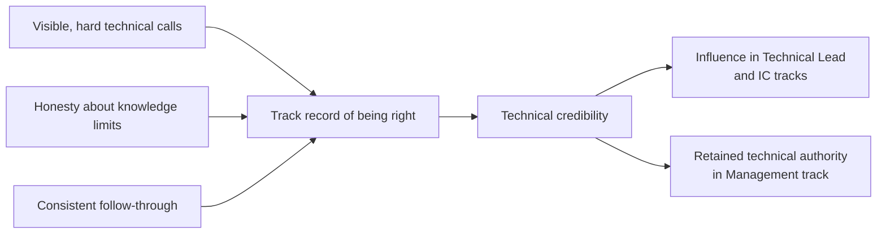

# Developing Leadership Skills and Technical Credibility

**Prerequisites**: [QA Career Roadmap: IC vs. Technical Lead vs. Manager](/learning-paths/career-leadership/qa-career-roadmap-ic-vs-technical-lead-vs-manager)
**Leads to**: After this, you'll be ready for [Personal Branding for Test Engineers](/learning-paths/career-leadership/personal-branding-for-test-engineers).

## Why This Matters

**An engineer promoted on tenure alone.** A QA engineer with five years at the company is made QA Lead largely because of seniority and time served. In their first cross-team meeting, they push back on a developer's proposed testing shortcut — and are quietly overruled, because the developers in the room have never seen this person's technical judgment demonstrated on anything difficult. The title says "Lead." The room doesn't treat them as one.

**An engineer who built credibility before the title arrived.** A peer at a similar tenure spent the two years before their own promotion deliberately taking on the hardest, most visible testing problems on the team — the flaky test suite nobody wanted to own, the production incident nobody could reproduce. By the time they're made QA Lead, the same room has already seen their judgment tested repeatedly. When they push back on a shortcut, the room listens, because the credibility was earned before the title needed it.

Both engineers got the same title. Only one of them had the standing to use it effectively — because credibility, unlike a title, isn't granted, it's built through visible, repeated demonstration of sound technical judgment.

## Technical Credibility Is the Foundation

Every track from [QA Career Roadmap](/learning-paths/career-leadership/qa-career-roadmap-ic-vs-technical-lead-vs-manager) — Individual Contributor, Technical Lead, and even Management — ultimately depends on technical credibility. A manager with no remaining technical credibility can still manage headcount and process, but loses the ability to make or defend real technical calls; a Technical Lead or Staff Engineer with no credibility has effectively lost the entire basis of the role, since influence on that track comes from technical authority specifically.

Credibility is built through a small number of repeated, visible behaviors, not through any single achievement:

- **Being right about hard, ambiguous calls, especially when it was uncomfortable to say so.** Flagging a genuine risk in a release everyone wants to ship, and being proven right, builds more credibility than a dozen easy, agreed-upon calls.
- **Being honest about the limits of your own knowledge.** Someone who says "I don't know, but I'll find out" on an unfamiliar problem, and then actually finds out, builds more trust than someone who bluffs and is later caught wrong.
- **Following through on commitments, consistently, especially small ones.** Credibility erodes faster from missed small commitments (a promised follow-up, a review that never happens) than it builds from occasional large wins.
- **Making your reasoning visible, not just your conclusions.** Explaining *why* a test strategy prioritizes one risk over another lets others evaluate and trust your judgment, rather than just your authority.

## Leadership Skills Are Learnable, Not Innate

A common, damaging assumption is that leadership is a fixed personality trait — some people "have it," others don't. In practice, the specific skills that make someone effective in QA leadership are learnable and improve with deliberate practice, the same way test design technique does:

**Structured communication**: stating a conclusion first, then the supporting reasoning, rather than building up to a conclusion — the same discipline [Presenting Your Testing Work Credibly](/learning-paths/interview-preparation/presenting-your-testing-work-credibly) teaches for interviews applies daily in leadership conversations.

**Active listening under disagreement**: genuinely understanding a developer's or product manager's position before responding, rather than formulating a rebuttal while they're still talking — the single most common gap in engineers who are technically strong but perceived as difficult to work with.

**Calibrated confidence**: stating a technical opinion with the confidence the evidence actually supports — neither hedging on something you're genuinely certain of, nor overstating certainty on something you're not.

## Common Mistakes

**Mistake 1: Assuming a title grants the credibility a title is supposed to reflect.**
Credibility has to be earned through demonstrated judgment; a title without it produces exactly the overruled-in-the-room scenario from this module's opening example.

**Mistake 2: Waiting for a title before demonstrating leadership behavior.**
The engineer who builds credibility *before* the title, as in this module's second example, arrives at the role already trusted — waiting until after the promotion to start demonstrating sound judgment means starting from zero exactly when it matters most.

**Mistake 3: Confusing volume of talking with leadership presence.**
Speaking often in meetings without being asked for input afterward is a sign of noise, not influence — genuine leadership presence is measured by whether people specifically seek out your judgment, not by how much airtime you take.

**Mistake 4: Treating a single high-profile win as sufficient, ongoing credibility.**
Credibility decays without reinforcement — a strong catch eighteen months ago doesn't carry the same weight as a consistent, recent track record.

## Best Practices

**Practice 1: Seek out the hardest, most visible technical problem currently unowned on your team.**
Flaky test suites, unreproducible production defects, and neglected technical debt are consistently undervalued opportunities to build credibility precisely because everyone else avoids them.

**Practice 2: State your reasoning, not just your conclusion, especially when disagreeing.**
"I don't think we should ship this" invites pushback with no basis for evaluation; "I don't think we should ship this because the payment-retry logic hasn't been tested under network failure, and that's our highest-risk path" gives others something concrete to evaluate and, if warranted, trust.

**Practice 3: Practice active listening deliberately, especially in disagreements.**
Before responding to a disagreement, restate the other person's position in your own words and confirm you've understood it correctly — this single habit measurably reduces perceived defensiveness and improves how your own pushback is received.

**Practice 4: Track your own credibility-building moments explicitly.**
A running, private log of hard calls you made and how they turned out is useful both for calibrating your own judgment over time and for concrete examples when the promotion or leadership conversation eventually happens.

:::note From the Field
At a mid-size fintech company, a Senior QA Engineer noticed the team's checkout-flow test suite had become notoriously flaky — failing intermittently for reasons nobody had fully diagnosed, to the point where developers had started ignoring its failures entirely. Over three months, alongside their regular work, they systematically diagnosed and fixed the root causes — several genuine race conditions in test setup, not application bugs. The suite went from a 15% flake rate to under 1%. No one asked them to do this; it wasn't in anyone's stated goals. But six months later, when a QA Lead role opened, three different engineers independently mentioned this work when asked who should get it — not because it was flashy, but because it was hard, visible, and directly solved a problem the whole team felt.
:::

## Mini Challenge

**Scenario**: You're a Senior QA Engineer. Your team has a known, long-standing problem that nobody currently owns (pick one: a flaky test suite, a slow release process, poor test documentation, or a recurring class of production defect).

**Your task**: Write a three-sentence plan for how you'd approach building credibility by addressing this specific problem, including what "visible" would concretely mean for this particular case (who would notice, and how).

## Key Takeaways

- Technical credibility, not title, is the actual foundation every QA leadership track depends on.
- Credibility is built through repeated, visible behaviors — being right on hard calls, honesty about knowledge limits, and consistent follow-through — not through a single achievement.
- Leadership skills like structured communication, active listening, and calibrated confidence are learnable, not fixed traits.
- Building credibility before a title arrives, not after, is what makes the title effective once it does.

## What You Just Learned

- Why technical credibility underlies every QA leadership track, including Management
- The specific, repeated behaviors that build credibility over time
- Which leadership skills are learnable and how to practice them deliberately
- Why waiting for a title before demonstrating leadership behavior costs you exactly when it matters most

## Related Topics

- [QA Career Roadmap: IC vs. Technical Lead vs. Manager](/learning-paths/career-leadership/qa-career-roadmap-ic-vs-technical-lead-vs-manager) — The three tracks this credibility is the shared foundation for
- [Leading Without Authority](/learning-paths/career-leadership/leading-without-authority) — Applying this same credibility directly, before any formal title exists
- [Presenting Your Testing Work Credibly](/learning-paths/interview-preparation/presenting-your-testing-work-credibly) — The same structured-communication discipline, applied specifically to interviews

## Interview Questions

**Q1: How do you build credibility with a team before you have formal authority?**

*What to look for*: A candidate who names specific, repeated behaviors (visible hard calls, honesty about limits, follow-through) rather than a vague "by doing good work" — and ideally a real example of doing this themselves.

**Q2: Tell me about a time your technical judgment was initially doubted, and how you addressed it.**

*What to look for*: A genuine example showing self-awareness about how credibility is earned, not a story that blames the doubters — a strong answer shows the candidate did something concrete to demonstrate judgment rather than simply asserting authority.

:::note Common Interview Mistake
Many candidates describe leadership presence in terms of confidence or charisma alone — "I speak up in meetings" — without connecting it to demonstrated technical judgment. A strong answer ties influence specifically to a track record other people can actually evaluate, not to communication style alone.
:::

**Q3: What's a technical leadership skill you've deliberately worked on improving, and how?**

*What to look for*: Evidence the candidate treats leadership skill as learnable and has actually practiced something specific (e.g., active listening, structured communication) rather than treating leadership ability as something you either have or don't.

---

## Glossary

**Technical Credibility**: A track record of demonstrated, trusted technical judgment that other engineers evaluate and rely on, distinct from formal title or authority.

**Influence Without Authority**: The ability to shape technical decisions and team direction without relying on positional power, built primarily through credibility.

**Calibrated Confidence**: Stating a technical opinion with a level of certainty that genuinely matches the strength of the underlying evidence — neither overstated nor underplayed.

## Quick Revision

Remember these five points:

✓ Technical credibility, not title, is the actual foundation every QA leadership track — IC, Technical Lead, and Management — depends on.

✓ Credibility is built through repeated, visible behaviors: being right on hard calls, honesty about knowledge limits, and consistent follow-through.

✓ Leadership skills like structured communication and active listening are learnable through deliberate practice, not fixed personality traits.

✓ Seeking out unowned, hard, visible problems is a consistently undervalued way to build credibility.

✓ Building credibility before a title arrives is what makes the title effective once it does — waiting until after starts you from zero.
