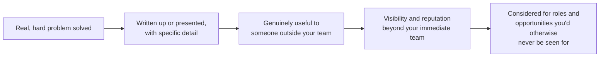

# Personal Branding for Test Engineers

**Prerequisites**: [Developing Leadership Skills and Technical Credibility](/learning-paths/career-leadership/developing-leadership-skills-and-technical-credibility)
**Leads to**: After this, you'll be ready for [What Is Test Strategy?](/learning-paths/career-leadership/what-is-test-strategy).

## Why This Matters

**An excellent tester known only within their team.** A QA engineer does consistently strong work — thorough, well-reasoned, genuinely valuable — but only their immediate team and manager ever see it. When a Staff QA Engineer role opens up elsewhere in a 300-person engineering organization, the hiring panel has never heard of them, despite years of strong work. A less experienced but more visible peer, whose write-ups and conference talk about a real production incident are known org-wide, gets the role instead.

**An equally excellent tester who shares real work deliberately.** A peer with similar skill writes a short internal post after solving a genuinely hard test-flakiness problem, explaining the root cause and the fix in a way other teams could apply. It gets referenced by two other teams within a month. A year later, when the same Staff role opens, three people on the hiring panel already know their work by reputation, not just their resume.

Both engineers did excellent work. Only one built a reputation for it — not through self-promotion disconnected from substance, but by deliberately sharing real, specific work that happened to be worth knowing about.

## What Personal Branding Actually Means Here

For a test engineer, personal branding is not marketing yourself — it's making your genuinely valuable work visible to people who aren't already watching it happen. The distinction matters: branding built on substance compounds your actual credibility (see [Developing Leadership Skills and Technical Credibility](/learning-paths/career-leadership/developing-leadership-skills-and-technical-credibility)); branding built on self-promotion without substance is quickly recognized as such, and actively damages credibility once it is.

Concrete forms this takes in a QA career:

- **Internal write-ups of real problems you solved**: a root-cause analysis, a framework decision and its tradeoffs, a postmortem you contributed meaningfully to — shared where people outside your immediate team can find it.
- **Speaking, even informally**: presenting a technique or a real incident at an internal engineering all-hands, a team's brown-bag session, or a local meetup.
- **Public contribution**: a blog post, an open-source contribution to a testing tool, a conference talk — higher-visibility versions of the same internal habit.
- **Consistent, substantive participation in professional spaces**: genuinely useful answers in a testing community, not just a filled-out profile.

## The Substance-First Principle

The single rule that keeps personal branding from becoming hollow self-promotion: **only share work that would be genuinely useful to someone else facing a similar problem.** A write-up about a real, specific defect investigation with a genuinely useful root cause helps a future reader; a generic "5 tips for better testing" post with no specific example behind it does not, and is recognized as filler.

## Common Mistakes

**Mistake 1: Sharing generic advice with no specific, real example behind it.**
Content without a real, specific problem attached reads as filler and is quickly recognized as self-promotion rather than genuine expertise.

**Mistake 2: Never sharing anything outside your immediate team, out of discomfort with self-promotion.**
The opposite failure mode is just as costly — strong, genuinely useful work that nobody outside your team ever learns about builds no reputation, no matter how good it is.

**Mistake 3: Treating branding as a one-time event rather than a habit.**
A single well-received post eighteen months ago doesn't sustain a reputation — consistent, if occasional, sharing over time is what actually compounds into visibility.

**Mistake 4: Taking credit disproportionate to your actual contribution.**
Overstating your role in a team effort is quickly noticed by the people who were actually there, and damages credibility far more than it builds visibility.

## Best Practices

**Practice 1: Write up the hard problems you solve, close to when you solve them.**
The detail and reasoning are freshest immediately after solving a problem — write it up while it's still clear, even if you don't share it publicly right away.

**Practice 2: Share where the people who'd actually benefit will see it.**
An internal engineering-wide channel or wiki reaches more relevant people than a private note to your own manager — match the sharing venue to who would genuinely benefit.

**Practice 3: Credit collaborators explicitly and specifically.**
Naming who else contributed, and how, costs nothing and meaningfully builds trust — the opposite of Mistake 4 above.

**Practice 4: Start internally before going external.**
Internal write-ups and talks are lower-stakes practice for the same skill a public blog post or conference talk requires — build the habit where the audience is smaller and more forgiving first.

:::note From the Field
A QA engineer at a healthcare software company spent two weeks diagnosing an intermittent, hard-to-reproduce defect in a patient-scheduling feature that had been logged and reopened three times without resolution. After finally identifying the real root cause — a timezone-handling bug that only manifested near daylight-saving transitions — they wrote a detailed internal postmortem, including the specific debugging steps that eventually worked. Two other teams at the same company referenced that postmortem within the following year when they hit similar timezone-related defects in unrelated features. When a Staff QA Engineer role opened eighteen months later, two of the people on the hiring panel already knew this engineer's work specifically because of that one postmortem — not because of any deliberate self-promotion effort, but because the write-up itself was genuinely useful enough to be remembered and referenced.
:::

## Mini Challenge

**Scenario**: Think of a real, specific technical problem you've solved in your own testing work — a defect you root-caused, a tooling decision you made, a process improvement you drove.

**Your task**: Write the first three sentences of an internal write-up about it, specific enough that someone facing a similar problem on a different team would find it genuinely useful.

## Key Takeaways

- Personal branding for a test engineer means making genuinely valuable work visible beyond your immediate team, not self-promotion disconnected from substance.
- The substance-first principle: only share work that would be genuinely useful to someone else facing a similar problem.
- Visibility beyond your immediate team is often what determines whether you're even considered for opportunities elsewhere in a larger organization.
- Consistent, if occasional, sharing over time compounds into reputation — a single instance doesn't sustain it.

## What You Just Learned

- What personal branding actually means for a test engineer, distinct from generic self-promotion
- The substance-first principle that keeps branding genuinely useful rather than hollow
- Concrete, low-stakes ways to start (internal write-ups, informal talks) before going public
- Why visibility beyond your immediate team materially affects career opportunities

## Related Topics

- [Developing Leadership Skills and Technical Credibility](/learning-paths/career-leadership/developing-leadership-skills-and-technical-credibility) — The credibility that genuine personal branding is an extension of, not a substitute for
- Executive Communication (coming soon, Section 7) — The same substance-first, specific-detail discipline applied to a different audience
- [Presenting Your Testing Work Credibly](/learning-paths/interview-preparation/presenting-your-testing-work-credibly) — The same underlying skill, applied specifically to interview settings

## Interview Questions

**Q1: How do you build visibility for your work beyond your immediate team?**

*What to look for*: Specific, real examples (a write-up, a talk, a shared postmortem) rather than a vague answer about "networking" — a strong answer ties visibility directly to genuinely useful, specific work.

**Q2: Tell me about a time you shared a technical write-up or presentation that others found useful.**

*What to look for*: A real example with enough specificity to show it happened, plus some indication of actual impact (referenced by another team, changed someone's approach) rather than just "I wrote a post once."

:::note Common Interview Mistake
Some candidates describe personal branding purely in terms of external visibility — conference talks, social media presence — without mentioning internal, lower-stakes forms first. A strong answer shows the candidate builds the habit internally, where the audience is smaller and the stakes lower, before or alongside anything external.
:::

**Q3: How do you avoid personal branding feeling like empty self-promotion?**

*What to look for*: An articulation of something like the substance-first principle — that only work genuinely useful to someone else is worth sharing — showing the candidate has thought about the difference between reputation-building and hollow self-promotion.

---

## Glossary

**Personal Branding (for test engineers)**: Making genuinely valuable, real work visible to people beyond your immediate team, as distinct from self-promotion without substance.

**Substance-First Principle**: The rule that only work genuinely useful to someone else facing a similar problem is worth sharing publicly or internally.

## Quick Revision

Remember these five points:

✓ Personal branding for a test engineer means making genuinely valuable work visible beyond your immediate team, not self-promotion for its own sake.

✓ The substance-first principle: only share work that would be genuinely useful to someone else facing a similar problem.

✓ Concrete forms include internal write-ups, informal talks, public contributions, and substantive community participation.

✓ Visibility beyond your immediate team often determines whether you're even considered for opportunities elsewhere in a larger organization.

✓ Consistent, if occasional, sharing over time compounds into reputation — a single instance of visibility doesn't sustain it.
