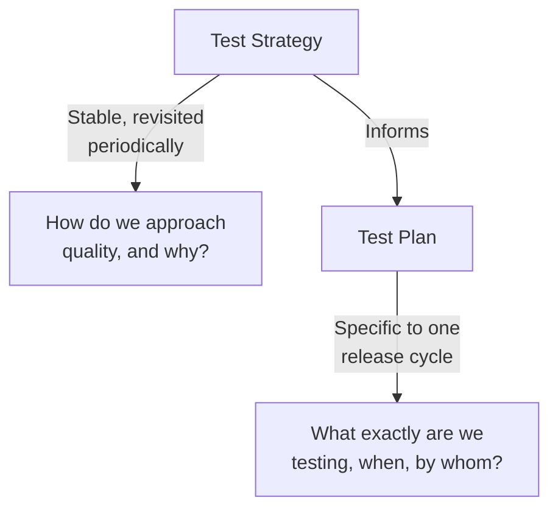

# What Is Test Strategy?

**Prerequisites**: [Personal Branding for Test Engineers](/learning-paths/career-leadership/personal-branding-for-test-engineers)
**Leads to**: After this, you'll be ready for [Risk-Based Strategy](/learning-paths/career-leadership/risk-based-strategy).

## Why This Matters

**A QA Lead who writes a test plan and calls it a strategy.** A newly promoted QA Lead is asked for "the test strategy" for a major new product. They produce a detailed document listing every feature, every test type to be run against it, and a schedule — thorough, specific, and immediately dated the moment the schedule slips or the feature list changes, which happens within two weeks. Six months later, no one references the document anymore, because it answered "what will we test, and when" for a version of the product that no longer exists.

**A QA Lead who writes an actual strategy.** A peer, asked the same question, produces a shorter document: the product's highest-risk areas and why, the overall testing approach for each risk category (which combination of manual, automated, and specialized testing applies where, and why), the quality bar for release, and how testing effort will scale as the product grows. It doesn't list every test case or a fixed schedule. Six months later, the specific tests have changed completely, but the document is still the reference point new team members read first — because it answered "how do we think about quality here," which didn't stop being true when the feature list changed.

Both documents were competently written. Only one was actually a strategy — because a strategy and a plan answer fundamentally different questions, and confusing them produces a document that looks thorough but stops being useful the moment specifics change.

## Test Strategy vs. Test Plan

A **test strategy** is the high-level approach to testing a product or organization takes, and the reasoning behind it — which risks matter most, which testing approaches address them, and what "good enough to release" actually means. It answers *how do we approach quality here, and why* — a question that stays stable even as specific features and schedules change.

A **test plan** is the specific, tactical execution of that strategy for a given release or feature — which test cases, which environments, which schedule, who's responsible for what. It answers *what exactly are we testing, when, and by whom* — a question that's expected to change constantly.

| | Test Strategy | Test Plan |
|---|---|---|
| **Question answered** | How do we approach quality, and why? | What exactly are we testing, when? |
| **Timeframe** | Stable across releases, revisited periodically | Specific to one release or feature cycle |
| **Level of detail** | Principles, risk priorities, approach | Concrete test cases, schedules, assignments |
| **Who uses it** | Leadership, new team members, cross-functional stakeholders | The team actually executing tests this cycle |
| **How often it changes** | Rarely — only when the product or risk landscape genuinely shifts | Every release |

A strategy without a plan stays too abstract to execute. A plan without a strategy behind it is a list of tasks with no coherent reasoning connecting them — which is exactly what the first example in this module produced, and why it stopped being useful the moment its specifics changed.

## What a Real Test Strategy Actually Contains

A genuinely useful test strategy typically covers:

- **Risk priorities**: which parts of the product carry the most business or user risk if they fail, and therefore deserve the most testing attention — covered in depth in [Risk-Based Strategy](/learning-paths/career-leadership/risk-based-strategy).
- **Testing approach by risk area**: which combination of manual exploratory testing, automated regression, performance testing, security testing, and specialized domain testing applies to each risk category, and why.
- **Quality bar for release**: what "ready to ship" actually means — which failures block release and which don't, stated explicitly rather than left to case-by-case judgment.
- **How testing scales**: how the approach adapts as the product, team, or release frequency grows, so the strategy doesn't need to be rewritten from scratch every time something changes.

## Common Mistakes

**Mistake 1: Writing a detailed test plan and calling it a strategy.**
This module's opening scenario — a document specific enough to be a plan won't survive the first significant change, and a strategy needs to survive exactly that kind of change to remain useful.

**Mistake 2: Writing a strategy so abstract it doesn't actually guide any real decision.**
The opposite failure — "we will test thoroughly and prioritize quality" states no actual position on risk, approach, or release bar, and is functionally useless the first time someone needs to make a real tradeoff call.

**Mistake 3: Treating the strategy document as a one-time deliverable rather than a living reference.**
A strategy that's written once and never revisited stops reflecting reality as the product and risk landscape genuinely change — it needs periodic review, not indefinite permanence.

**Mistake 4: Writing the strategy without input from the people who'll actually execute against it.**
A strategy written in isolation by leadership, without input from the engineers doing the actual testing, often misses practical realities that make it hard to follow in practice.

## Best Practices

**Practice 1: Write the strategy to answer "why," not just "what."**
Every stated priority should have a reason attached — "the payment flow gets the most testing attention because a defect there has direct financial and trust consequences" is far more useful than "the payment flow is high priority" alone.

**Practice 2: Keep the strategy short enough that people actually read it.**
A strategy document that's 30 pages long won't be referenced in practice — a strategy that fits on a few pages, focused on the genuinely important decisions, is more useful than an exhaustive one nobody reads.

**Practice 3: Revisit the strategy on a deliberate cadence, not only when something breaks.**
Reviewing the strategy quarterly, or whenever the product's risk profile genuinely shifts, keeps it a living document rather than something that quietly goes stale.

**Practice 4: Involve the team that will execute against the strategy in writing it.**
A strategy shaped with input from the engineers who'll actually apply it day to day is both more practical and more likely to be genuinely followed, not just filed away.

:::note From the Field
At AtlasBank, each of the four product teams — Internet Banking, Mobile App, Admin Portal, and Loan Portal — had historically written its own test plan independently, with no shared strategy connecting them. A newly hired QA Architect discovered this meant the same risk (unauthorized access to another customer's account data) was tested with completely different rigor across the four teams, purely because each team's plan reflected whatever that team happened to prioritize, not a shared, deliberate risk assessment. Writing a single organization-wide test strategy — starting with a shared risk assessment across all four products — surfaced this gap explicitly and became the direct basis for closing it. This exact scenario becomes this path's own capstone project later in the curriculum.
:::

## Mini Challenge

**Scenario**: You've just joined a mid-size company as QA Lead for a product you're unfamiliar with. Leadership asks for "the test strategy" within two weeks.

**Your task**: List the four questions you'd need answered before you could write a genuine strategy (not a plan), and explain why a plan alone wouldn't satisfy the actual request.

## Key Takeaways

- A test strategy answers how and why an organization approaches quality; a test plan answers what's being tested, when, and by whom — different questions, different lifespans.
- A strategy that's actually just a detailed plan stops being useful the moment its specifics change.
- A useful strategy states risk priorities, testing approach by risk area, and an explicit quality bar for release.
- Strategies need periodic revisiting, not indefinite permanence, to stay accurate as the product and risk landscape change.

## What You Just Learned

- The concrete difference between a test strategy and a test plan, and why conflating them produces documents that quickly go stale
- What a genuinely useful test strategy actually contains
- Why a strategy needs to state reasoning ("why"), not just priorities ("what")
- The AtlasBank scenario this curriculum's capstone later builds directly on

## Related Topics

- [Risk-Based Strategy](/learning-paths/career-leadership/risk-based-strategy) — How to actually determine the risk priorities a strategy states
- [Organization-Wide Quality Strategy](/learning-paths/career-leadership/organization-wide-quality-strategy) — Extending a single-product strategy across multiple teams, the AtlasBank scenario introduced here
- [Test Strategy and "How Would You Test X" Interviews](/learning-paths/interview-preparation/test-strategy-and-how-would-you-test-x-interviews) — Applying this same strategic reasoning under interview time pressure

## Interview Questions

**Q1: What's the difference between a test strategy and a test plan?**

*What to look for*: A clear articulation of the different questions each answers and different lifespans — a candidate who describes them as basically the same thing, or who can only describe one, hasn't fully grasped the distinction.

**Q2: Walk me through how you'd write a test strategy for a product you're unfamiliar with.**

*What to look for*: A process that starts with understanding risk (not test cases), and produces something stable rather than a detailed, soon-to-be-outdated plan — a candidate who jumps straight to listing test types without discussing risk first is missing the strategic layer.

:::note Common Interview Mistake
Many candidates use "test strategy" and "test plan" interchangeably throughout an interview, describing a strategy in terms that are actually plan-level detail (specific test cases, specific schedules). A strong answer keeps the two clearly separated and can explain why the distinction matters in practice, not just define both terms.
:::

**Q3: How often should a test strategy be revisited, and why?**

*What to look for*: An answer connecting revision frequency to actual triggers (product or risk-landscape changes, not just a fixed calendar) — showing the candidate understands a strategy as a living reference, not a one-time deliverable.

---

## Glossary

**Test Strategy**: The high-level approach an organization or product takes to testing, and the reasoning behind it — stable across releases, answering how and why.

**Test Plan**: The specific, tactical execution of a strategy for a given release — concrete test cases, schedules, and assignments, changing every cycle.

**Quality Bar**: An explicit statement of what "ready to release" means — which failures block release and which don't.

## Quick Revision

Remember these five points:

✓ A test strategy answers how and why an organization approaches quality; a test plan answers what's being tested, when, and by whom.

✓ A document detailed enough to be a plan stops being useful as a strategy the moment its specifics change.

✓ A genuinely useful strategy states risk priorities, testing approach by risk area, and an explicit release quality bar.

✓ Strategies need periodic revisiting on a deliberate cadence to stay accurate as the product and risk landscape change.

✓ A strategy written without input from the people executing against it often misses practical realities that make it hard to follow.
