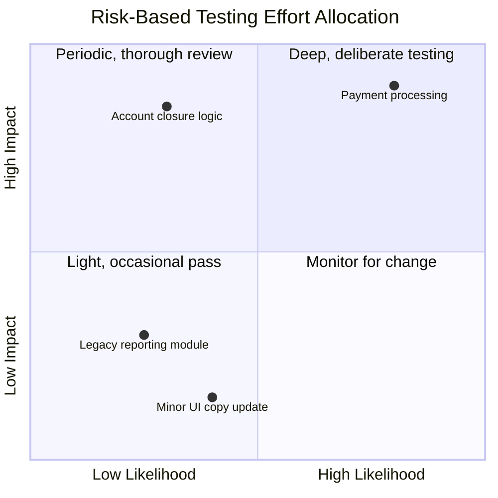

# Risk-Based Strategy

**Prerequisites**: [What Is Test Strategy?](/learning-paths/career-leadership/what-is-test-strategy)
**Leads to**: After this, you'll be ready for [Release Strategy](/learning-paths/career-leadership/release-strategy).

## Why This Matters

**A QA Lead who spreads testing effort evenly.** Facing a release with limited time, a QA Lead divides the team's remaining effort roughly equally across every feature area — new and old, high-stakes and low-stakes alike. It feels fair and thorough. Two weeks after release, a defect surfaces in the account-closure flow, a rarely-touched but high-consequence feature that got the same modest testing attention as a minor UI update — and the defect allows an account to be closed while a pending transfer is still in flight, causing real financial confusion for affected customers.

**A QA Lead who allocates effort by risk.** A peer facing the same time constraint spends the first hour explicitly ranking feature areas by likely impact if something goes wrong and likelihood of a defect existing, then allocates effort disproportionately: the account-closure and funds-transfer flows get deep, deliberate testing; a minor UI update gets a light pass. The same defect class in account-closure logic is caught before release, precisely because it got the attention its actual risk warranted.

Both QA Leads had the same amount of time. Only one spent it where a defect would actually matter most — because risk-based strategy isn't about testing more, it's about testing where it counts, deliberately.

## What Risk-Based Strategy Actually Means

Risk-based strategy allocates testing effort based on **risk**, not on equal coverage, familiarity, or how recently code changed. Risk is a function of two independent factors:

- **Impact**: how bad the consequences are if a defect in this area reaches production — financial loss, safety, data integrity, regulatory exposure, reputational damage, or simple user frustration, in roughly that order of severity for most domains.
- **Likelihood**: how probable a defect actually is in this area — driven by code complexity, how recently and heavily it changed, how many people touch it, and its history of past defects.

Effort should scale with the *combination* of the two, not either alone. A high-impact, low-likelihood area (a rarely-touched but critical compliance calculation) still deserves real attention, just less frequently revisited than a high-impact, high-likelihood area (a payment flow under active, heavy development).

## Building a Risk Assessment

A practical risk assessment doesn't require complex scoring models — a simple, explicit process works:

1. **List the product's major feature areas or flows.** Concrete enough to reason about, not so granular that the list becomes unmanageable.
2. **Rate each on impact.** What's the realistic worst case if a defect here reaches production? Be specific — "customers lose money" is more useful than "bad."
3. **Rate each on likelihood.** How complex is this area, how much does it change, and what's its actual defect history?
4. **Combine into a priority order.** High impact and high likelihood areas top the list; low and low sit at the bottom; the two mixed cases (high-impact/low-likelihood, low-impact/high-likelihood) need judgment about which matters more for a given release.
5. **Allocate effort disproportionately, and say so explicitly.** State plainly that some areas get less testing attention than others, and why — the alternative is an unstated, accidental imbalance rather than a deliberate one.

## Common Mistakes

**Mistake 1: Spreading effort evenly across all feature areas.**
This module's opening scenario — treating every area as equally deserving of attention means the genuinely high-risk areas get less than they need, and low-risk areas get more than they need.

**Mistake 2: Conflating "recently changed" with "high risk."**
Recently changed code is often more *likely* to have a defect, but likelihood alone isn't risk — a recently changed, low-impact feature still matters less than a rarely-touched, high-impact one.

**Mistake 3: Rating impact and likelihood from gut feel alone, without stating the reasoning.**
An unstated risk rating can't be challenged, discussed, or revisited later — writing down *why* an area is rated high or low impact makes the reasoning reviewable and correctable.

**Mistake 4: Treating the risk assessment as a one-time exercise.**
A risk landscape shifts as the product changes — a feature that was low-risk a year ago may now be high-risk after a major redesign, and the assessment needs periodic revisiting, not permanent fixation on an old ranking.

## Best Practices

**Practice 1: Make the risk assessment explicit and written down, not implicit in someone's head.**
A written assessment can be reviewed, challenged, and revisited by the whole team — an unstated one dies with whoever held it in their head.

**Practice 2: Involve people beyond QA in the impact assessment specifically.**
Product and engineering often have context QA doesn't — a product manager may know a feature is contractually critical to a major customer in a way that isn't visible from the code alone.

**Practice 3: Revisit the risk assessment at a deliberate cadence, tied to major product changes.**
Reviewing risk ratings whenever a major feature ships or an area undergoes significant rework keeps the assessment current rather than reflecting outdated assumptions.

**Practice 4: Say the disproportionate allocation out loud, to the whole team and stakeholders.**
Stating plainly "we are deliberately testing X more thoroughly than Y because of assessed risk" turns an implicit tradeoff into an explicit, defensible decision everyone understands.

:::note From the Field
At AtlasBank, a QA Lead inherited a testing approach where effort was allocated based on which features happened to be most actively developed that quarter — a reasonable-sounding but ultimately arbitrary proxy for risk. A deliberate risk assessment revealed that the beneficiary-management feature (adding a new recipient for fund transfers), while barely changed in over a year and therefore rarely prioritized, carried genuinely high impact: a defect allowing an unverified beneficiary to receive funds was a direct fraud vector. Reallocating testing effort to include periodic, deliberate deep review of this stable-but-critical area — despite it seeing little active development — caught a subtle authorization gap that had existed undetected for months, precisely because "actively changing" had been silently used as a stand-in for "risky."
:::

## Mini Challenge

**Scenario**: You're the QA Lead for an e-commerce checkout flow. You have limited testing time before a release that touches: the payment-processing integration, a promotional-banner display, the order-confirmation email, and the shipping-address validation logic.

**Your task**: Rate each of these four areas as high or low on both impact and likelihood, and state which two should get the most testing attention and why.

## Key Takeaways

- Risk-based strategy allocates testing effort based on the combination of impact and likelihood, not equal coverage or recent-change alone.
- Impact and likelihood are independent factors — a high-impact, low-likelihood area still deserves real, if less frequent, attention.
- A written, explicit risk assessment can be reviewed and revisited; an unstated one can't.
- Risk assessments need periodic revisiting as the product and its risk landscape genuinely change.

## What You Just Learned

- What risk-based strategy actually means, and why it's about deliberate allocation, not testing more overall
- The two independent factors — impact and likelihood — that together determine risk
- A practical, concrete process for building a risk assessment
- Why "recently changed" and "high risk" are related but not the same thing

## Related Topics

- [What Is Test Strategy?](/learning-paths/career-leadership/what-is-test-strategy) — The broader strategy document this risk assessment feeds directly into
- [Organization-Wide Quality Strategy](/learning-paths/career-leadership/organization-wide-quality-strategy) — Applying the same risk-based reasoning across multiple products or teams at once
- [Boundary Value Analysis](/learning-paths/manual-testing/boundary-value-analysis) — A technique-level example of concentrating testing effort where defects actually cluster, the same underlying principle applied at the level of individual test cases

## Interview Questions

**Q1: How do you decide where to focus limited testing time?**

*What to look for*: An answer built around impact and likelihood together, not just "the most important features" without a stated method — a candidate who can't articulate the two factors separately likely hasn't formalized their own risk-based thinking.

**Q2: Describe a time you deliberately tested one area less than another, and how you justified that decision.**

*What to look for*: A real example showing explicit, stated reasoning (not just an accidental imbalance discovered after the fact) — strong answers show the tradeoff was a deliberate, defensible choice.

:::note Common Interview Mistake
Many candidates equate "high risk" with "recently changed" or "complex code" alone, without separately considering impact. A strong answer explicitly separates the two factors and can give an example where a low-likelihood but high-impact area still deserved significant attention.
:::

**Q3: How often should a risk assessment be revisited, and what would trigger an update?**

*What to look for*: Specific triggers (a major feature launch, a significant rework, a new regulatory requirement) rather than a vague "periodically" — showing the candidate treats risk assessment as an ongoing, responsive process.

---

## Glossary

**Risk-Based Strategy**: An approach to allocating testing effort based on the combination of impact and likelihood, rather than equal coverage across all areas.

**Impact**: How severe the consequences are if a defect in a given area reaches production.

**Likelihood**: How probable a defect actually is in a given area, based on complexity, change frequency, and defect history.

## Quick Revision

Remember these five points:

✓ Risk-based strategy allocates testing effort based on the combination of impact and likelihood, not equal coverage.

✓ Impact and likelihood are independent factors — a high-impact, low-likelihood area still deserves real, if less frequent, attention.

✓ A practical risk assessment lists feature areas, rates each on impact and likelihood, and allocates effort disproportionately and explicitly.

✓ "Recently changed" affects likelihood but is not the same thing as risk — impact still has to be assessed separately.

✓ Risk assessments need periodic revisiting as the product and its risk landscape genuinely change, not permanent fixation on an old ranking.
