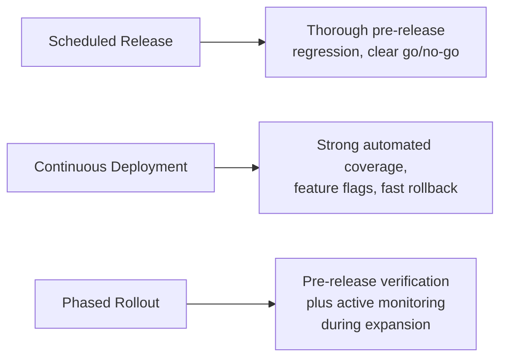

# Release Strategy

**Prerequisites**: [Risk-Based Strategy](/learning-paths/career-leadership/risk-based-strategy)
**Leads to**: After this, you'll be ready for [Organization-Wide Quality Strategy](/learning-paths/career-leadership/organization-wide-quality-strategy).

## Why This Matters

**A QA Lead who applies one release approach everywhere.** A QA Lead who built their career on scheduled, quarterly releases joins a company that deploys continuously, multiple times a day. They try to apply the same pre-release testing checklist they always have — a full manual regression pass before every deploy. Within weeks, releases are bottlenecked behind a testing process that assumes far more time exists than actually does, and the team starts quietly bypassing the checklist just to ship.

**A QA Lead who adapts the release strategy to how the product actually ships.** A peer joining the same continuous-deployment environment instead redesigns the approach around it: heavy investment in automated regression and feature flags that let risky changes roll out to a small percentage of users first, with manual testing reserved for genuinely novel, high-risk changes rather than every deploy. Releases stay frequent, and risk stays controlled — because the release strategy matches how the product actually ships, not how the QA Lead is used to working.

Both QA Leads cared about quality. Only one recognized that release strategy has to fit the release model, not be imported unchanged from a previous context.

## Release Models and What Each Needs

**Scheduled releases** (weekly, monthly, or quarterly): testing has a defined window before each release, making a thorough pre-release regression pass and a clear go/no-go decision point practical. The main risk is a large batch of changes shipping together, making it harder to isolate which change caused a given defect.

**Continuous deployment**: changes ship frequently, sometimes many times a day, with little or no dedicated pre-release testing window. This model depends heavily on strong automated regression coverage, feature flags to control exposure, and fast rollback capability — manual testing effort concentrates on genuinely novel or high-risk changes rather than every deploy.

**Phased or staged rollout**: a release goes to a small subset of users or environments first (a percentage of traffic, a specific region, internal users only), then expands gradually based on observed behavior. This model shifts some testing burden from pure pre-release verification to monitoring real behavior during the phased expansion, catching issues that only appear at scale or in production-like conditions.

## Matching Strategy to Model

The core discipline is recognizing which model a product actually uses — and adapting testing approach to it, rather than defaulting to whatever approach is most familiar. A release strategy section within the broader test strategy (see [What Is Test Strategy?](/learning-paths/career-leadership/what-is-test-strategy)) should state explicitly: which release model applies, what testing happens at each stage, and what the rollback or mitigation plan is if a defect reaches production anyway — because under any release model, some defects will eventually reach production, and having a plan for that is part of the strategy, not an admission of failure.

## Common Mistakes

**Mistake 1: Applying a scheduled-release testing approach to a continuous-deployment product.**
This module's opening scenario — a full manual regression pass before every deploy is incompatible with shipping multiple times a day, and teams under that pressure will eventually route around the process rather than follow it.

**Mistake 2: Assuming continuous deployment means less testing rigor overall, rather than differently distributed rigor.**
Continuous deployment actually requires *more* investment in automated coverage and rollback safety, not less overall care — the rigor shifts from manual pre-release gates to automated coverage and production safety nets.

**Mistake 3: Treating phased rollout as "testing in production" instead of a deliberate risk-reduction technique.**
A phased rollout without genuine pre-release testing first is just shipping untested code to a smaller blast radius — phased rollout complements pre-release testing, it doesn't replace it.

**Mistake 4: Having no explicit plan for what happens when a defect does reach production.**
Every release model eventually lets some defect through — a strategy with no stated rollback or mitigation plan leaves the team improvising under pressure exactly when a calm, pre-agreed plan matters most.

## Best Practices

**Practice 1: Explicitly identify the release model before designing the testing approach around it.**
State plainly which model applies — scheduled, continuous, or phased — as the first step, since it determines nearly everything else about how testing effort should be distributed.

**Practice 2: Invest in automated regression proportional to release frequency.**
The more frequently a product releases, the more that automated coverage — not manual effort — has to carry the weight of catching regressions, since manual testing simply can't scale to match deployment frequency.

**Practice 3: Define an explicit rollback and mitigation plan as part of the release strategy, not as an afterthought.**
Deciding in advance how a bad release gets detected and reversed removes pressure and improvisation from the moment it's actually needed.

**Practice 4: Reassess the release strategy when the release model itself changes.**
A team moving from quarterly to continuous releases needs a genuinely rebuilt testing approach, not a compressed version of the old one — recognize the shift as a strategic change, not just a scheduling change.

:::note From the Field
AtlasBank's Mobile App team moved from quarterly app-store releases to a continuous deployment model for its backend services, while keeping quarterly releases for the app itself (a common split, since mobile app-store review adds an unavoidable release cadence constraint the backend doesn't have). The QA Lead initially applied the same testing approach to both, causing the backend releases to slow to a near-quarterly pace despite the infrastructure supporting much faster deployment. Recognizing the two components needed genuinely different release strategies — heavy automated regression and feature flags for the backend, thorough scheduled testing for the app itself — let backend releases resume shipping multiple times a week while the app kept its quarterly cadence, each matched to its actual release model rather than forced into a single shared approach.
:::

## Mini Challenge

**Scenario**: You're the QA Lead for a product moving from monthly scheduled releases to continuous deployment.

**Your task**: List three specific changes you'd need to make to the testing approach, and explain what risk each change is meant to address given the new release model.

## Key Takeaways

- Release strategy has to match the actual release model — scheduled, continuous, or phased — not be imported unchanged from a different context.
- Continuous deployment shifts rigor toward automated coverage and rollback safety, rather than reducing rigor overall.
- Phased rollout complements pre-release testing as a risk-reduction technique; it doesn't replace it.
- Every release strategy needs an explicit plan for what happens when a defect reaches production anyway.

## What You Just Learned

- The three common release models and what testing approach each genuinely requires
- Why a release strategy built for one model breaks down when applied to another
- The role of automated coverage, feature flags, and rollback planning in continuous and phased models
- Why having a stated mitigation plan is part of the strategy, not an admission of failure

## Related Topics

- [Risk-Based Strategy](/learning-paths/career-leadership/risk-based-strategy) — The risk assessment that should inform which changes get the most scrutiny under any release model
- [Organization-Wide Quality Strategy](/learning-paths/career-leadership/organization-wide-quality-strategy) — Coordinating potentially different release strategies across multiple teams within one organization
- [CI/CD Integration](/learning-paths/automation/cicd-integration) — The automation practices a continuous-deployment release strategy depends on most directly

## Interview Questions

**Q1: How does testing strategy change between scheduled releases and continuous deployment?**

*What to look for*: A clear articulation that rigor shifts location (toward automation and rollback safety) rather than simply decreasing — a candidate who says continuous deployment means "less testing" without qualification is missing the actual shift.

**Q2: What would you do if you inherited a testing process built for quarterly releases on a team now shipping daily?**

*What to look for*: A concrete plan involving automated coverage investment and feature flags, not just "test faster" — showing the candidate understands this requires a structurally different approach, not a compressed version of the old one.

:::note Common Interview Mistake
Some candidates describe phased or canary rollouts as a substitute for pre-release testing — "we just test in production." A strong answer positions phased rollout as a complement to genuine pre-release testing, reducing blast radius for issues that only surface at scale, not a replacement for testing before release at all.
:::

**Q3: How do you plan for the possibility that a defect reaches production despite your testing?**

*What to look for*: A specific, pre-agreed plan (monitoring, rollback mechanism, clear ownership for response) rather than an assumption that thorough testing eliminates the need for one — every release model eventually lets something through.

---

## Glossary

**Release Model**: The pattern by which a product actually ships changes to users — scheduled, continuous, or phased rollout — which determines how testing effort should be distributed.

**Feature Flag**: A mechanism that controls which users see a given change, allowing gradual exposure and fast rollback without a full redeploy.

**Phased Rollout**: Releasing a change to a small subset of users or environments first, then expanding gradually based on observed behavior.

## Quick Revision

Remember these five points:

✓ Release strategy has to match the product's actual release model — scheduled, continuous, or phased — not be imported unchanged from a different context.

✓ Continuous deployment shifts testing rigor toward automated coverage and rollback safety, rather than reducing rigor overall.

✓ Phased rollout is a risk-reduction technique that complements pre-release testing, not a substitute for it.

✓ A release strategy needs an explicit rollback or mitigation plan for when a defect reaches production anyway.

✓ A release model change (e.g., quarterly to continuous) requires a genuinely rebuilt testing approach, not a compressed version of the old one.
