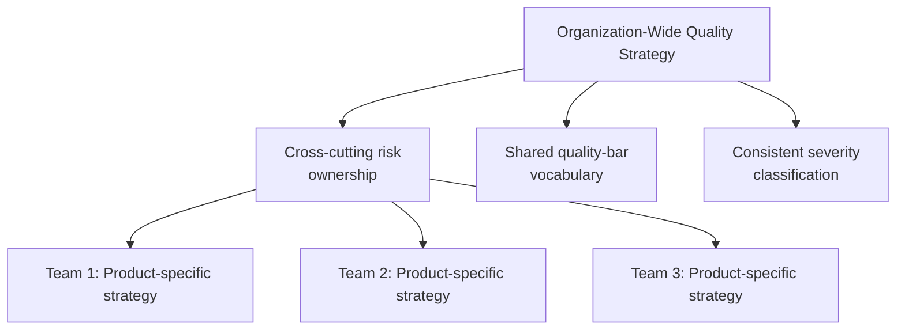

# Organization-Wide Quality Strategy

**Prerequisites**: [Release Strategy](/learning-paths/career-leadership/release-strategy)
**Leads to**: After this, you'll be ready for [Leading Without Authority](/learning-paths/career-leadership/leading-without-authority).

## Why This Matters

**A Head of QA who lets every team define quality independently.** At a company with four product teams, each team's QA Lead independently decides what "well tested" means for their own product — some rigorous, some looser, with no shared reasoning connecting them. When a shared piece of infrastructure (a single sign-on system all four products depend on) has a defect, it's unclear whose responsibility the gap was, because no team's strategy ever considered risk that crossed product boundaries. The same class of authorization defect that one team caught in their own product had already shipped, unnoticed, in another.

**A Head of QA who builds a shared strategy without erasing team-level judgment.** A peer facing the same four-team structure builds a genuinely shared, organization-wide risk assessment — covering the risks that span product boundaries, like the shared sign-on system — while explicitly leaving each team's product-specific testing approach to its own QA Lead's judgment. The shared authorization risk gets consistent, deliberate attention across all four teams, precisely because it was named and owned at the organizational level rather than left to whichever team happened to think of it.

Both leaders wanted their organization to ship quality software. Only one recognized that some risks are genuinely organization-wide and need a shared strategy, while product-specific decisions are still best made by the people closest to that product.

## What Organization-Wide Strategy Adds

An organization-wide quality strategy doesn't replace each product's own test strategy (see [What Is Test Strategy?](/learning-paths/career-leadership/what-is-test-strategy)) — it adds a layer above it, focused specifically on:

- **Cross-cutting risks**: shared infrastructure, shared authentication, shared data stores — anything a defect in could affect multiple products at once, and that no single product team's own risk assessment would naturally catch on its own.
- **A shared quality bar language**: not identical standards for every product, but a shared vocabulary for stating risk and quality bar, so a "high-risk" rating means roughly the same thing whether it comes from the Mobile team or the Admin Portal team.
- **Consistent incident and defect-severity classification**: so patterns can be tracked and compared meaningfully across teams, and organizational leadership can see real trends rather than four teams' worth of incompatible data.
- **Deliberate reuse of testing investment**: shared automation infrastructure, shared test data strategies, shared tooling decisions — reducing duplicated effort across teams solving the same underlying problems independently.

## Where Uniformity Helps, and Where It Doesn't

The judgment call at the center of organization-wide strategy is knowing which decisions genuinely benefit from central consistency, and which are better left to each team:

**Benefits from central consistency**: risk vocabulary and severity classification (so data is comparable), ownership of genuinely cross-cutting risks, shared tooling decisions where fragmentation creates real duplicated cost.

**Better left to team-level judgment**: the specific testing techniques a team applies day to day, how a team organizes its own testing work, product-specific quality-bar decisions that depend on that product's own user base and context.

Forcing uniformity onto team-level decisions — mandating the exact same test-case format or tooling choice across teams with genuinely different needs — tends to produce compliance without genuine buy-in, and loses the context-specific judgment a team closer to its own product actually has.

## Common Mistakes

**Mistake 1: Leaving every risk decision entirely to individual teams, with no shared layer at all.**
This module's opening scenario — cross-cutting risks that no single team naturally owns fall through the gap between teams' independently scoped strategies.

**Mistake 2: Mandating identical processes and tooling across teams with genuinely different needs.**
Uniformity imposed without regard for real differences between teams produces resentment and workarounds, not genuine alignment — the goal is a shared *vocabulary* and shared ownership of cross-cutting risk, not identical execution everywhere.

**Mistake 3: Building the organization-wide strategy without input from the teams it applies to.**
A strategy imposed top-down, without the product-level context each team actually has, misses real risks and practical constraints those teams would have flagged.

**Mistake 4: Treating organization-wide strategy as a one-time document rather than an ongoing coordination function.**
Cross-cutting risks and shared infrastructure change as the organization grows — the strategy needs an ongoing owner and review cadence, not a document written once and left untouched.

## Best Practices

**Practice 1: Explicitly separate "organization-wide" decisions from "team-level" decisions when building the strategy.**
Naming which category each decision falls into up front avoids both under-centralizing (missed cross-cutting risk) and over-centralizing (unwanted uniformity).

**Practice 2: Build the shared risk assessment with representatives from every team, not in isolation.**
Each team's QA Lead has visibility into risks the others don't — a genuinely cross-cutting risk assessment needs their combined input, not a single person's view of the whole organization.

**Practice 3: Establish a shared severity and risk vocabulary early, and hold teams to using it consistently.**
This is the one area where genuine consistency matters most — without it, organizational leadership can't meaningfully compare or aggregate quality data across teams.

**Practice 4: Revisit organization-wide risk ownership whenever a new shared system or dependency is introduced.**
A new piece of shared infrastructure is exactly the moment a cross-cutting risk can quietly emerge without anyone explicitly owning it — treat its introduction as a trigger for updating the shared strategy.

:::note From the Field
This is the exact situation AtlasBank found itself in ([introduced in What Is Test Strategy?](/learning-paths/career-leadership/what-is-test-strategy)): four product teams — Internet Banking, Mobile App, Admin Portal, and Loan Portal — each maintaining its own independent test strategy, with the same customer-authorization risk tested at meaningfully different rigor across teams purely by accident of what each team happened to prioritize. Building a shared organization-wide risk assessment specifically for cross-cutting risks — starting with customer authorization and data access, since all four products touched the same underlying customer-account data — gave every team a consistent, deliberate standard for that specific risk, while leaving each team's own day-to-day testing approach otherwise untouched. This scenario is the direct basis for this curriculum's capstone project.
:::

## Mini Challenge

**Scenario**: You've just become Head of QA across three product teams that previously operated with fully independent test strategies. All three products depend on the same shared user-authentication service.

**Your task**: List two decisions you'd bring under organization-wide ownership, and two decisions you'd deliberately leave to each team's own judgment — with a one-sentence reason for each choice.

## Key Takeaways

- Organization-wide quality strategy adds a shared layer focused on cross-cutting risk, not a replacement for each team's own product-specific strategy.
- The judgment call is distinguishing which decisions benefit from central consistency (risk vocabulary, cross-cutting risk ownership) from which are better left to team-level judgment.
- Forcing uniformity onto team-level decisions tends to produce compliance without genuine buy-in.
- Cross-cutting risks that no single team naturally owns are exactly what falls through the gap when there's no shared layer at all.

## What You Just Learned

- What an organization-wide quality strategy adds on top of individual product strategies
- Which kinds of decisions benefit from central consistency, and which don't
- The AtlasBank cross-cutting authorization-risk scenario this curriculum's capstone builds on directly
- Why forcing uniformity onto team-level decisions backfires

## Related Topics

- [What Is Test Strategy?](/learning-paths/career-leadership/what-is-test-strategy) — The single-product strategy this module extends to multiple teams at once
- [Building Centers of Excellence](/learning-paths/career-leadership/building-centers-of-excellence) — A more formal structure for driving exactly this kind of cross-team consistency at larger scale
- [Working with DevOps and Stakeholder Management](/learning-paths/career-leadership/working-with-devops-and-stakeholder-management) — Coordinating shared infrastructure risk with the teams that actually operate it

## Interview Questions

**Q1: How would you approach quality strategy across multiple teams with previously independent approaches?**

*What to look for*: An answer that distinguishes cross-cutting risk (bring under shared ownership) from team-specific decisions (leave to team judgment), rather than a blanket "standardize everything" or "leave everything to each team" answer.

**Q2: Tell me about a risk that fell through the gap between two teams' independent approaches, and how you'd prevent that.**

*What to look for*: A real or realistic example of a cross-cutting risk (shared infrastructure, shared authentication) and a concrete mechanism (shared risk assessment, named ownership) for preventing the gap, not just "better communication."

:::note Common Interview Mistake
Some candidates equate "organization-wide strategy" with "identical process across every team," describing a goal of full standardization. A strong answer explicitly preserves team-level judgment for product-specific decisions while centralizing only genuinely cross-cutting concerns — full uniformity is presented as a mistake, not the goal.
:::

**Q3: How do you get buy-in from teams for an organization-wide quality initiative?**

*What to look for*: An answer involving those teams in building the shared strategy, not imposing it — candidates who describe a collaborative process (representatives from each team, explicit reasoning shared) show more realistic organizational leadership judgment than those who describe a top-down mandate.

---

## Glossary

**Organization-Wide Quality Strategy**: A shared strategic layer above individual product teams' own test strategies, focused on cross-cutting risk, shared vocabulary, and consistent classification.

**Cross-Cutting Risk**: A risk arising from shared infrastructure, systems, or data that spans multiple product teams, and that no single team's own risk assessment would naturally catch alone.

**Centers of Excellence**: A more formal organizational structure for driving shared standards and practices across teams — covered in depth in [Building Centers of Excellence](/learning-paths/career-leadership/building-centers-of-excellence).

## Quick Revision

Remember these five points:

✓ Organization-wide quality strategy adds a shared layer above individual teams' own strategies — it doesn't replace them.

✓ It focuses specifically on cross-cutting risk, shared quality-bar vocabulary, and consistent severity classification across teams.

✓ Team-level decisions (specific techniques, day-to-day process) are usually better left to each team's own judgment, not centrally mandated.

✓ Cross-cutting risks that span shared infrastructure or systems are exactly what falls through the gap without a shared layer.

✓ Building the shared strategy with input from every team it applies to avoids missing real risks and losing genuine buy-in.

---

## Section 2 Complete

Across four modules, this section built the strategic foundation for everything from here forward: what a test strategy actually is and how it differs from a plan, how to allocate limited effort using risk rather than intuition, how to adapt that approach to how a product actually ships, and how to extend a single-product strategy across an entire organization without erasing team-level judgment. The AtlasBank cross-team authorization scenario introduced in this section becomes this curriculum's capstone project later on. From here, continue to Section 3 — Leadership, starting with Leading Without Authority.

## Section 2 Knowledge Check

Four realistic scenarios. For each, decide which of this section's concepts applies, and how. No answers are provided here — this is a chance to apply the section's reasoning yourself before moving on. **Solutions**: [Section 2 Solutions](/learning-paths/career-leadership/section-2-solutions).

**Scenario 1**: A QA Lead has two weeks before a release and needs to decide where to focus limited testing time across five feature areas with varying complexity and business impact.

**Scenario 2**: A team moving from monthly releases to twice-weekly releases asks whether their existing full-regression testing checklist still makes sense.

**Scenario 3**: A newly appointed Head of QA discovers that three product teams have three different definitions of what counts as a "critical" defect.

**Scenario 4**: A stakeholder asks a QA Lead for "the test strategy" and receives a 40-page document listing every planned test case for the next release.
