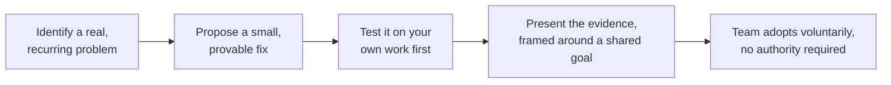

# Leading Without Authority

**Prerequisites**: [Organization-Wide Quality Strategy](/learning-paths/career-leadership/organization-wide-quality-strategy)
**Leads to**: After this, you'll be ready for [Running QA Teams](/learning-paths/career-leadership/running-qa-teams).

## Why This Matters

**A Senior QA Engineer who waits for a title to lead.** A Senior QA Engineer sees a real, recurring problem — releases regularly ship with untested edge cases because there's no shared definition of "done" across the team. They recognize it clearly, but say nothing beyond their own work, reasoning that raising process changes isn't their job until they're formally a Lead. The problem persists for another year, through two more preventable production incidents, until someone with a Lead title finally addresses it.

**A Senior QA Engineer who leads the change without the title.** A peer with the same seniority and no formal authority instead proposes a concrete, small change: a shared "definition of done" checklist for the team, tested first on their own features. After it visibly reduces escaped defects on the features it's applied to, they present the data at a team retro and the rest of the team adopts it voluntarily. No title was involved — the change happened because a credible, well-argued proposal, backed by real evidence, was hard to refuse.

Both engineers saw the same problem. Only one recognized that meaningful influence doesn't require formal authority — it requires credibility (see [Developing Leadership Skills and Technical Credibility](/learning-paths/career-leadership/developing-leadership-skills-and-technical-credibility)), a well-framed proposal, and evidence, all of which are available to anyone regardless of title.

## Why This Skill Matters More Than It Seems

Most technical leadership, even for people with a formal Lead or Manager title, actually happens without direct authority: over other teams, over developers who don't report to QA, over decisions made in cross-functional forums where no one has unilateral power. Leading without authority isn't a workaround for not yet having a title — it's the actual, primary mechanism by which most real influence happens, titled or not.

## The Mechanics of Influence Without Authority

**Lead with evidence, not opinion.** "I think we should change X" is easy to dismiss; "Here's data showing X caused three production incidents this quarter" is much harder to argue with, because it shifts the conversation from preference to fact.

**Start small and provable, not big and abstract.** A team is far more likely to adopt a small, demonstrated improvement (the "definition of done" checklist tested on one engineer's own work first) than to accept a large, unproven process change proposed in the abstract.

**Frame the ask around a shared goal, not personal preference.** "This would reduce escaped defects, which we all said was a priority last quarter" lands very differently than "I'd prefer we did this."

**Build a coalition before the big ask.** Discussing an idea informally with a few respected peers first, and incorporating their feedback, means the formal proposal arrives already partially validated rather than as a surprise someone has to evaluate cold.

## Common Mistakes

**Mistake 1: Waiting for a title before attempting to lead any change.**
This module's opening scenario — most real influence happens without formal authority, and waiting for a title delays solving problems that are visible and fixable right now.

**Mistake 2: Proposing a large, unproven change directly, without first demonstrating it works at small scale.**
An untested, abstract proposal is easy to dismiss or deprioritize — a small, already-demonstrated improvement is much harder to argue against.

**Mistake 3: Framing a proposal around personal preference rather than a shared goal.**
"I'd prefer" invites disagreement on taste; "this addresses the priority we already agreed on" invites agreement on a goal everyone already holds.

**Mistake 4: Trying to drive a significant change unilaterally, without building any support first.**
A proposal that arrives as a surprise, with no prior informal validation, is more likely to be met with skepticism or defensiveness than one that's been quietly refined with a few peers' input beforehand.

## Best Practices

**Practice 1: Always attach evidence to a proposed change, even informal evidence.**
Even a small, informal before-and-after comparison is more persuasive than an unsupported opinion, and costs little to gather.

**Practice 2: Pilot on your own work before proposing team-wide adoption.**
Testing an idea on your own features first gives you both real evidence and firsthand experience with any rough edges before asking others to adopt it.

**Practice 3: Explicitly connect your proposal to a goal the team or organization has already stated.**
Tying a change to an already-agreed priority (fewer escaped defects, faster releases) removes the need to first convince people the goal itself matters.

**Practice 4: Build informal support before a formal proposal.**
A few candid conversations with respected peers before raising something formally both improves the proposal and reduces the chance of being blindsided by an objection you hadn't considered.

:::note From the Field
At AtlasBank, a Senior QA Engineer on the Loan Portal team, with no Lead title, noticed that a specific class of defect — inconsistent validation between the loan-application form and the backend calculation service — kept recurring across releases, each time caught late and each time treated as a one-off. Rather than waiting for someone with more authority to address it, they built a small, shared validation-rules reference document mapping every field's frontend and backend rules side by side, tested it by using it themselves on the next two releases, and then presented the before-and-after defect count at a team retro. The team adopted the document voluntarily within the same meeting — not because of any title, but because the evidence was concrete and the ask was small and already proven.
:::

## Mini Challenge

**Scenario**: You've noticed your team routinely skips exploratory testing under release pressure, and you believe this has caused at least two recent production defects, but you have no formal authority to mandate a process change.

**Your task**: Write a three-step plan for driving this change without authority, following this module's sequence — a small, provable first step, how you'd generate evidence, and how you'd frame the eventual ask.

## Key Takeaways

- Leading without formal authority is the primary mechanism by which most real influence happens, not a workaround for lacking a title.
- Influence is built through evidence, small provable steps, framing around shared goals, and informal support built before a formal ask.
- A small, demonstrated improvement is far more persuasive than a large, unproven proposal.
- Waiting for a title before addressing a visible, fixable problem delays solving it for no real benefit.

## What You Just Learned

- Why leading without authority is the actual primary mechanism of influence, for titled and untitled engineers alike
- The concrete sequence for driving change without formal power: small proof, evidence, shared-goal framing, informal support
- Why unproven, large proposals are easy to dismiss compared to small, demonstrated ones
- The AtlasBank Loan Portal example of this sequence in practice

## Related Topics

- [Developing Leadership Skills and Technical Credibility](/learning-paths/career-leadership/developing-leadership-skills-and-technical-credibility) — The credibility that makes influence without authority possible in the first place
- [Running QA Teams](/learning-paths/career-leadership/running-qa-teams) — Where some of this same influence becomes formalized once a Lead or Manager role exists
- [Decision Making](/learning-paths/career-leadership/delegation-and-decision-making) — The evidence-based reasoning this module's proposals depend on

## Interview Questions

**Q1: Tell me about a time you drove a change on your team without having formal authority to mandate it.**

*What to look for*: A real, specific example showing evidence-based persuasion and a small, provable first step — not just "I suggested it and people agreed," which lacks the actual mechanism of influence.

**Q2: How do you get buy-in for an idea when you don't have the authority to simply require it?**

*What to look for*: A clear method (evidence, small pilot, framing around shared goals) rather than a vague "I communicate well" — the strongest answers describe a repeatable approach, not a one-off story.

:::note Common Interview Mistake
Many candidates describe influence purely in terms of communication style or persistence — "I just kept bringing it up." A strong answer ties influence specifically to evidence and a small, demonstrated first step, showing the candidate understands what actually changes minds, not just that persistence eventually works.
:::

**Q3: Describe a situation where your proposed change was initially rejected. What did you do?**

*What to look for*: A candidate who iterates — gathering more evidence, refining the proposal, building more support — rather than escalating or giving up, showing resilience combined with genuine responsiveness to the feedback that led to rejection.

---

## Glossary

**Influence Without Authority**: The ability to drive real change through credibility, evidence, and framing, independent of formal positional power.

**Coalition Building**: Gathering informal support and feedback from respected peers before making a formal proposal, so it arrives already partially validated.

## Quick Revision

Remember these five points:

✓ Leading without formal authority is the primary mechanism by which most real influence happens, not a workaround for lacking a title.

✓ Evidence-backed proposals are far harder to dismiss than opinion-based ones.

✓ Small, already-demonstrated changes are much more persuasive than large, unproven proposals.

✓ Framing a proposal around a shared goal, rather than personal preference, invites agreement rather than disagreement.

✓ Building informal support before a formal proposal improves the proposal and reduces the chance of being blindsided.
