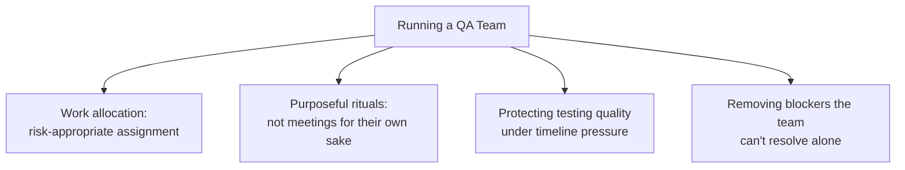

# Running QA Teams

**Prerequisites**: [Leading Without Authority](/learning-paths/career-leadership/leading-without-authority)
**Leads to**: After this, you'll be ready for [Mentoring Engineers](/learning-paths/career-leadership/mentoring-engineers).

## Why This Matters

**A new QA Lead who runs the team on instinct.** A newly promoted QA Lead inherits a team of five and starts making decisions case by case — who tests what, which meetings happen, how work gets prioritized — without any explicit structure. Within a few months, the team is functional but inconsistent: two engineers are consistently overloaded while others have slack, testing priorities shift unpredictably based on whoever raised their concern most recently, and new team members struggle to understand how decisions actually get made.

**A new QA Lead who builds explicit structure early.** A peer inheriting a similar team instead spends their first month establishing a small number of explicit structures: a clear method for how testing work gets assigned and prioritized, a short weekly sync focused specifically on blockers and risk, and an explicit escalation path for when priorities conflict. The team runs more predictably, workload stays more balanced, and new members can understand how things work within their first week rather than picking it up by osmosis over months.

Both leads cared about their team. Only one recognized that running a team well requires deliberate, explicit structure — not because structure is bureaucracy for its own sake, but because the alternative is inconsistency that eventually costs the team's trust and effectiveness.

## What Running a Team Actually Involves

Day-to-day QA team leadership centers on a small number of recurring responsibilities:

**Work allocation**: deciding who tests what, balancing workload, and making sure the highest-risk work (per [Risk-Based Strategy](/learning-paths/career-leadership/risk-based-strategy)) gets appropriately experienced attention rather than being assigned arbitrarily.

**Rituals that earn their time**: a small number of deliberately structured recurring meetings — not meetings for their own sake, but ones with a specific, stated purpose (a short daily sync on blockers, a weekly risk review, a retro after each release).

**Protecting the team's ability to do good testing under pressure**: pushing back, when necessary, on unrealistic timelines that would force the team to skip genuinely necessary testing — one of the most important and most difficult parts of the role, since it often means disagreeing with people outside QA who don't feel the consequences of a corner cut.

**Removing blockers**: identifying and resolving whatever is actually slowing the team down — an unclear requirement, a flaky test environment, a dependency on another team — often faster than any individual engineer could resolve it alone, because a Lead has visibility and standing an individual doesn't.

## Common Mistakes

**Mistake 1: Running the team on ad hoc, case-by-case decisions with no explicit structure.**
This module's opening scenario — inconsistency compounds over time into imbalanced workload, unpredictable priorities, and a team that struggles to onboard new members effectively.

**Mistake 2: Scheduling recurring meetings without a specific, stated purpose.**
A daily standup with no clear focus becomes a status-report ritual that wastes time rather than surfacing genuine blockers — every recurring meeting should have an explicit answer to "what specific problem does this solve."

**Mistake 3: Caving to unrealistic timeline pressure without pushing back.**
Protecting the team's ability to do genuinely necessary testing is part of the job, not a nice-to-have — a Lead who always accommodates unrealistic timelines eventually presides over a team that ships defects it could have caught.

**Mistake 4: Trying to remove every blocker personally rather than building the team's own ability to resolve smaller ones.**
Over-centralizing blocker resolution creates a bottleneck at the Lead and prevents the team from developing its own problem-solving capability — reserve direct intervention for blockers genuinely outside individual engineers' reach.

## Best Practices

**Practice 1: Make work-allocation logic explicit and consistent, not case-by-case.**
A stated method (e.g., allocation weighted by risk area, rotated for skill development) that the team can understand and predict builds more trust than decisions that appear arbitrary, even if well-intentioned.

**Practice 2: Regularly audit your own recurring meetings for actual purpose.**
Periodically ask whether each recurring meeting is still solving the problem it was created for — rituals that outlive their purpose are a common, quiet source of wasted team time.

**Practice 3: When pushing back on timeline pressure, bring risk-based reasoning, not just refusal.**
"We can't test this in time" is easy to override; "skipping this specific testing risks this specific consequence, based on this risk assessment" is much harder to dismiss, and mirrors the evidence-based influence approach from [Leading Without Authority](/learning-paths/career-leadership/leading-without-authority).

**Practice 4: Distinguish blockers worth personally resolving from ones the team should learn to handle.**
Reserve direct intervention for blockers genuinely outside an individual engineer's standing or visibility to resolve — otherwise, coach the engineer toward resolving it themselves, building the team's own capability over time.

:::note From the Field
At AtlasBank, a newly appointed QA Lead for the Admin Portal team inherited a situation where testing work was assigned informally, by whoever happened to have capacity when a ticket came in — with no connection to risk or individual expertise. A recurring pattern emerged: the team's most experienced tester, who understood the platform's authorization logic best, was frequently assigned low-risk UI polish work simply because they finished tasks quickly, while less experienced engineers were assigned the platform's highest-risk permission-boundary changes without the specific context to catch subtle issues. Introducing an explicit, risk-weighted assignment method — matching testing experience to risk level, not just available capacity — measurably reduced escaped authorization defects within two release cycles, simply by making an implicit, accidental allocation pattern into a deliberate one.
:::

## Mini Challenge

**Scenario**: You've just become QA Lead for a team of six. You notice testing work has historically been assigned based purely on who has free capacity, with no connection to risk or expertise.

**Your task**: Describe the specific allocation method you'd introduce instead, and explain how you'd communicate the change to the team without it feeling like an arbitrary new rule.

## Key Takeaways

- Running a QA team well requires deliberate, explicit structure — work allocation, purposeful rituals, protecting testing quality under pressure, and removing blockers.
- Ad hoc, case-by-case decisions feel flexible in the short term but compound into inconsistency and eroded trust over time.
- Protecting the team's ability to do genuinely necessary testing under timeline pressure is a core part of the role, not an optional extra.
- Reserve direct blocker resolution for what's genuinely outside an individual engineer's reach, building the team's own capability for the rest.

## What You Just Learned

- The four core responsibilities of day-to-day QA team leadership
- Why explicit, consistent structure produces better outcomes than case-by-case decisions
- How to push back on timeline pressure using risk-based reasoning rather than simple refusal
- The AtlasBank Admin Portal example of moving from accidental to deliberate work allocation

## Related Topics

- [Leading Without Authority](/learning-paths/career-leadership/leading-without-authority) — The same evidence-based influence approach, applied here to pushing back on timeline pressure
- [Risk-Based Strategy](/learning-paths/career-leadership/risk-based-strategy) — The risk assessment that should inform how work gets allocated across a team
- [Delegation and Decision Making](/learning-paths/career-leadership/delegation-and-decision-making) — How to decide which decisions and blockers to hand off versus resolve personally

## Interview Questions

**Q1: How do you decide how to allocate testing work across your team?**

*What to look for*: A stated, consistent method connected to risk and expertise, not "whoever has time" — a candidate who describes an explicit approach shows more mature team-leadership thinking than one who describes purely ad hoc decisions.

**Q2: Tell me about a time you had to push back on a timeline that would have compromised testing quality.**

*What to look for*: A real example using risk-based reasoning to make the case, not just "I said no" — strong answers show how the pushback was framed to be persuasive, not just asserted.

:::note Common Interview Mistake
Some candidates describe team leadership purely in terms of meetings and check-ins, without discussing the harder responsibility of protecting testing quality under pressure. A strong answer explicitly names this as part of the role and gives a concrete example of doing it.
:::

**Q3: How do you decide which problems to solve yourself versus delegate to your team?**

*What to look for*: A distinction based on what's genuinely outside an individual's standing or visibility to resolve, not simply "whatever I have time for" — showing awareness of building team capability, not just personal efficiency.

---

## Glossary

**Work Allocation**: The method by which testing work is assigned across a team, ideally weighted by risk and matched to individual expertise rather than assigned arbitrarily.

**Purposeful Ritual**: A recurring team meeting or process with a specific, stated purpose that's periodically re-evaluated, as distinct from a habitual meeting that has outlived its original reason for existing.

## Quick Revision

Remember these five points:

✓ Running a QA team well requires deliberate structure across four areas: work allocation, purposeful rituals, protecting testing quality, and removing blockers.

✓ Ad hoc, case-by-case decisions feel flexible short-term but compound into inconsistency and eroded trust over time.

✓ Every recurring team ritual should have a specific, stated purpose, periodically re-evaluated.

✓ Protecting the team's ability to do genuinely necessary testing under timeline pressure is a core responsibility, not optional.

✓ Reserve personal blocker resolution for what's genuinely outside an individual engineer's reach, building team capability for the rest.
