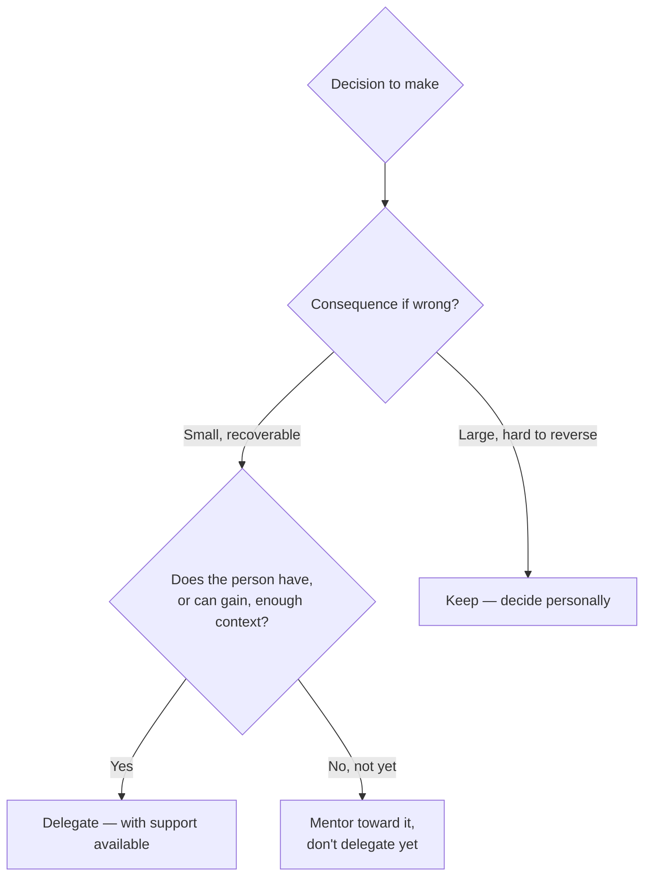

# Delegation and Decision Making

**Prerequisites**: [Mentoring Engineers](/learning-paths/career-leadership/mentoring-engineers)
**Leads to**: After this, you'll be ready for [Conflict Resolution](/learning-paths/career-leadership/conflict-resolution).

## Why This Matters

**A QA Lead who delegates nothing significant.** A QA Lead, wanting to make sure everything is done correctly, keeps every meaningful decision — which test approach to use, how to prioritize a release's risk areas, how to respond to a production incident — with themselves. The team executes competently but never develops independent judgment, and the Lead becomes a bottleneck: decisions queue up waiting for their availability, and the team's growth stalls because they're never handed anything genuinely consequential to decide.

**A QA Lead who delegates deliberately.** A peer facing the same responsibilities identifies which decisions genuinely require their specific judgment (organization-wide risk tradeoffs, decisions with major consequences if wrong) and which can be handed to capable team members with appropriate support (which specific test cases to write for a well-scoped feature, how to structure a test suite). The team grows measurably more capable over time, and the Lead's own time gets freed for the decisions that genuinely need their attention.

Both leads cared about getting things right. Only one recognized that delegation isn't a risk to manage away — it's how a team's collective judgment actually grows, and how a leader avoids becoming the bottleneck for every decision, large and small.

## What to Delegate, and What Not To

Not every decision belongs at the same level. A useful distinction:

**Delegate**: decisions where the consequence of a suboptimal choice is small and recoverable, where the person has (or can be given, with support) enough context to decide well, and where the decision is a genuine opportunity for someone to build judgment.

**Keep**: decisions with major, hard-to-reverse consequences; decisions requiring context only you currently have (organization-wide risk priorities, information from a conversation the team wasn't part of); decisions during a genuine crisis where the cost of a wrong call is immediate and severe.

The mistake in both directions is common: over-centralizing (keeping decisions that would be safe and valuable to delegate) stalls team growth and creates a bottleneck; under-centralizing (delegating decisions with major, hard-to-reverse consequences to someone without adequate context) creates real risk.

## Decision-Making Under Genuine Ambiguity

Beyond delegation, much of QA leadership involves making decisions personally under real ambiguity — incomplete information, competing priorities, no clearly correct answer. A structured approach helps even when certainty isn't available:

- **State the decision and the deadline explicitly.** Ambiguous decisions can drift indefinitely without a stated deadline — naming when a call needs to be made forces actual resolution.
- **Identify what you'd need to know to be more confident, and get what's actually gettable.** Not all uncertainty can be resolved in the available time, but some can — separate what's worth chasing from what genuinely isn't.
- **Make the decision, state your reasoning, and note what would change your mind.** This keeps the decision reviewable and shows the team your reasoning process, not just your conclusion — the same discipline from [Developing Leadership Skills and Technical Credibility](/learning-paths/career-leadership/developing-leadership-skills-and-technical-credibility).
- **Revisit if the situation genuinely changes, not just because the outcome turned out badly.** A good decision can still have a bad outcome under real uncertainty — distinguish a genuinely wrong process from an unlucky result.

## Common Mistakes

**Mistake 1: Delegating nothing significant, keeping every decision centralized.**
This module's opening scenario — the leader becomes a bottleneck, and the team's own judgment never develops, since it's never exercised on anything consequential.

**Mistake 2: Delegating decisions with major, hard-to-reverse consequences without adequate support.**
The opposite failure — handing someone a genuinely high-stakes decision without the context or support to make it well creates real risk, not growth.

**Mistake 3: Treating every ambiguous decision as requiring complete information before acting.**
Waiting for full certainty on a decision that has a deadline just delays the decision indefinitely — resolve what's genuinely resolvable in the available time, then decide.

**Mistake 4: Second-guessing a sound decision after a bad outcome, without evaluating whether the process was actually flawed.**
Under real uncertainty, a well-reasoned decision can still turn out badly — conflating outcome quality with decision quality discourages the kind of reasoned risk-taking good leadership sometimes requires.

## Best Practices

**Practice 1: Explicitly categorize decisions as "delegate" or "keep" rather than deciding case by case on instinct.**
A stated framework (consequence severity, available context) produces more consistent, defensible delegation choices than ad hoc judgment calls each time.

**Practice 2: When delegating, be explicit about the support available, not just the handoff.**
"This is yours to decide, and here's who to ask if you get stuck" delegates real ownership while still providing a safety net — pure handoff with no support available risks under-delegation's failure mode.

**Practice 3: State a deadline for ambiguous decisions, even a self-imposed one.**
A stated deadline forces actual resolution rather than indefinite drift, especially for decisions where more information could theoretically always be gathered.

**Practice 4: Separate decision-quality review from outcome-quality review.**
After a decision plays out, explicitly ask both "was the outcome good?" and "was the reasoning sound given what was known at the time?" — treating them as the same question conflates luck with judgment.

:::note From the Field
A QA Lead at AtlasBank initially kept every test-approach decision for the Mobile App team centralized, reviewing and approving even routine, low-risk test-case decisions personally. This created a consistent bottleneck — engineers waited on approval for decisions that carried little real risk if made independently. After explicitly categorizing decisions (test-case-level choices for well-understood features: delegate; anything touching the shared authentication service or cross-team risk: keep), routine work sped up substantially, and two engineers who'd previously never made an independent test-strategy call developed enough judgment within two quarters to be trusted with meaningfully larger decisions — capability that had simply never had room to develop under the fully centralized approach.
:::

## Mini Challenge

**Scenario**: You're a QA Lead deciding whether to delegate the decision of how to test a new feature to a mid-level engineer on your team, versus deciding the approach yourself.

**Your task**: List the two or three questions you'd ask yourself to make this call, based on this module's delegate-versus-keep distinction, and state what answer would tip the decision each way.

## Key Takeaways

- Delegation should be based on consequence severity and available context, not instinct or an unwillingness to let go of control.
- Over-centralizing decisions stalls team growth and creates a bottleneck; under-centralizing high-stakes decisions creates real risk.
- Decisions under genuine ambiguity benefit from a stated deadline, resolving what's actually resolvable, and making reasoning visible.
- Decision quality and outcome quality are separate things — a sound decision can still have a bad outcome under real uncertainty.

## What You Just Learned

- A concrete framework for deciding what to delegate versus keep, based on consequence and context
- A structured approach to making decisions under genuine ambiguity, without waiting for full certainty
- Why conflating decision quality with outcome quality discourages sound, reasoned risk-taking
- The AtlasBank Mobile App example of moving from full centralization to deliberate delegation

## Related Topics

- [Mentoring Engineers](/learning-paths/career-leadership/mentoring-engineers) — How mentoring and delegation work together to build a team's independent judgment over time
- [Leading Without Authority](/learning-paths/career-leadership/leading-without-authority) — The same visible-reasoning discipline, applied here to decisions made under formal authority
- [Conflict Resolution](/learning-paths/career-leadership/conflict-resolution) — What to do when a delegated decision or a personal call becomes a point of genuine disagreement

## Interview Questions

**Q1: How do you decide what to delegate versus decide yourself?**

*What to look for*: A stated framework involving consequence severity and available context, not just "I delegate what I don't have time for" — the strongest answers show a deliberate method, not simply offloading based on personal bandwidth.

**Q2: Tell me about a decision you had to make with incomplete information. How did you approach it?**

*What to look for*: A structured process (identifying what's resolvable, setting a deadline, stating reasoning) rather than a description of pure gut instinct — strong answers show the candidate can reason under real uncertainty, not just when the answer is clear.

:::note Common Interview Mistake
Some candidates describe delegation purely as offloading tasks they don't have time for, without discussing it as a deliberate tool for building team capability. A strong answer explicitly connects delegation to growing the team's own judgment, not just personal workload management.
:::

**Q3: Describe a decision that turned out badly. How did you evaluate what went wrong?**

*What to look for*: A candidate who separates process quality from outcome quality — evaluating whether the reasoning was sound given what was known at the time, not simply concluding the decision was wrong because the outcome was bad.

---

## Glossary

**Delegation**: Handing decision-making authority for a specific decision to someone else, calibrated to the decision's consequence severity and the person's available context.

**Decision Quality vs. Outcome Quality**: The distinction between whether a decision's reasoning was sound given available information, and whether its actual result turned out well — related but not the same thing under genuine uncertainty.

## Quick Revision

Remember these five points:

✓ Delegation should be based on consequence severity and available context, not instinct or reluctance to let go of control.

✓ Over-centralizing decisions creates a bottleneck and stalls team growth; under-centralizing high-stakes decisions creates real risk.

✓ Decisions under genuine ambiguity benefit from a stated deadline and resolving what's actually resolvable before deciding.

✓ Making your reasoning visible when deciding, not just the conclusion, keeps decisions reviewable and builds trust.

✓ Decision quality and outcome quality are separate — a sound decision can still turn out badly under real uncertainty.
