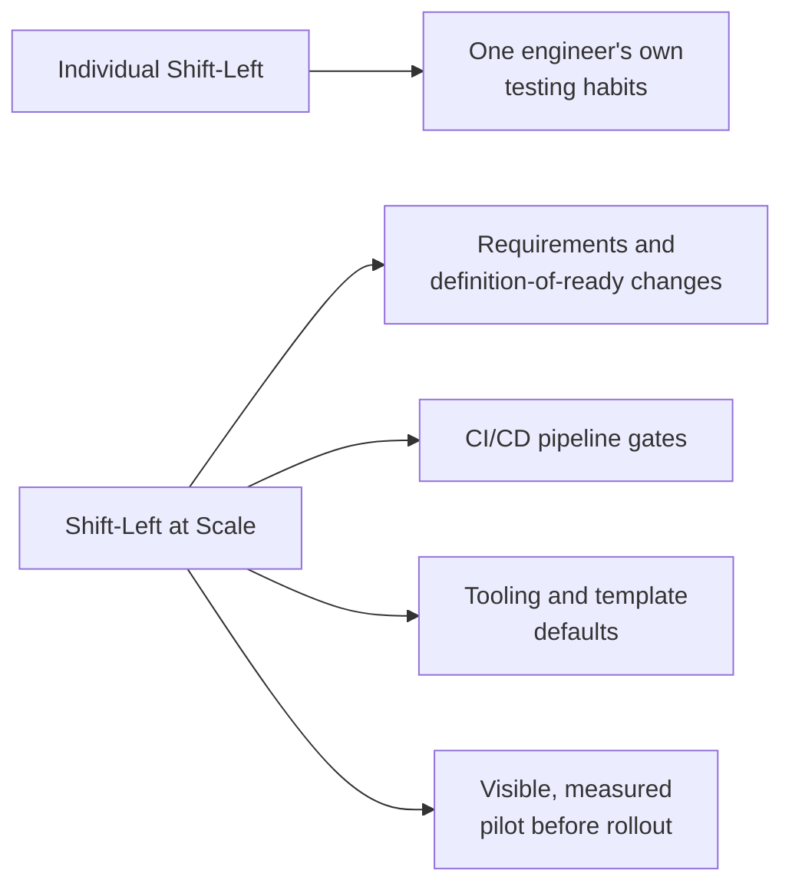

# Shift Left at Scale

**Prerequisites**: [Conflict Resolution](/learning-paths/career-leadership/conflict-resolution)
**Leads to**: After this, you'll be ready for [Shift Right and Continuous Testing](/learning-paths/career-leadership/shift-right-and-continuous-testing).

## Why This Matters

**A QA Manager who tries to mandate shift-left by memo.** A newly appointed QA Manager, aware that shift-left testing (catching defects earlier, closer to when code is written, rather than after the fact) is broadly considered good practice, sends an organization-wide message asking every team to "write more tests earlier." Three months later, almost nothing has changed — a few teams write slightly more unit tests, most continue exactly as before, because nothing about how work actually gets planned or executed changed, only a stated expectation with no structural support behind it.

**A QA Manager who builds shift-left into the structure of how work happens.** A peer with the same goal instead makes concrete structural changes: requirements templates that require testability criteria before a story is considered ready for development, CI pipeline gates that block a merge without passing tests at the unit level, and a small, visible pilot on one team that demonstrates measurably fewer defects reaching later stages. Within two quarters, shift-left has genuinely spread — not because people were told to care about it more, but because the structure of how work happens now makes it the default rather than an extra effort.

Both leaders wanted the same outcome. Only one recognized that shift-left at organizational scale requires structural change, not just a stated preference — the same distinction between real influence and a memo that [Leading Without Authority](/learning-paths/career-leadership/leading-without-authority) makes about individual-level change.

## What Changes at Scale

Shift-left as an individual practice — a single engineer writing tests alongside their own code — is a technique, covered across [Manual Testing](/learning-paths/manual-testing/test-design-fundamentals) and [Test Automation](/learning-paths/automation/introduction-to-automation-testing). Shift-left *at scale*, across an entire organization, is a leadership and structural problem: it requires changing the defaults that dozens or hundreds of engineers operate within, not asking each of them individually to change their habits.

Concrete structural levers that actually move organization-wide shift-left, beyond individual encouragement:

- **Requirements and definition-of-ready changes**: requiring testability criteria before a story can be planned, so testing consideration happens at the design stage, not after code exists.
- **CI/CD pipeline gates**: making certain testing checks (unit test coverage thresholds, static analysis) a structural blocker on merging, not an optional best practice someone can skip under time pressure.
- **Tooling and template defaults**: making the "shift-left path" the easiest, most obvious path — a code template that includes a test stub by default, a pull-request template that asks for testing evidence, rather than testing being something extra to remember.
- **Visible, measured pilots before organization-wide rollout**: demonstrating real impact on one team first, per the same evidence-based influence pattern from [Leading Without Authority](/learning-paths/career-leadership/leading-without-authority), rather than mandating broadly on faith.

## Common Mistakes

**Mistake 1: Mandating shift-left through communication alone, with no structural change.**
This module's opening scenario — a stated expectation, without any change to how work actually gets planned, gated, or defaulted, produces little real change at scale.

**Mistake 2: Rolling out structural changes organization-wide without a visible, measured pilot first.**
An unproven, broad rollout is both riskier and less persuasive than a demonstrated small-scale success — the same evidence-based sequencing that works for individual-level influence applies at organizational scale too.

**Mistake 3: Making shift-left checks so strict, so quickly, that they become a bottleneck teams route around.**
A coverage threshold or gate introduced too aggressively, without giving teams time to genuinely adapt, often produces workarounds (tests written to pass the gate rather than to catch real defects) rather than genuine adoption.

**Mistake 4: Treating shift-left as purely a testing initiative, disconnected from how requirements and planning actually work.**
Shift-left that only touches the testing team's own practices, without reaching into how requirements are written and stories are planned, misses where the earliest opportunity to catch issues actually is.

## Best Practices

**Practice 1: Change structural defaults, not just stated expectations.**
Make the desired behavior the path of least resistance — a template, a gate, a default — rather than relying on people remembering and choosing to do the extra thing.

**Practice 2: Pilot on one team, measure real impact, and use that evidence to drive broader rollout.**
A demonstrated reduction in escaped defects on one team is far more persuasive, and lower-risk, than an organization-wide mandate based on belief alone.

**Practice 3: Introduce stricter gates gradually, giving teams real time to adapt.**
A coverage threshold that ratchets up over several quarters, rather than jumping immediately to a strict target, reduces the incentive to game the gate rather than genuinely meet it.

**Practice 4: Involve requirements and planning processes, not just testing practices, in the shift-left effort.**
Testability criteria in a definition-of-ready template reaches the earliest point in the workflow where a design flaw can be caught, before any code — or any test — has even been written.

:::note From the Field
AtlasBank's newly appointed Head of QA wanted to reduce a recurring pattern: defects related to unclear or untestable requirements, discovered only after significant development effort had already gone into a feature. Rather than mandating "write better requirements" organization-wide, they piloted a small structural change on the Loan Portal team first: adding a required "testability criteria" section to that team's story template, reviewed as part of making a story ready for development. Within one quarter, the pilot team's rate of late-discovered, requirements-related defects dropped measurably. That concrete evidence, not a general appeal to best practice, was what got the same template change adopted by the other three product teams within the following two quarters.
:::

## Mini Challenge

**Scenario**: You're a newly appointed Head of QA and want to reduce the number of defects your organization discovers late in the development cycle, after significant work has already gone into a feature.

**Your task**: Name two structural changes (not communication-based asks) you'd introduce, and describe how you'd pilot and measure one of them before rolling it out organization-wide.

## Key Takeaways

- Shift-left at organizational scale is a structural and leadership problem, distinct from individual-level testing practice.
- Structural levers — requirements changes, CI/CD gates, tooling defaults — move behavior more reliably than stated expectations alone.
- A visible, measured pilot on one team, demonstrating real impact, is more persuasive and lower-risk than a broad, unproven mandate.
- Gates introduced too strictly, too quickly, tend to produce workarounds rather than genuine adoption.

## What You Just Learned

- Why shift-left at scale requires structural change, not just communicated expectations
- The four concrete structural levers that actually move organization-wide behavior
- Why a measured pilot should precede broad rollout, echoing the evidence-based influence pattern from earlier in this path
- The AtlasBank Loan Portal example of piloting a requirements-template change before organization-wide adoption

## Related Topics

- [Leading Without Authority](/learning-paths/career-leadership/leading-without-authority) — The same evidence-based, small-pilot-first influence pattern, applied here at organizational scale
- [Shift Right and Continuous Testing](/learning-paths/career-leadership/shift-right-and-continuous-testing) — The complementary structural shift toward testing in and after production
- [CI/CD Integration](/learning-paths/automation/cicd-integration) — The pipeline mechanics that shift-left gates depend on directly

## Interview Questions

**Q1: How would you drive shift-left testing adoption across an entire engineering organization, not just your own team?**

*What to look for*: An answer centered on structural change (gates, templates, defaults) rather than communication alone — a candidate who only describes sending guidance or training likely hasn't led this kind of change at real scale.

**Q2: Tell me about a time you introduced a process change that initially met resistance. How did you handle it?**

*What to look for*: Evidence of a measured pilot, gradual rollout, or evidence-based case that eventually won broader adoption — not just persistence or authority-based enforcement.

:::note Common Interview Mistake
Many candidates describe shift-left purely as a testing-team initiative — writing more automated tests earlier — without connecting it to requirements and planning processes. A strong answer recognizes that the earliest, highest-leverage point to catch issues is often before any code exists, at the requirements stage.
:::

**Q3: How do you avoid a new testing gate or requirement becoming something teams route around?**

*What to look for*: An answer involving gradual introduction, genuine team involvement in designing the gate, and realistic thresholds — showing awareness that overly strict, sudden gates tend to produce gaming rather than genuine compliance.

---

## Glossary

**Shift-Left at Scale**: Driving earlier defect detection as an organizational default through structural change — requirements processes, CI/CD gates, tooling — rather than as an individually adopted practice.

**Definition of Ready**: The criteria a story or requirement must meet before development begins, which can be extended to require testability criteria as part of a shift-left effort.

## Quick Revision

Remember these five points:

✓ Shift-left at organizational scale is a structural and leadership problem, distinct from individual-level testing habits.

✓ Structural levers — requirements changes, CI/CD gates, tooling defaults — move behavior more reliably than stated expectations alone.

✓ A visible, measured pilot on one team should precede broad, organization-wide rollout.

✓ Gates introduced too strictly or too quickly tend to produce workarounds rather than genuine adoption.

✓ The earliest, highest-leverage point to catch issues is often the requirements stage, before any code exists.
