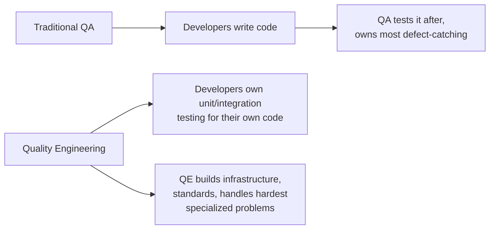

# Quality Engineering as a Discipline

**Prerequisites**: [Shift Right and Continuous Testing](/learning-paths/career-leadership/shift-right-and-continuous-testing)
**Leads to**: After this, you'll be ready for [Test Governance](/learning-paths/career-leadership/test-governance).

## Why This Matters

**A QA Manager who renames the team without changing anything else.** A QA Manager, following an industry trend, renames their team from "QA" to "Quality Engineering" and updates job titles accordingly. Nothing else changes — developers still treat quality as something the QA team handles after they finish writing code, the team's scope and responsibilities are identical to before, and within a year, the rename is functionally meaningless — a title change with no substance behind it.

**A QA Manager who builds Quality Engineering as an actual discipline.** A peer pursuing the same rebrand instead treats it as a genuine shift in ownership model: developers become accountable for their own unit and integration test coverage, with the QE team's role shifting toward building shared testing infrastructure, defining quality standards, and handling the hardest, most specialized testing problems rather than executing all testing themselves. It takes real organizational effort and some initial resistance, but a year later, quality genuinely is a shared responsibility, not a title change describing the same old division of labor.

Both managers used the same new name. Only one changed what the name was actually supposed to represent — because Quality Engineering, done as an actual discipline rather than a rebrand, means genuinely distributed ownership of quality, not a QA team by a different name.

## What Genuinely Distinguishes Quality Engineering

The meaningful distinction isn't the title — it's the ownership model:

**Traditional QA**: quality is primarily the QA team's responsibility. Developers write code; QA tests it, largely after the fact, and is accountable for catching defects before release.

**Quality Engineering**: quality is a shared responsibility across the whole engineering organization. Developers own unit and integration testing for their own code as a baseline expectation, not an optional extra. The QE team's role shifts toward building and maintaining shared testing infrastructure and tooling, defining and evangelizing quality standards, handling the hardest and most specialized testing problems (security, performance, complex integration scenarios), and coaching developers toward better testing practice — closer to the "technical leadership" tracks from [QA Career Roadmap](/learning-paths/career-leadership/qa-career-roadmap-ic-vs-technical-lead-vs-manager) than to hands-on execution of all testing.

## Common Mistakes

**Mistake 1: Rebranding the team without changing the actual ownership model.**
This module's opening scenario — a title change with no shift in who's actually accountable for what produces no real change in outcomes.

**Mistake 2: Expecting developers to fully own testing without providing the infrastructure or coaching to do it well.**
Shifting ownership to developers without giving them the tooling, standards, and support to succeed produces worse testing, not shared ownership — the QE team's infrastructure and coaching role is what makes distributed ownership actually work.

**Mistake 3: Treating the QE team's reduced hands-on testing role as a reduction in headcount need.**
Building and maintaining shared infrastructure, defining standards, and handling the hardest specialized problems is real, substantial work — a smaller execution role doesn't mean a smaller team is needed, just a differently focused one.

**Mistake 4: Rolling out the ownership shift all at once, organization-wide, without a demonstrated pilot.**
The same evidence-based, piloted rollout pattern from [Shift Left at Scale](/learning-paths/career-leadership/shift-left-at-scale) applies here — a sudden, broad shift in ownership without a proven model tends to produce confusion and inconsistent adoption.

## Best Practices

**Practice 1: Define the new ownership model explicitly, in writing, before using the new title.**
State plainly what developers now own, what the QE team now owns, and what changes for each — clarity about the actual shift matters far more than the label itself.

**Practice 2: Invest in shared testing infrastructure and standards before expecting developers to own more testing.**
Good tooling and clear, documented standards are what make broader ownership actually succeed, rather than just shifting a burden without the support to carry it.

**Practice 3: Position the QE team's shift as moving toward higher-leverage work, not a reduction in importance.**
Building infrastructure and handling the hardest specialized problems is genuinely higher-leverage work than executing routine testing — frame the shift accordingly, both to the QE team and to the rest of the organization.

**Practice 4: Pilot the ownership shift with one team, demonstrate real results, before rolling it out broadly.**
A demonstrated success — developers on a pilot team genuinely maintaining strong test coverage with QE-provided infrastructure — makes the broader rollout both more credible and more refined.

:::note From the Field
AtlasBank's engineering organization renamed its QA function to Quality Engineering as part of a broader initiative, but the actual ownership model didn't shift for nearly a year — developers still treated all testing as the QE team's job, just under a new name. A newly hired Quality Engineering Lead identified this gap and piloted a genuine ownership shift on the Internet Banking team: developers took ownership of unit and integration test coverage for their own code, with the QE team providing a shared testing framework, clear coverage standards, and hands-on coaching during the transition. Six months in, the pilot team's overall defect rate had measurably improved, and the QE team's own time had shifted toward building tooling and handling complex integration and security testing scenarios — the actual substance the rename had originally promised but never delivered.
:::

## Mini Challenge

**Scenario**: Your organization's QA team was recently renamed to Quality Engineering, but the actual division of testing responsibility hasn't changed — developers still treat all testing as the QE team's job.

**Your task**: Describe the specific ownership changes you'd propose, and name one piece of infrastructure or one standard the QE team would need to build first to make that shift realistic.

## Key Takeaways

- Quality Engineering, done as an actual discipline, means genuinely distributed ownership of quality across engineering, not a rebrand of the same QA scope.
- Developers owning their own unit and integration testing only works with QE-provided infrastructure, standards, and coaching behind it.
- The QE team's role shifts toward higher-leverage work — infrastructure, standards, and the hardest specialized problems — not a reduced role.
- A piloted, demonstrated ownership shift on one team should precede organization-wide rollout.

## What You Just Learned

- The genuine distinction between traditional QA and Quality Engineering as an ownership model, not just a title
- Why distributed ownership requires real infrastructure and coaching investment to actually work
- How to position the QE team's shift as higher-leverage, not diminished, work
- The AtlasBank Internet Banking example of piloting a genuine ownership shift after an initial rename-only attempt

## Related Topics

- [Shift Left at Scale](/learning-paths/career-leadership/shift-left-at-scale) — The same structural, piloted-rollout approach applied to distributing testing ownership
- [QA Career Roadmap: IC vs. Technical Lead vs. Manager](/learning-paths/career-leadership/qa-career-roadmap-ic-vs-technical-lead-vs-manager) — How the QE team's shifted focus maps onto the Technical Lead and IC tracks
- [Test Governance](/learning-paths/career-leadership/test-governance) — The standards and oversight function that keeps distributed quality ownership consistent

## Interview Questions

**Q1: What's the real difference between QA and Quality Engineering, beyond the name?**

*What to look for*: A clear articulation of the ownership-model shift — developers owning more testing, QE shifting toward infrastructure and standards — not just a description of the title change itself.

**Q2: How would you shift testing ownership toward developers without just offloading work onto people who aren't equipped for it?**

*What to look for*: An answer emphasizing infrastructure, standards, and coaching as prerequisites for the shift, not just a mandate — showing the candidate understands distributed ownership requires real investment to succeed.

:::note Common Interview Mistake
Many candidates describe Quality Engineering purely in terms of increased automation or tooling sophistication, without mentioning the ownership-model shift. A strong answer centers the distinction on who's accountable for what, not just on which tools are used.
:::

**Q3: How do you measure whether a Quality Engineering transformation is actually working, versus just a rebrand?**

*What to look for*: Concrete measures tied to actual ownership and outcomes (developer-authored test coverage, defect rates, QE team's shifted focus) rather than vague cultural indicators — showing the candidate would hold the initiative to a real, evidence-based standard.

---

## Glossary

**Quality Engineering (QE)**: A discipline in which quality ownership is genuinely distributed across an engineering organization, with a dedicated QE team focused on infrastructure, standards, and the hardest specialized testing problems, distinct from a QA team that owns most testing execution itself.

**Ownership Model**: The explicit division of who is accountable for which parts of testing and quality — the actual substance a Quality Engineering shift needs to change, beyond a title.

## Quick Revision

Remember these five points:

✓ Quality Engineering, done as an actual discipline, means genuinely distributed quality ownership, not a rebrand of the same QA scope.

✓ Developers owning their own testing only works with real QE-provided infrastructure, standards, and coaching behind it.

✓ The QE team's role shifts toward higher-leverage work — infrastructure, standards, specialized problems — not a diminished role.

✓ A piloted, demonstrated ownership shift on one team should precede organization-wide rollout.

✓ The real distinction between QA and QE is the ownership model, not the title or tooling sophistication alone.
