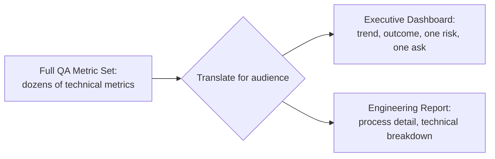

# Executive Dashboards

**Prerequisites**: [Automation Metrics and Release Health](/learning-paths/career-leadership/automation-metrics-and-release-health)
**Leads to**: After this, you'll be ready for [Engineering Reporting](/learning-paths/career-leadership/engineering-reporting).

## Why This Matters

**A QA Manager who gives executives the same dashboard QA uses internally.** A QA Manager, asked for a quality update at a leadership review, presents the same detailed dashboard the QA team uses day to day — dozens of metrics, test-suite-level breakdowns, technical terminology throughout. The executives in the room, without the context to interpret most of it, nod politely and ask no real questions, because there's no clear signal in the noise for them to act on. The update takes fifteen minutes and changes no decisions.

**A QA Manager who builds a dashboard for the actual audience.** A peer facing the same review instead presents four numbers: overall release health trend, escaped-defect rate for the highest-risk product area, one specific current risk that needs executive-level attention (a resourcing gap affecting testing on a critical upcoming release), and one clear ask. The update takes three minutes, and a specific resourcing decision gets made in the room, because the information was scoped to what this specific audience could actually act on.

Both managers had the same underlying data. Only one translated it for the audience actually receiving it — because a dashboard's value depends entirely on whether its audience can use it to make a real decision, not on how comprehensive or technically accurate it is.

## Translating Detail Into Signal

The core skill is deliberate translation, not simplification for its own sake — reducing a large amount of accurate detail down to the smaller set of things that specific audience needs to know and can act on, without distorting what the detail actually shows.

**For an executive audience specifically**: lead with trend and outcome (is quality improving or declining, and what's the real-world consequence), not process or activity detail. State one clear risk or ask, if one exists, rather than a comprehensive list. Avoid QA-specific terminology that requires translation in the room — "escaped defects reaching customers" communicates more to a non-QA executive than "P1/P2 defect leakage rate."

**What NOT to cut**: don't oversimplify to the point of hiding a real risk just because it's inconvenient to explain — the goal is translation, not spin. If quality genuinely has a problem, an executive dashboard should make that clear, just in terms that audience can act on, not in the same technical form QA itself uses to diagnose it.

## Common Mistakes

**Mistake 1: Presenting the same detailed, internal dashboard to an executive audience unchanged.**
This module's opening scenario — comprehensive detail without translation produces no actionable signal for an audience without the context to parse it.

**Mistake 2: Oversimplifying to the point of hiding a genuine risk.**
Translation should make a real risk more actionable for the audience, not less visible — cutting an inconvenient truth to keep the update short is a failure of the dashboard's actual purpose.

**Mistake 3: Using QA-specific terminology without translating it for a non-QA audience.**
Jargon that requires explanation in the room defeats the purpose of a translated dashboard — use terms the audience already understands wherever an equivalent exists.

**Mistake 4: Including no clear ask when one genuinely exists, burying it in a list of updates instead.**
If the dashboard's purpose includes securing a decision (resourcing, a policy change), stating that ask explicitly and prominently is what actually makes the meeting productive — an implied need buried in a status update often goes unaddressed.

## Best Practices

**Practice 1: Lead with trend and real-world outcome, not process or activity.**
"Escaped defect rate is trending down 15% this quarter" communicates more, faster, to an executive audience than a description of testing activity.

**Practice 2: State one clear risk and one clear ask, if either exists, prominently rather than buried.**
An executive audience with limited time needs the most important thing stated plainly, not discoverable only by reading closely.

**Practice 3: Translate QA terminology into outcome-based language throughout.**
Replace internal terms with their real-world consequence — "P1 defects" becomes "critical issues affecting customers directly."

**Practice 4: Build the executive dashboard as a genuinely separate artifact from the internal one, not a filtered view of the same document.**
A dashboard designed from the ground up for this specific audience communicates more effectively than one that's simply had rows hidden from a more detailed source.

:::note From the Field
At AtlasBank, a QA Manager's quarterly executive update had historically been a fifteen-slide deck covering every product team's detailed metrics, technical terminology throughout, that consistently generated little discussion or follow-up action from leadership. Redesigning it to a single slide — overall release-health trend, the one product area currently carrying disproportionate risk (with a plain-language explanation of the real customer consequence), and one specific resourcing ask — changed the meeting's outcome directly: the resourcing ask was approved in the same meeting, something the previous fifteen-slide version had never once achieved despite technically containing the same underlying justification somewhere within it.
:::

## Mini Challenge

**Scenario**: You currently present the same 12-metric internal QA dashboard to both your team and to executive leadership.

**Your task**: Design a translated, 3-item executive version instead, specifying exactly which trend, which single risk (if any), and which single ask you'd lead with.

## Key Takeaways

- An executive dashboard's value depends on whether its specific audience can use it to make a real decision, not on comprehensive technical accuracy.
- Translation means reducing detail to trend, outcome, one risk, and one ask — not oversimplifying to hide a genuine problem.
- QA-specific terminology should be translated into outcome-based language a non-QA audience already understands.
- A stated, prominent ask is what actually makes an executive update lead to a decision, rather than polite acknowledgment.

## What You Just Learned

- Why translating detail for a specific audience, not comprehensiveness, is what makes a dashboard actually useful
- The specific elements an executive dashboard should lead with: trend, outcome, one risk, one ask
- The distinction between genuine translation and harmful oversimplification that hides real risk
- The AtlasBank example of a redesigned single-slide dashboard directly securing a resourcing decision a detailed deck never had

## Related Topics

- [Quality KPIs and Defect Metrics](/learning-paths/career-leadership/quality-kpis-and-defect-metrics) — The underlying metrics this module translates for an executive audience
- [Engineering Reporting](/learning-paths/career-leadership/engineering-reporting) — The parallel translation exercise for a technical, engineering-focused audience instead
- [Personal Branding for Test Engineers](/learning-paths/career-leadership/personal-branding-for-test-engineers) — The same substance-first, audience-appropriate communication discipline applied to a different context

## Interview Questions

**Q1: How would you present quality metrics to a non-technical executive audience?**

*What to look for*: A description of translated, outcome-focused content (trend, real-world consequence, one ask) rather than a plan to present the same detailed dashboard used internally.

**Q2: Tell me about a time you had to communicate a quality risk to leadership. How did you frame it?**

*What to look for*: A real example showing plain-language translation of a genuine risk, ideally one that led to an actual decision or resourcing change — not just "I flagged it and moved on."

:::note Common Interview Mistake
Some candidates describe executive communication purely in terms of confidence or presentation polish, without discussing what content actually gets included or cut. A strong answer addresses the translation itself — what gets emphasized, what gets simplified, and what must never be hidden regardless of audience.
:::

**Q3: How do you avoid oversimplifying a dashboard to the point of hiding a real problem?**

*What to look for*: An articulated principle — translation should make risk more actionable, not less visible — showing the candidate distinguishes genuine audience-appropriate translation from convenient spin.

---

## Glossary

**Executive Dashboard**: A quality reporting artifact specifically translated for a non-QA leadership audience, emphasizing trend, real-world outcome, and actionable asks over technical detail.

**Detail-to-Signal Translation**: The deliberate process of reducing comprehensive, accurate data down to what a specific audience needs to know and can act on, without distorting what the underlying detail actually shows.

## Quick Revision

Remember these five points:

✓ An executive dashboard's value depends on whether its specific audience can use it to make a real decision.

✓ Translation means reducing detail to trend, outcome, one risk, and one clear ask — not oversimplifying to hide a genuine problem.

✓ QA-specific terminology should be translated into outcome-based language a non-QA audience already understands.

✓ A prominently stated ask is what turns a status update into an actual decision-making opportunity.

✓ The executive dashboard should be a genuinely separate, purpose-built artifact, not a filtered view of the internal one.
