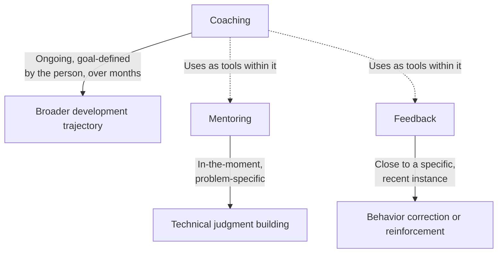

# Coaching

**Prerequisites**: [Giving Feedback](/learning-paths/career-leadership/giving-feedback)
**Leads to**: After this, you'll be ready for Working with Product and Developers, opening Section 7 (coming soon).

## Why This Matters

**A QA Lead who treats every growth conversation the same way.** A QA Lead has a monthly one-on-one with a senior engineer who's expressed interest in eventually becoming a QA Lead themselves. The conversation, like every other one-on-one on the calendar, focuses on current work status and immediate blockers. Months pass, the stated career interest is never revisited in any structured way, and the engineer eventually raises it again, frustrated that nothing seems to have moved despite the earlier conversation.

**A QA Lead who coaches deliberately toward a stated goal.** A peer, aware of a similar stated interest from one of their own reports, structures a portion of their regular one-on-ones specifically around that goal — asking what the engineer thinks their own gaps are toward it, identifying a specific stretch opportunity (leading a small cross-team initiative) as a deliberate step, and checking in on progress explicitly over several months. A year later, that engineer is measurably closer to the stated goal, with concrete evidence to show for it, because the growth conversation was structured and ongoing, not incidental.

Both leads cared about their reports' growth. Only one treated coaching as a distinct, deliberate practice — not something that happens automatically inside routine status conversations.

## Coaching vs. Mentoring vs. Feedback

These three related skills are often conflated, but serve different purposes:

**Mentoring** (see [Mentoring Engineers](/learning-paths/career-leadership/mentoring-engineers)) builds technical judgment for a specific problem or skill area, typically through guided questions in the moment a problem arises.

**Feedback** (see [Giving Feedback](/learning-paths/career-leadership/giving-feedback)) addresses a specific, recent instance of behavior, close to when it happened.

**Coaching** is broader and more ongoing: helping someone define their own goals and work toward them deliberately over time, with the coach asking questions and providing structure rather than directing the specific path. A coaching relationship might use mentoring and feedback as tools within it, but its scope is the person's broader development, not a single skill or a single instance of behavior.

## A Practical Coaching Approach

- **Ask what the person actually wants, and let them define the goal.** Coaching works from the person's own stated direction, not one imposed on them — connecting directly to the individual-not-template principle from [Career Development and Performance Reviews](/learning-paths/career-leadership/career-development-and-performance-reviews).
- **Ask what they think is in their way, before offering your own view.** The same guided-questioning discipline from [Mentoring Engineers](/learning-paths/career-leadership/mentoring-engineers), applied here to self-assessment of a broader gap, not a single technical problem.
- **Identify concrete, deliberate stretch opportunities, not just conversation.** A coaching relationship that stays purely conversational, without real opportunities to practice toward the goal, produces limited actual progress — the stretch opportunity is where growth actually happens.
- **Check in explicitly and regularly, treating it as an ongoing thread, not a one-time conversation.** Revisiting the goal at each one-on-one, even briefly, keeps it a live, structured priority rather than something raised once and left to fade.

## Common Mistakes

**Mistake 1: Treating every growth conversation as generic, without structuring any of it around a stated goal.**
This module's opening scenario — a stated career interest that's never structurally revisited leaves the person feeling their growth isn't a genuine priority, regardless of good intentions.

**Mistake 2: Conflating coaching with mentoring or feedback, treating them as interchangeable.**
Each serves a different purpose and timescale — mistaking a single mentoring conversation or piece of feedback for genuine, ongoing coaching misses coaching's actual scope and value.

**Mistake 3: Directing the person toward a goal you think they should have, rather than one they've defined themselves.**
Coaching that imposes the coach's own idea of the right direction, rather than working from the person's own stated goal, produces compliance at best, not genuine, motivated growth.

**Mistake 4: Keeping coaching purely conversational, with no concrete stretch opportunities attached.**
Conversation alone rarely produces real capability growth — a deliberate, real opportunity to practice toward the stated goal is what actually moves someone forward.

## Best Practices

**Practice 1: Explicitly ask what someone wants from their own development, and build the coaching relationship around their answer.**
This single practice keeps coaching genuinely person-centered rather than imposing an assumed default direction.

**Practice 2: Identify at least one concrete, real stretch opportunity connected to the stated goal.**
A specific opportunity — leading a small initiative, owning a new area of responsibility — gives the coaching relationship something tangible to work toward, not just conversation.

**Practice 3: Revisit the coaching goal explicitly and briefly at regular intervals, not just once.**
A short check-in on progress at each one-on-one keeps the goal a genuinely live priority rather than something that quietly fades after the initial conversation.

**Practice 4: Be honest about the distinction between coaching, mentoring, and feedback, and use each deliberately.**
Recognizing which mode a given conversation actually calls for — a specific technical problem (mentor), a recent instance of behavior (feedback), or a broader goal (coach) — makes each one more effective.

:::note From the Field
A QA Manager at AtlasBank had a senior engineer who, in a single one-on-one nearly a year earlier, mentioned interest in eventually moving into a QA Lead role — a goal that was never structurally revisited afterward, buried among routine status updates in every subsequent conversation. After the engineer raised visible frustration about the lack of progress, the manager restructured their monthly one-on-ones to explicitly include a coaching thread: asking the engineer's own assessment of what stood between them and that goal, identifying a concrete stretch opportunity (leading the team's quarterly retro process), and checking in on it specifically each month. Within six months, the engineer had visibly grown into aspects of the role informally, with concrete evidence to show for it — a direct result of structured, ongoing coaching, not the single conversation from a year earlier that had otherwise gone nowhere.
:::

## Mini Challenge

**Scenario**: A team member mentioned six months ago, in passing, that they'd eventually like to move toward a Technical Lead role, but you haven't structurally revisited it since.

**Your task**: Write the specific questions you'd ask in your next one-on-one to restart this as a genuine coaching thread, and name one concrete stretch opportunity you might propose.

## Key Takeaways

- Coaching is a distinct, ongoing practice centered on a goal the person themselves defines, broader than a single mentoring conversation or piece of feedback.
- Coaching, mentoring, and feedback serve different purposes and timescales, and conflating them limits each one's actual value.
- Concrete stretch opportunities, not conversation alone, are what actually move someone toward a coaching goal.
- Revisiting a coaching goal explicitly and regularly keeps it a genuine, live priority rather than something raised once and forgotten.

## What You Just Learned

- The distinction between coaching, mentoring, and feedback, and why conflating them limits each one's value
- A practical, concrete approach to structuring an ongoing coaching relationship
- Why concrete stretch opportunities, not just conversation, are what actually drive coaching progress
- The AtlasBank example of restructuring one-on-ones to turn a forgotten career interest into genuine, measurable growth

## Related Topics

- [Mentoring Engineers](/learning-paths/career-leadership/mentoring-engineers) — The related, but narrower and more in-the-moment, practice of building technical judgment
- [Giving Feedback](/learning-paths/career-leadership/giving-feedback) — The related, but instance-specific, practice that coaching often uses as one of its tools
- [Career Development and Performance Reviews](/learning-paths/career-leadership/career-development-and-performance-reviews) — The formal checkpoint that a genuine, ongoing coaching relationship should feed directly into

## Interview Questions

**Q1: How is coaching different from mentoring or giving feedback?**

*What to look for*: A clear articulation of the different scope and timescale — coaching as ongoing and goal-defined by the person, versus mentoring's in-the-moment technical focus and feedback's instance-specific focus — not treating all three as the same thing.

**Q2: Tell me about a time you coached someone toward a specific career goal. What did you actually do?**

*What to look for*: A real example showing a structured, ongoing process — asking about the person's own goal, identifying a concrete stretch opportunity, checking in over time — not just a single supportive conversation.

:::note Common Interview Mistake
Many candidates describe coaching purely as being supportive and available for career conversations, without describing any structured, ongoing process. A strong answer names concrete practices — explicit goal-setting from the person's own direction, stretch opportunities, regular check-ins — not just general availability and encouragement.
:::

**Q3: How do you balance coaching someone toward their stated long-term goal with the team's immediate day-to-day needs?**

*What to look for*: An answer showing the candidate can identify stretch opportunities that serve both the person's growth and real team needs simultaneously, rather than treating coaching and day-to-day work as always in tension.

---

## Glossary

**Coaching**: An ongoing, growth-focused relationship centered on helping someone define and work toward their own goals over time, distinct from the narrower, more instance-specific practices of mentoring and feedback.

**Stretch Opportunity**: A concrete, real assignment or responsibility deliberately identified to help someone practice and grow toward a specific coaching goal.

## Quick Revision

Remember these five points:

✓ Coaching is a distinct, ongoing practice centered on a goal the person themselves defines, broader than mentoring or feedback.

✓ Mentoring is in-the-moment and problem-specific; feedback is close to a specific recent instance; coaching spans months toward a broader goal.

✓ Concrete stretch opportunities, not conversation alone, are what actually move someone toward a coaching goal.

✓ Revisiting a coaching goal explicitly and regularly keeps it a genuine priority rather than something raised once and forgotten.

✓ Coaching should work from the person's own stated direction, not a goal the coach assumes or imposes.

---

## Section 6 Complete

Across four modules, this section built the core team-management skills every QA leadership track eventually needs: designing a hiring process that assesses real judgment, making performance reviews genuinely reflect ongoing attention, giving feedback specific and timely enough to actually change behavior, and coaching people toward goals they've defined themselves. From here, continue to Section 7 — Cross-Functional Leadership, starting with Working with Product and Developers.

## Section 6 Knowledge Check

Four realistic scenarios. For each, decide which of this section's concepts applies, and how. No answers are provided here — this is a chance to apply the section's reasoning yourself before moving on. **Solutions**: [Section 6 Solutions](/learning-paths/career-leadership/section-6-solutions).

**Scenario 1**: A hiring manager evaluates every QA candidate against a checklist of 15 specific tools, and a strong candidate with different tool experience but excellent reasoning is rejected.

**Scenario 2**: A QA Manager writes performance reviews once a year, based on vague, general impressions reconstructed from memory shortly before each review is due.

**Scenario 3**: A QA Lead notices a recurring, specific issue in a team member's bug reports in March but waits until the September review to mention it.

**Scenario 4**: A team member mentioned a career goal in passing eight months ago, and it hasn't come up in any one-on-one since.
