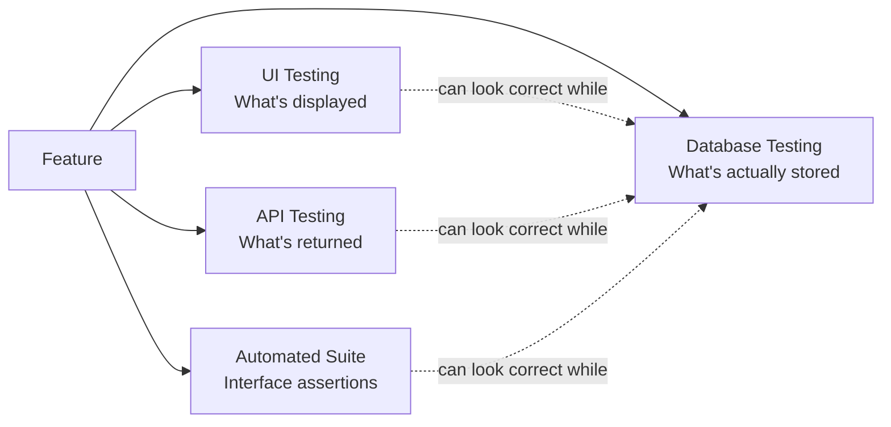

# What is Database Testing?

**Prerequisites**: You should already have completed [Manual Testing and Test Design](/learning-paths/manual-testing/test-design-fundamentals), and be comfortable with [Verification vs. Validation](/learning-paths/foundations/verification-vs-validation).
**Leads to**: After this, you'll be ready for [Relational Database Fundamentals](/learning-paths/database-testing/relational-database-fundamentals).

A test case can pass at every layer a team normally checks — the UI shows the right number, the API returns the right JSON — and the underlying data can still be wrong. Not "eventually wrong," not "wrong under some rare edge case," but wrong *right now*, sitting quietly in a table, waiting for a reconciliation job, an audit, or a customer to notice before anyone else does. This module is about why testers verify the data layer directly, and what that verification actually looks like from a QA perspective rather than a database administrator's.

## Why This Matters

**A team that trusts the UI.** AtlasBank ships a fund-transfer feature. QA tests it thoroughly at the layers they're used to: the Internet Banking UI shows the sender's balance decrease and the receiver's balance increase, the transfer confirmation screen displays the right amount, and the API response returns a 200 with the expected transaction ID. Every visible signal says the feature works. Three weeks later, the finance team's nightly reconciliation job flags a discrepancy — for a specific class of transfer (ones interrupted partway through, then retried), two `Transactions` rows were created instead of one, both marked successful, and the sender's `Accounts` balance was debited twice while the UI only ever displayed the correct, single amount. The UI was reporting a *cached* balance that happened to be right; the actual ledger underneath was already wrong, and had been for three weeks, across every affected retry.

**A team that verifies the data layer.** A different AtlasBank release cycle tests the same kind of retried-transfer scenario, but this time a tester runs a direct SQL query against the `Transactions` table after triggering the same interrupted-then-retried flow: `SELECT COUNT(*) FROM Transactions WHERE reference_id = 'TXN-4471'`. The UI still shows one clean confirmation screen — but the query returns 2, not 1. The duplicate is caught in QA, before release, because someone checked the row count the UI was never going to display in the first place.

Both scenarios involve the exact same underlying defect. In one, it reaches production and costs a reconciliation incident, a compliance question, and an uncomfortable customer conversation. In the other, it's a bug ticket closed before release. The difference isn't a smarter tester — it's a tester who knew to look at a layer the UI and API were never going to surface on their own.

## What Database Testing Actually Covers

**Database testing** means verifying data directly at its source — the tables, rows, and relationships a feature actually writes to and reads from — instead of relying entirely on what the UI displays or what the API returns. It is not database administration: a database tester isn't tuning indexes, designing schemas, or managing replication. A database tester is asking a narrower, QA-specific question: *did this feature do exactly what it claims to have done to the data, and nothing else?*

This is a genuinely different question from what [Manual Testing](/learning-paths/manual-testing/test-design-fundamentals), [API Testing](/learning-paths/api-testing/what-is-api-testing), and [Automation Testing](/learning-paths/automation/introduction-to-automation-testing) already answer. Each of those paths verifies a feature through an interface the feature presents to a caller — a screen, a JSON response, a script asserting against either. None of them can see past that interface to the actual stored state. A feature can present a perfectly correct interface while writing an incorrect row underneath it, and every technique those paths teach will still report the feature as passing.

| Layer | What It Verifies | What It Cannot See |
|---|---|---|
| **UI (Manual Testing)** | What a human sees on screen | Whether the underlying row is actually correct, or just displayed correctly |
| **API (API Testing)** | What a caller receives in a response | Whether the write behind that response was clean, duplicated, or partial |
| **Automated Suite (Automation Testing)** | Whether the interface's behavior matches an assertion | The same blind spot as manual and API testing — it asserts against the interface, not the data |
| **Database (this path)** | The actual stored state — rows, constraints, relationships, transactional outcome | The user-facing presentation layer — a correct row can still be presented badly, which is a UI-testing concern, not this path's |

Database testing isn't a replacement for any of the three interface-level layers — it's the one layer none of them were ever designed to reach. A team doing all four together gets a genuinely complete picture; a team doing only the first three has a real, structural blind spot, not a minor gap.

## Where This Path Builds From Here

This path assumes the test-design discipline [Manual Testing](/learning-paths/manual-testing/test-design-fundamentals) already taught — [Boundary Value Analysis](/learning-paths/manual-testing/boundary-value-analysis) and [Equivalence Partitioning](/learning-paths/manual-testing/equivalence-partitioning) both return later in this path, applied to constraints and data boundaries instead of UI fields. What's genuinely new is the surface: [Relational Database Fundamentals](/learning-paths/database-testing/relational-database-fundamentals) (next) and [SQL for Testers](/learning-paths/database-testing/sql-for-testers) build the vocabulary and query literacy this entire path runs on, the same way [HTTP Basics for Testers](/learning-paths/api-testing/http-fundamentals) did for API Testing.

## How This Works on a Real Project

AtlasBank's QA lead is planning test coverage for a new "scheduled payments" feature — customers can set up a recurring transfer that executes automatically on a chosen date. The team's initial test plan covers only the UI (can a customer create, view, and cancel a scheduled payment) and the API (does the scheduling endpoint return the correct confirmation).

A QA engineer with prior data-layer experience raises a specific concern: what happens to the `Payments` table if the scheduled job that executes the transfer fails partway through — does it leave a payment marked "processing" forever, does it retry and risk a duplicate, or does it correctly roll back? None of the planned UI or API tests would ever exercise this, because a customer never sees the scheduler run — they only see the payment listed as "scheduled" before, and either "completed" or "failed" after, with nothing in between actually displayed.

The team adds a database-level test: intentionally interrupt the scheduled job mid-execution in a test environment, then query the `Payments` and `Transactions` tables directly to check for orphaned "processing" rows, duplicate transaction entries, or an account balance that was debited without a corresponding completed payment record. The first test run finds exactly the kind of duplicate this module opened with — caught before the feature ever reaches a customer who schedules a payment and refreshes the page at the wrong moment.

## Common Mistakes

**Mistake 1: Assuming a passing UI and API test means the data is correct.**
As both opening scenarios show, an interface can report success while the underlying write is duplicated, partial, or otherwise wrong — the interface only reports what it was built to report, not what actually happened underneath.

**Mistake 2: Treating database testing as the database team's job, not QA's.**
A DBA cares about performance, schema design, and reliability at the infrastructure level. A QA engineer's database-testing question — did this specific feature do exactly what it claims — is a functional-correctness question, squarely a testing responsibility, not an infrastructure one.

**Mistake 3: Only checking the data after a single, clean happy-path run.**
The scheduled-payments example's defect only appears under an *interrupted* run — a single clean pass through the UI would never have exposed it, the same way the fund-transfer duplicate only appeared on a retried transfer, not a first attempt.

**Mistake 4: Assuming database testing requires deep SQL expertise before it's worth starting.**
The next two modules build exactly the SQL literacy this path needs from the ground up — a tester doesn't need DBA-level query skill to ask "did exactly one row get created," only enough SQL to check.

## Best Practices

**Practice 1: Verify the data layer for any feature that writes to shared or financial state.**
Fund transfers, scheduled payments, inventory updates — anywhere a wrong or duplicated row has a real cost — deserve a direct data-layer check, not just an interface-level one.

**Practice 2: Design data-layer checks around interruption and retry, not just the happy path.**
Both examples in this module found their defect specifically because someone tested what happens when a flow doesn't complete cleanly the first time.

**Practice 3: Ask "what row did this actually write" as a standard test-design question, not an afterthought.**
Building this question into test design from the start — the way this path's later modules formalize — catches data-layer defects before release instead of during a reconciliation incident.

**Practice 4: Keep the scope QA-shaped, not DBA-shaped.**
This path teaches enough SQL and relational literacy to verify correctness — not schema design, index tuning, or replication, which stay a database administrator's domain.

:::note From the Field
A logistics company's inventory system passed every UI and API test for its "reserve stock" feature — the UI correctly showed an item as reserved, and the API correctly returned a confirmation. During a high-traffic sale event, two customers were able to reserve the same unit of a low-stock item, because the reservation write itself had no protection against two near-simultaneous requests both reading "available" before either one wrote "reserved." Neither the UI nor the API ever showed anything wrong — both requests received a clean success response. The defect was only visible by querying the `Inventory` table directly and finding two active reservations against a stock count of one.
:::

:::tip Senior QA Insight
A newer tester considers a feature "verified" once the UI displays the expected result. A senior tester treats the UI's display as one data point, not the answer — and checks the row the feature actually wrote whenever the cost of being wrong (money, compliance, a double-booked resource) is high enough to justify it.
:::

## Mini Challenge

**Scenario**: AtlasBank's `Beneficiaries` feature lets a customer add a new payee for future transfers. The UI confirms "Beneficiary added successfully," and the API returns a 201 with the new beneficiary's ID.

**Your task**: Write down three specific things you'd want to verify directly against the `Beneficiaries` table (not just the UI/API response) before trusting this feature is fully correct — and for each, explain what kind of defect it would catch that the UI/API alone would miss.

## Key Takeaways

- Database testing verifies the actual stored data a feature wrote — a layer no UI, API, or automated-suite test can see past, because all three verify an interface, not the data underneath it.
- A feature can present a completely correct interface while writing an incorrect, duplicated, or partial row — this is a real, structural blind spot, not a rare edge case.
- Database testing is a QA-scoped skill (functional correctness) distinct from database administration (performance, schema design, infrastructure).
- Interruption and retry scenarios are where data-layer defects most often hide, because a single clean happy-path run rarely exposes them.

---

## What You Just Learned

- What database testing is, and the specific question it answers that UI, API, and automated-suite testing structurally cannot
- Why a feature can pass every interface-level test while still writing incorrect data
- Where database testing fits relative to the three testing layers covered in prior paths
- How AtlasBank's QA team caught a scheduled-payment duplication defect by querying the data layer directly, not the UI

**Next:** [Relational Database Fundamentals](/learning-paths/database-testing/relational-database-fundamentals)

## Related Topics

- [Verification vs. Validation](/learning-paths/foundations/verification-vs-validation) — The same "confirm it actually happened, don't just trust the report" discipline, applied here to stored data specifically
- [Test Design Fundamentals](/learning-paths/manual-testing/test-design-fundamentals) — The test-design toolkit this path reuses against data boundaries, starting from Section 2
- [API Testing Fundamentals](/learning-paths/api-testing/what-is-api-testing) — The interface-layer testing this module explicitly distinguishes database testing from

## Interview Questions

**Q1: How is database testing different from what API testing already covers?**

*What to look for*: A clear statement that API testing verifies the response an interface returns, while database testing verifies the actual stored data behind that response — and that the two can diverge (a correct-looking response with an incorrect underlying write).

:::note Common Interview Mistake
Many candidates answer "database testing is basically the same as API testing, just at a lower level," without identifying the specific gap: an API response and the data it's based on can genuinely disagree, and only a direct data-layer check catches that. A strong answer names a concrete example, like a duplicated write behind a single successful-looking response.
:::

**Q2: What's an example of a defect only a direct database query would catch?**

*What to look for*: A specific, plausible scenario — a duplicate row from a retried operation, an orphaned record from a partial failure, two reservations against one unit of stock — not a vague "data corruption" answer with no concrete mechanism behind it.

---

## Glossary

**Database Testing**: Verifying data directly at its source — tables, rows, and relationships — rather than relying on what a UI or API reports about that data.

**Data Layer**: The actual stored state of an application's data, as distinct from any interface (UI, API) presenting a view of that data to a caller.

**Reconciliation**: A process (often run on a schedule) that compares expected and actual data state to catch discrepancies — frequently how data-layer defects are first discovered when they aren't caught earlier by testing.

## Quick Revision

Remember these five points:

✓ Database testing verifies the actual stored data, not the interface reporting on it.

✓ A feature can present a fully correct UI/API response while writing incorrect data underneath.

✓ This is a QA-scoped skill (functional correctness), not database administration (performance, schema, infrastructure).

✓ Interruption and retry scenarios are where data-layer defects most commonly hide.

✓ This path reuses Manual Testing's test-design toolkit (BVA, Equivalence Partitioning) against a new surface — data boundaries — starting in Section 2.
