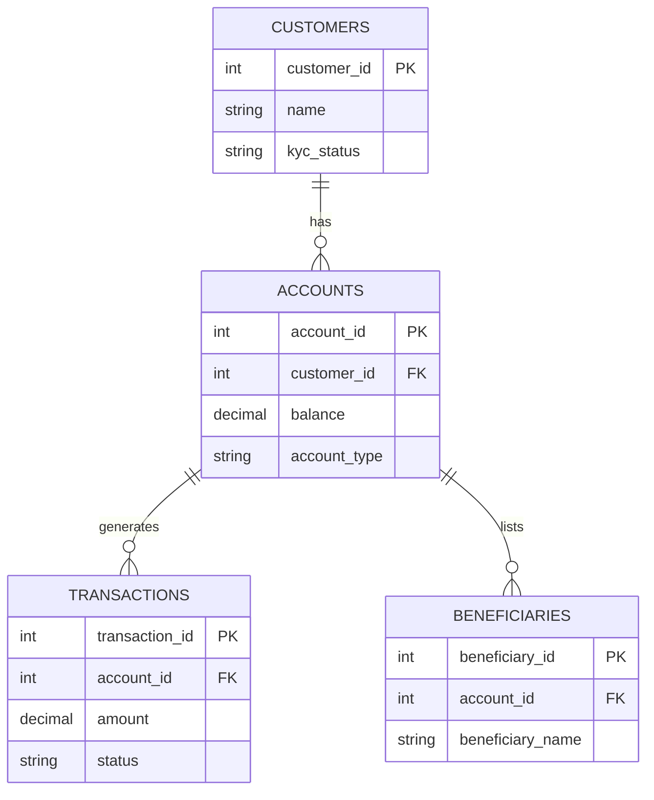

# Relational Database Fundamentals

**Prerequisites**: You should already have completed [What is Database Testing?](/learning-paths/database-testing/what-is-database-testing).
**Leads to**: After this, you'll be ready for [SQL for Testers](/learning-paths/database-testing/sql-for-testers).

A tester who doesn't understand what a foreign key actually enforces will test a "delete customer" feature by checking that the customer disappears from the UI — and miss that every account, transaction, and beneficiary record that pointed to that customer is now either silently orphaned or, worse, still fully intact and still spendable against a customer who no longer officially exists. This module builds the relational vocabulary the rest of this path assumes: not database design theory, just enough to reason correctly about what a table, a key, and a relationship actually guarantee.

## Why This Matters

**A tester without relational vocabulary.** A tester validating AtlasBank's "close account" feature confirms the account disappears from the customer's dashboard and the API returns a success response. They consider the feature verified. What they didn't check: the `Beneficiaries` table still has rows referencing the closed account's ID, and a scheduled payment configured against that account is still active in the `Payments` table, silently failing every night with an error nobody's monitoring. The tester had no framework for asking "what else points to this row," because they didn't know that's a question relational data structurally raises.

**A tester with relational vocabulary.** A different tester, testing the same feature, starts by asking a specific question: what tables have a foreign key pointing at `Accounts.account_id`? A quick look at the schema shows `Beneficiaries`, `Transactions`, and `Payments` all do. They design test cases specifically for each: does closing an account cancel related scheduled payments, does it correctly handle (not silently orphan) related beneficiary entries, does transaction history remain intact for audit purposes rather than being deleted. Two of the three turn out to be genuine defects — the scheduled payment isn't cancelled, and it keeps failing silently every night.

The first tester wasn't careless — they simply didn't have the vocabulary to know what question to ask. That vocabulary is this module's entire purpose.

## Tables, Rows, and Columns

A **relational database** organizes data into **tables** — think of a table as a single, structured list of one kind of thing. AtlasBank's `Accounts` table holds one row per bank account; its `Customers` table holds one row per customer. Each **row** is one specific record (one actual account, one actual customer); each **column** is one attribute every row in that table has (every account row has an `account_id`, a `balance`, an `account_type`, and so on).

This is the same vocabulary a spreadsheet uses — a table is conceptually a sheet, a row is one line, a column is one field — but a relational database adds something a spreadsheet doesn't enforce on its own: **structure that's actually guaranteed**, not just organized by convention.

## Primary Keys: What Makes a Row Unique

A **primary key** is the column (or combination of columns) that uniquely identifies each row in a table — no two rows in `Accounts` can share the same `account_id`, and the database itself enforces this, rejecting any attempt to insert a duplicate. This matters to a tester directly: if a feature is supposed to create exactly one new account and the primary key constraint didn't exist (or wasn't working), a race condition or a retried request could silently create two rows that both claim to be the same account — exactly the kind of duplicate-row defect [What is Database Testing?](/learning-paths/database-testing/what-is-database-testing) opened with.

## Foreign Keys: What Connects Tables to Each Other

A **foreign key** is a column in one table that references a primary key in another table, and it's how relational databases model real relationships: a row in `Accounts` has a `customer_id` column that's a foreign key pointing back to a specific row in `Customers` — this is what says "this account belongs to that customer," enforced by the database, not just assumed by the application code.

Foreign keys are what raise the exact question the first tester in this module's opening scenario missed: **when a row is deleted or changed, what else references it, and what's supposed to happen to those references?** A well-designed system either cascades the change (deleting a customer also deletes their accounts), restricts it (refuses to delete a customer who still has open accounts), or nullifies it (sets the reference to empty) — and a tester's job is to verify the system actually does whichever of these it claims to do, not to assume it does the sensible one automatically.

## Relationship Types, at a Tester's Depth

| Relationship | What It Means | AtlasBank Example |
|---|---|---|
| **One-to-many** | One row in Table A can relate to many rows in Table B, but each row in B relates to only one row in A | One `Customer` has many `Accounts`; each `Account` belongs to exactly one `Customer` |
| **Many-to-many** | Rows in Table A can relate to many rows in Table B, and vice versa — usually implemented via a third linking table | Multiple `Cards` could each be authorized on multiple `Accounts` (a joint account's shared card), tracked via a linking table |
| **One-to-one** | Each row in Table A relates to at most one row in Table B | A `Customer`'s `KYC` verification record — one customer, one active KYC record |

A tester doesn't need to design these relationships — that's a schema-design decision already made before testing begins. What a tester needs is to recognize which type a given relationship is, because it changes what "correct" looks like: testing a one-to-many delete (does deleting the "one" side correctly handle the "many" side) is a different test than testing a many-to-many link (does removing one link leave the other, unrelated links intact).

## Schemas: The Structure a Feature Is Supposed to Respect

A **schema** is the overall structure — every table, every column, every key and relationship, defined together. A tester doesn't need to design a schema, but reading one (even a partial diagram, like the one above) is directly useful: it tells you, before you write a single test case, exactly which tables a feature is likely to touch and which relationships a change might ripple through — the same reconnaissance [Requirement Traceability Matrix](/learning-paths/manual-testing/requirement-traceability-matrix) work does for requirements, applied to data structure instead.

## How This Works on a Real Project

AtlasBank is building a "merge duplicate customer profiles" feature — support agents can merge two customer records that turn out to belong to the same person (created by mistake during two separate onboarding attempts). The initial test plan checks that the merged profile shows all accounts and transaction history from both original profiles correctly in the UI.

A tester who's internalized this module's vocabulary asks a schema-first question before writing a single UI test case: which tables have a foreign key pointing at `Customers.customer_id`? The answer — `Accounts`, `KYC`, and `Beneficiaries` — becomes the actual test plan. For each, they design a specific case: does merging correctly re-point every `Accounts` row's `customer_id` to the surviving profile, does the `KYC` record correctly resolve when both profiles somehow have one (a one-to-one relationship being merged is a genuinely different problem than a one-to-many), and do `Beneficiaries` entries survive the merge without becoming orphaned or duplicated.

The `KYC` case turns out to be a real defect: the merge feature correctly re-points `Accounts` and `Beneficiaries`, but silently keeps only one of the two `KYC` records and deletes the other — including, in one tested case, the more recently verified one. A UI-only test plan, focused on "do the accounts show up," would never have raised this specific one-to-one merge conflict as a distinct case worth testing.

## Common Mistakes

**Mistake 1: Treating "the row disappeared from the UI" as proof the underlying data was handled correctly.**
As this module's opening scenario shows, a deleted or changed row can leave orphaned or stale references in every table that had a foreign key pointing at it — none of which show up in a UI that only displays the row that changed, not everything connected to it.

**Mistake 2: Not identifying which tables reference a given table before testing a delete or merge feature.**
This is the single question that turned a UI-only test plan into a real defect-catching one in both this module's examples — skipping it means testing only the change itself, not its ripple effects.

**Mistake 3: Assuming every relationship is one-to-many by default.**
The `KYC` merge example specifically failed because a one-to-one relationship was tested with one-to-many assumptions — knowing the actual relationship type changes what "handled correctly" even means.

**Mistake 4: Waiting to learn relational vocabulary until a defect forces the issue.**
Both opening scenarios show the same underlying skill gap costing real, missed defects — this vocabulary is cheap to learn up front and expensive to be missing during test design.

## Best Practices

**Practice 1: Before testing any delete, update, or merge feature, ask what else has a foreign key pointing at the affected row.**
This single question, applied consistently, is what caught the real defect in both this module's worked examples.

**Practice 2: Identify the relationship type (one-to-many, many-to-many, one-to-one) before assuming how a change should ripple.**
A one-to-one relationship being merged or deleted needs different test cases than a one-to-many relationship undergoing the same operation.

**Practice 3: Read the schema before writing test cases for a data-heavy feature, the way you'd read a requirement before writing any other test case.**
A schema diagram (even partial) tells you which tables a feature is likely to touch before you've written a single test.

**Practice 4: Verify referential integrity behavior explicitly — cascade, restrict, or nullify — rather than assuming the system does the "obviously correct" one.**
What counts as correct is a real design decision the system either implements correctly or doesn't; a tester's job is to confirm which, not assume.

:::note From the Field
An e-commerce platform's "delete product" feature correctly removed the product from the catalog and confirmed success in the UI. It didn't check whether any `OrderItems` rows still referenced that product's ID from past orders. Months later, a customer service tool that displayed order history began crashing for any order containing a deleted product, because the tool assumed every `OrderItems.product_id` would always resolve to a real, current `Products` row — an assumption the delete feature had silently broken for months before anyone traced the crash back to its actual cause.
:::

:::tip Senior QA Insight
A newer tester tests a delete feature by confirming the deleted thing is gone. A senior tester tests it by asking what else in the schema pointed at that thing, and confirms each of those relationships was handled deliberately — cascaded, restricted, or nullified — rather than left to become a silent, undiscovered orphan.
:::

## Mini Challenge

**Scenario**: AtlasBank is adding a "close account" feature. You've confirmed (from the schema) that `Transactions`, `Beneficiaries`, and `Payments` (scheduled payments) all have a foreign key pointing at `Accounts.account_id`.

**Your task**: For each of the three related tables, state what you think the *correct* behavior should be when the referenced account is closed (cascade, restrict, or nullify — or something else entirely), and explain your reasoning for each. There's no single universally correct answer — the point is reasoning about each relationship on its own terms, not applying one rule to all three.

## Key Takeaways

- Tables, rows, and columns organize data; primary keys guarantee row uniqueness; foreign keys connect tables and model real relationships, all enforced by the database itself, not just application convention.
- Foreign keys raise a specific, testable question whenever a row changes or is deleted: what else references this row, and is that reference handled correctly?
- Relationship type (one-to-many, many-to-many, one-to-one) changes what "correct" behavior actually looks like — don't assume every relationship behaves the same way under change.
- Reading a schema before test design is reconnaissance, the same way reading a requirement is — it tells you which tables a feature is likely to touch before you write a single test case.

---

## What You Just Learned

- The core relational vocabulary: tables, rows, columns, primary keys, and foreign keys
- Why foreign keys are what make "what else references this row" a testable, necessary question
- The three common relationship types and why the type changes what correct behavior looks like
- How AtlasBank's QA team caught a one-to-one KYC merge defect by reading the schema before writing test cases

**Next:** [SQL for Testers](/learning-paths/database-testing/sql-for-testers)

## Related Topics

- [What is Database Testing?](/learning-paths/database-testing/what-is-database-testing) — Why this vocabulary matters: it's what lets a tester ask the right question at the data layer
- [Requirement Traceability Matrix](/learning-paths/manual-testing/requirement-traceability-matrix) — The same "map what connects to what before testing" reconnaissance, applied to requirements instead of schema
- [Constraints, Keys, and Relationships](/learning-paths/database-testing/constraints-keys-and-relationships) — Where this module's vocabulary becomes concrete, testable constraint behavior

## Interview Questions

**Q1: What's the difference between a primary key and a foreign key?**

*What to look for*: A clear, correct distinction — a primary key uniquely identifies a row within its own table; a foreign key is a column referencing another table's primary key, modeling a relationship between the two. Bonus if the candidate connects this to a testing implication, not just a textbook definition.

:::note Common Interview Mistake
Many candidates can recite the definitions of primary and foreign keys correctly but can't explain why a tester cares — that a foreign key is what makes "what else references this row" a real, testable question whenever a row is deleted or changed. A strong answer connects the definition to a concrete testing consequence, not just terminology.
:::

**Q2: You're testing a "delete customer" feature. What data-layer questions would you ask before writing test cases?**

*What to look for*: Specifically asking what tables have a foreign key pointing at the customer being deleted, and what the correct handling (cascade, restrict, nullify) should be for each — not just "I'd check the customer is gone from the UI."

---

## Glossary

**Table**: A structured list of one kind of record in a relational database (e.g., `Accounts`, `Customers`).

**Row**: One specific record within a table.

**Column**: One attribute every row in a table has.

**Primary Key**: The column (or columns) that uniquely identifies each row in a table, enforced by the database.

**Foreign Key**: A column in one table that references a primary key in another table, modeling a relationship between them.

**Schema**: The overall structure of a database — every table, column, key, and relationship, defined together.

## Quick Revision

Remember these five points:

✓ Tables hold rows of one kind of record; primary keys guarantee each row is unique.

✓ Foreign keys connect tables and model real relationships, enforced by the database, not just application logic.

✓ Whenever a row changes or is deleted, ask what else has a foreign key pointing at it.

✓ Relationship type (one-to-many, many-to-many, one-to-one) changes what "correctly handled" means for a given change.

✓ Reading a schema before test design tells you which tables a feature will touch — the same reconnaissance value as reading a requirement first.
