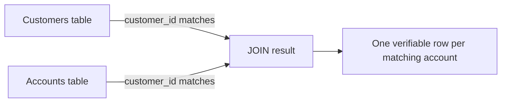

# SQL for Testers

**Prerequisites**: You should already have completed [Relational Database Fundamentals](/learning-paths/database-testing/relational-database-fundamentals).
**Leads to**: After this, you'll be ready for [Section 1 Review](/learning-paths/database-testing/section-1-review), then [CRUD Validation](/learning-paths/database-testing/crud-validation) in Section 2.

A tester who can't query the database directly has exactly one way to check whether a feature did what it claims: trust the interface. Everything this path has argued so far is that trusting the interface alone leaves a real blind spot. This module closes that gap — not with the full breadth of SQL a database administrator needs, but with the specific handful of query patterns a tester actually uses, over and over, to answer one recurring question: *did the data end up the way the feature says it should have?*

## Why This Matters

**A tester without SQL.** A tester validating AtlasBank's "add beneficiary" feature can only confirm what the UI shows: the new beneficiary appears in the list. When a bug report comes in claiming a customer sees the *same* beneficiary listed twice after a slow network retry, the tester has no way to independently confirm whether that's really two rows in the `Beneficiaries` table or a UI rendering glitch showing one row twice. They escalate the ticket to a developer and wait, because checking the actual data isn't something they know how to do.

**A tester with SQL.** A different tester, hearing the same bug report, runs one query: `SELECT * FROM Beneficiaries WHERE account_id = 4471 AND beneficiary_name = 'John Mehta'`. It returns two rows, with two different `beneficiary_id` values, created eleven seconds apart. The tester now has a confirmed, precise answer in under a minute — it's a real duplicate row, not a rendering bug — and can hand the developer the exact evidence instead of a vague repro description.

The second tester isn't more senior in title. They just have one specific, learnable skill the first one doesn't: enough SQL to ask the data a direct question and get a direct answer.

## SELECT: Asking the Data a Question

Every verification query starts with `SELECT` — it retrieves rows from a table, and it's the only statement this path uses (testers verify data; they don't write application code that modifies it as part of a test, beyond deliberately setting up test scenarios).

```sql
SELECT account_id, balance, account_type
FROM Accounts
WHERE customer_id = 4471;
```

This asks: show me the account ID, balance, and type for every account belonging to customer 4471. `SELECT` names which columns you want (or `SELECT *` for all of them, useful for quick exploration but worth narrowing once you know what you're checking); `FROM` names the table; `WHERE` filters which rows qualify.

## WHERE: Narrowing to What You Actually Care About

`WHERE` is the clause that turns "show me everything" into "show me exactly the row I'm testing." A tester uses it constantly — to isolate one customer's data, one transaction's status, one date range.

```sql
SELECT transaction_id, amount, status, created_at
FROM Transactions
WHERE account_id = 4471
  AND status = 'FAILED';
```

Multiple conditions combine with `AND` (all must be true) or `OR` (at least one must be true) — a distinction worth being deliberate about, since `WHERE status = 'FAILED' OR status = 'PENDING'` and `WHERE status = 'FAILED' AND status = 'PENDING'` produce very different (in the second case, empty) results, since no single row can have two different status values at once.

**NULL needs its own comparison.** A column with no value isn't equal to anything, including itself — `WHERE closed_date = NULL` never matches any row, even ones where `closed_date` genuinely has no value. The correct check is `WHERE closed_date IS NULL` (or `IS NOT NULL`). This trips up testers new to SQL constantly, and it matters directly: confirming a field is correctly *empty* after an operation (an account's `closed_date` should be NULL until it's actually closed) requires `IS NULL`, not `= NULL`, which would silently return nothing and give a false sense that "there's no matching row" when the real answer is "the comparison itself was wrong."

## ORDER BY: Making Sequence Verifiable

`ORDER BY` sorts results — essential whenever a test needs to confirm *sequence*, not just presence: did the most recent transaction actually process last, is a customer's transaction history displayed newest-first as the requirement states.

```sql
SELECT transaction_id, amount, created_at
FROM Transactions
WHERE account_id = 4471
ORDER BY created_at DESC;
```

`DESC` sorts newest/highest first; `ASC` (or omitting it, since it's the default) sorts oldest/lowest first.

## JOIN: Verifying Across Tables at Once

[Relational Database Fundamentals](/learning-paths/database-testing/relational-database-fundamentals) established that AtlasBank's data lives across related tables, connected by foreign keys. A `JOIN` combines rows from two tables based on that relationship, letting a single query verify something that spans both — exactly the kind of check a foreign-key-aware tester needs.

```sql
SELECT c.name, a.account_id, a.balance
FROM Customers c
JOIN Accounts a ON c.customer_id = a.customer_id
WHERE c.kyc_status = 'VERIFIED';
```

This answers a question neither table alone could: show me the accounts belonging to customers whose KYC is verified. The `ON` clause states the relationship (`Customers.customer_id` matches `Accounts.customer_id`) — the same foreign-key relationship from the previous module's diagram, now put to direct use. This is the query pattern behind the merge-defect example from that module: a tester checking whether a merged customer's accounts correctly re-pointed would join `Customers` to `Accounts` and look for any account still referencing the deleted profile's ID.



## GROUP BY and Aggregates: Verifying Totals and Counts

`GROUP BY` collapses many rows into one summary row per group, almost always paired with an **aggregate function** — `COUNT()`, `SUM()`, and similar — that computes something across each group. This is the pattern behind the exact duplicate-detection query from this module's opening scenario, generalized:

```sql
SELECT account_id, COUNT(*) AS transaction_count
FROM Transactions
WHERE reference_id = 'TXN-4471'
GROUP BY account_id;
```

If this returns `2` instead of `1`, that's a confirmed duplicate, in one query. `SUM()` works the same way for verifying totals — a common reconciliation-style check:

```sql
SELECT account_id, SUM(amount) AS total_debited
FROM Transactions
WHERE account_id = 4471
  AND transaction_type = 'DEBIT'
  AND status = 'SUCCESS';
```

This confirms the total amount actually debited from an account matches what the feature claims to have debited — the direct data-layer version of the ledger-drift scenario from [What is Database Testing?](/learning-paths/database-testing/what-is-database-testing).

| Function | What It Verifies | Testing Use |
|---|---|---|
| `COUNT(*)` | How many rows match a condition | Duplicate detection — should this return exactly 1? |
| `SUM(column)` | The total of a numeric column across matching rows | Reconciliation — does the total match what the feature claims? |
| `EXISTS` | Whether at least one matching row is present, without returning the row itself | Fast presence/absence checks — did *any* orphaned record get left behind? |

## EXISTS: A Fast Yes/No Check

`EXISTS` answers a presence question directly, without retrieving the actual rows — useful when a test only needs "did this happen at all," not the row's details:

```sql
SELECT EXISTS (
    SELECT 1 FROM Beneficiaries WHERE account_id = 4471
) AS has_beneficiaries;
```

This is the query pattern for confirming an orphan check from the previous module's mini challenge — does *any* row in `Beneficiaries` still reference a closed account, without needing to know how many or which ones until the answer to "any at all" is already yes.

## How This Works on a Real Project

AtlasBank's QA team is testing the "scheduled payments" feature from [What is Database Testing?](/learning-paths/database-testing/what-is-database-testing)'s worked example — specifically, verifying that an interrupted scheduled job doesn't leave the system in a bad state. Before this module, the team's only tool was re-checking the UI repeatedly after manually interrupting a test job, which couldn't distinguish "the payment genuinely completed" from "the payment failed but the UI is just showing stale cached data."

With SQL, the test becomes precise. After interrupting a scheduled job mid-execution, the tester runs three targeted queries: `SELECT COUNT(*) FROM Payments WHERE status = 'PROCESSING' AND scheduled_date < CURRENT_DATE` (should return 0 — nothing should still be stuck "processing" from a prior day), a `JOIN` between `Payments` and `Transactions` checking for any completed payment with no corresponding transaction record (an orphan), and a `GROUP BY` on `reference_id` checking for duplicate transaction rows from a retried job. The second query is the one that finds a real defect: three completed payments with no matching transaction row at all — money that left an account balance display correctly updated in a cached UI value, with no actual ledger entry behind it.

## Common Mistakes

**Mistake 1: Using `= NULL` instead of `IS NULL`.**
As covered above, this silently returns no rows and can be mistaken for "there's nothing to find" when the real problem is the comparison itself is wrong.

**Mistake 2: Forgetting `WHERE` and querying an entire large table.**
Beyond being slow, an unfiltered query makes it easy to miss the specific row you're actually testing among thousands of irrelevant ones — always filter to the exact scope the test case cares about.

**Mistake 3: Trusting a `COUNT` or `SUM` without also checking `WHERE` narrowed to the right condition first.**
An aggregate is only as correct as the filter feeding it — a `SUM` without the right `status = 'SUCCESS'` filter, for example, might silently include failed or pending transactions in a reconciliation total.

**Mistake 4: Treating SQL fluency as an all-or-nothing skill before starting to use it.**
As this module's opening scenario shows, the gap between "no SQL" and "verified a real defect" is a handful of query patterns, not deep expertise — the six covered here already close most of it.

## Best Practices

**Practice 1: Reach for `COUNT` first whenever "did this create a duplicate" is the question.**
It's the fastest, most direct way to confirm or rule out the duplicate-row defect class this entire path keeps returning to.

**Practice 2: Use `JOIN` whenever a test question spans a relationship from the previous module's schema.**
Anywhere a foreign key connects two tables, a `JOIN` is usually the fastest way to verify both sides agree.

**Practice 3: Always filter (`WHERE`) before aggregating (`SUM`, `COUNT`), not after.**
Confirm the scope is correct before trusting the number it produces — an unfiltered aggregate answers a different, usually wrong, question.

**Practice 4: Keep verification queries read-only.**
This path's queries are for checking state, not changing it — a tester writing `SELECT` queries against a shared or production-like environment should never need `INSERT`, `UPDATE`, or `DELETE` as part of verification itself.

:::note From the Field
A subscription-billing company's QA team relied entirely on the billing dashboard to confirm customers weren't double-charged after a payment-retry bug fix. The dashboard displayed each customer's most recent charge only — it had no way to show a duplicate charge from earlier in the day, because it was designed to show current state, not history. A single `GROUP BY customer_id, billing_date HAVING COUNT(*) > 1` query, run directly against the charges table, immediately surfaced 40 customers who'd been charged twice that the dashboard had no way of ever revealing.
:::

:::tip Senior QA Insight
A newer tester writes a query, sees a result, and reports it. A senior tester writes the query, then asks whether the `WHERE` clause actually scoped it to the exact condition the test case claims to check — a query that runs without error can still be quietly answering the wrong question.
:::

## Mini Challenge

**Scenario**: You need to verify that AtlasBank's nightly interest-calculation job correctly credited interest to every savings account, and didn't credit any account twice.

**Your task**: Write (in plain language or actual SQL, either is fine) the specific query or queries you'd run against `Accounts` and `Transactions` to check this — name which columns and conditions you'd filter on, and what result would tell you the job worked correctly versus ran twice.

## Key Takeaways

- `SELECT`, `WHERE`, and `ORDER BY` are the core of any verification query — retrieve, filter, and sequence exactly the data a test case cares about.
- `JOIN` verifies across related tables at once, directly using the foreign-key relationships the previous module introduced.
- `COUNT` and `SUM` (via `GROUP BY`) are the primary tools for duplicate detection and reconciliation — the two most common data-layer defect classes this path keeps returning to.
- `= NULL` never matches, even genuinely empty values — always use `IS NULL` / `IS NOT NULL`.

---

## What You Just Learned

- The core SQL verification toolkit: `SELECT`, `WHERE`, `ORDER BY`, `JOIN`, `GROUP BY`, `COUNT`, `SUM`, `EXISTS`
- Why `NULL` requires its own comparison operator, and how getting this wrong silently produces a false negative
- How `JOIN` and `GROUP BY` map directly onto the two recurring defect classes this path has examined: cross-table relationship failures and duplicate rows
- How AtlasBank's QA team used three targeted queries to catch a real orphaned-payment defect an interrupted scheduled job produced

**Next:** [Section 1 Review](/learning-paths/database-testing/section-1-review)

## Related Topics

- [Relational Database Fundamentals](/learning-paths/database-testing/relational-database-fundamentals) — The table/key/relationship vocabulary this module's `JOIN` queries put directly to use
- [What is Database Testing?](/learning-paths/database-testing/what-is-database-testing) — The duplicate-row and reconciliation defect classes this module's `COUNT`/`SUM` queries are built to catch
- [CRUD Validation](/learning-paths/database-testing/crud-validation) — Where this module's query toolkit becomes a systematic verification framework for Create, Read, Update, and Delete operations

## Interview Questions

**Q1: How would you check whether a database operation created a duplicate row?**

*What to look for*: A concrete `SELECT COUNT(*) ... GROUP BY` (or equivalent) answer that filters to the specific condition being tested, not a vague "I'd look at the table" answer with no actual query logic.

:::note Common Interview Mistake
Many candidates answer `WHERE column = NULL` when asked how to check for an empty value, not realizing this always returns zero rows regardless of the actual data. A strong answer names `IS NULL` specifically and can explain why the equality operator doesn't work for NULL comparisons.
:::

**Q2: What's the difference between filtering rows before versus after an aggregate function like `SUM` or `COUNT`?**

*What to look for*: Understanding that `WHERE` filters rows before aggregation, so an aggregate is only as correct as the filter feeding it — an unfiltered or wrongly-filtered `SUM`, for example, can silently include rows (like failed transactions) that shouldn't count toward the total.

---

## Glossary

**SELECT**: The SQL statement that retrieves rows from a table — the only statement testers use for verification.

**WHERE**: The clause that filters which rows a query returns, based on one or more conditions.

**JOIN**: A clause that combines rows from two tables based on a matching relationship, typically a foreign key.

**GROUP BY**: A clause that collapses multiple rows into one summary row per group, typically paired with an aggregate function.

**Aggregate Function**: A function (`COUNT`, `SUM`, and similar) that computes a single value across a group of rows.

**NULL**: The absence of a value in a column — requires `IS NULL` / `IS NOT NULL`, since `= NULL` never matches.

## Quick Revision

Remember these five points:

✓ `SELECT`, `WHERE`, and `ORDER BY` retrieve, filter, and sequence — the foundation of every verification query.

✓ `JOIN` verifies across related tables, using the same foreign-key relationships from the previous module.

✓ `COUNT` + `GROUP BY` is the standard duplicate-detection pattern; `SUM` + `GROUP BY` is the standard reconciliation pattern.

✓ `= NULL` never matches — always use `IS NULL` or `IS NOT NULL` for empty-value checks.

✓ Always filter (`WHERE`) before trusting an aggregate (`SUM`, `COUNT`) — the aggregate is only as correct as its filter.
