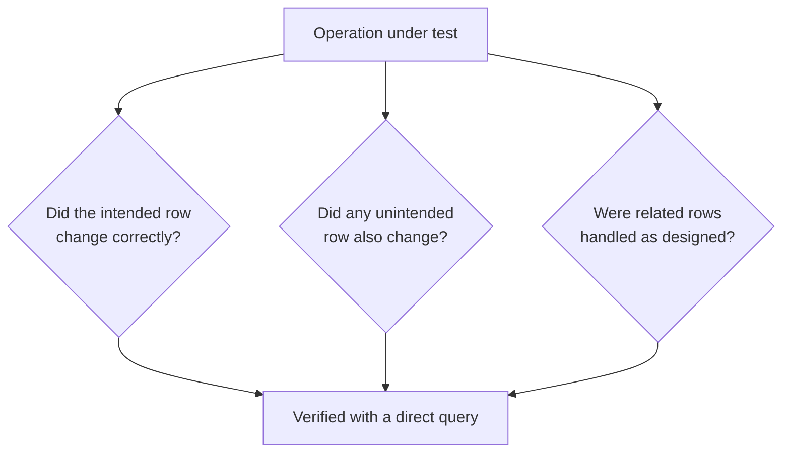

# CRUD Validation

**Prerequisites**: You should already have completed [SQL for Testers](/learning-paths/database-testing/sql-for-testers) and Section 1 in full.
**Leads to**: After this, you'll be ready for [Constraints, Keys, and Relationships](/learning-paths/database-testing/constraints-keys-and-relationships).

Nearly every feature a tester validates, underneath its UI and API surface, is really one of four operations against the database: it **creates** a row, it **reads** rows, it **updates** a row, or it **deletes** a row. Section 1 built the SQL literacy to check any of these directly. This module turns that literacy into a systematic framework — a specific, repeatable set of questions for each of the four operations, so "verify this feature" stops meaning "click through it and see if it looks right."

## Why This Matters

**A tester who verifies CRUD loosely.** A tester validates AtlasBank's "update mailing address" feature by changing a customer's address in the UI, refreshing the page, and confirming the new address displays. It does, so the test passes. What they didn't check: the update query, due to a bug in how the feature matched customer records, actually updated the address on a *different* customer's row — one whose account happened to be a database ID away — while a caching layer in the UI happened to keep showing the tester's own session the value they'd just typed in. The real row updated was wrong; the screen the tester was looking at just didn't reflect that.

**A tester who verifies CRUD systematically.** A different tester, testing the same feature, doesn't stop at the UI. They run one query before the update (`SELECT customer_id, address FROM Customers WHERE customer_id = 4471`) and the same query after, confirming the *specific row they intended to change* actually changed — and, just as important, run a second query confirming no *other* row changed (`SELECT COUNT(*) FROM Customers WHERE address = 'new address' AND customer_id != 4471`, expecting 0). The second query catches the defect immediately: it returns 1, meaning the wrong customer's row was silently changed too.

Both testers "tested the update feature." Only one of them verified the operation actually did what it claims — to the right row, and only the right row.

## The Four Operations, and What Each One Actually Promises

| Operation | What It Promises | What a Tester Verifies |
|---|---|---|
| **Create** | A new row exists, with the correct values, and nothing else was affected | Exactly one new row, correct values, correct foreign keys, no unintended side effects |
| **Read** | The data returned accurately reflects current stored state | The returned data matches a direct query — not stale, not filtered incorrectly, not showing another record's data |
| **Update** | The intended row changed, to the intended new values, and no other row changed | The right row changed, to the right values; every other row is provably untouched |
| **Delete** | The intended row is gone (or correctly marked gone), and every reference to it was handled deliberately | The row is actually gone (or correctly soft-deleted) — and, per [Relational Database Fundamentals](/learning-paths/database-testing/relational-database-fundamentals), every foreign-key reference to it was cascaded, restricted, or nullified as designed |



## Create: Exactly One Row, With Correct Values

Verifying a Create operation means confirming three things: exactly one new row was created (not zero, not two — the duplicate-detection pattern from [SQL for Testers](/learning-paths/database-testing/sql-for-testers)), the new row's values match what was submitted, and any foreign keys on the new row point to the correct related record.

```sql
SELECT * FROM Beneficiaries
WHERE account_id = 4471 AND beneficiary_name = 'John Mehta';
```

Run immediately after the create action, this should return exactly one row. Run it again after a deliberate retry (submitting the same request twice, simulating a slow network causing a double-tap) — a well-built Create operation still returns exactly one row; a poorly-built one, like this path's recurring duplicate-row example, returns two.

## Read: The Data Shown Matches What's Actually Stored

A Read operation is less about the database changing and more about confirming the *displayed* data is an accurate reflection of the *stored* data — a distinct failure mode from Create/Update/Delete, since nothing is being written. A tester verifies this by comparing what an interface displays against a direct query result for the same record, looking specifically for staleness (a cached value that hasn't caught up to a recent change) and scope errors (a query that accidentally returns another customer's data alongside, or instead of, the intended one).

```sql
SELECT balance FROM Accounts WHERE account_id = 4471;
```

If this returns a different value than what the UI's balance display shows, that's a Read-layer defect — either a caching bug or a query scoping bug, and the direct query is what tells you which value is actually correct.

## Update: The Right Row Changed, and Only the Right Row

This is where this module's opening scenario lives. Verifying an Update means two separate checks, not one: did the intended row change to the intended value, *and* did every other row remain untouched. The second check is the one testers skip most often, because a UI only ever shows you the row you were looking at — it structurally cannot show you that some other row silently changed too.

```sql
-- Before the update
SELECT customer_id, address FROM Customers WHERE customer_id = 4471;

-- After the update
SELECT customer_id, address FROM Customers WHERE customer_id = 4471;

-- The check most testers skip
SELECT COUNT(*) FROM Customers
WHERE address = 'new address value' AND customer_id != 4471;
```

That third query is what caught this module's opening defect. A tester who only runs the first two — confirming the intended row changed — would have passed a feature that also silently corrupted a different customer's data.

## Delete: Gone, or Correctly Marked Gone — and Its References Handled

[Relational Database Fundamentals](/learning-paths/database-testing/relational-database-fundamentals) already established the core question a Delete raises: what else references this row, and was that reference cascaded, restricted, or nullified as designed. CRUD validation adds one more distinction worth checking explicitly: **hard delete** (the row is physically removed) versus **soft delete** (the row remains, but is marked inactive — often via a `deleted_at` or `is_active` column). Many financial systems, AtlasBank included, use soft deletes for anything with audit or compliance implications — a closed account's history shouldn't vanish, it should be retained but excluded from active views.

```sql
-- Confirm a soft-deleted account is correctly excluded from "active" views...
SELECT * FROM Accounts WHERE account_id = 4471 AND is_active = true;
-- ...expected: 0 rows

-- ...but still exists for audit/history purposes
SELECT * FROM Accounts WHERE account_id = 4471;
-- ...expected: 1 row, with is_active = false and closed_date populated
```

Testing a soft delete as if it were a hard delete — just checking the row is "gone" with an unscoped query — misses the entire point of the design: the row isn't supposed to be gone, it's supposed to be correctly excluded from active use while remaining for history.

## How This Works on a Real Project

AtlasBank is testing a "reissue card" feature: a customer reports a lost card, and the system is supposed to deactivate the old card and issue a new one with a new card number, keeping the same account and credit limit. A UI-only test confirms the old card shows "inactive" and a new card number displays.

Applying this module's framework, a tester runs the full CRUD check. **Create**: exactly one new row in `Cards` for the new card number, correctly linked via `account_id` to the same account (not accidentally created against a different account). **Update**: the old card's row correctly updated to `status = 'INACTIVE'` — and a check that no *other* card on the account was also deactivated (a customer with two cards on one account is exactly the scenario where an Update bug could silently deactivate the wrong one). **Delete**: not applicable here — the old card is soft-deactivated, not deleted, since transaction history tied to it must remain queryable.

The Update check is where a real defect surfaces: on accounts with exactly two active cards, reissuing one card incorrectly deactivates *both* — a bug in how the deactivation query was scoped, matching on `account_id` alone instead of the specific `card_id` being reissued. A UI test focused only on the reissued card's own status would never see this, because it never checks the *other* card the operation wasn't supposed to touch.

## Common Mistakes

**Mistake 1: Verifying only that the intended row changed, never checking that nothing else did.**
This module's opening scenario and its AtlasBank example both hinge on exactly this gap — an Update or Delete that correctly handles its intended target while silently corrupting something else nearby.

**Mistake 2: Testing a soft delete as if it were a hard delete.**
Checking only "is the row gone" misses that a soft delete is supposed to retain the row, correctly excluded from active views — the design intent and the test need to match.

**Mistake 3: Trusting a Read operation's displayed value without a direct query to compare against.**
A cached or stale value can look correct while silently disagreeing with the actual stored state — only a direct query resolves which one is right.

**Mistake 4: Not testing Create under a retry/duplicate-submission scenario.**
A Create that works correctly on a single clean submission can still produce a duplicate under a retried request — this path's most recurring defect class, and one a single happy-path test will never expose.

## Best Practices

**Practice 1: For every Update or Delete test, explicitly check that unrelated rows are untouched, not just that the target row is correct.**
This is the single check that turns a CRUD test from "looks right" into "verified right," per this module's own worked example.

**Practice 2: Know whether a Delete operation is designed to be hard or soft before testing it.**
Testing against the wrong assumption produces a test that either fails a correctly-working soft delete or passes a broken hard delete — know the design intent first.

**Practice 3: Test Create operations against retry and duplicate-submission scenarios, not just a single clean attempt.**
Every duplicate-row defect this path has examined so far was found this way, not on a first, uninterrupted attempt.

**Practice 4: Compare a Read operation's displayed value against a direct query whenever staleness or scope is a plausible risk.**
Caching layers and query-scoping bugs both produce a Read operation that looks correct until compared against the actual stored data.

:::note From the Field
A ride-sharing platform's "cancel ride" feature correctly marked the cancelled ride as inactive and correctly refunded the rider — verified thoroughly. What wasn't verified: whether the driver's own active-ride record was also cleared. On rides cancelled in a specific timing window, the driver's app continued showing the cancelled ride as active for the rest of their shift, silently blocking them from being matched with new ride requests. The defect was in an Update operation whose own target (the ride record) was handled correctly — but a related row (the driver's active-assignment record) wasn't updated at all, and nobody had tested that dependency explicitly.
:::

:::tip Senior QA Insight
A newer tester tests an Update by confirming the field they changed now shows the new value. A senior tester tests the same Update by also confirming every row and field they *didn't* intend to change is provably still exactly what it was before — "nothing else moved" is treated as its own explicit test case, not an assumption.
:::

## Mini Challenge

**Scenario**: AtlasBank is launching a "bulk update beneficiary limits" feature — an admin can raise the transfer limit for every beneficiary belonging to a specific account type (e.g., "Premium") in one action.

**Your task**: List the specific CRUD-validation checks you'd run — which rows should have changed, which rows must remain untouched, and what query you'd use to confirm the "untouched" set is genuinely untouched, not just unchecked.

## Key Takeaways

- Nearly every feature reduces to Create, Read, Update, or Delete at the data layer — a systematic check exists for each.
- Verifying Update and Delete requires checking two things, not one: the intended row changed correctly, *and* no unintended row also changed — the second check is what most UI-only testing structurally misses.
- Soft deletes and hard deletes need different verification — know which one a feature is designed to use before testing it.
- Create operations need to be tested under retry/duplicate-submission conditions, not just a single clean attempt, to catch this path's most recurring defect class.

---

## What You Just Learned

- A systematic verification framework for each of the four CRUD operations
- Why verifying "the right row changed" is only half the check — "nothing else changed" is the other, more often skipped half
- The distinction between hard and soft deletes, and why testing the wrong assumption produces a wrong test
- How AtlasBank's QA team caught a real dual-card deactivation defect by checking what an Update operation wasn't supposed to touch

**Next:** [Constraints, Keys, and Relationships](/learning-paths/database-testing/constraints-keys-and-relationships)

## Related Topics

- [SQL for Testers](/learning-paths/database-testing/sql-for-testers) — The query toolkit this module's verification checks are built from
- [Relational Database Fundamentals](/learning-paths/database-testing/relational-database-fundamentals) — The foreign-key reasoning this module's Delete-validation section builds on directly
- [Writing Clear Test Cases](/learning-paths/manual-testing/writing-clear-test-cases) — The same precision-in-expected-results discipline, applied here to data-layer verification instead of UI test steps

## Interview Questions

**Q1: When testing an Update operation, what would you check beyond confirming the target row changed correctly?**

*What to look for*: Explicit mention of verifying that no unintended row also changed — a specific query approach (like a `COUNT` scoped to exclude the intended row), not just "I'd double check the data."

:::note Common Interview Mistake
Many candidates describe testing an Update by confirming the field they changed shows the new value, and stop there. That's incomplete — a strong answer explicitly names the second check: confirming rows that shouldn't have changed are provably untouched, since a scoping bug in the update query can silently affect other rows a UI test would never reveal.
:::

**Q2: What's the difference between testing a hard delete and a soft delete?**

*What to look for*: A clear distinction — hard delete means the row is physically gone (testable as "the row no longer exists"); soft delete means the row remains but is marked inactive/excluded (testable as "correctly excluded from active views, but still present for history/audit"). A candidate who tests both the same way is missing the distinction.

---

## Glossary

**CRUD**: Create, Read, Update, Delete — the four fundamental operations a feature performs against stored data.

**Hard Delete**: Physically removing a row from a table.

**Soft Delete**: Marking a row as inactive/excluded (often via a flag or timestamp column) while retaining it in the table, typically for audit or history purposes.

**Scope Bug**: A defect where an operation's `WHERE` condition matches more (or fewer) rows than intended, causing it to affect the wrong data.

## Quick Revision

Remember these five points:

✓ Nearly every feature reduces to Create, Read, Update, or Delete at the data layer.

✓ Verifying Update/Delete requires two checks: the intended row changed correctly, and no unintended row also changed.

✓ Know whether a Delete is designed as hard or soft before testing it — they need different verification.

✓ Test Create operations under retry/duplicate-submission conditions, not just a single clean attempt.

✓ A Read operation's displayed value should be compared against a direct query whenever staleness or scope is a plausible risk.
