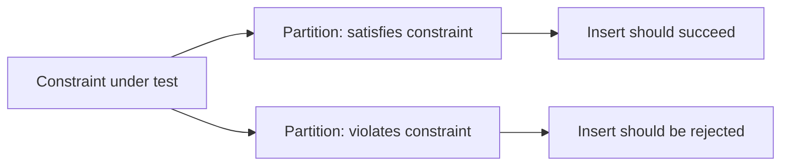

# Constraints, Keys, and Relationships

**Prerequisites**: You should already have completed [CRUD Validation](/learning-paths/database-testing/crud-validation), and be comfortable with [Boundary Value Analysis](/learning-paths/manual-testing/boundary-value-analysis) and [Equivalence Partitioning](/learning-paths/manual-testing/equivalence-partitioning) from Manual Testing.
**Leads to**: After this, you'll be ready for [Data Integrity and Consistency](/learning-paths/database-testing/data-integrity-and-consistency).

A constraint is a rule the database itself enforces — not application code that might have a bug in it, not a UI validation that might be bypassed by a direct API call, but a rule the database refuses to let any write violate, no matter what path the write came through. That's exactly why testing whether a constraint is *actually* enforced, rather than assuming it is because a design document says it should be, matters: a constraint that's declared but not actually applied gives every layer above it a false sense of safety.

## Why This Matters

**A team that assumes constraints are enforced.** AtlasBank's schema design document states that `Customers.email` has a `UNIQUE` constraint — no two customers should ever share an email address, since email is used for account recovery. QA tests the "sign up" feature's UI, which correctly shows an error when a customer tries to register with an already-used email. The feature is marked verified. Months later, a bug in a *separate* internal tool (a batch customer-import script used by the operations team) bypasses the UI entirely and writes directly to the `Customers` table — and it turns out the `UNIQUE` constraint was never actually applied in the schema, only assumed to be there because the design document said it should be. Two customers now share an email address, and account recovery for either of them sends a reset link to a shared inbox.

**A team that verifies constraints directly.** A different QA process includes one direct check: attempt to insert a row that violates the constraint, directly against the database, bypassing the UI entirely — `INSERT INTO Customers (email, ...) VALUES ('existing@atlasbank.example', ...)` for an email that already exists. If the constraint is real, this insert fails with a constraint-violation error. If it isn't, the insert silently succeeds, and the team has caught a gap no UI-level test could ever have found, since the UI's own validation was never the thing actually being tested.

The first team tested that the *UI* stops a duplicate email. The second team tested that the *database* does — and only the second team would have caught a constraint that existed on paper but not in reality.

## The Constraint Types a Tester Verifies

| Constraint | What It Guarantees | AtlasBank Example |
|---|---|---|
| **NOT NULL** | A column can never be left empty | `Accounts.account_type` can never be null — every account must have a type |
| **UNIQUE** | No two rows can share the same value in that column | `Customers.email` — no two customers share an email |
| **PRIMARY KEY** | Uniquely identifies each row; implies both NOT NULL and UNIQUE | `Accounts.account_id` |
| **FOREIGN KEY** | A value must match an existing row in another table | `Accounts.customer_id` must match a real row in `Customers` |
| **CHECK** | A column's value must satisfy a specific condition | `Transactions.amount > 0` — a transaction can't have a zero or negative amount |

Each of these is directly testable the same way this module's opening example tested `UNIQUE`: attempt a write that should violate the constraint, and confirm the database rejects it — not the UI, not the application layer, the database itself.

## Applying Boundary Value Analysis to Constraints

[Boundary Value Analysis](/learning-paths/manual-testing/boundary-value-analysis) already taught that defects cluster at boundaries — the edges of a valid range, not its comfortable middle. A constraint *is* a boundary, formally declared, which makes this technique apply directly rather than needing to be re-taught: if `Transactions.amount` has a `CHECK (amount > 0)` constraint, the boundary values to test are exactly the ones BVA already trained you to reach for — `0` (should be rejected), the smallest valid positive value just above zero (should be accepted), and a large but plausible value well within range (should be accepted) — rather than only testing one comfortable mid-range amount and calling the constraint verified.

```sql
-- Boundary test: exactly at the constraint's edge
INSERT INTO Transactions (account_id, amount, transaction_type)
VALUES (4471, 0, 'DEBIT');
-- Expected: rejected, if CHECK (amount > 0) is real
```

## Applying Equivalence Partitioning to Constraints

[Equivalence Partitioning](/learning-paths/manual-testing/equivalence-partitioning) taught grouping inputs into classes that should behave the same way, then testing one representative from each class rather than every possible value. A constraint naturally creates exactly two partitions: values that satisfy it, and values that don't. Testing a `NOT NULL` constraint on `Accounts.account_type` means one representative insert with a real value (should succeed) and one representative insert with `NULL` (should fail) — not an exhaustive sweep of every possible account type, since every valid, non-null value belongs to the same "should succeed" partition.



## Foreign Keys: Testing Both Directions

A foreign-key constraint (`Accounts.customer_id` referencing `Customers.customer_id`) needs to be tested in both directions, not just one. **Insert direction**: attempting to insert an `Accounts` row with a `customer_id` that doesn't exist in `Customers` should be rejected — this confirms the constraint prevents orphaned data from being created in the first place. **Delete direction**: attempting to delete a `Customers` row that still has related `Accounts` rows should behave according to whatever the schema declares — reject the delete (`RESTRICT`), delete the related accounts too (`CASCADE`), or set the reference to empty (`SET NULL`) — and a tester's job, per [Relational Database Fundamentals](/learning-paths/database-testing/relational-database-fundamentals), is to confirm it does whichever one it claims to, not assume.

## How This Works on a Real Project

AtlasBank is adding a `Beneficiaries.ifsc_code` column (the bank-branch identifier required for domestic transfers), with a design document specifying it as `NOT NULL` and constrained to an 11-character format. UI-level testing confirms the "add beneficiary" form rejects a blank or malformed IFSC code with a friendly error message.

A tester applying this module's framework goes further, testing the constraint directly at the database, bypassing the UI's own validation entirely — because the whole point of a database-level constraint is that it should hold even if a bypass exists somewhere the UI doesn't cover. Two direct inserts: one with `ifsc_code = NULL` (equivalence partition: violates NOT NULL) and one with a valid 11-character code (equivalence partition: satisfies both constraints). The first is correctly rejected. But a boundary-value insert with a 12-character string — one character over the intended format — succeeds, revealing that the `NOT NULL` constraint is real, but the length/format restriction the design document specified was never actually implemented as a database-level `CHECK` constraint at all — only as UI-side validation, which a bulk-import tool (the same kind of bypass this module's opening scenario described) would completely skip.

## Common Mistakes

**Mistake 1: Trusting a design document's stated constraints instead of verifying them directly against the database.**
As this module's opening scenario and its AtlasBank example both show, a constraint that's documented isn't necessarily implemented — only a direct insert attempt confirms the difference.

**Mistake 2: Testing a constraint only through the UI, never bypassing it to hit the database directly.**
A UI-level validation and a database-level constraint are two different things enforced in two different places — testing only the UI never confirms the database itself would reject the same bad data through a different path.

**Mistake 3: Testing only one "obviously invalid" value instead of the actual boundary.**
Testing a `CHECK (amount > 0)` constraint with `-100` alone would miss that `0` — the actual boundary value BVA would flag — might slip through a constraint that was implemented as `>= 0` by mistake instead of `> 0`.

**Mistake 4: Testing a foreign key's insert direction but not its delete direction, or vice versa.**
Both directions can fail independently — a foreign key that correctly prevents an invalid insert can still have undefined or wrong behavior on delete, and each needs its own explicit test.

## Best Practices

**Practice 1: Test every documented constraint with a direct database write, not just through the UI.**
This is the single practice that would have caught both this module's opening defect and its AtlasBank example's IFSC-length gap — the UI passing tells you nothing about whether the database itself enforces the rule.

**Practice 2: Apply Boundary Value Analysis to every numeric or length-based constraint.**
A `CHECK`, `NOT NULL`, or length restriction is a formally declared boundary — test exactly at its edge, not just comfortably inside or outside the valid range.

**Practice 3: Apply Equivalence Partitioning to identify the minimum representative tests needed.**
One valid-partition insert and one invalid-partition insert per constraint is usually sufficient — exhaustively testing every possible valid value adds test volume without adding real coverage.

**Practice 4: Test both directions of every foreign-key constraint — insert and delete.**
Treat them as two separate test cases, since one can pass while the other silently fails.

:::note From the Field
An online marketplace's `Orders` table had a documented `CHECK (quantity > 0)` constraint intended to prevent zero-quantity order line items. During a schema migration, the constraint was accidentally dropped and never re-added — nobody noticed, because every UI path into order creation already prevented a zero-quantity submission at the application layer, so the missing database constraint had no visible effect for months. A third-party integration partner, calling the orders API directly with a malformed payload, eventually submitted a zero-quantity order that the database silently accepted, corrupting downstream inventory-reconciliation reports that assumed the constraint's guarantee still held.
:::

:::tip Senior QA Insight
A newer tester verifies a constraint by confirming the UI shows the right validation error. A senior tester verifies the same constraint by also attempting to violate it directly against the database — because the UI's validation and the database's constraint are two independent things, and only one of them is guaranteed to hold against every possible path into the data, including ones the UI was never built to cover.
:::

## Mini Challenge

**Scenario**: AtlasBank's `Loans` table has a documented `CHECK (interest_rate BETWEEN 0 AND 100)` constraint — interest rates are stored as a percentage and should never be negative or absurdly high.

**Your task**: Using Boundary Value Analysis, list the specific values you'd attempt to insert to fully test this constraint's boundaries, and state what result (accepted or rejected) you'd expect for each.

## Key Takeaways

- A constraint is enforced by the database itself, independent of any application or UI validation — testing only the UI never confirms the database-level guarantee actually exists.
- Boundary Value Analysis and Equivalence Partitioning apply directly to constraints — a constraint is a formally declared boundary, and its valid/invalid values are exactly the two partitions those techniques already trained you to test.
- Foreign-key constraints need to be tested in both directions — insert (does it prevent an invalid reference) and delete (does it handle related rows as designed).
- A documented constraint is a claim, not a guarantee — only a direct database write confirms whether it's actually implemented.

---

## What You Just Learned

- The core constraint types (NOT NULL, UNIQUE, PRIMARY KEY, FOREIGN KEY, CHECK) and what each guarantees
- How Boundary Value Analysis and Equivalence Partitioning apply directly to constraint testing, without needing to be re-taught
- Why a foreign key needs testing in both the insert and delete direction
- How AtlasBank's QA team found a real, undocumented gap between a stated constraint and its actual database implementation

**Next:** [Data Integrity and Consistency](/learning-paths/database-testing/data-integrity-and-consistency)

## Related Topics

- [Boundary Value Analysis](/learning-paths/manual-testing/boundary-value-analysis) — The technique this module applies directly to constraint boundaries, not re-taught
- [Equivalence Partitioning](/learning-paths/manual-testing/equivalence-partitioning) — The technique this module applies to constraint valid/invalid partitions
- [Relational Database Fundamentals](/learning-paths/database-testing/relational-database-fundamentals) — The foreign-key vocabulary this module's both-directions testing builds on

## Interview Questions

**Q1: Why would you test a constraint directly against the database instead of only through the application's UI?**

*What to look for*: A clear statement that the UI's validation and the database's constraint are two independent mechanisms — a UI can correctly block bad data while the underlying constraint is missing or misconfigured, invisible until something (a bulk import, a direct API call, a different client) bypasses the UI.

:::note Common Interview Mistake
Many candidates answer that testing the UI is sufficient "because that's how users interact with the system." That's incomplete — a strong answer names a specific bypass path (a batch job, an internal tool, a third-party integration) that skips the UI entirely, and explains that only a direct database-level test confirms the constraint holds regardless of entry point.
:::

**Q2: How would you apply Boundary Value Analysis to a numeric database constraint?**

*What to look for*: A concrete answer identifying the exact boundary values (the limit itself, one step inside, one step outside) rather than a vague "test some valid and invalid numbers" — showing the technique transfers with the same precision it had in Manual Testing.

---

## Glossary

**Constraint**: A rule enforced by the database itself on what data a column or table can contain, independent of any application-layer validation.

**CHECK Constraint**: A constraint requiring a column's value to satisfy a specific condition (e.g., `amount > 0`).

**Equivalence Partition**: A group of input values expected to be treated the same way by the system under test — a constraint's valid values form one partition, its invalid values form another.

## Quick Revision

Remember these five points:

✓ A constraint is enforced by the database itself — testing only the UI never confirms it's actually implemented.

✓ NOT NULL, UNIQUE, PRIMARY KEY, FOREIGN KEY, and CHECK are the core constraint types a tester verifies.

✓ Boundary Value Analysis applies directly to numeric/length constraints — test at the exact edge, not just comfortably inside or outside it.

✓ Equivalence Partitioning applies directly to constraints — one valid-partition test and one invalid-partition test per constraint is usually sufficient.

✓ Foreign keys need testing in both directions: insert (prevents invalid references) and delete (handles related rows as designed).
