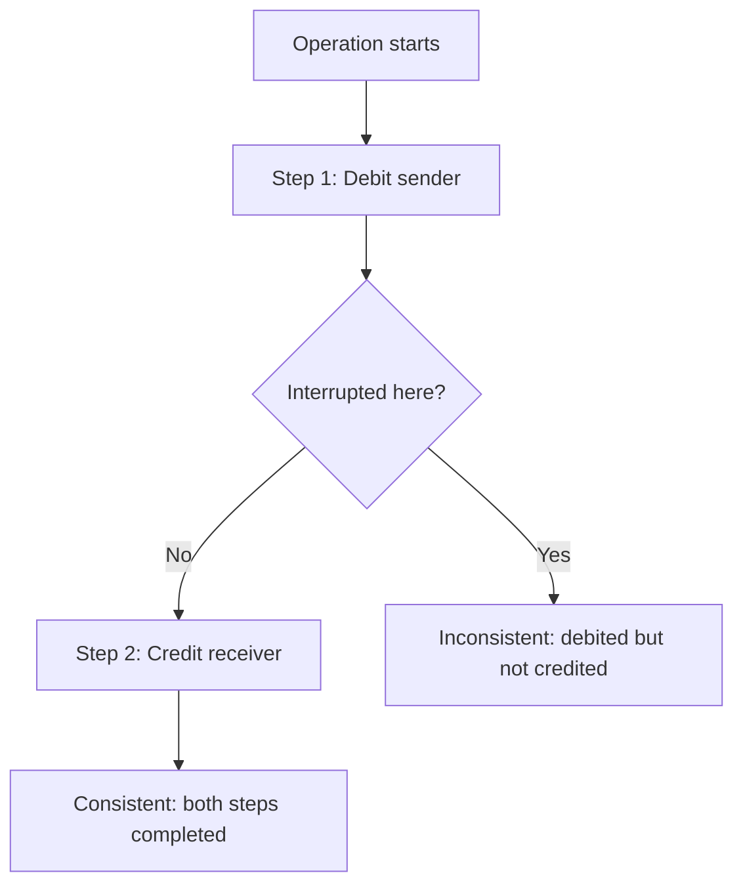

# Data Integrity and Consistency

**Prerequisites**: You should already have completed [Constraints, Keys, and Relationships](/learning-paths/database-testing/constraints-keys-and-relationships).
**Leads to**: After this, you'll be ready for [Section 2 Review](/learning-paths/database-testing/section-2-review), then Section 3 — Advanced Database Testing.

Sections 1 and 2 so far have tested one table, or one relationship between two tables, at a time. Real features are rarely that simple — a single fund transfer writes to at least two rows (debit one account, credit another), and if the operation fails after the first write but before the second, the database is left in a state where each individual row still satisfies every constraint from the previous module, and yet the data, taken together, is wrong. This module is about that gap: correctness that only shows up when you look across an entire operation, not at any single row in isolation.

## Why This Matters

**A team that checks rows in isolation.** AtlasBank tests a fund-transfer feature by checking each affected row separately: the sender's `Accounts` row correctly shows a decreased balance (passes), the receiver's `Accounts` row correctly shows an increased balance (passes), and a new `Transactions` row exists with the right amount (passes). Every individual check is green. What nobody checked: whether the amount debited from the sender and the amount credited to the receiver are actually the *same* amount — and in a specific failure case (the transfer process crashing between the debit write and the credit write, then a partial-recovery script running), the sender was correctly debited $500, but the receiver was credited only $498, with $2 simply gone. Every row involved individually "looks correct" — a valid balance, a valid transaction record — and the inconsistency only exists in the relationship *between* them.

**A team that checks consistency across the operation.** A different test explicitly verifies the invariant the feature is supposed to preserve, not just each row's individual validity: `SELECT SUM(amount) FROM Transactions WHERE reference_id = 'TXN-4471'` should equal exactly twice the transfer amount (one debit entry, one credit entry, equal and opposite), and a direct comparison confirms the sender's debit and the receiver's credit match to the cent. The same crash-during-partial-recovery scenario is caught immediately — the sums don't match, even though every individual row still passes every constraint from the previous module.

Both teams tested "the fund transfer." Only one of them tested what a fund transfer actually *promises*: that money isn't created or destroyed in the process — a promise no single row's own correctness can verify on its own.

## What "Correct" Means Across a Multi-Row Operation

**Data integrity** is the property that data remains accurate and uncorrupted, both individually (a single row obeys its constraints) and collectively (related rows agree with each other in the ways they're supposed to). **Consistency** — in the everyday testing sense used throughout this module, not the formal database-theory term — is the specific claim that after a multi-step operation, the data reflects a single, coherent version of events, not a partially-applied one where some steps happened and others didn't.

| Check Level | What It Confirms | What It Misses |
|---|---|---|
| **Single-row validity** (Section 2 so far) | This one row satisfies its own constraints | Whether this row's value agrees with a related row it's supposed to match |
| **Cross-row consistency** (this module) | Related rows agree with each other the way the operation promises | Nothing at this level alone — this is the check the opening scenario's gap needed |

## Testing for Partial-Failure Inconsistency

The opening scenario's defect only appears under a specific condition: the operation is interrupted *between* its steps, not before or after all of them. This is the same principle [What is Database Testing?](/learning-paths/database-testing/what-is-database-testing) raised about interruption and retry — data-integrity defects concentrate at exactly the moments an operation doesn't complete cleanly, and a test suite that only exercises clean, uninterrupted runs will systematically miss them.



A tester deliberately targets this window: interrupt the operation (in a test environment) between its first and second write, then query both affected rows directly and check whether the invariant the operation promises — equal debit and credit, matching totals, whatever the specific operation claims — actually holds. This is a different test case from anything Section 2 covered so far, because no single row's constraint check can catch it; it requires comparing two (or more) rows against each other.

## UI Bug vs. Data Bug: A Distinction Worth Making Explicit

A UI showing a wrong number and the underlying data being wrong are two different defects, and confusing them sends a bug report to the wrong place. A **UI bug** means the stored data is correct, but something in how it's retrieved, cached, or displayed shows the wrong value — fixable by changing the interface layer, with the data itself needing no repair. A **data bug** means the stored data itself is wrong — no interface fix resolves it, because every interface reading that row will keep reporting the same wrong value until the row itself is corrected.

```sql
-- The diagnostic query: does the data agree with what the UI shows?
SELECT balance FROM Accounts WHERE account_id = 4471;
```

If this returns a different value than the UI displays, it's a UI bug (stale cache, wrong query scope in the display layer). If it returns the *same* wrong value the UI shows, it's a data bug — and the fix, and the remediation (correcting affected rows, not just the code), are both a different, larger conversation than a UI-layer fix would be.

## How This Works on a Real Project

AtlasBank's QA team is testing a "split bill" feature — one customer initiates a payment split three ways among linked accounts, deducting one-third of a shared expense from each. A UI-only test confirms all three accounts show a decreased balance and a shared expense record shows as "settled."

Applying this module's framework, a tester adds a cross-row consistency check: does the sum of the three deductions exactly equal the original shared expense amount? On a bill that doesn't divide evenly by three (e.g., $100 split three ways), a rounding defect surfaces — each account was debited $33.33, totaling $99.99, with one cent simply unaccounted for anywhere in the system. Every individual row passes its own constraints (a valid balance, a valid transaction amount); the defect only exists in the relationship between the three transactions and the original expense total.

The team also tests the partial-failure window this module described: interrupting the split after two of the three deductions have written but before the third. The `Transactions` table correctly shows two completed debits and the operation correctly halts — but the shared-expense record was already marked "settled" before the third deduction ran, meaning the UI shows the bill as fully resolved while one account was never actually charged its share. This is caught by comparing `SUM(amount)` across the three related `Transactions` rows against the expense record's total, the exact pattern this module's opening example used for a two-row transfer, now applied to a three-row split.

## Common Mistakes

**Mistake 1: Verifying each row's individual correctness and treating that as verifying the operation.**
As this module's opening scenario and its AtlasBank example both show, every row can independently satisfy its own constraints while the operation, taken as a whole, is still wrong.

**Mistake 2: Only testing multi-step operations under clean, uninterrupted conditions.**
Consistency defects concentrate specifically in the window between steps — a test suite that never interrupts an operation there will systematically miss this entire defect class.

**Mistake 3: Sending a UI-reported wrong value straight to a data-correction process without first confirming it's actually a data bug.**
Comparing the UI's value against a direct query is the fast, cheap check that prevents wasted effort correcting data that was never actually wrong — the bug might be in the display layer instead.

**Mistake 4: Not defining, before testing, what invariant a multi-row operation is actually supposed to preserve.**
Without a clear statement (debit equals credit; the sum of splits equals the total), there's no concrete check to run — this has to be identified explicitly, the same way a requirement is read before writing any other test case.

## Best Practices

**Practice 1: For any multi-row operation, identify the specific invariant it promises before writing a single test case.**
"Debit equals credit" or "the sum of parts equals the whole" — name it explicitly, the way both worked examples in this module did, before deciding what to query.

**Practice 2: Deliberately interrupt multi-step operations between their steps, not just at the start or end.**
This is the specific window where cross-row consistency defects concentrate, and it needs to be tested on purpose — it won't appear in a clean run.

**Practice 3: Diagnose UI bug vs. data bug with one comparison query before escalating either direction.**
A single direct query against the same row the UI is displaying tells you immediately which category the defect falls into, and which team or fix path it actually needs.

**Practice 4: Treat "each row passed its constraints" as necessary, not sufficient.**
Section 2's constraint testing and this module's consistency testing are both required — one doesn't substitute for the other, since they catch genuinely different defect classes.

:::note From the Field
A gift-card platform's "combine balances" feature let a customer merge two gift cards into one. Each individual write passed every constraint — the surviving card's balance updated to a valid, non-negative value, and the merged card was correctly marked inactive. What wasn't checked: whether the surviving card's new balance actually equaled the sum of both original balances. A currency-rounding defect in the combination logic silently lost a few cents on a small fraction of merges — invisible to any single-row check, since the resulting balance was still a perfectly valid number, just not the *correct* one relative to the two balances it was supposed to sum.
:::

:::tip Senior QA Insight
A newer tester considers a multi-step operation tested once every individual row involved passes its own checks. A senior tester asks a different question first — what invariant is this operation actually supposed to preserve across all the rows it touches — and designs at least one test case specifically to verify that relationship, not just each row on its own.
:::

## Mini Challenge

**Scenario**: AtlasBank's "loan disbursement" feature deposits an approved loan amount into a customer's account and simultaneously creates a `Loans` record showing the outstanding balance owed.

**Your task**: State the specific invariant this operation should preserve between the `Accounts` deposit and the `Loans` record, and write the query (or describe it in plain language) you'd use to verify that invariant holds — including what you'd check if the operation were interrupted between the two writes.

## Key Takeaways

- Data integrity includes both single-row validity (Section 2's constraint testing) and cross-row consistency (this module) — they catch genuinely different defect classes, and neither substitutes for the other.
- Consistency defects concentrate in the window between steps of a multi-step operation, and only appear when that window is deliberately tested, not on a clean run.
- A UI bug (wrong display, correct data) and a data bug (wrong data itself) are diagnosed with one direct comparison query — confusing the two sends a defect to the wrong fix path.
- Before testing any multi-row operation, name the specific invariant it's supposed to preserve — there's no concrete check to run without one.

---

## What You Just Learned

- The difference between single-row validity and cross-row consistency, and why both are needed
- How to deliberately test the interruption window where multi-step operations most often produce inconsistent data
- How to diagnose whether a wrong-looking value is a UI bug or a genuine data bug with one comparison query
- How AtlasBank's QA team caught a rounding-based consistency defect and a partial-failure "settled" flag defect in a three-way bill split

**Next:** [Section 2 Review](/learning-paths/database-testing/section-2-review)

## Related Topics

- [Constraints, Keys, and Relationships](/learning-paths/database-testing/constraints-keys-and-relationships) — Single-row validity, the check this module's cross-row consistency testing builds on top of
- [What is Database Testing?](/learning-paths/database-testing/what-is-database-testing) — The interruption/retry principle this module applies specifically to multi-step operations
- Transactions, Locks, and Concurrency (Section 3, coming next) — The deeper mechanism (ACID, isolation) behind why partial failures happen, and how well-designed systems prevent them

## Interview Questions

**Q1: How can every individual row in a multi-table operation pass its own validation, while the operation as a whole is still wrong?**

*What to look for*: A concrete example (like this module's fund-transfer or bill-split scenario) showing that single-row constraints (a valid balance, a valid amount) say nothing about whether related rows agree with each other the way the operation promises they should.

:::note Common Interview Mistake
Many candidates answer that this situation "shouldn't happen if the constraints are set up correctly," without recognizing that constraints validate individual rows, not relationships across multiple rows and multiple write operations. A strong answer explains that cross-row consistency requires its own explicit test, separate from constraint testing, because no single-row constraint can express "these two amounts must match."
:::

**Q2: How would you determine whether a wrong value a customer reports is a UI bug or a data bug?**

*What to look for*: A specific, concrete method — querying the underlying data directly and comparing it to what the UI shows. If they match, it's a data bug; if they don't, it's a UI/caching bug — not a vague "I'd investigate further" with no actual diagnostic step named.

---

## Glossary

**Data Integrity**: The property that data remains accurate and uncorrupted, both at the level of individual rows and in how related rows agree with each other.

**Consistency** (testing sense): The property that after a multi-step operation, the data reflects a single, coherent outcome rather than a partially-applied one.

**Invariant**: A relationship between values that an operation is supposed to preserve no matter what (e.g., debit amount equals credit amount).

**UI Bug**: A defect where the stored data is correct but something in retrieval, caching, or display shows the wrong value.

**Data Bug**: A defect where the stored data itself is incorrect, independent of how any interface displays it.

## Quick Revision

Remember these five points:

✓ Single-row validity (constraints) and cross-row consistency are different checks — neither substitutes for the other.
✓ Consistency defects concentrate in the interruption window between steps of a multi-step operation.
✓ Name the specific invariant a multi-row operation should preserve before designing a test case for it.
✓ Diagnose UI bug vs. data bug with one direct query comparing stored data to what the interface displays.
✓ Deliberately interrupting multi-step operations in test environments is how partial-failure consistency defects get found before release.
