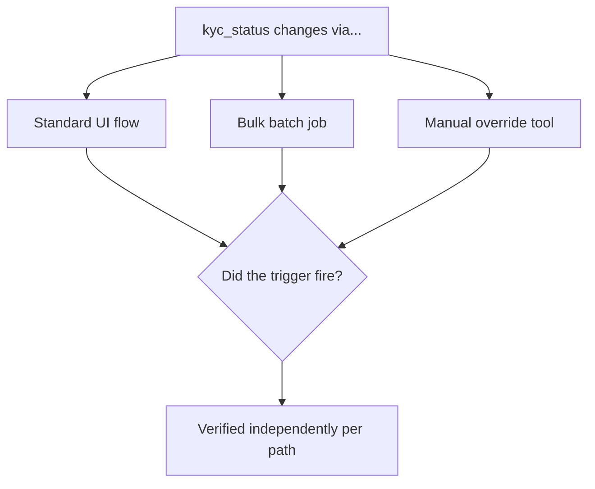

# Stored Procedures, Views, and Triggers

**Prerequisites**: You should already have completed [Data Integrity and Consistency](/learning-paths/database-testing/data-integrity-and-consistency) and Section 2 in full.
**Leads to**: After this, you'll be ready for [Transactions, Locks, and Concurrency](/learning-paths/database-testing/transactions-locks-and-concurrency).

So far, this path has treated "the application" as the only thing writing to the database — a feature's own code runs an `INSERT`, an `UPDATE`, a `DELETE`, and this path's earlier modules test the result. But a real system often has logic living *inside* the database itself: a stored procedure the application calls instead of writing raw SQL, a view that presents a simplified or filtered version of underlying tables, a trigger that fires automatically whenever a specific write happens, with no application code invoking it directly at all. This module is about testing that logic — which needs a genuinely different approach, because it doesn't run when the tester tells it to. It runs when the database decides to run it.

## Why This Matters

**A team that doesn't test trigger coverage.** AtlasBank has a trigger on the `Customers` table: whenever `kyc_status` changes, it automatically writes a row to `Audit Logs`, satisfying a compliance requirement that every KYC status change be traceable. QA tests this by changing a customer's KYC status through the standard "verify customer" UI flow and confirming an audit log entry appears. It does, so the trigger is marked verified. Months later, a compliance audit discovers a gap: a separate, newer bulk "re-verify inactive customers" batch job updates `kyc_status` directly via a different code path — one that, as it turns out, updates the column through a bulk `UPDATE` statement the trigger was never actually configured to fire on (a database-specific limitation the team didn't know applied to their trigger's `AFTER UPDATE` scope). Thousands of KYC status changes over several months have no audit trail at all.

**A team that tests trigger coverage explicitly.** A different QA process treats "does this trigger fire" as a testable claim independent of any single UI flow — the team identifies every distinct code path that can change `kyc_status` (the verify-customer UI, the bulk re-verify job, a support-agent manual override tool, a data-migration script) and tests the trigger against each one directly, by making the change and then querying `Audit Logs` for a matching entry. The bulk job's gap is caught immediately, before the compliance audit ever needs to find it.

Both teams tested "the audit trigger." Only one of them tested it against every way the triggering condition can actually occur — not just the one path a UI-focused test naturally reaches first.

## Stored Procedures: Testing a Black Box With Real Inputs and Outputs

A **stored procedure** is a piece of logic saved and run inside the database itself — the application calls it by name (often with parameters) instead of sending raw SQL, and the procedure runs a defined sequence of operations. From a tester's perspective, a stored procedure is tested the way any function is: call it with a range of inputs (including boundary and invalid ones, per [Constraints, Keys, and Relationships](/learning-paths/database-testing/constraints-keys-and-relationships)'s BVA/Equivalence Partitioning reuse), and verify both its direct output *and* any side effects it produces — a procedure that calculates and applies monthly interest, for instance, needs its calculated amount checked, but also needs the `Accounts` and `Transactions` rows it wrote checked, the same as any other multi-row operation from [Data Integrity and Consistency](/learning-paths/database-testing/data-integrity-and-consistency).

```sql
-- Calling a stored procedure directly to test it in isolation
CALL apply_monthly_interest(account_id => 4471);

-- Then verifying its side effects the same way any multi-row write is verified
SELECT balance FROM Accounts WHERE account_id = 4471;
SELECT * FROM Transactions WHERE account_id = 4471 AND transaction_type = 'INTEREST_CREDIT'
ORDER BY created_at DESC LIMIT 1;
```

## Views: Testing That a Projection Stays Accurate

A **view** is a saved query that behaves like a virtual table — it doesn't store data itself, it presents a live, computed result from underlying tables every time it's queried. AtlasBank might have a `CustomerAccountSummary` view joining `Customers` and `Accounts` to present a simplified read-only summary for a customer-service tool. Testing a view means confirming two things: that it accurately reflects the *current* state of its underlying tables (a view is only as fresh as the query behind it — if it's genuinely live, it should reflect a change the instant the underlying data changes, with no separate refresh step), and that it doesn't expose data it's specifically designed to restrict — a view built to exclude a sensitive column (like a full account number) needs an explicit test confirming that column genuinely isn't queryable through the view, not just absent from the one query someone happened to try.

```sql
-- Confirm a view reflects an underlying change immediately
UPDATE Accounts SET balance = 5000 WHERE account_id = 4471;
SELECT balance FROM CustomerAccountSummary WHERE account_id = 4471;
-- Expected: 5000, with no separate refresh step needed
```

## Triggers: Testing Every Path That Can Fire Them, Not Just One

A **trigger** is logic that runs automatically whenever a specified event happens to a table — an `INSERT`, `UPDATE`, or `DELETE` — without any application code calling it directly. This is exactly what makes triggers a distinct testing challenge from procedures and views: a trigger's correctness isn't just "does it produce the right result," it's "does it actually fire under every condition it's supposed to," and as this module's opening scenario shows, different write paths (a single-row UI update versus a bulk batch update) can behave differently against the same trigger, depending on the trigger's exact configuration and the database engine's own rules about when triggers fire on bulk operations.



| Object | What It Is | What a Tester Verifies |
|---|---|---|
| **Stored Procedure** | Saved logic called explicitly by name | Output correctness across boundary/invalid inputs, plus every side effect it produces |
| **View** | A live, virtual table computed from a query | Accuracy against current underlying data, and that restricted columns are genuinely inaccessible |
| **Trigger** | Logic that fires automatically on a table event | Whether it actually fires on *every* distinct path that can produce the triggering event, not just the most obvious one |

## How This Works on a Real Project

AtlasBank is adding a trigger on the `Transactions` table: any transaction over $50,000 should automatically flag the associated account for manual compliance review by inserting a row into a `ComplianceFlags` table. The initial test plan verifies this through the standard "fund transfer" UI flow — submit a $60,000 transfer, confirm a `ComplianceFlags` row appears.

Applying this module's framework, a tester maps every distinct path that can insert a `Transactions` row above the threshold: the standard transfer UI, a scheduled/recurring payment executing automatically, an admin tool that manually adjusts a balance (via a direct `Transactions` insert, bypassing the normal transfer logic entirely), and a batch interest-credit job for very large accounts. Each is tested independently, the same way the opening scenario's audit trigger needed testing across every KYC-change path.

The admin balance-adjustment tool is where a real gap surfaces: it writes directly to `Transactions` using a different insert pattern than the standard transfer flow, and the trigger — written and tested only against the standard flow's exact insert shape — doesn't fire on it. A support agent using that tool to correct a large balance discrepancy could silently bypass compliance review entirely, a gap no single-path test would ever have revealed.

## Common Mistakes

**Mistake 1: Testing a trigger against only one write path and assuming it covers every path.**
As both this module's opening scenario and its AtlasBank example show, a trigger's behavior can genuinely differ across write paths — each one needs its own explicit test.

**Mistake 2: Testing a view's current output without confirming it stays live against underlying changes.**
A view that was correct at some point in the past isn't automatically still correct — testing it right after an underlying data change is what actually confirms it's genuinely live, not cached or stale.

**Mistake 3: Testing a stored procedure's direct output but not its side effects.**
A procedure that returns the "correct" calculated value can still write incorrect or incomplete data as a side effect — both need independent verification, the same multi-row consistency discipline from [Data Integrity and Consistency](/learning-paths/database-testing/data-integrity-and-consistency).

**Mistake 4: Assuming a view's restricted columns are safe because the one query tried didn't return them.**
A column genuinely needs to be excluded from the view's underlying definition, not just absent from a specific `SELECT *` — a differently-written query against the same view could still expose it if the restriction isn't structural.

## Best Practices

**Practice 1: Map every distinct code path that can trigger a database-level event before testing a trigger.**
This is the single practice both worked examples in this module hinge on — a trigger's coverage has to be verified per path, not assumed uniform.

**Practice 2: Test a view immediately after changing its underlying data, not just once at setup.**
This is what actually confirms "live" behavior, as opposed to a value that happened to be correct once and was never re-checked.

**Practice 3: Treat a stored procedure's side effects as first-class test targets, not an afterthought to its return value.**
Apply the same "verify every affected row" discipline this path has used since [CRUD Validation](/learning-paths/database-testing/crud-validation).

**Practice 4: Test bulk/batch write paths against triggers explicitly, not just single-row UI flows.**
Bulk operations are disproportionately likely to interact differently with trigger configuration than the single-row path a team naturally tests first — this module's opening scenario and worked example both hinge on exactly this gap.

:::note From the Field
A healthcare scheduling system had a trigger intended to send a notification whenever an appointment's status changed to "cancelled," tested and verified through the primary patient-facing cancellation flow. A separate internal tool used by front-desk staff to cancel appointments on a patient's behalf updated the same `status` column, but through a stored procedure that performed the update inside a transaction block with a database-specific setting that suppressed trigger execution during that specific transaction type — a setting nobody testing the primary flow had any reason to know existed. Front-desk-cancelled appointments silently never triggered a notification, discovered only when patients started showing up for appointments they'd been told, verbally, were cancelled, with no confirmation ever sent.
:::

:::tip Senior QA Insight
A newer tester verifies a trigger by triggering it once, through whichever path is easiest to test, and confirming the expected side effect happened. A senior tester starts by asking how many *different* ways the triggering condition can occur in the real system, and tests the trigger against each one independently — because a trigger's implementation can be sensitive to exactly how the triggering write was performed, in ways a single successful test will never reveal.
:::

## Mini Challenge

**Scenario**: AtlasBank has a view, `ActiveLoanSummary`, that's supposed to show only loans with a status of `ACTIVE`, joining `Loans` and `Customers` for a collections team's dashboard. It's also supposed to exclude any loan belonging to a customer flagged `kyc_status = 'UNDER_REVIEW'`.

**Your task**: List the specific tests you'd run to verify this view — including at least one test that confirms it stays live against an underlying change, and one that confirms the KYC-based restriction can't be bypassed by a differently-shaped query.

## Key Takeaways

- Stored procedures, views, and triggers are business logic living inside the database itself, and each needs a distinct testing approach — not the same technique applied to all three.
- A stored procedure needs both its direct output and its side effects verified independently.
- A view needs to be tested for liveness (does it reflect a just-made underlying change) and for structural, not just observed, restriction of sensitive columns.
- A trigger's correctness depends on testing every distinct write path that can produce its triggering condition — a trigger that fires correctly on one path is not guaranteed to fire on another.

---

## What You Just Learned

- How to test a stored procedure's output and side effects together, the same multi-row discipline used throughout this path
- How to verify a view stays accurate against live underlying changes, and that restricted data is structurally, not just apparently, excluded
- Why a trigger needs independent testing across every distinct code path that can produce its triggering condition
- How AtlasBank's QA team found a real compliance-flag trigger gap in an admin tool that bypassed the standard transfer flow entirely

**Next:** [Transactions, Locks, and Concurrency](/learning-paths/database-testing/transactions-locks-and-concurrency)

## Related Topics

- [CRUD Validation](/learning-paths/database-testing/crud-validation) — The side-effect verification discipline this module applies to stored procedures
- [Data Integrity and Consistency](/learning-paths/database-testing/data-integrity-and-consistency) — The multi-row consistency checking this module's procedure-testing section builds on
- [Constraints, Keys, and Relationships](/learning-paths/database-testing/constraints-keys-and-relationships) — The boundary/equivalence-based input testing this module applies to stored procedure parameters

## Interview Questions

**Q1: Why might a trigger that works correctly in one part of a system fail to fire in another part?**

*What to look for*: Recognition that different write paths (a UI-driven single-row update, a bulk batch job, a direct admin tool) can interact differently with a trigger's exact configuration — not an assumption that a trigger, once verified, behaves identically everywhere.

:::note Common Interview Mistake
Many candidates answer that a trigger either "works" or "doesn't work," without recognizing that trigger behavior can be path-dependent — that a bulk operation, for instance, might not fire a trigger configured only for row-by-row updates. A strong answer names a specific mechanism (bulk operations, transaction-level settings, a different insert pattern) that can cause this divergence.
:::

**Q2: How would you test whether a database view correctly restricts a sensitive column?**

*What to look for*: An answer describing an attempt to actually query the view for the restricted column directly, confirming it structurally isn't present in the view's definition — not just observing that one particular query didn't happen to return it.

---

## Glossary

**Stored Procedure**: Saved logic that runs inside the database, called by the application via name and parameters instead of raw SQL.

**View**: A saved query that behaves like a virtual, live table, computed from underlying tables at query time.

**Trigger**: Logic that runs automatically whenever a specified event (insert, update, delete) happens to a table, without any application code invoking it directly.

## Quick Revision

Remember these five points:

✓ Stored procedures need both their output and their side effects verified — the same multi-row discipline as any other write.

✓ Views need to be tested for liveness against underlying changes, not just checked once at setup.

✓ A view's restricted columns need structural verification, not just absence from one observed query.

✓ A trigger's firing behavior can differ across write paths — test every distinct path, not just the easiest one.

✓ Bulk/batch operations are a common, disproportionate source of trigger-coverage gaps compared to single-row UI flows.
