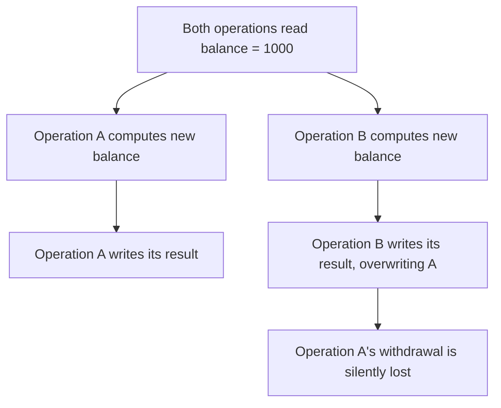

# Transactions, Locks, and Concurrency

**Prerequisites**: You should already have completed [Stored Procedures, Views, and Triggers](/learning-paths/database-testing/stored-procedures-views-and-triggers).
**Leads to**: After this, you'll be ready for [Database Defect Investigation](/learning-paths/database-testing/database-defect-investigation).

Every defect this path has examined so far has involved one operation at a time — a single Create, a single Update, one interrupted multi-step process. Real systems rarely have that luxury: two customers can attempt to spend from the same joint account within the same second, two support agents can edit the same customer record simultaneously, a scheduled batch job can run while a customer is actively using the feature it's updating. This module is about what happens when two operations touch the same data at nearly the same time — and why a defect that never appears when you test one operation at a time can appear reliably the moment two operations genuinely overlap.

## Why This Matters

**A team that tests one operation at a time.** AtlasBank's QA team tests a joint account's withdrawal feature thoroughly — one customer withdraws, the balance decreases correctly, every test passes. What the test plan never exercised: what happens when *both* account holders on a joint account submit a withdrawal within the same fraction of a second. In production, this happens on a real joint account with a $1,000 balance — both holders each withdraw $800 nearly simultaneously. Each request independently reads the balance as $1,000 before either writes anything, and each independently confirms "sufficient funds" and proceeds. Both withdrawals succeed. The account is now at -$600, a state no single test ever exercised because no single test ever ran two operations against the same row at the same time.

**A team that tests concurrent access deliberately.** A different QA process includes a specific test class this module formalizes: deliberately trigger two operations against the same row at nearly the same time, in a test environment, and verify the result respects the business rule that should have prevented it. Testing the same joint-account scenario this way — two simultaneous $800 withdrawals against a $1,000 balance — immediately reveals the defect: both succeed, when at most one should have, because nothing in the withdrawal logic actually prevented two reads from both seeing the same "before" balance before either write happened.

Both teams tested "the withdrawal feature" thoroughly by every measure a single-operation test can apply. Only one of them tested what happens when the feature runs twice, at once, against the same data — which is exactly where this specific defect class lives and nowhere else.

## Transactions: The Unit That Succeeds or Fails Together

A **transaction** is a group of database operations treated as a single, indivisible unit — either every operation in it completes, or none of them do. [Data Integrity and Consistency](/learning-paths/database-testing/data-integrity-and-consistency)'s fund-transfer example (debit one account, credit another) is exactly what a transaction is designed to prevent from going wrong: wrapped in a proper transaction, an interruption between the debit and the credit causes the *entire* transaction to roll back, leaving neither write applied, rather than leaving the debit applied and the credit missing. A tester's job isn't to implement this — it's to verify a feature that *should* be transactional actually behaves as one under interruption, which is precisely the partial-failure testing this path has practiced since [What is Database Testing?](/learning-paths/database-testing/what-is-database-testing).

## ACID, at a Tester's Depth

**ACID** is the set of four properties a properly-implemented transaction is supposed to guarantee. A tester doesn't need to implement any of these — the database engine does — but recognizing what a *violation* of each looks like is directly, practically useful, because it tells you what kind of bug report you're looking at and what kind of test would have caught it.

| Property | What It Guarantees | What a Violation Looks Like to a Tester |
|---|---|---|
| **Atomicity** | All operations in a transaction succeed, or none do | A partial write after an interruption — exactly [Data Integrity and Consistency](/learning-paths/database-testing/data-integrity-and-consistency)'s debit-without-credit scenario |
| **Consistency** | A transaction only moves the database from one valid state to another | A completed transaction that leaves a constraint or invariant violated (a negative balance, an orphaned reference) |
| **Isolation** | Concurrent transactions don't interfere with each other's intermediate state | This module's opening scenario — two withdrawals both reading the same "before" balance |
| **Durability** | Once a transaction is confirmed complete, it survives a subsequent crash | A confirmed transaction that's silently missing after a system restart or failure |

Isolation is the property this module's opening scenario and most of its content concentrate on, because it's the one that only ever manifests under genuine concurrency — Atomicity and Consistency violations can often be found with a single-operation interruption test (as earlier modules already do); Isolation violations structurally require two operations actually overlapping.

## Recognizing Concurrency Defect Patterns

**Lost update**: two operations both read the same value, both compute a new value based on that read, and the second write silently overwrites the first — exactly this module's opening scenario, and the most common concurrency defect a tester encounters in practice.



**Dirty read**: an operation reads a value another transaction wrote but hasn't yet confirmed (committed) — and that other transaction then rolls back, meaning the value read was never actually real. A tester recognizes this pattern as "a value was briefly visible that turned out to never have actually happened."

**Deadlock**: two operations each hold a lock the other one needs, and neither can proceed — the database typically detects this and forcibly fails one of the two operations. A tester recognizes this pattern as a specific, reproducible error (rather than the operation simply hanging forever) when two concurrent operations are deliberately made to touch the same two rows in opposite order.

## Testing for Concurrency Defects

The core technique is simple to describe and requires deliberate setup to execute: trigger two operations against the same row, timed to overlap as closely as possible (many teams use two threads, two parallel test scripts, or a database-level artificial delay inserted specifically for testing, to widen the overlap window enough to reliably reproduce it), then verify the final state respects the rule that should have governed it.

```sql
-- After deliberately running two concurrent $800 withdrawals
-- against a $1,000 joint account balance:
SELECT balance FROM Accounts WHERE account_id = 4471;
-- Expected: one withdrawal succeeded, one was correctly rejected —
-- balance should be 200, not -600
```

A single test run of this kind isn't always conclusive — timing-dependent defects can pass on one run and fail on another, depending on exactly how close the two operations' overlap gets. Running the same concurrent test multiple times, and treating an inconsistent result as itself a finding (the system's behavior isn't deterministic under concurrency, which is its own kind of defect), is standard practice for this test class.

## How This Works on a Real Project

AtlasBank is testing a "redeem loyalty points" feature — customers can redeem points for account credit, and the same points balance can theoretically be redeemed from both the mobile app and web app if a customer has both open at once. A single-session test confirms redeeming points correctly decreases the points balance and correctly credits the account.

Applying this module's framework, a tester deliberately triggers two near-simultaneous redemption requests against the same customer's points balance — 500 points available, two requests each attempting to redeem 400 points at nearly the same instant. If Isolation is correctly implemented, one request should succeed and the other should be rejected (insufficient remaining points) or queued to run after the first completes. The actual result: both requests succeed, the points balance goes negative (-300), and the customer receives account credit for 800 points they never actually had — a lost-update pattern identical in shape to this module's opening joint-account scenario, just on a different table.

The fix the development team implements — verified by re-running the exact same concurrent test — adds row-level locking so the second request's read genuinely waits for the first request's write to complete first, rather than both reading the same stale "500 available" value independently.

## Common Mistakes

**Mistake 1: Testing a feature that touches shared or contested data only in a single session, never concurrently.**
This is the exact gap in both this module's opening scenario and its AtlasBank example — a feature can pass every single-operation test while still having a real concurrency defect that only appears under genuine overlap.

**Mistake 2: Running a concurrency test once and treating a pass as conclusive.**
Timing-dependent defects can be inconsistent across runs — a single passing run doesn't rule out a real defect that a tighter timing overlap would still expose.

**Mistake 3: Confusing a deadlock (a specific, detectable error) with a feature that's simply slow.**
A deadlocked operation and a genuinely slow operation look similar from the outside (both take longer than expected) but have completely different causes and fixes — checking for the database's specific deadlock error is how a tester tells them apart.

**Mistake 4: Assuming ACID properties are guaranteed by default without verifying the specific operation is actually wrapped in a transaction.**
Not every write path in a real system is necessarily transactional just because the database engine supports transactions — a specific procedure or code path can write without one, and only testing (interrupting it, or running it concurrently) reveals whether it actually is.

## Best Practices

**Practice 1: Identify which features touch shared or contested data, and prioritize concurrency testing there specifically.**
Joint accounts, loyalty points, shared inventory, anything two users or processes could plausibly touch at once — these deserve the deliberate concurrent-test setup this module describes; most features don't need it.

**Practice 2: Run concurrency tests multiple times, not once.**
Timing-dependent defects can be inconsistent — treat an inconsistent result across repeated runs as its own finding, not just noise to average away.

**Practice 3: Learn your specific database engine's concurrency behavior rather than assuming a generic model.**
Isolation levels and locking behavior vary meaningfully across database engines — the general Lost Update / Dirty Read / Deadlock vocabulary transfers everywhere, but the exact guarantees a given engine provides by default don't.

**Practice 4: When a concurrency defect is found and fixed, keep the concurrent test as a permanent regression check, not a one-time investigation.**
Concurrency fixes (adding a lock, changing an isolation level) can regress silently in ways a single-operation test suite will never catch — the AtlasBank loyalty-points fix in this module's example was specifically verified by re-running the same concurrent test, not a new single-operation one.

:::note From the Field
An event-ticketing platform's "reserve seat" feature passed every functional test — a customer selects a seat, it's reserved, confirmed, and paid for. During a high-demand on-sale event, two customers were able to purchase the same seat for a sold-out show, because two near-simultaneous reservation requests both read the seat as "available" before either one's write took effect — a textbook lost-update defect that had simply never occurred during single-session functional testing, because high-demand, high-concurrency conditions never existed in the test environment until the defect had already reached real customers on a real on-sale day.
:::

:::tip Senior QA Insight
A newer tester considers a feature fully tested once it passes reliably in a single session. A senior tester specifically asks whether the feature touches any data more than one user or process could plausibly touch at the same time — and if so, treats a deliberately concurrent test as a required, separate test case, not an edge case to skip if time runs short.
:::

## Mini Challenge

**Scenario**: AtlasBank is adding a "transfer credit limit increase request" feature — a customer requests a credit limit increase, and a separate automated risk-assessment job periodically re-evaluates and can also adjust the same customer's credit limit independently.

**Your task**: Describe the specific concurrency scenario you'd test (what two operations, touching what shared data, timed how), and what the correct final outcome should be if both the customer's request and the automated job happen to run at nearly the same time.

## Key Takeaways

- A transaction is a group of operations that succeed or fail together — the mechanism behind the partial-failure protection this path has discussed since Section 2.
- ACID properties describe what a correct transaction guarantees; a tester's value is recognizing what a *violation* of each looks like, not implementing the guarantee itself.
- Isolation violations (lost updates, dirty reads, deadlocks) structurally require genuine concurrency to test — a single-operation test, no matter how thorough, cannot find them.
- Concurrency tests can be timing-dependent and inconsistent across runs — run them repeatedly, and keep them as permanent regression checks once a defect is fixed.

---

## What You Just Learned

- What a transaction is, and how ACID properties describe what a correctly-implemented one guarantees
- How to recognize a lost update, a dirty read, and a deadlock from their symptoms
- How to deliberately design a concurrent test to expose an Isolation violation that a single-operation test structurally cannot find
- How AtlasBank's QA team caught a real lost-update defect in a loyalty-points redemption feature, and verified the fix with the same concurrent test that found it

**Next:** [Database Defect Investigation](/learning-paths/database-testing/database-defect-investigation)

## Related Topics

- [Data Integrity and Consistency](/learning-paths/database-testing/data-integrity-and-consistency) — The partial-failure/Atomicity testing this module's transaction section builds on directly
- [What is Database Testing?](/learning-paths/database-testing/what-is-database-testing) — The interruption-testing principle this module extends from single operations to concurrent ones
- Database Performance Testing (Section 4, coming next) — Where lock contention under heavy concurrent load becomes a performance concern, not just a correctness one

## Interview Questions

**Q1: What's a "lost update," and how would you test for one?**

*What to look for*: A clear description of two operations reading the same value before either writes, with the second write silently overwriting the first — and a concrete testing approach (deliberately triggering two near-simultaneous operations against the same row), not just a definition with no testing method attached.

:::note Common Interview Mistake
Many candidates can define ACID properties from memory but can't describe how they'd actually test for a violation of one — particularly Isolation, since it's the property most candidates have the least hands-on testing experience with. A strong answer names a specific technique: deliberately running two operations concurrently against the same data and checking whether the result respects the business rule that should have governed it.
:::

**Q2: Why might a concurrency test pass on one run and fail on another?**

*What to look for*: Understanding that concurrency defects are often timing-dependent — the exact overlap between two operations varies run to run, so a defect that requires a very tight overlap window might not reproduce every time. A strong answer suggests running the test multiple times rather than trusting a single pass.

---

## Glossary

**Transaction**: A group of database operations treated as a single, indivisible unit — either all complete, or none do.

**ACID**: Atomicity, Consistency, Isolation, Durability — the four properties a correctly-implemented transaction guarantees.

**Lost Update**: A concurrency defect where two operations read the same value and the second write silently overwrites the first.

**Dirty Read**: Reading a value from another transaction that hasn't yet committed, and which may later be rolled back.

**Deadlock**: A situation where two operations each hold a lock the other needs, and neither can proceed.

## Quick Revision

Remember these five points:

✓ A transaction is a group of operations that succeed or fail together — the mechanism behind partial-failure protection.
✓ ACID's four properties: Atomicity, Consistency, Isolation, Durability — recognize a violation of each, don't just define them.
✓ Isolation violations (lost updates, dirty reads, deadlocks) require genuine concurrent testing — a single-operation test cannot find them.
✓ Concurrency tests can be timing-dependent — run them repeatedly, not once.
✓ Prioritize concurrency testing specifically on features touching shared or contested data, not every feature equally.
