# Database Defect Investigation

**Prerequisites**: You should already have completed [Transactions, Locks, and Concurrency](/learning-paths/database-testing/transactions-locks-and-concurrency) and Section 3 so far.
**Leads to**: After this, you'll be ready for [Section 3 Review](/learning-paths/database-testing/section-3-review), then Section 4 — Performance and Security.

Every module in this path so far has taught a specific technique for a specific defect class — duplicate rows, broken constraints, cross-row inconsistency, trigger coverage gaps, lost updates. In practice, a bug report rarely arrives labeled with which of these it is. It arrives as "the balance is wrong," and a tester's job is to work backward from that vague symptom to a specific, provable cause — which module's technique actually applies here. This module is that systematic backward trace, tying every prior module in this path together into one repeatable investigation process.

## Why This Matters

**A tester without a systematic trace.** A support ticket reports that a customer's account balance "looks wrong." A tester checks the UI, confirms the balance does look unusual, and escalates the ticket to a developer with the description "balance appears incorrect for account 4471" — no further detail, because the tester has no systematic way to narrow down *where* in the stack the problem actually originates. The developer spends half a day checking application code, finds nothing wrong there (correctly, since the bug isn't in the application logic), and escalates further, unsure whether to loop in a DBA. Two days pass before anyone runs a direct query against the `Transactions` table and discovers the actual cause: a duplicate transaction from a retried request, a defect class this path's very first module already described.

**A tester with a systematic trace.** A different tester, receiving the same vague report, works backward layer by layer: first a direct query confirming the *stored* balance itself is wrong, not just displayed wrong (ruling out a UI/caching bug in under a minute, per [Data Integrity and Consistency](/learning-paths/database-testing/data-integrity-and-consistency)'s diagnostic). Then a query against `Transactions` for that account, sorted by time, immediately revealing two entries with the same reference ID eleven seconds apart — a duplicate, per [SQL for Testers](/learning-paths/database-testing/sql-for-testers)'s own opening example. The ticket reaches a developer already containing the exact query, the exact rows, and the exact defect class — a fix can start immediately instead of two days later.

Both testers received the identical vague report. Only one of them had a repeatable process for turning "looks wrong" into "here's the specific row and the specific defect class" — and that process is this module's entire content.

## The Trace Chain: Working Backward From Symptom to Cause

A wrong value visible to a user traveled through several layers to get there, and each layer is a place the defect could actually live. The systematic approach is to check each layer in order, from the outside in, ruling each one out (or confirming it) with a direct, fast check before moving to the next — rather than guessing which layer is at fault and investigating it first.

```mermaid
%% VIS-009 — The Database Defect Investigation Trace Chain
flowchart LR
    accTitle: The Database Defect Investigation Trace Chain
    accDescr: A defect investigation traces backward from what the user sees, through the UI display layer, the API response layer, the query behind that response, and finally the underlying stored data itself, checking each layer in order to find where the actual defect lives.
    A[User sees wrong value] --> B[UI Display Layer]
    B --> C[API Response Layer]
    C --> D[Query Behind the Response]
    D --> E[Underlying Stored Data]
    E --> F[Specific row / transaction / write path]
```

| Layer | Fast Check | What Confirms a Defect at This Layer |
|---|---|---|
| **UI Display** | Compare the UI's value to a direct query on the same row | They disagree — this is a UI/caching bug, not a data bug (per [Data Integrity and Consistency](/learning-paths/database-testing/data-integrity-and-consistency)) |
| **API Response** | Call the API directly and compare its response to a direct query | They disagree — the bug is in how the API builds its response, not in the stored data |
| **Query/Aggregation** | Re-derive the expected value manually from raw rows (`SUM`, `COUNT`) and compare to what a reporting query returns | They disagree — the bug is in the query logic itself (a missing filter, wrong join), not the underlying rows |
| **Underlying Data** | Everything above agrees, and the value is still wrong | The defect is in the data itself — proceed to identify which write path produced it |

If the trace reaches the last row — every layer above agrees, and the raw data is genuinely wrong — the investigation shifts from "which layer" to "which write path produced this," pulling directly on this path's earlier modules: is it a duplicate (Section 1's `COUNT`/`GROUP BY` pattern), a constraint gap (Section 2), a cross-row consistency failure (Section 2), a trigger that didn't fire on this specific path (this section, Module 7), or a lost update from concurrent access (this section, Module 8).

## Reproducing Before Concluding

A trace that stops at "found a suspicious row" isn't finished — the strongest defect report includes a way to *reproduce* the issue, not just evidence that it happened once. This usually means identifying the specific conditions (a retried request, an interrupted operation, two near-simultaneous writes, a specific bulk-update code path) that would recreate the defect on demand, the same techniques each earlier module in this path used to *find* its own defect class in the first place. A defect that can be reproduced on demand is both easier for a developer to fix and easier for a tester to confirm is actually fixed.

## How This Works on a Real Project

AtlasBank receives a support escalation: a customer's loyalty points balance shows as negative on their account statement, which should be structurally impossible. Applying this module's trace chain, a tester works through it layer by layer.

**UI Display**: a direct query against the customer's points balance returns the same negative number the statement shows — not a UI bug, the data itself is wrong. **API Response**: the account-summary API's response matches the direct query — not an API-layer bug either. **Query/Aggregation**: the points balance isn't itself a stored column; it's derived by summing all point-earning and point-redemption transactions for the customer. Manually re-summing those transactions gives the same negative total the API reports — so the aggregation query itself is working correctly; the underlying transaction rows themselves must be wrong.

**Underlying Data**: with every layer above confirmed innocent, the investigation shifts to which write path produced the bad data. A query against the customer's points-transaction history, sorted by time, shows two redemption entries for the same 400-point redemption, eleven seconds apart — immediately recognizable, from [SQL for Testers](/learning-paths/database-testing/sql-for-testers) and [Transactions, Locks, and Concurrency](/learning-paths/database-testing/transactions-locks-and-concurrency) both, as this path's now-familiar lost-update pattern: two near-simultaneous redemption requests, each reading the same "before" balance before either wrote. The investigation concludes with a reproducible test case — deliberately firing two concurrent redemption requests against a low points balance — handed to the development team already proven to recreate the exact defect on demand.

## Common Mistakes

**Mistake 1: Escalating a vague symptom without first ruling out the layers above the data itself.**
This module's opening scenario cost two extra days precisely because "balance looks wrong" was escalated before confirming which layer actually held the defect — a five-minute direct query would have skipped straight to the right team.

**Mistake 2: Investigating layers out of order, guessing instead of working outside-in systematically.**
Checking the raw data first, then working "outward," risks missing a UI or API-layer bug that a direct query wouldn't reveal on its own — the outside-in order specifically catches the fastest, cheapest explanations first.

**Mistake 3: Stopping at "found a wrong row" without identifying a reproducible cause.**
A defect report that says "this specific row was wrong once" is far less actionable than one that says "these two conditions, combined, reliably produce this wrong row" — the second is what actually gets fixed and stays fixed.

**Mistake 4: Not connecting a found defect back to this path's established defect classes.**
Recognizing "this is a lost update" or "this is a duplicate from a retry" immediately points to the right investigation and fix pattern — treating every defect as a brand-new mystery wastes the pattern recognition this entire path has been building.

## Best Practices

**Practice 1: Always start a defect investigation with the fastest, cheapest check — a direct query comparing the UI's value to stored data.**
This single check, taking under a minute, immediately rules out or confirms the most common and easiest-to-fix defect category (UI/caching bugs) before any deeper investigation begins.

**Practice 2: Work the trace chain in order, outside-in, not by guessing which layer feels most likely.**
This is what turned this module's AtlasBank example into a fast, confident diagnosis instead of a guessing exercise.

**Practice 3: Always conclude an investigation with a reproducible test case, not just a one-time observation.**
A defect that can be recreated on demand is both provably fixed once addressed, and immediately becomes a regression test — exactly what [Transactions, Locks, and Concurrency](/learning-paths/database-testing/transactions-locks-and-concurrency)'s closing best practice recommended keeping permanently.

**Practice 4: Pattern-match a found defect against this path's established defect classes before writing up the investigation.**
Naming the defect class (lost update, duplicate from retry, trigger coverage gap, constraint gap) in the bug report immediately orients whoever picks it up next toward the right fix.

:::note From the Field
A hotel booking platform received a report that a specific room showed as "available" in search results but returned a booking error when a customer actually tried to reserve it. Rather than escalating the vague symptom, the QA team worked the trace chain: the search API's availability query and the booking API's availability check turned out to use two *different* queries against the same underlying data — one that correctly excluded a room with a pending-but-not-yet-confirmed hold, and one that didn't. The room was never actually "available" in the way search claimed; the two API endpoints simply disagreed with each other about what "available" meant, a defect that a direct row-level query alone wouldn't have caught, since the underlying data itself wasn't wrong — the two queries built from it disagreed.
:::

:::tip Senior QA Insight
A newer tester, faced with a vague "this looks wrong" report, starts investigating wherever seems most likely based on a hunch. A senior tester starts at the same fixed point every time — a direct query comparing what's displayed to what's stored — and works outward from there in a consistent order, because a systematic process finds the actual cause faster and more reliably than intuition, especially on defect classes the tester hasn't personally encountered before.
:::

## Mini Challenge

**Scenario**: A customer reports that a fund transfer they made three days ago "disappeared" — it shows in their email confirmation, but not in their current transaction history in the app.

**Your task**: Walk through this module's trace chain step by step for this specific scenario — what would you check first, second, and third, and what result at each step would tell you to stop and conclude the investigation versus continue to the next layer?

## Key Takeaways

- A vague "this looks wrong" report should be traced systematically, outside-in, through UI display, API response, query logic, and finally underlying stored data — not investigated by guessing which layer is at fault.
- The fastest, cheapest check (comparing a displayed value to a direct query) should always come first — it rules out the most common defect category in under a minute.
- An investigation isn't complete until the defect is reproducible on demand, not just observed once.
- Recognizing which of this path's established defect classes (duplicate, constraint gap, consistency failure, trigger gap, lost update) a found defect belongs to immediately orients the fix.

---

## What You Just Learned

- A systematic, repeatable trace chain for turning a vague symptom into a specific, provable root cause
- Why checking layers outside-in (UI, then API, then query, then data) finds the fastest explanation first
- Why a defect investigation should conclude with a reproducible test case, not just a one-time observation
- How AtlasBank's QA team traced a negative loyalty-points balance through four layers to a lost-update defect, ending with a reproducible concurrent test

**Next:** [Section 3 Review](/learning-paths/database-testing/section-3-review)

## Related Topics

- [Data Integrity and Consistency](/learning-paths/database-testing/data-integrity-and-consistency) — The UI-bug-vs-data-bug diagnostic this module's trace chain starts from
- [Transactions, Locks, and Concurrency](/learning-paths/database-testing/transactions-locks-and-concurrency) — One of the defect classes this module's trace chain frequently leads back to
- [Writing Effective Bug Reports](/learning-paths/manual-testing/writing-effective-bug-reports) — The reproducibility discipline this module applies specifically to data-layer defects

## Interview Questions

**Q1: A customer reports a wrong balance. Walk through how you'd investigate it.**

*What to look for*: A systematic, ordered approach — starting with a direct query compared to the displayed value, then working outward through API and query layers before concluding the data itself is wrong — not a guess-and-check approach with no consistent starting point.

:::note Common Interview Mistake
Many candidates jump straight to "I'd check the database" without first ruling out whether the problem is actually in the UI or API layer — potentially spending significant investigation time on a layer that turns out to be innocent. A strong answer explicitly starts with the fastest, cheapest check (comparing displayed value to stored value) before going deeper.
:::

**Q2: Why is it important for a defect investigation to end with a reproducible test case?**

*What to look for*: Recognition that a one-time observation is hard to confirm as fixed and provides no ongoing protection against regression, while a reproducible test case both proves the fix works and becomes a permanent safeguard against the same defect recurring.

---

## Glossary

**Trace Chain**: A systematic, ordered investigation working backward from a visible symptom through each layer (UI, API, query, data) to find where a defect actually originates.

**Root Cause**: The actual, underlying source of a defect, as distinct from the symptom a user or report initially describes.

**Reproducible Defect**: A defect that can be reliably recreated on demand by following a known set of conditions, as opposed to one observed only once.

## Quick Revision

Remember these five points:

✓ Trace a vague symptom outside-in: UI display, then API response, then query logic, then underlying data.
✓ Always start with the fastest, cheapest check — comparing a displayed value to a direct query.
✓ An investigation isn't complete until the defect is reproducible on demand.
✓ Pattern-match a found defect against this path's established classes (duplicate, constraint gap, consistency failure, trigger gap, lost update).
✓ A well-traced defect report reaches a developer already containing the specific query, rows, and defect class — not a vague description.
