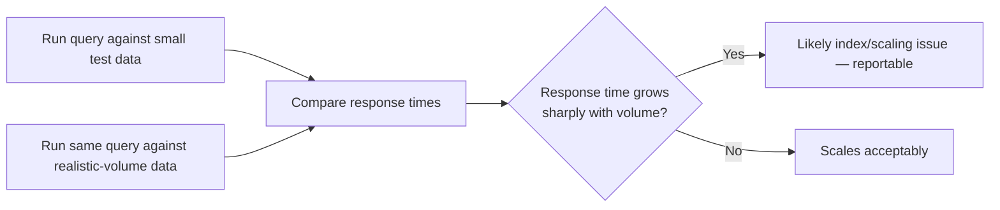

# Database Performance Testing

**Prerequisites**: You should already have completed [Database Defect Investigation](/learning-paths/database-testing/database-defect-investigation) and Section 3 in full.
**Leads to**: After this, you'll be ready for [Database Security Testing](/learning-paths/database-testing/database-security-testing).

A feature that returns the correct data can still be a defect if it takes eleven seconds to do it — and the specific reason it's slow is very often something a tester can recognize and report precisely, without needing to be a database administrator. This module is deliberately scoped to that QA-level depth: recognizing the symptoms of a slow query and reporting them precisely, not designing indexes or tuning a database engine, which stay a DBA's job.

## Why This Matters

**A team that only tests with small sample data.** AtlasBank's QA team tests the "transaction history" page against test accounts with a handful of sample transactions each — the page loads instantly, every test passes. In production, months later, a long-standing customer with eight years of transaction history opens the same page, and it takes nearly fifteen seconds to load — not because anything is broken, but because the underlying query was never tested against realistic data volume, and a missing index on the `account_id` column means the database scans the entire `Transactions` table (now millions of rows) every single time that page loads for anyone.

**A team that tests at realistic data volume.** A different QA process specifically seeds a test account with a realistic volume of historical data — tens of thousands of transactions, matching what a genuinely long-standing customer would actually have — before testing the same page. The fifteen-second load time reproduces immediately in a test environment, caught before release, with a specific, reportable detail: response time on this exact query grows sharply as the account's transaction count grows, a pattern strongly suggesting a missing index rather than a fundamentally unfixable design problem.

Both teams tested "the transaction history page." Only one of them tested it under the data volume a real, valuable customer would actually produce — small, tidy test data hides exactly this defect class.

## Recognizing a Slow Query Without Being a DBA

A tester doesn't need to design or implement an index to recognize the *symptom* an index would fix: a query whose response time grows sharply as the amount of matching data grows, especially when it's filtering or sorting on a column, is a strong indicator of a missing or ineffective index on that column. This is testable without any database-internals knowledge — run the same query (or the same feature) against a small dataset, then a realistically large one, and compare the two response times directly.

```sql
-- Timing comparison: run against a small test account, then a large one
SELECT * FROM Transactions WHERE account_id = 4471 ORDER BY created_at DESC LIMIT 50;
```

If this returns in milliseconds against an account with 50 transactions but takes seconds against an account with 500,000, that scaling pattern — not the raw number itself — is the actual finding worth reporting.



## Index Awareness — What a Tester Needs, Not What a DBA Needs

An **index** is a structure a database maintains to find matching rows quickly, without scanning every row in a table — conceptually similar to a book's index letting you jump to a page instead of reading the whole book to find a topic. A tester's depth here stops at *recognizing when a query's performance pattern suggests one is missing* (the scaling symptom above) and *knowing which columns are natural candidates* (columns frequently used in `WHERE` or `ORDER BY` clauses — like `account_id` in the example above) — not designing the index itself, choosing its type, or evaluating its tradeoffs (an index speeds up reads but adds overhead to writes, a genuine engineering tradeoff outside this path's scope).

## The N+1 Query Pattern — A Symptom a Tester Can Spot Directly

A specific, common performance defect worth naming explicitly: a feature that's supposed to run one query but instead runs one query *per row* of a result set — fetching a list of 50 accounts with one query, then running 50 additional queries (one per account) to fetch each account's related data, instead of a single query (often a `JOIN`, from [SQL for Testers](/learning-paths/database-testing/sql-for-testers)) that gets everything at once. A tester doesn't need to read application code to catch this — many environments expose a query count or query log for a given page load, and a page that's supposed to run a handful of queries but runs hundreds is a directly observable, reportable symptom, regardless of whether the tester can explain the exact code path causing it.

| Symptom | Likely Cause | What a Tester Reports |
|---|---|---|
| Response time grows sharply as matching data grows | Missing or ineffective index on a filtered/sorted column | The specific query, the response times at two data volumes, and which column it filters/sorts on |
| A page's query count scales with the number of items displayed | N+1 query pattern | The observed query count at different list sizes (e.g., 10 vs. 100 items) |
| A query is consistently slow regardless of data volume | Possibly an inherently expensive operation (a large join, a complex aggregate) — a genuinely different cause than a missing index | The query itself and confirmation that response time doesn't scale with volume, ruling out the index explanation |

## How This Works on a Real Project

AtlasBank is testing a new "account statement" feature that lists a customer's linked beneficiaries alongside each beneficiary's most recent transfer. A functional test with a customer who has three beneficiaries confirms the page loads correctly and quickly.

Applying this module's framework, a tester specifically checks whether performance scales acceptably: seeding a test customer with 40 beneficiaries (a realistic upper bound for a long-standing customer) and observing both the load time and, using the environment's available query logging, the actual number of queries the page runs. The result: 41 queries for a 40-beneficiary customer — one to fetch the beneficiary list, then one *additional* query per beneficiary to fetch their most recent transfer, a textbook N+1 pattern invisible at the three-beneficiary scale the original functional test used.

The report handed to the development team includes the specific, reproducible comparison (3 beneficiaries → 4 queries; 40 beneficiaries → 41 queries, a 1:1 scaling ratio that specifically identifies the N+1 pattern rather than a vaguer "it's slow with more data"), giving the team a precise, fixable target — replacing the 40 individual per-beneficiary queries with a single `JOIN`-based query, verified afterward by re-running the same test and confirming the query count no longer scales with beneficiary count.

## Common Mistakes

**Mistake 1: Testing performance only with small, tidy sample data.**
As this module's opening scenario and its AtlasBank example both show, small test data structurally hides exactly the defect class this module is about — scaling-dependent performance issues only appear at realistic volume.

**Mistake 2: Reporting "it's slow" without the scaling comparison that identifies the likely cause.**
A response time alone is much less actionable than a response time *compared* at two different data volumes — the comparison is what tells a developer whether they're looking at a missing index, an N+1 pattern, or something else entirely.

**Mistake 3: Treating every slow feature as an indexing problem.**
As the table above shows, a query that's consistently slow *regardless* of data volume likely has a different cause (an inherently expensive operation) than one whose slowness specifically grows with volume — conflating the two sends a report down the wrong investigation path.

**Mistake 4: Trying to diagnose or fix the exact database-internals cause instead of reporting the precise, reproducible symptom.**
This path's scope, deliberately, stops at recognition and precise reporting — the actual index design or query rewrite is a developer or DBA's job, and attempting to go further than symptom-and-comparison isn't necessary to be effective here.

## Best Practices

**Practice 1: Always test performance-sensitive features against realistic, not minimal, data volume.**
This single practice is what caught both this module's opening defect and its AtlasBank example — a feature that performs fine at 10 rows tells you nothing about how it performs at 100,000.

**Practice 2: Report a scaling comparison, not a single response time.**
Response time at small scale versus large scale is the actual diagnostic signal — a single number in isolation rarely is.

**Practice 3: Use available query-count or query-log tooling to check for N+1 patterns directly, without needing to read application code.**
This is an observable, reportable symptom on its own — a tester doesn't need code-level access to catch it, only a way to count queries per page load at different list sizes.

**Practice 4: Distinguish "slow and scaling with data volume" from "slow regardless of volume" before reporting.**
The table in this module names both patterns because they point toward genuinely different causes, and the distinction meaningfully changes what a developer investigates first.

:::note From the Field
A project-management tool's "team activity feed" performed well in every test environment, all of which had teams of five to ten members. A large enterprise customer with a 400-person team reported the feed taking over 20 seconds to load. QA hadn't tested at that team size because no existing test account came close to it — once a test account with 400 members was created specifically to reproduce the report, the same N+1 pattern this module describes was immediately visible: one query per team member to fetch their latest activity, instead of one query for the whole team's activity at once. The defect had existed since the feature first shipped; it simply required a data volume nobody had thought to test at.
:::

:::tip Senior QA Insight
A newer tester considers a feature performance-tested once it loads quickly in the test environment. A senior tester specifically asks what realistic data volume a real, valuable customer would actually have — and tests at that volume deliberately, because the test environment's default data almost never resembles it, and that gap is exactly where this defect class hides.
:::

## Mini Challenge

**Scenario**: AtlasBank's "search transactions by description" feature works instantly in every test you've run so far — but all your test accounts have fewer than 100 transactions each.

**Your task**: Describe the specific test you'd design to check whether this feature has a scaling performance problem, including what data volume you'd seed and what comparison you'd report if a problem is found.

## Key Takeaways

- Performance defects concentrate at realistic data volume — small, tidy test data structurally hides this entire defect class.
- A tester's depth on indexing is recognizing the scaling symptom (response time growing sharply with data volume) and naming likely candidate columns — not designing or implementing an index.
- The N+1 query pattern is directly observable via query count at different result-set sizes, without needing application-code access.
- Report a scaling comparison (small volume vs. large volume), not a single response time in isolation — the comparison is the actual diagnostic signal.

---

## What You Just Learned

- How to recognize a slow-query symptom and connect it to a likely (though not tester-implemented) missing index
- How to spot the N+1 query pattern using observable query counts, without reading application code
- Why performance testing has to happen at realistic data volume, not the small samples most functional testing uses
- How AtlasBank's QA team caught a real N+1 defect in an account-statement feature using a precise, reproducible scaling comparison

**Next:** [Database Security Testing](/learning-paths/database-testing/database-security-testing)

## Related Topics

- [SQL for Testers](/learning-paths/database-testing/sql-for-testers) — The `JOIN` pattern that's frequently the actual fix behind an N+1 defect this module identifies
- [Database Defect Investigation](/learning-paths/database-testing/database-defect-investigation) — The systematic reporting discipline this module applies specifically to performance symptoms
- [Performance Testing APIs](/learning-paths/api-testing/performance-testing-apis) — The API-layer equivalent of this module's scope discipline (recognition, not full load-engineering)

## Interview Questions

**Q1: How would you test whether a feature has a performance problem that only shows up with real customer data?**

*What to look for*: A specific method — seeding a test environment with realistic, large-scale data and comparing response time against a small-scale baseline — not a vague "I'd check if it's fast" with no actual volume-based comparison.

:::note Common Interview Mistake
Many candidates describe performance testing purely in terms of load (many concurrent users) without mentioning data volume (how much data a single realistic customer or query actually touches). A strong answer names both dimensions and specifically describes testing at realistic per-account or per-query data volume, not just concurrent request count.
:::

**Q2: What's the N+1 query problem, and how would you detect it without reading the application's code?**

*What to look for*: A correct description (one query becomes one-plus-N queries, one per row of an initial result) and a practical detection method — observing query count at different list sizes using available logging/monitoring tools, not requiring source-code access.

---

## Glossary

**Index**: A structure a database maintains to find matching rows quickly without scanning an entire table.

**N+1 Query Pattern**: A performance defect where a feature runs one query per row of a result set instead of a single combined query.

**Query Scaling**: How a query's response time changes as the volume of data it processes grows — the core diagnostic signal this module is built around.

## Quick Revision

Remember these five points:

✓ Test performance at realistic data volume, not small sample data — this defect class hides at small scale.

✓ A tester recognizes the missing-index symptom (response time scaling sharply with data volume); designing the index is a developer/DBA's job.

✓ The N+1 pattern is observable directly via query count at different result-set sizes.

✓ Report a scaling comparison (small vs. large volume), not a single response time.

✓ Distinguish "slow and scaling with volume" from "slow regardless of volume" — they point to different causes.
