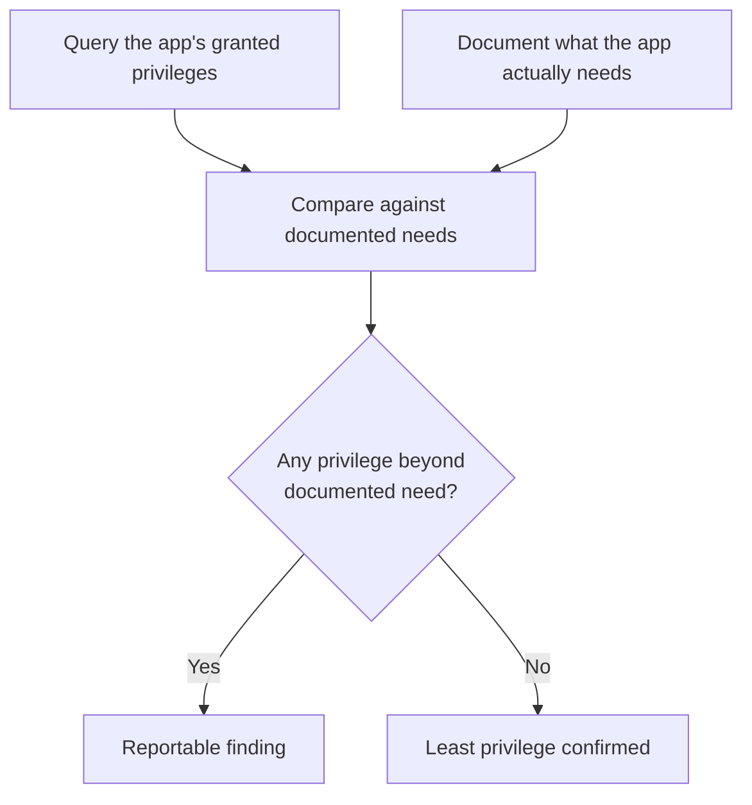

# Database Security Testing

**Prerequisites**: You should already have completed [Database Performance Testing](/learning-paths/database-testing/database-performance-testing).
**Leads to**: After this, you'll be ready for [Backup, Recovery, and Audit Validation](/learning-paths/database-testing/backup-recovery-and-audit-validation).

Like [Database Performance Testing](/learning-paths/database-testing/database-performance-testing) before it, this module is deliberately scoped: a QA-level security check at the data layer is about *recognizing and reporting* a real gap — an application with more database access than it needs, a symptom suggesting unsanitized input is reaching a query, sensitive data stored in a way it shouldn't be — not constructing an exploit or performing a penetration test, which stay a security specialist's domain. [API Testing's own Injection module](/learning-paths/api-testing/injection-and-input-based-attacks) drew this exact same line; this module draws it at the data layer instead.

## Why This Matters

**A team that never checks database-level access scope.** AtlasBank's application connects to its database using a single database credential with broad, unreviewed privileges — access to every table, including ones the application itself never touches (an internal `EmployeeSalaries` table used only by an unrelated HR system sharing the same database server). Nobody tested this, because the application's own functional behavior never exercises those unrelated tables — every UI and API test passes without ever revealing the credential's actual scope. A later, unrelated vulnerability in the application's own code (an injection flaw, a compromised dependency) would have given an attacker access far beyond what the application legitimately needed, purely because nobody had ever checked whether the credential's granted privileges matched its actual requirements.

**A team that verifies least privilege directly.** A different QA process includes a specific check: query the database directly for exactly which privileges the application's own credential has been granted, and compare that list against which tables and operations the application actually needs. This surfaces the same gap immediately — the application credential can read and write to `EmployeeSalaries`, a table with no legitimate connection to anything the application does — flagged and corrected before it becomes the difference between a contained defect and a much larger breach.

Both teams' applications functioned identically from a user's perspective. Only one of them had verified that the database access underneath matched what was actually needed — a gap invisible to any functional test, because functional tests only exercise the access a feature actually needs, never the access it was *also, unnecessarily* granted.

## Access Control at the Data Layer: Testing for Least Privilege

The **principle of least privilege** means a database credential (or role) should have exactly the access it needs to do its job — no more. A tester verifies this directly, the same way [Constraints, Keys, and Relationships](/learning-paths/database-testing/constraints-keys-and-relationships) verified a constraint by checking it directly rather than trusting a design document: query the database's own privilege metadata for the application's credential, and compare the granted privileges against the actual, documented set of tables and operations the application needs.

```sql
-- Checking what an application's own database role can actually access
-- (syntax varies by database engine; this is the conceptual pattern)
SELECT table_name, privilege_type
FROM information_schema.role_table_grants
WHERE grantee = 'atlasbank_app_role';
```

Any table appearing in this result that the application has no legitimate functional reason to touch is a finding worth reporting — the same "what else references this" reflex [Relational Database Fundamentals](/learning-paths/database-testing/relational-database-fundamentals) trained, applied to privileges instead of foreign keys.



## SQL Injection: Recognizing the Symptom, Not Building the Exploit

**SQL injection** happens when untrusted input (something a user typed) reaches a database query without being properly separated from the query's own structure, letting the input change what the query actually does. This path's scope stops at *recognizing the symptom* — the same discipline [API Testing's Injection module](/learning-paths/api-testing/injection-and-input-based-attacks) already established: a tester's job is noticing that something is wrong and reporting it precisely, not constructing a working exploit.

A tester recognizes this symptom by testing an input field with characters that have special meaning in SQL (a single quote is the most common) and watching for an anomalous response — not a crash necessarily, but an unexpected result count, an error message revealing raw SQL or database structure, or a result set that doesn't match what a syntactically-limited input should be able to produce.

```sql
-- What an application should do internally with user input (parameterized):
SELECT * FROM Customers WHERE name = ?;  -- input passed as a parameter, never concatenated

-- What an injection-vulnerable query might look like internally (never write this):
-- "SELECT * FROM Customers WHERE name = '" + userInput + "'"
```

A tester never needs to see the application's internal query construction to test for this — testing a search field with an input like `O'Brien` (a legitimate name containing a single quote) is often enough on its own: a correctly-built, parameterized query handles it as ordinary data, while a vulnerable, string-concatenated query can produce a database error or unexpected behavior from that single quote alone, since the character has special meaning in SQL syntax.

## Sensitive Data at Rest: A Direct, Simple Check

Whether genuinely sensitive data (passwords, full card numbers, government ID numbers) is stored in an appropriately protected form — rather than in plain, readable text — is directly testable with the same kind of query this path has used throughout: query the relevant table directly and look at what's actually stored.

```sql
SELECT password_hash FROM Customers WHERE customer_id = 4471;
-- Expected: an unreadable hash, never a plain-text password
```

A tester doesn't need to evaluate whether a specific hashing algorithm is strong enough (a security specialist's call) — but recognizing that a column *should* contain something hashed or encrypted, and directly confirming it doesn't contain obviously plain, readable sensitive data instead, is squarely within QA scope and catches a real, serious class of defect.

| Check | What a Tester Verifies | Stays Out of Scope |
|---|---|---|
| **Least Privilege** | The application's own credential has no access beyond documented need | Designing the correct privilege model itself |
| **SQL Injection** | An input field produces an anomalous result with a special-character test value | Constructing a working exploit or extracting real data via injection |
| **Data at Rest** | A sensitive column doesn't contain obviously plain, readable data | Evaluating cryptographic algorithm strength |

## How This Works on a Real Project

AtlasBank is testing a new "search customers by name" feature for its internal support tool. A functional test confirms searching for an exact or partial name returns the right customers.

Applying this module's framework, a tester tests the same search field with `O'Connor` — a legitimate customer name containing a single quote — and the search returns a database error visible directly in the UI's response, exposing a fragment of the raw SQL query in the error message. This is a clear, reportable injection symptom: a syntactically ordinary name broke the query, meaning user input is reaching the database without being safely separated from the query's own structure. The tester doesn't attempt to go further — extracting data, bypassing authentication — the finding (the exact input, the exact error, the exact endpoint) is reported immediately as a security defect requiring developer attention, matching the same identification-not-exploitation scope [API Testing's Injection module](/learning-paths/api-testing/injection-and-input-based-attacks) established.

Separately, reviewing the support tool's own database credential privileges (this module's least-privilege check) reveals it has write access to the `Loans` table — a table the read-only support search tool has no legitimate reason to ever modify. Both findings are reported together: a specific, reproducible injection symptom, and an unrelated but equally real least-privilege gap neither would have been caught by the other.

## Common Mistakes

**Mistake 1: Never checking what privileges an application's database credential actually has.**
As this module's opening scenario shows, this gap is invisible to every functional test — a feature can work perfectly while its underlying credential has far more access than it needs.

**Mistake 2: Attempting to construct a working SQL injection exploit instead of reporting the symptom.**
This path's scope, matching API Testing's own precedent, stops at recognizing and precisely reporting an anomalous result — going further risks operating outside a tester's authorized scope and isn't necessary to produce an actionable, credible defect report.

**Mistake 3: Assuming sensitive data is stored securely without directly checking.**
The same "trust but verify" principle from [Constraints, Keys, and Relationships](/learning-paths/database-testing/constraints-keys-and-relationships) applies here — a design document saying passwords are hashed is a claim, not a guarantee, until a direct query confirms it.

**Mistake 4: Testing SQL injection with only "obviously malicious" input, missing legitimate input that happens to contain special characters.**
As the AtlasBank example shows, a completely ordinary name like `O'Connor` is often the most realistic and effective test input — it's exactly the kind of input a vulnerable, string-concatenated query fails on, without needing anything that looks like an attack.

## Best Practices

**Practice 1: Directly query an application's granted database privileges and compare against documented need, on a regular basis, not just at initial release.**
Privilege scope can drift over time as a system evolves — this check has ongoing value, not just a one-time relevance.

**Practice 2: Test input fields with legitimate values containing special characters (apostrophes, in particular), not just obviously adversarial ones.**
This module's AtlasBank example and the general practice of testing names like `O'Connor` or `O'Brien` catch real injection symptoms using entirely realistic input.

**Practice 3: Stop at symptom identification and precise reporting for injection testing — don't attempt exploit construction.**
Matches this path's and API Testing's shared scope discipline; a precise, reproducible symptom report is both sufficient and appropriately scoped for a QA role.

**Practice 4: Directly query sensitive columns to confirm they're not stored in plain, readable form, rather than trusting documentation.**
A five-second query is the entire check — there's no reason to assume correctness here when direct verification is this cheap.

:::note From the Field
An online forum platform's database credential, used by the main application, had been granted broad privileges years earlier during initial setup and never reviewed since. A routine security audit (not triggered by any incident) discovered the credential had write access to an internal moderation-notes table that only a separate, restricted admin tool was supposed to be able to modify — a gap that had existed, unnoticed, for years, invisible to every functional test the platform's QA team had ever run, since the main application never had a legitimate reason to exercise that access and therefore never accidentally revealed it either.
:::

:::tip Senior QA Insight
A newer tester considers database security "someone else's job" — a specialist penetration tester's domain, not something to check during regular functional QA. A senior tester recognizes that least-privilege gaps and injection symptoms are both directly, cheaply testable within normal QA scope, and treats not checking them as leaving an easy, high-value defect class entirely unexamined.
:::

## Mini Challenge

**Scenario**: AtlasBank's new "beneficiary nickname" field lets customers add a custom label to a beneficiary. You're testing it for the first time.

**Your task**: Describe the specific input you'd test this field with to check for an SQL injection symptom, and what response (or database-level check) would tell you a real defect exists versus the field being safely implemented.

## Key Takeaways

- Least-privilege access at the data layer is directly testable by comparing an application's actual granted privileges against its documented needs — a gap invisible to every functional test.
- SQL injection testing at a QA level means recognizing an anomalous symptom from legitimate-looking special-character input, not constructing a working exploit.
- Sensitive data at rest is directly checkable with a simple query — confirming it isn't stored in obviously plain, readable form.
- All three checks stay within QA scope by stopping at recognition and precise reporting, the same discipline API Testing's own Injection module established.

---

## What You Just Learned

- How to test for least-privilege violations by directly querying an application's granted database privileges
- How to recognize an SQL injection symptom using realistic, legitimate-looking input, without constructing an exploit
- How to directly verify sensitive data isn't stored in plain, readable form
- How AtlasBank's QA team found both a real injection symptom and an unrelated least-privilege gap in the same testing session

**Next:** [Backup, Recovery, and Audit Validation](/learning-paths/database-testing/backup-recovery-and-audit-validation)

## Related Topics

- [Injection and Input-Based Attacks](/learning-paths/api-testing/injection-and-input-based-attacks) — The identical identification-not-exploitation scope this module applies at the data layer
- [Constraints, Keys, and Relationships](/learning-paths/database-testing/constraints-keys-and-relationships) — The "verify directly, don't trust documentation" discipline this module applies to privileges and data-at-rest
- [API Security Fundamentals](/learning-paths/api-testing/api-security-fundamentals) — The broader security-testing mindset this module's data-layer checks extend

## Interview Questions

**Q1: How would you test for a SQL injection vulnerability without attempting to actually exploit it?**

*What to look for*: A concrete method — testing an input field with a legitimate value containing special characters (like an apostrophe in a name) and watching for an anomalous response (an error, an unexpected result count) — not an answer describing actual exploit construction, which is out of scope for a QA-level test.

:::note Common Interview Mistake
Many candidates answer with an attempted exploit payload (like a classic injection string) without explaining what they'd actually be looking for in the response, or why a QA-level test stops short of extracting real data. A strong answer names the specific, realistic test input and the specific anomalous symptom that would indicate a defect, explicitly scoped to identification and reporting.
:::

**Q2: What does "least privilege" mean at the database level, and how would you test for a violation of it?**

*What to look for*: A clear definition (a credential should have only the access it actually needs) plus a concrete testing method — querying the credential's granted privileges directly and comparing against documented, legitimate need — not a vague description with no actual verification step.

---

## Glossary

**Least Privilege**: The principle that a credential or role should have only the access it needs to perform its function, no more.

**SQL Injection**: A vulnerability where untrusted input reaches a database query without being safely separated from the query's structure, letting the input alter what the query does.

**Data at Rest**: Data as it's stored in the database, as distinct from data in transit (covered in API Testing's transport-security scope).

## Quick Revision

Remember these five points:

✓ Least-privilege gaps are directly testable by comparing granted database privileges against documented, legitimate need.
✓ Test for SQL injection symptoms using realistic, legitimate input containing special characters — not just obviously adversarial payloads.
✓ Stop at symptom identification and precise reporting for injection testing — exploit construction is out of QA scope.
✓ Confirm sensitive data at rest isn't stored in plain, readable form with a direct query — don't trust documentation alone.
✓ All three checks here mirror API Testing's own identification-not-exploitation security scope, applied to the data layer.
