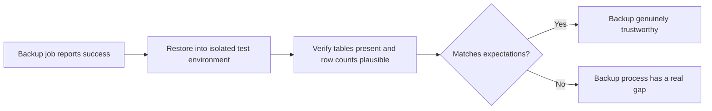

# Backup, Recovery, and Audit Validation

**Prerequisites**: You should already have completed [Database Security Testing](/learning-paths/database-testing/database-security-testing).
**Leads to**: After this, you'll be ready for [Section 4 Review](/learning-paths/database-testing/section-4-review), then Section 5 — Application Modules & Capstone.

A backup job that reports "success" every night for two years can still be completely useless the one time it's actually needed — because "the job ran without error" and "the data can actually be restored, correctly and completely" are two different claims, and only one of them is usually tested. This module closes this path's Section 4 with the last piece of QA-scoped database verification: confirming a backup can genuinely be restored from, that recovery leaves the data correct, and that an audit trail — often a compliance requirement, always relevant for a domain like AtlasBank's — is actually complete.

## Why This Matters

**A team that trusts a "successful" backup job.** AtlasBank's nightly database backup job has reported "completed successfully" every night for over a year, and nobody has ever actually tried to restore from one of those backups — the monitoring dashboard's green checkmark has been treated as sufficient proof the backups work. During an actual incident (a bad migration corrupts a production table), the team attempts its first-ever real restore and discovers the backup process has, for months, been silently skipping one specific table due to a misconfigured exclusion rule added during an unrelated infrastructure change — the "successful" backups never actually contained the `Transactions` table at all.

**A team that tests restores regularly.** A different QA process treats "the backup completed" and "the backup is actually restorable and complete" as two separate claims requiring two separate verifications — a scheduled, regular test restores a recent backup into an isolated test environment and directly queries it, confirming every expected table is present with a row count in the right range compared to production. The same missing-table gap this module opened with is caught within a day of the misconfiguration being introduced, not discovered for the first time during a real incident.

Both teams had backup jobs that reported success identically. Only one of them had ever confirmed that "success" actually meant something — a distinction that costs nothing to verify regularly and costs everything to discover for the first time during an actual emergency.

## Backup Validation: Restore It, Don't Just Trust the Job Log

A backup job's own success report only confirms the *process* completed without an error — it says nothing about whether the resulting backup file is actually complete or restorable. The only real test is the one this module's opening scenario describes: **actually restore from the backup**, into an isolated test environment, and verify the result directly.

```sql
-- After restoring a backup into an isolated test environment:
SELECT table_name FROM information_schema.tables WHERE table_schema = 'public';
-- Compare this list against the known, expected set of production tables

SELECT COUNT(*) FROM Transactions;
-- Compare against a recent, known-approximate production row count
```

A restore test that surfaces every expected table, with row counts in a plausible range relative to when the backup was taken, is real evidence the backup works. A restore test that's never performed provides no evidence at all, regardless of how many consecutive "success" notifications the backup job has produced.



## Recovery Correctness: What "Restored" Actually Needs to Mean

Beyond confirming a backup restores at all, recovery testing checks that the restored data is *correct* — not just present. This includes confirming referential integrity survived the restore (per [Relational Database Fundamentals](/learning-paths/database-testing/relational-database-fundamentals), do foreign-key relationships between restored tables still correctly resolve), and understanding the backup's **recovery point** — the most recent moment the backup actually reflects, and therefore how much data (if any) would be genuinely, expectedly lost if a restore were needed right now. A nightly backup restored at 2 PM the next day has an expected gap of up to a day's worth of transactions — that's not a defect, it's the design; a tester's job is confirming the actual gap matches the *documented, expected* gap, not assuming zero loss.

## Audit Log Completeness: Extending Trigger Coverage to Compliance

[Stored Procedures, Views, and Triggers](/learning-paths/database-testing/stored-procedures-views-and-triggers) already established that a trigger's coverage needs testing across every distinct write path that can fire it — not just the obvious one. Audit logging is very often implemented via exactly this kind of trigger, which makes it directly vulnerable to the same gap this module's earlier section described: an audit trigger that correctly fires through the standard UI flow can still silently miss a bulk job, an admin tool, or a migration script, exactly the way this path's Module 7 worked example found a compliance-flag trigger gap in an admin balance-adjustment tool.

For a compliance-relevant system like AtlasBank, this isn't a minor gap — an incomplete audit trail can itself be a compliance failure, independent of whatever underlying data change it failed to record. Testing this means the same systematic path-mapping Module 7 taught, applied specifically to whatever fields or tables carry compliance significance (KYC status changes, large transactions, account closures) — for each, confirm every distinct way that field can change actually produces a corresponding audit entry.

| Check | What "Success" Actually Requires | Common False Confidence |
|---|---|---|
| **Backup** | A restore, performed and verified directly, produces complete, correct data | Trusting a job's "success" status without ever restoring |
| **Recovery** | Restored data has correct relationships, and any data gap matches the documented recovery point | Assuming zero data loss without confirming the actual recovery point |
| **Audit Trail** | Every distinct path that changes a compliance-relevant field produces a log entry | Testing the audit log through only the primary/obvious UI flow |

## How This Works on a Real Project

AtlasBank's QA team runs a quarterly backup-restore drill as a standing practice: restore the most recent nightly backup into an isolated environment and directly verify it. On one such drill, the table-presence check passes (every expected table exists), but the row-count comparison reveals `Beneficiaries` has roughly 40% fewer rows than a same-day production snapshot should have — well outside the plausible range for normal data changes overnight.

Tracing this (applying [Database Defect Investigation](/learning-paths/database-testing/database-defect-investigation)'s systematic approach) reveals the actual cause: a recent database migration had temporarily disabled the backup process's replication for the `Beneficiaries` table during a schema change, and the backup configuration was never fully re-enabled afterward — silently producing incomplete backups of that one table for three weeks before the quarterly drill caught it. Because the drill is a standing, recurring practice rather than a one-time check, the gap is caught within the same quarter it was introduced, not accumulated for a year before an actual incident might have revealed it.

Separately, the same team applies Module 7's trigger-coverage framework specifically to the KYC audit trigger from that module's own example, now with compliance stakes made explicit: confirming the trigger fires through the standard verify-customer flow, the bulk re-verify job, and a newly added support-agent override tool — closing the exact gap Module 7's original example found, now treated as a required, standing compliance check rather than a one-time investigation.

## Common Mistakes

**Mistake 1: Trusting a backup job's "success" status without ever performing a real restore.**
This module's opening scenario and its AtlasBank drill example both hinge on exactly this gap — a job's own report of success is not evidence the resulting backup is actually usable.

**Mistake 2: Testing a restore once, at initial setup, and never again.**
The AtlasBank example's gap was introduced by a later, unrelated migration — a one-time restore test performed months earlier would never have caught it; this needs to be a recurring, standing practice.

**Mistake 3: Assuming zero data loss on restore without confirming the actual, documented recovery point.**
Some data-loss window is often expected and acceptable by design — the defect is a gap that doesn't match what's documented, not the existence of any gap at all.

**Mistake 4: Testing audit-log coverage only through the primary, most obvious flow.**
This directly extends Module 7's own lesson — an audit trigger, like any trigger, needs testing across every distinct path that can produce its triggering condition, especially for compliance-relevant fields where a gap has real regulatory consequences.

## Best Practices

**Practice 1: Establish backup-restore verification as a recurring, scheduled practice, not a one-time check.**
The AtlasBank quarterly-drill example is the pattern worth adopting — a gap introduced after the last check is invisible until the next one, so the cadence itself matters.

**Practice 2: Compare restored row counts against a known, expected baseline, not just table presence.**
Table presence alone would have missed the AtlasBank example's 40% `Beneficiaries` gap — the count comparison is what actually caught it.

**Practice 3: Know and verify your system's documented recovery point, and treat any gap beyond it as a real defect.**
This distinguishes an expected, designed limitation from an actual failure — both matter, but they need different responses.

**Practice 4: Apply trigger-coverage testing (Module 7) specifically and deliberately to every compliance-relevant audit trail.**
Treat this as a standing requirement for anything with regulatory stakes, not a one-time investigation limited to whatever gap happened to be found first.

:::note From the Field
A healthcare records provider discovered, during an actual data-loss incident, that its nightly backups had been technically "succeeding" for over a year while silently backing up an empty, misconfigured staging database instead of the real production database — a configuration error introduced during an infrastructure migration that nobody had caught, because nobody had ever actually attempted a restore to confirm what the backups actually contained. The organization had no genuinely restorable backup of real patient data for the entire period, discovered only at the exact moment a real restore was actually needed.
:::

:::tip Senior QA Insight
A newer tester treats a backup system as verified once the job's dashboard shows consistent green checkmarks. A senior tester treats a green checkmark as an unverified claim, the same way an undocumented constraint is an unverified claim — and insists on a real, periodic restore test as the only genuine evidence, because the one time a backup's accuracy actually matters is precisely the worst possible time to discover it was never real.
:::

## Mini Challenge

**Scenario**: AtlasBank's loan-approval audit trail is supposed to log every change to a loan's approval status, for regulatory review. You've been asked to verify its completeness.

**Your task**: List the distinct ways a loan's approval status could plausibly change (think about UI flows, batch jobs, and admin tools, the same categories Module 7 and this module both used), and describe how you'd test that each one produces a corresponding audit log entry.

## Key Takeaways

- A backup job's "success" report only confirms the process completed — only an actual, verified restore confirms the backup is genuinely usable.
- Recovery testing means confirming both data correctness after restore and that any data-loss gap matches the documented, expected recovery point, not assuming zero loss.
- Audit-log completeness is a direct extension of trigger-coverage testing (Module 7), applied specifically to compliance-relevant fields where a gap has real regulatory consequences.
- Backup-restore verification needs to be a recurring, scheduled practice — a gap introduced after the last check stays invisible until the next one.

---

## What You Just Learned

- Why a backup job's success status and a genuinely restorable backup are two different claims requiring two different verifications
- What recovery correctness actually requires: restored data integrity plus a documented, verified recovery point
- How trigger-coverage testing extends directly to audit-log completeness for compliance-relevant fields
- How AtlasBank's QA team caught a real, silent backup gap through a recurring quarterly restore drill

**Next:** [Section 4 Review](/learning-paths/database-testing/section-4-review)

## Related Topics

- [Stored Procedures, Views, and Triggers](/learning-paths/database-testing/stored-procedures-views-and-triggers) — The trigger-coverage framework this module applies specifically to audit trails
- [Database Defect Investigation](/learning-paths/database-testing/database-defect-investigation) — The systematic tracing this module's AtlasBank restore-drill example applies to a row-count discrepancy
- [Relational Database Fundamentals](/learning-paths/database-testing/relational-database-fundamentals) — The referential-integrity check this module's recovery-correctness section verifies survives a restore

## Interview Questions

**Q1: A backup job has reported "success" every night for a year. What would you do to confirm the backups are actually usable?**

*What to look for*: A specific answer describing an actual restore, into an isolated test environment, with direct verification (table presence, row counts) — not accepting the job's own success status as sufficient evidence on its own.

:::note Common Interview Mistake
Many candidates answer that a consistent "success" status over time is itself reassuring evidence the backups work. That's exactly the false confidence this module warns against — a strong answer explicitly states that a job's own success report says nothing about restorability, and that only an actual restore test provides real evidence.
:::

**Q2: How would you test whether an audit trail is complete for a compliance-relevant field?**

*What to look for*: An answer that maps every distinct way the field can change (UI, batch job, admin tool) and tests each independently for a corresponding audit entry — directly connecting to the trigger-coverage principle from earlier in this path, not just "check that the audit log has some entries."

---

## Glossary

**Recovery Point**: The most recent moment a backup actually reflects — and therefore the maximum expected data loss if a restore is performed.

**Restore Test**: Actually restoring a backup into an isolated environment and directly verifying the result, as distinct from trusting a backup job's own completion status.

**Audit Trail**: A record of changes to specific, typically compliance-relevant data, often implemented via a database trigger.

## Quick Revision

Remember these five points:

✓ A backup job's "success" status only confirms the process ran — only an actual restore confirms the backup is usable.
✓ Recovery testing checks both data correctness after restore and that any gap matches the documented recovery point.
✓ Audit-log completeness is trigger-coverage testing (Module 7) applied specifically to compliance-relevant fields.
✓ Backup-restore verification needs to be recurring and scheduled, not a one-time check.
✓ Compare restored row counts against a known baseline, not just table presence — presence alone can hide a significant data gap.
