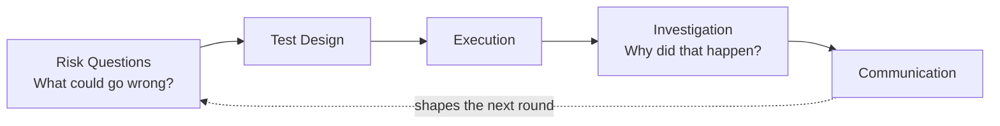
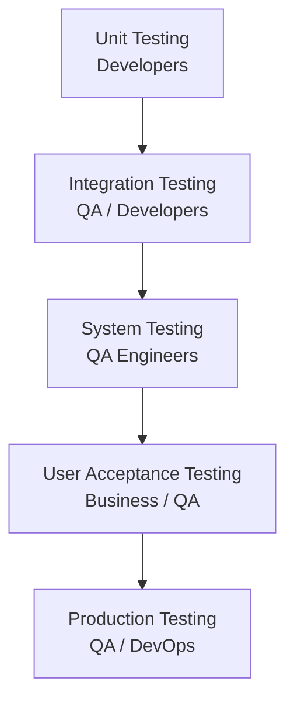
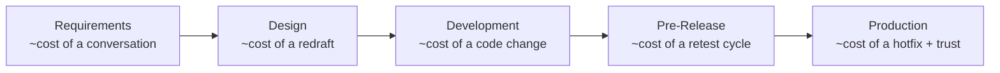

# What Is Software Testing?

**Prerequisites**: None — this is the first module in Foundations.
**Leads to**: After this, you'll be ready for [The Role of QA in Product Delivery](/learning-paths/foundations/role-of-qa-in-product-delivery).

Testing is not about executing test cases. Testing is how a team answers a specific question: **Will this product work for its users?** Everything else follows from that one purpose.

This chapter establishes what testing means, why it matters differently at each stage of delivery, and how experienced testers work. The remaining chapters in this learning path build on this foundation.

## Why Testing Matters

Software ships every day. Most of it works most of the time. But "most of the time" is not acceptable for critical systems.

Consider three scenarios:

**Scenario 1: Banking Mobile App**
A defect in the money-transfer flow causes incorrect balance calculations. A user transfers $500 but the app shows $5,000 gone. They lose trust in the bank immediately—and escalate to the regulatory authorities. The cost: fines, customer compensation, reputation damage, and engineering time to fix.

**Scenario 2: E-Commerce Checkout**
During a peak sales event, the checkout page becomes unreliable. Some customers can complete purchases; others timeout and lose their cart. Customers abandon purchases and buy from competitors instead. The cost: lost revenue, customer support burden, and pressure to re-architect under fire.

**Scenario 3: Healthcare Scheduling**
A race condition in appointment booking lets two patients book the same time slot. One patient misses a critical treatment. The cost: patient harm, legal liability, and regulatory investigation.

None of these are hypothetical. They happen because testing was incomplete, happened too late, or asked the wrong questions.

**Testing's job is to find these problems before users do.**

But testing is not random. Experienced testers don't try everything; they think about **risk**: What could go wrong? Which failures would hurt most? Which features interact in dangerous ways? What assumptions are we making that could be wrong?

Testing is risk-based thinking applied to code.

## What Is Testing?

**Testing is the act of exploring a product to answer specific questions about whether it will work as intended.**

This is different from checking. Checking is automated: run this input, does the output match the expected value? Testing includes checking, but it is much broader. Testing includes:

- **Question Formation**: What questions matter for this product? What failures would hurt users most?
- **Test Design**: How do we ask questions in a way that might reveal problems?
- **Execution**: Actually running the tests, paying attention to what happens
- **Investigation**: When something unexpected happens, digging deeper to understand why
- **Communication**: Reporting findings clearly so the team can act on them

A tester might notice that a feature "works" in the happy path but fails when users operate offline. A tester might realize that two features interact in a way nobody intended. A tester might discover that the product works fine for English speakers but breaks for languages with different character encodings.

**These discoveries are testing.**

Testing happens at different levels:

| Level | Who Does It | Scope | Example |
|-------|----------|-------|---------|
| **Unit Testing** | Developers | Individual functions, classes | Does the password-validation function reject passwords under 8 characters? |
| **Integration Testing** | QA Engineers / Developers | Multiple components working together | Does the authentication service correctly update the user database when login succeeds? |
| **System Testing** | QA Engineers | The entire product end-to-end | Can a user complete the checkout flow from login to payment confirmation? |
| **User Acceptance Testing (UAT)** | Business stakeholders / QA | Real-world scenarios from actual business workflows | When an accountant reconciles transactions in our accounting software, do the reports match their manual calculations? |
| **Production Testing** | QA Engineers / DevOps | The product running in the real environment | Is the application responding to requests under real traffic? Are error rates within acceptable limits? |

All of these are testing. All of them serve the same purpose: **Does this work for its users?**

## When Testing Happens

Many teams treat testing like a phase: development finishes, then testing begins. This delays feedback and makes defects expensive to fix.

Experienced teams test throughout delivery:

**Requirements Stage**
- Are the requirements clear enough to build against?
- Are there missing scenarios or edge cases?
- What might break if these requirements change?

*Example*: A requirements doc says "Users can search for flights by destination." A tester asks: What happens if no flights exist for that destination? What if the user searches for a misspelled city? What if they search with special characters? These questions shape what the development team actually builds.

**Design Stage**
- Does the architecture account for failure modes?
- Are there security assumptions that might not hold?
- Will this design scale if traffic increases 10x?

*Example*: Before coding a new payment flow, the team discusses: What happens if the payment processor is down? Should the request retry or fail immediately? This conversation prevents guesswork during crisis.

**Development Stage**
- Developers write unit tests; QA may write integration tests
- Continuous integration (CI) runs automated tests on every commit
- Code review includes questions about edge cases

*Example*: A developer submits code to fix an off-by-one error in price calculations. Before merging, CI runs all existing price-calculation tests plus new tests for the specific edge case that was broken. This prevents the fix from introducing new problems.

**Pre-Release Stage**
- QA runs end-to-end test scenarios
- Performance and load testing validate scalability
- Security testing checks for common vulnerabilities
- UAT confirms the product solves the original business problem

*Example*: Before launching a new reporting feature, QA tests with 10 years of historical data (the largest realistic dataset), ensures reports export correctly to CSV and Excel, verifies that report permissions respect user roles, and tests what happens if a user's data changes while they are viewing a report.

**Production**
- Monitoring tracks error rates, latency, and user behavior
- If problems emerge, tester work focuses on understanding how to reproduce and escalate

*Example*: After launch, monitoring shows that 2% of payment-processing requests are timing out. QA works with engineering to understand whether this is a load issue, a downstream service issue, or an intermittent network problem. This shapes the fix.

**Why this matters**: Defects found early cost almost nothing to fix. Defects found after release cost everything—customer trust, reputation, money, and engineering time.

## How Testing Works in Real Projects

Let's walk through a realistic scenario to see how testers actually work.

**The Scenario**: A fintech company is building a new feature: users can link their bank account and see balances across multiple banks in one dashboard.

**What a tester does:**

**Phase 1: Requirements**
The tester reads the requirements and asks:
- Which banks do we support? (affects test scope)
- What if a user's bank changes their password after linking? (affects error handling)
- What if a user links 50 bank accounts? (performance question)
- Can two people link the same bank account? (security/logic question)
- If linking fails, what message does the user see? (UX question)
- What data do we store after linking? (privacy question)

These questions shape what the team actually builds.

**Phase 2: Development**
The team builds the feature. QA writes test cases:
- Happy path: Link a single bank account, verify the balance appears
- Link multiple accounts, verify all balances appear
- Deliberately enter wrong credentials, verify the error message is helpful
- Unlink an account, verify the balance disappears
- Try to bypass authentication and link without credentials (security test)
- Check what happens if the bank API is slow or down

**Phase 3: Before Release**
The feature is "done" according to the developer. QA runs all test cases. One breaks:
- Test: "Link multiple accounts, verify all balances appear"
- Expected: All three accounts show their balances
- Actual: Only the most recently linked account shows a balance

This is a real defect. The tester:
1. Verifies it's reproducible (runs the test again—same result)
2. Clarifies the scope (does this happen with 2 accounts? 3? 10?)
3. Logs a clear defect report with steps to reproduce
4. The developer fixes it
5. QA re-tests to confirm the fix works and didn't break anything else

**Why this matters**: The defect was caught before users linked multiple accounts and lost visibility of most of their money.

## Common Mistakes

**Mistake 1: Testing only the happy path**
Testing only works when everything goes right. Real users make typos, lose internet connection, and click buttons twice. Experienced testers test what breaks.

**Mistake 2: Testing finds defects; testing creates them**
If a tester's job is only to find defects, the team sees testing as a cost center. Reality: early testing (in design, in code review) prevents defects. This is cheaper than finding them after release.

**Mistake 3: Testing is a phase, not a practice**
"We are in testing now" suggests testing happens for two weeks then stops. Actually, testing happens throughout delivery. What changes is the type of testing: requirements review (early), UAT (late).

**Mistake 4: 100% test coverage means zero defects**
A test can verify that code works correctly. It cannot verify that the code solves the right problem, or that the product is usable, or that it scales. Coverage is a useful metric; it is not a guarantee.

**Mistake 5: QA owns quality**
Quality is a shared responsibility. Developers write unit tests. Product managers clarify requirements. Operations monitors production. QA's role is to think rigorously about risk and ensure the team has answered the important questions.

## Best Practices

**Practice 1: Think like a user**
Before writing a test, ask: What would a real user actually do? What are they trying to accomplish? What might confuse them or make them fail?

**Practice 2: Automate the routine; test the risky**
Automated tests run the same scenarios perfectly every time. But they can only test what you told them to test. Manual testing explores unknowns. Use both: automate regression scenarios (to avoid re-testing the same thing endlessly), and use human testing to explore edge cases and think critically about risk.

**Practice 3: Test early, test often**
A defect found in design costs almost nothing to fix. A defect found in code review costs minutes. A defect found in UAT costs hours. A defect found after release costs days and customer trust. Test early and often.

**Practice 4: Make the failure obvious**
When a test fails, make it clear why. A test that produces a confusing output wastes everyone's time. A test with a clear, specific assertion (the actual value was X, but I expected Y) saves hours of debugging.

**Practice 5: Keep tests maintainable**
A test that is brittle (breaks when the UI changes slightly) is worse than no test (it creates false alarms). Write tests that verify *what matters* (the user can submit the form), not *exactly how* (the submit button is 200px from the left edge).

## Key Takeaways

- Testing is not about executing test cases; it is about exploring whether a product will work for its users.
- Testing is risk-based thinking: What could go wrong? Which failures hurt most?
- Testing happens throughout delivery, not as a phase after development.
- Every level of testing (unit, integration, system, UAT, production) serves the same purpose.
- The cost of a defect increases exponentially the later it is found. Test early.
- Quality is a shared responsibility. QA's role is to think rigorously about risk and ensure important questions get answered.

---

## What You Just Learned

- Why testing exists — the cost of skipping it
- What testing is — and how it differs from checking
- Where testing happens — across every stage of delivery
- How testing works on a real project — from requirements to production

**Next:** [The Role of QA in Product Delivery](/learning-paths/foundations/role-of-qa-in-product-delivery)

## Related Topics

- Test Design Techniques (coming soon, Manual Testing path) — How to design tests that catch real problems
- Test Automation (coming soon) — When and how to automate tests
- [Defect Life Cycle](/learning-paths/foundations/defect-life-cycle) — How to report, prioritize, and track defects
- Performance Testing (coming soon) — How to ensure the product scales under load

## Interview Questions

**Q1: Describe the difference between testing and checking.**

*What to look for*: The answer should distinguish between verification (does this match what we expected?) and exploration (what could be wrong that we haven't thought of?). Checking is automated and binary; testing includes human judgment and discovery.

**Q2: You find a defect on the last day before release. The developer says it is low priority and hard to fix. How do you approach this conversation?**

*What to look for*: The answer should focus on impact (how badly does this hurt users?), context (what is the release schedule?), and collaboration (what options do we have?). It should not be adversarial—it should be about surfacing the risk and letting the team decide.

**Q3: Why might 100% code coverage not guarantee zero defects?**

*What to look for*: The answer should explain that coverage verifies that code works as written, but does not verify that the code solves the right problem, that the product is usable, or that integration between components works correctly. Examples help (e.g., "high coverage could miss that users find the feature confusing").

---

## Glossary

**Defect (Bug)**: A deviation between what the software does and what it should do.

**Test Case**: A specific scenario written to verify that the software behaves correctly. Includes preconditions, steps, and expected results.

**Coverage**: The percentage of code (or requirements, or risk areas) that tests exercise. High coverage does not guarantee no defects.

**Regression**: When a previously-working feature breaks after a code change. Regression tests prevent this by re-checking existing functionality after changes.

**UAT (User Acceptance Testing)**: Testing performed by business stakeholders to verify that the software solves the business problem.

**Reproducible**: A defect is reproducible if you can reliably trigger it by following specific steps. Non-reproducible defects are hard to fix and prioritize.
