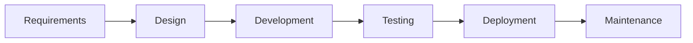
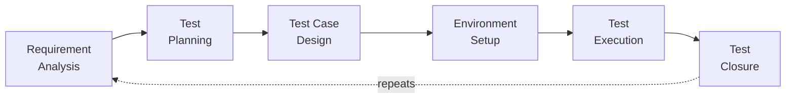

# Testing Across the SDLC

**Prerequisites**: You should already understand [Software Testing Principles](/learning-paths/foundations/software-testing-principles).
**Leads to**: After this, you'll be ready for [Agile & Scrum Basics for QA](/learning-paths/foundations/agile-and-scrum-basics-for-qa).

The previous chapter established that testing happens throughout delivery, not as a single phase at the end. That's true — but *how* it happens throughout delivery looks completely different depending on which software development lifecycle (SDLC) model a team actually uses. Knowing that testing should be continuous doesn't tell you what to do differently on a Waterfall project versus a two-week Agile sprint. This chapter does.

## Why This Matters

**A Waterfall insurance platform.** Requirements take two months, design takes one, development takes four, and testing is scheduled as its own phase: three weeks, right before launch. Three weeks in, QA finds a policy premium miscalculation that requires a design change, not a quick fix. There's no time left in the schedule to redo the design properly, so the team ships a workaround instead of the correct fix, and revisits it "after launch" — which, a year later, still hasn't happened.

**The same company, six months into an Agile transition.** Now working in two-week sprints, they assume the SDLC problem is solved because "we test every sprint now." But each sprint quietly recreates the old pattern in miniature: two weeks of development, then testing crammed into the last day and a half before the sprint review. It's Waterfall, just smaller and more frequent — a pattern with an actual name: **water-scrum-fall**. The team is doing Agile ceremonies without Agile testing.

Both teams believe they understand when testing happens. Neither has actually mapped testing activities onto their specific delivery model — they've adopted a process without adapting the testing approach to fit it.

## What the SDLC and STLC Are

The **SDLC** (Software Development Lifecycle) is the sequence a product moves through: typically Requirements → Design → Development → Testing → Deployment → Maintenance, though the exact phase names vary by team and methodology.

The **STLC** (Software Testing Life Cycle) is a sub-cycle that runs *inside* the SDLC — a repeatable sequence testing itself follows, regardless of how the overall SDLC is structured:

| STLC Phase | What Happens |
|---|---|
| Requirement Analysis | Reviewing requirements specifically for testability — what needs to be verified, and how |
| Test Planning | Deciding scope, approach, tools, timeline, and who tests what |
| Test Case Design | Writing the actual test cases and identifying test data |
| Test Environment Setup | Preparing a environment that reflects real conditions closely enough to trust the results |
| Test Execution | Running the tests, logging defects |
| Test Closure | Summarizing results, coverage, and open risks before moving on |

The mistake both teams above made is treating the STLC as something that only happens once, at "the testing phase" of the SDLC. In reality, the STLC repeats — once per Waterfall project, or once per Agile sprint, or continuously in a fully automated delivery pipeline. What changes across SDLC models isn't whether the STLC happens; it's how often it repeats and how compressed each phase becomes.

## When: How Testing Maps Onto Different SDLC Models

| Model | Where Testing Happens | Feedback Speed | STLC Repeats |
|---|---|---|---|
| **Waterfall** | One dedicated phase, after development is complete | Slow — issues surface weeks or months after the decisions that caused them | Once per project |
| **V-Model** | Each development phase has a paired testing phase planned alongside it (e.g., requirements ↔ UAT planning, design ↔ system test planning) | Better than Waterfall — test planning starts early, even though execution still happens late | Once per project, but planning is distributed |
| **Agile / Scrum** | Continuously within each sprint, alongside development | Fast — days, not months | Once per sprint |
| **Continuous Delivery / DevOps** | Largely automated, on every commit; manual STLC activity shrinks to what automation can't cover | Fastest — minutes to hours | Continuously |

The V-Model is worth calling out specifically because it's often misunderstood as "Waterfall with testing." It isn't — its actual improvement is that *test planning* happens in parallel with each development phase (so test cases for a requirement are drafted while that requirement is still being written, not after coding finishes), even though *test execution* still happens sequentially at the end. It reduces some risk without solving the fundamental "feedback arrives late" problem Waterfall has.

## How This Works on a Real Project

A mid-size insurance company (the same one from the earlier scenario) decides to genuinely fix its water-scrum-fall problem, not just rename its process.

**Before:** Sprint planning scopes the work. Development happens for roughly nine of the ten working days in the sprint. QA gets the "testing phase" — the last day and a half — to run through everything at once. Predictably, defects found that late either ship anyway or push the sprint's completed work into the next sprint, defeating the purpose of working in sprints at all.

**The change:** Test planning moves into sprint planning itself — when a new "claims auto-approval" story is scoped, the QA engineer drafts test cases for it that same day, not after the code exists. Test execution stops being a single end-of-sprint event and instead happens continuously as individual stories are finished — a story marked "code complete" on day three gets tested on day three, not day ten. Automated regression tests for previously shipped features run on every commit, so re-verifying old functionality doesn't compete for time with testing new functionality. Test closure becomes a five-minute summary at the sprint review — coverage, open defects, and anything deliberately not tested this sprint — rather than a scramble to produce a report nobody has time to read carefully.

Nothing about the STLC's six phases changed. What changed is that they now repeat every sprint, in parallel with development, instead of being squeezed into the sprint's final day and a half.

## Common Mistakes

**Mistake 1: Assuming "Agile" automatically means testing happens early.**
Water-scrum-fall is the default outcome of adopting Agile ceremonies without deliberately redesigning when test planning and execution happen. Nothing about calling a two-week block "a sprint" changes testing behavior on its own.

**Mistake 2: Skipping test closure because "we're Agile now, we don't need documentation."**
Even a five-minute summary preserves the ability to see quality trends over time. Dropping it entirely means nobody notices a slow decline in coverage or a rising defect count until it's a crisis.

**Mistake 3: Running a rigid, months-long STLC process inside a two-week sprint.**
The STLC's phases don't disappear in Agile — they compress. A team that tries to run the same heavyweight test-planning process from its Waterfall days inside a two-week sprint will simply run out of sprint before finishing test planning.

**Mistake 4: Confusing "continuous testing" with "no test planning."**
Automated tests still need someone to have planned what they verify. "We have CI" is not the same as "we have a test strategy" — automation executes a plan, it doesn't replace having one.

## Best Practices

**Practice 1: Match your test planning cadence to your delivery cadence.**
If you deliver every two weeks, test planning needs to happen in two-week cycles too — ideally starting the same day the corresponding development work is scoped, not after.

**Practice 2: Keep some form of test closure regardless of methodology.**
It doesn't need to be a formal document. A short, honest summary of what was tested, what wasn't, and why is enough to keep quality trends visible.

**Practice 3: Treat water-scrum-fall as a diagnosable smell, not a personal failing.**
If testing consistently happens in the last day or two of every sprint, that's a process signal worth raising in a retrospective — not something to quietly work around every cycle.

**Practice 4: Invest in automated regression suites before scaling delivery frequency.**
Continuous delivery without automated regression coverage just means continuous manual re-testing, which doesn't scale. Automation is what makes fast, frequent delivery compatible with real testing.

## Key Takeaways

- The SDLC is the overall product delivery sequence; the STLC is testing's own repeatable sub-cycle that runs inside it.
- What changes between SDLC models isn't whether the STLC happens — it's how often it repeats and how compressed each phase becomes.
- Water-scrum-fall is Waterfall's late-feedback problem recreated inside a smaller Agile sprint, not a real fix for it.
- The V-Model's real improvement over Waterfall is parallel test *planning*, not parallel test *execution*.
- Continuous delivery doesn't eliminate test planning — it shifts test execution into automation that still requires a plan behind it.

---

## What You Just Learned

- What the SDLC and STLC are, and how they relate
- How testing maps differently onto Waterfall, V-Model, Agile, and continuous delivery
- What water-scrum-fall is, and why it's a common trap during Agile transitions
- How a real team compressed its STLC to fit a two-week sprint

**Next:** [Agile & Scrum Basics for QA](/learning-paths/foundations/agile-and-scrum-basics-for-qa)

## Related Topics

- [What Is Software Testing?](/learning-paths/foundations/what-is-software-testing) — Why testing throughout delivery matters in the first place
- [The Role of QA in Product Delivery](/learning-paths/foundations/role-of-qa-in-product-delivery) — Who's involved at each SDLC stage
- [Defect Life Cycle](/learning-paths/foundations/defect-life-cycle) — What happens to a defect once the STLC's Test Execution phase finds one
- Test Automation (coming soon) — How continuous delivery pipelines automate STLC execution

## Interview Questions

**Q1: What's the difference between the SDLC and the STLC?**

*What to look for*: A clear statement that the SDLC is the whole product lifecycle and the STLC is testing's sub-cycle within it, plus recognition that the STLC repeats — once per Waterfall project, once per Agile sprint, or continuously in DevOps — rather than happening only once regardless of methodology.

**Q2: How does your testing approach change between a Waterfall project and an Agile one?**

*What to look for*: Specifics, not just "Agile is faster." A strong answer describes test planning starting alongside story scoping, execution happening continuously as stories complete, and closure becoming lightweight and frequent rather than a single large end-of-project report.

**Q3: What is water-scrum-fall, and why is it a problem?**

*What to look for*: Recognition that it's Agile ceremonies without Agile testing — development consuming most of the sprint and testing crammed into the last day or two, recreating Waterfall's late-feedback problem at smaller scale. Bonus if the candidate has seen it firsthand and describes how it was fixed.

---

## Glossary

**SDLC (Software Development Lifecycle)**: The overall sequence a product moves through, from requirements to maintenance.

**STLC (Software Testing Life Cycle)**: Testing's own repeatable sub-cycle — requirement analysis, test planning, test case design, environment setup, execution, and closure — that runs inside the SDLC.

**V-Model**: An SDLC model that pairs each development phase with a corresponding test-planning phase, executed in parallel, though test *execution* still happens sequentially near the end.

**Water-Scrum-Fall**: A common failure pattern where a team adopts Agile sprints but still concentrates testing at the end of each sprint, recreating Waterfall's late-feedback problem at a smaller scale.

**Continuous Delivery**: A delivery approach where code changes are automatically built, tested, and prepared for release on every commit, shrinking the STLC's manual footprint to what automation doesn't cover.

**Test Closure**: The STLC phase where a team summarizes what was tested, what wasn't, and what risks remain, before considering testing complete for that cycle.
