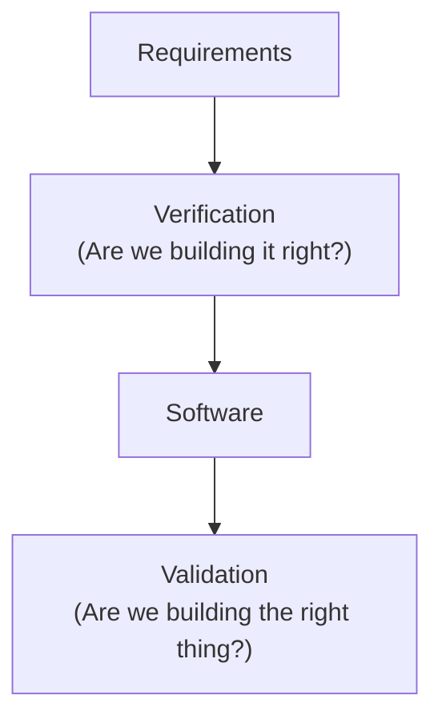

# Verification vs. Validation

**Prerequisites**: You should already understand [Agile & Scrum Basics for QA](/learning-paths/foundations/agile-and-scrum-basics-for-qa).
**Leads to**: After this, you'll be ready for [Static vs. Dynamic Testing](/learning-paths/foundations/static-vs-dynamic-testing).

A feature can be built exactly to spec and still be the wrong feature. Verification and validation are the two separate checks that catch each half of that problem — and teams that only run one of them ship products that are either full of defects or confidently wrong.

## Why This Matters

**A team that only validates.** A fintech startup builds a loan-eligibility calculator. Nobody reviews the requirements document before development starts, and nobody reviews the design before it's built — the team goes straight from a one-paragraph brief to code. QA tests the finished feature against real users and finds it technically works: the calculator returns a number. But the underlying eligibility formula was misread from the compliance document during handoff, and it silently disqualifies applicants who should qualify. The bug wasn't caught earlier because nothing checked the requirements *themselves* before building against them.

**A team that only verifies.** A different team runs a rigorous requirements review, a design review, and a code review at every stage — verification is thorough. But nobody actually runs the finished product against a real use case until it's in production. The reviews confirmed the software matched the (subtly wrong) requirements document perfectly. It ships exactly as specified, and is exactly as broken as the spec was, because nobody ever asked "does this actually work for a real user with real data," only "does this match what we wrote down."

Both teams skipped half the check. Verification catches "we built it wrong." Validation catches "we built the wrong thing." A team needs both, because each one is blind to the failure the other one catches.

## What Verification and Validation Are

**Verification** asks: *Are we building the product right?* It confirms that each stage of development matches the stage before it — that the design matches the requirements, that the code matches the design, that the build matches the spec. Verification is done without running the software; it's a review process.

**Validation** asks: *Are we building the right product?* It confirms that the finished software actually satisfies the user's real need, by running it and checking its behavior against reality — not just against a document. Validation happens by executing the software.

| | Verification | Validation |
|---|---|---|
| **Question** | Are we building it right? | Are we building the right thing? |
| **Checks against** | Requirements, design documents, specifications | Actual user needs, real-world behavior |
| **How it's done** | Reviews, walkthroughs, inspections, static analysis | Executing the software — testing |
| **Catches** | Internal inconsistency (code doesn't match design) | Requirements that were wrong to begin with |
| **Typical activities** | Requirements review, design review, code review | Functional testing, user acceptance testing, usability testing |

A common shorthand: verification is *static* — it happens on paper, without running anything. Validation is *dynamic* — it only happens by running the software. That distinction is explored in full in Static vs. Dynamic Testing, the next module — this chapter focuses on the *purpose* each serves, that module focuses on the *technique*.

It's easy to assume validation is "real testing" and verification is a bureaucratic formality. In practice, verification is often cheaper insurance: catching a wrong requirement during a one-hour review costs an hour. Catching the same wrong requirement after the feature is built, tested, and shipped costs a rewrite — and possibly a production incident first.

## When Each Applies

**Verification applies throughout development, before anything is executable:**
- When a requirements document is written, before any design work starts
- When a design or technical approach is proposed, before any code is written
- When code is written, before it's merged (code review is a form of verification)
- Whenever there's a document or artifact that a later stage will depend on being correct

**Validation applies once there's something to run:**
- When a feature is functionally complete enough to test end-to-end
- Before a release, to confirm the product actually solves the user's problem — not just that it matches the ticket
- During user acceptance testing, where the people who requested the feature confirm it does what they needed, which is sometimes different from what was written down
- After a fix, to confirm the real-world symptom is gone, not just that the code changed in the expected way

Neither replaces the other. A requirements review (verification) can confirm a document is internally consistent and unambiguous, but it can't catch that the underlying business assumption was wrong — only a real user, or someone validating against a real use case, tends to catch that.

## How This Works on a Real Project

An insurance company is building a claims-status notification feature: policyholders should get an email when their claim status changes. The team runs both checks deliberately, at different stages.

**Verification, at the requirements stage:** Before any code is written, a business analyst, a developer, and a QA engineer review the requirements document together. QA asks a pointed question: the document says "notify the policyholder when status changes," but doesn't say whether a policyholder should be notified for *every* status change or only certain ones. The document is ambiguous in a way that would have let two developers implement it two different ways. The team resolves it in the review — notify only on the four customer-relevant statuses, not every internal workflow state — and updates the document before development starts. This is verification: catching a defect in the requirements themselves, before anything downstream depends on them.

**Verification, at the design stage:** The proposed technical design routes notifications through the same email service used for marketing emails. QA flags that transactional emails (claim status) and marketing emails share an unsubscribe list in that service — meaning a policyholder who unsubscribed from marketing could also stop receiving claim status updates, which is a compliance problem, not just an inconvenience. This gets caught and redesigned before a line of code is written.

**Validation, once the feature is built:** QA now runs the finished feature — actually triggering claim status changes and confirming real emails arrive, with the right content, only for the four correct statuses, and independent of marketing-email unsubscribe status. This is validation: confirming the built software behaves correctly for a real policyholder, not just that it matches the (now-corrected) requirements document.

**Validation, at user acceptance:** Before release, two claims adjusters — the actual future users — try the feature against real claim scenarios from their daily work, not the QA team's test cases. One adjuster points out that a status labeled "Under Review" in the system reads as alarming to a policyholder who doesn't know it's routine — a genuine product gap that no requirements review or functional test would have caught, because it's about how the message *lands* with a real user, not whether it technically works.

Two of these four checks — the ambiguous requirement and the shared unsubscribe list — were caught by verification, before any code existed to test. The other two — correct email delivery and the alarming wording — could only be caught by validation, because they required something real to run or read.

## Common Mistakes

**Mistake 1: Treating requirements review as optional because "we'll catch it in testing anyway."**
Some requirements defects — like an ambiguous or wrong business rule — produce software that passes every test written *against that same wrong requirement*. Testing against a flawed spec doesn't catch a flaw in the spec itself.

**Mistake 2: Skipping validation because verification was thorough.**
A design that perfectly matches a well-reviewed requirements document can still fail a real user, because "matches the document" and "solves the actual problem" are different claims. Verification confirms internal consistency, not real-world fitness.

**Mistake 3: Confusing "the code does what the ticket says" with "done."**
A developer who verifies their own code against the ticket has performed verification, not validation — they've confirmed internal consistency with a document, not that it works for an actual user in an actual scenario.

**Mistake 4: Running validation on obviously wrong requirements instead of catching them earlier.**
If a requirements review would have caught a defect in one hour, and it instead gets caught during validation after the feature is fully built, the team paid for a full build-test cycle for a defect that never needed to exist by that point.

## Best Practices

**Practice 1: Run a requirements review before development starts, every time.**
A short review with QA, a developer, and whoever owns the requirement catches ambiguity and wrong assumptions while they're still cheap to fix — before design or code depends on them.

**Practice 2: Include design review as a form of verification, not just code review.**
Verifying a design against requirements before implementation starts catches structural problems (like the shared unsubscribe list above) that a later code review, focused on implementation detail, is less likely to surface.

**Practice 3: Validate with people who didn't write the requirements.**
The people who wrote a requirements document already believe it's correct — that's why they wrote it that way. Real validation gaps surface fastest with people encountering the feature fresh, ideally actual future users.

**Practice 4: Don't let a passing verification stage substitute for validation, or vice versa.**
A feature isn't done because it matches its requirements (verification only), and it isn't done because it happens to work in a demo (validation only, and possibly a lucky one). Both checks need to pass.

## Key Takeaways

- Verification asks "are we building it right?" and checks internal consistency between stages — requirements, design, code — without running anything.
- Validation asks "are we building the right thing?" and confirms the finished software actually solves the real user's problem, by running it.
- A requirement can be internally consistent and still wrong; only validation, against real use, catches that.
- Verification is generally cheaper insurance — catching a defect in a document costs far less than catching the same defect after it's been built and tested.
- Neither check replaces the other; a mature process runs both, at different stages.

---

## What You Just Learned

- The distinction between verification ("built it right") and validation ("built the right thing")
- Why each check catches a category of defect the other one is blind to
- How an insurance company caught two requirements-level defects through verification, and two real-world gaps through validation, on the same feature
- Why catching a defect through verification is typically far cheaper than catching the same defect through validation

**Next:** [Static vs. Dynamic Testing](/learning-paths/foundations/static-vs-dynamic-testing)

## Related Topics

- [Testing Across the SDLC](/learning-paths/foundations/testing-across-the-sdlc) — Where in the SDLC and STLC verification and validation activities typically happen
- [Risk-Based Testing Fundamentals](/learning-paths/foundations/risk-based-testing-fundamentals) — Why catching a defect earlier (verification) is generally cheaper than catching it later (validation)
- [What Is Software Testing?](/learning-paths/foundations/what-is-software-testing) — The testing-vs-checking distinction this chapter builds on

## Interview Questions

**Q1: What's the difference between verification and validation?**

*What to look for*: A clear statement of "building it right" vs. "building the right thing," plus a concrete example of a defect each one catches that the other wouldn't — not just a memorized definition.

**Q2: Can a feature pass verification and still fail validation? Give an example.**

*What to look for*: Recognition that a feature can perfectly match a requirements document that was itself wrong or incomplete — like the "alarming wording" example — showing the candidate understands verification checks consistency, not correctness of the underlying idea.

**Q3: Where would you insert a requirements review in a typical sprint, and why does timing matter?**

*What to look for*: An answer that places the review before development starts, with reasoning about cost — a defect caught in review is far cheaper than the same defect caught after the feature is built and tested.

---

## Glossary

**Verification**: Confirming that each stage of development is internally consistent with the stage before it — that the design matches the requirements, that the code matches the design — done through review, not execution.

**Validation**: Confirming that a finished, running product actually satisfies the real user's need, by executing the software rather than reviewing a document.

**Requirements Review**: A verification activity where stakeholders examine a requirements document before development starts, to catch ambiguity, contradictions, or wrong assumptions early.

**User Acceptance Testing (UAT)**: A validation activity where the people who requested a feature confirm it meets their actual need, often the last check before release.
