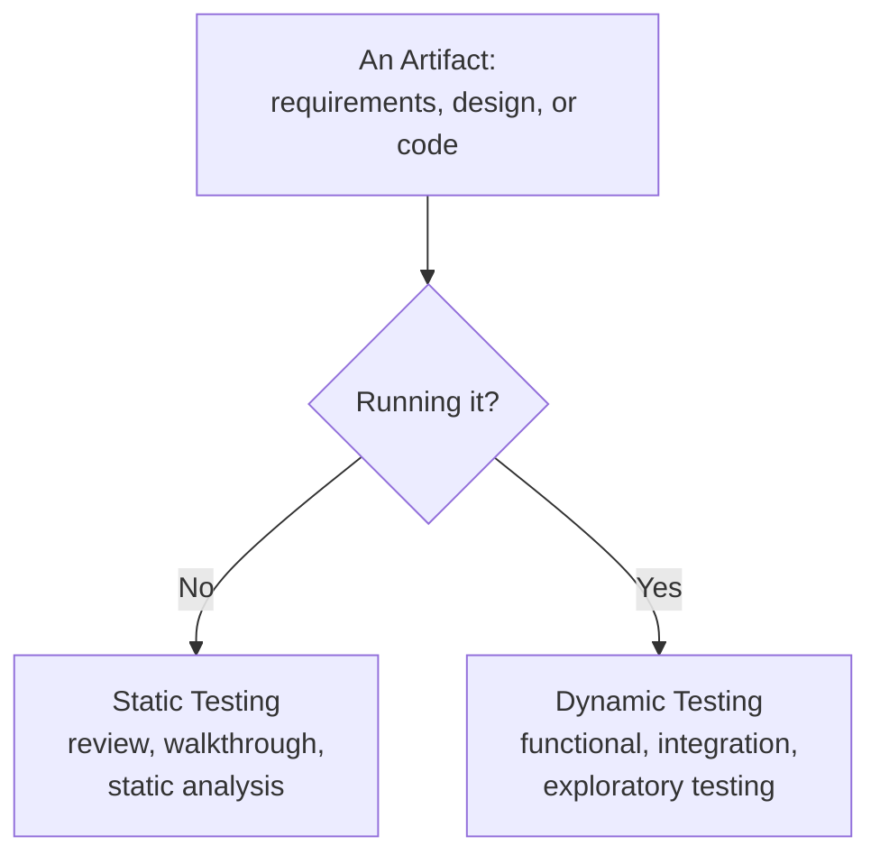

# Static vs. Dynamic Testing

**Prerequisites**: You should already understand [Verification vs. Validation](/learning-paths/foundations/verification-vs-validation).
**Leads to**: After this, you'll be ready for [Risk-Based Testing Fundamentals](/learning-paths/foundations/risk-based-testing-fundamentals).

[Verification vs. Validation](/learning-paths/foundations/verification-vs-validation) drew the line at *purpose* — are we building it right, versus are we building the right thing. This chapter draws the same line at the level of *technique*: static testing examines an artifact without running it, dynamic testing examines behavior by running it. Understanding which techniques belong to which category is what turns "we should test more" into a concrete plan for what to actually do, and when.

## Why This Matters

**A team that only runs dynamic testing.** A team builds a payment-retry feature entirely without any code review or static analysis — the first time anyone besides the author looks at the logic is when QA runs it. QA's dynamic tests all pass: retries happen, payments succeed. Weeks later, a linting tool finally gets run as an afterthought and immediately flags a resource leak in the retry loop — a connection that's opened on every retry attempt and never closed. It hadn't caused a failure yet in testing because test runs were short; in production, under sustained retry load during a payment-provider outage, it exhausted the connection pool and took down an unrelated part of the system. A five-second static analysis check, run before any dynamic testing even started, would have caught it immediately.

**A team that only runs static testing.** A different team invests heavily in code review and static analysis for a new search-ranking algorithm — every review passes, every static check is green. But nobody actually runs the algorithm against real search queries before release. In production, the ranking technically works exactly as reviewed and approved, but produces results that are technically correct and practically useless — the top result for a common query is a barely-related product, because the ranking logic, while clean and well-reviewed, never accounted for a real-world case that only shows up when it's run against actual data. Static testing can confirm code is well-structured; it can't confirm it behaves sensibly against reality the way running it can.

Static and dynamic testing catch different categories of defect because they operate on the software in fundamentally different states — one before it runs, one while it's running.

## What Static and Dynamic Testing Are

**Static testing** examines an artifact — requirements, a design, or code — without executing it. It relies on reading, reviewing, and automated analysis, not running anything.

**Dynamic testing** examines actual behavior by executing the software with real or simulated inputs and observing what happens.

| | Static Testing | Dynamic Testing |
|---|---|---|
| **Software running?** | No | Yes |
| **Examines** | Requirements, design, code, documentation | Actual runtime behavior |
| **Typical activities** | Code review, walkthroughs, static analysis tools, linting, requirements inspection | Functional testing, integration testing, performance testing, exploratory testing |
| **Catches** | Structural issues, unclear logic, style violations, some classes of bug (unused variables, resource leaks, unreachable code) | Behavioral issues, logic errors that only manifest with real data, timing and load issues |
| **Cost to run** | Cheap, fast, can run on every commit | More expensive — needs a working build, test data, and often a running environment |

This maps directly onto verification and validation, but it's not the exact same axis. Verification and validation are about *purpose* (matching a spec vs. matching a real need); static and dynamic are about *mechanism* (reading vs. running). In practice, verification is almost always done through static techniques, and validation is almost always done through dynamic techniques — which is why the two distinctions are easy to blur together. The useful way to hold them apart: static/dynamic tells you *how* a check is performed; verification/validation tells you *what question* it's trying to answer.

:::tip From the Field
In one fintech project, a feature passed every dynamic test we threw at it — every scenario in the test suite came back green. It was only during a requirements walkthrough, a purely static exercise with no code running at all, that someone read the settlement-timing rule out loud and realized it was ambiguous enough to support two different correct implementations. The code wasn't broken; the requirement it was faithfully built from was underspecified. No dynamic test could have caught that, because every test we wrote was itself built from the same ambiguous requirement.
:::

## When Each Applies

**Static testing applies as early and as often as possible:**
- The moment a requirements document exists, before design starts (a static review, covered in depth in the previous module)
- On every code change, via linting and static analysis tools integrated into the development workflow — not as a separate manual step someone has to remember
- During code review, before a change merges
- Whenever a defect class is well-understood enough to be checked mechanically (unused variables, obvious null-reference risks, style violations) — these don't need a human running the software to catch

**Dynamic testing applies once there's something executable:**
- As soon as a feature is functionally complete enough to run, even partially
- Whenever behavior under real or realistic conditions is the actual question — load, timing, concurrency, and real user interaction can only be observed by running the system
- For exploratory testing, where a tester's judgment and creativity find issues no static rule could have anticipated
- As the final check before release, since it's the only technique that confirms the *whole* system behaves correctly together, not just that each piece was individually well-formed

Static testing is cheap enough that there's rarely a good reason to skip it — a five-minute lint pass or code review catches a real class of bugs before a single test needs to run. Dynamic testing is what confirms the software actually does its job in practice; no amount of static review substitutes for actually running it.

## How This Works on a Real Project

A healthcare records team is building a feature that flags potential drug interactions when a doctor prescribes a new medication. Both static and dynamic testing get applied deliberately, at different points.

**Static, on the requirements:** Before development starts, a walkthrough of the interaction-flagging rules catches an ambiguity — the rules don't specify what happens when a drug interacts with two other current medications differently (one interaction is minor, one is severe). This gets resolved and documented before any code exists: always surface the most severe interaction, never average or hide it.

**Static, on the code:** A static analysis tool, run automatically on every commit, flags that the interaction-checking function has a code path where a null medication list would cause an unhandled exception rather than a graceful "no interactions found" result — caught in seconds, without anyone needing to construct a test case for it.

**Dynamic, on the feature:** QA then runs the actual feature against a set of realistic prescription scenarios — a patient on three medications where a fourth is added, a patient with an incomplete medication history, a patient where two interactions of different severities apply simultaneously (the exact ambiguity resolved during the static requirements walkthrough). Running the software confirms the most-severe-interaction rule actually behaves correctly in practice, not just that it was correctly specified and reviewed.

**Dynamic, under load:** Because prescriptions are often written in batches during morning hospital rounds, the team also runs a load test simulating 50 doctors submitting prescriptions within the same two-minute window — something no static review of the code could ever surface, since it's purely a question of runtime behavior under real conditions.

The requirements ambiguity and the null-handling bug were both caught statically, before a test run was needed. The correctness of the severity rule in practice, and the system's behavior under realistic concurrent load, could only be confirmed by actually running it.

## Common Mistakes

**Mistake 1: Treating static analysis tools as optional tooling rather than a standard gate.**
A linter or static analyzer that isn't wired into the commit or review process gets skipped under deadline pressure — exactly when its cheap, fast checks matter most.

**Mistake 2: Assuming code review alone counts as "testing."**
Code review is real static testing and catches real defects, but it's not a substitute for running the software — a reviewer reading code can miss behavioral issues that only appear when real data or real load hits it.

**Mistake 3: Delaying dynamic testing until a feature feels "finished."**
Waiting for a feature to be fully complete before running it once means every defect dynamic testing would have caught gets discovered all at once, late, instead of incrementally as the feature was built.

**Mistake 4: Using dynamic testing to catch defects a static check would have caught in seconds.**
Writing a dedicated test case to catch an unused variable or an obviously unreachable code path is a poor use of the more expensive technique for a defect class the cheap technique already covers.

## Best Practices

**Practice 1: Wire static analysis into the workflow, not into memory.**
Linting and static analysis should run automatically on every commit or pull request, not depend on a developer remembering to run them manually.

**Practice 2: Use static testing for what it's cheap at, dynamic testing for what only running reveals.**
Structural and style issues belong to static checks; behavior under real data, timing, and load belongs to dynamic checks. Matching the technique to the defect class keeps both cheap and effective.

**Practice 3: Don't let a clean static pass create false confidence.**
A codebase with zero lint warnings and a clean code review can still behave incorrectly at runtime — static cleanliness is necessary, not sufficient.

**Practice 4: Start dynamic testing on partial functionality, not just the finished feature.**
Running whatever exists so far, even incomplete, surfaces behavioral issues incrementally instead of all at once at the end.

## Key Takeaways

- Static testing examines an artifact without running it (requirements, design, code); dynamic testing examines actual behavior by executing the software.
- Static and dynamic map closely onto verification and validation, but the two distinctions answer different questions — mechanism (how) versus purpose (why).
- Static testing is cheap and should run constantly and automatically; dynamic testing is what confirms real-world behavior and can't be skipped in favor of static checks alone.
- Some defect classes (structural issues, obvious logic errors) are cheap to catch statically; others (behavior under load, real-data edge cases) can only be found dynamically.

---

## What You Just Learned

- The distinction between static testing (examining without running) and dynamic testing (examining by running)
- How static/dynamic (mechanism) relates to, but isn't identical to, verification/validation (purpose)
- How a healthcare records team caught two defects statically, before any test run, and two more only by running the software under realistic and load conditions
- Why matching technique to defect class keeps both fast and effective

**Next:** [Defect Life Cycle](/learning-paths/foundations/defect-life-cycle)

## Related Topics

- [Verification vs. Validation](/learning-paths/foundations/verification-vs-validation) — The purpose-level distinction (why) that this chapter's mechanism-level distinction (how) maps onto
- [Testing Across the SDLC](/learning-paths/foundations/testing-across-the-sdlc) — Where static and dynamic testing activities typically happen across the STLC
- [Risk-Based Testing Fundamentals](/learning-paths/foundations/risk-based-testing-fundamentals) — Why cheap static checks are worth running on everything, while expensive dynamic checks get prioritized by risk

## Interview Questions

**Q1: What's the difference between static and dynamic testing?**

*What to look for*: A clear statement that static testing doesn't run the software and dynamic testing does, plus at least one concrete example of a defect each one catches that the other can't.

**Q2: How does static vs. dynamic testing relate to verification vs. validation?**

*What to look for*: Recognition that they're related but not identical — static/dynamic is about mechanism, verification/validation is about purpose — rather than treating the two pairs as interchangeable synonyms.

**Q3: Give an example of a defect that static analysis would catch but a functional test might miss, or vice versa.**

*What to look for*: A concrete example — an unused variable or resource leak for the static case, a load- or timing-dependent issue for the dynamic case — not a generic restatement of the definitions.

---

## Glossary

**Static Testing**: Examining a requirements document, design, or code without executing it, typically through review or automated analysis.

**Dynamic Testing**: Examining a system's actual behavior by executing it with real or simulated inputs.

**Static Analysis**: An automated tool that examines source code for structural issues, style violations, or known defect patterns without running the code.

**Linting**: A specific form of static analysis focused on code style and common, mechanically-detectable mistakes.
