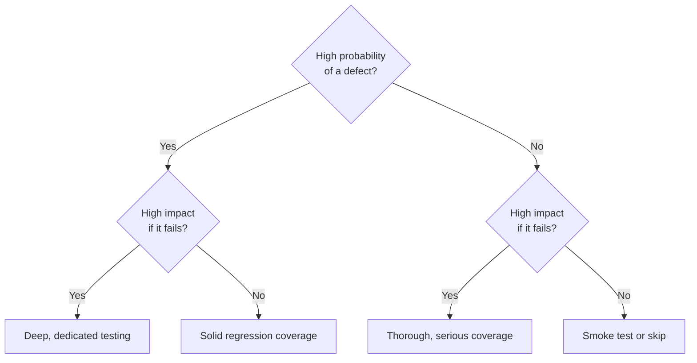

# Risk-Based Testing Fundamentals

**Prerequisites**: You should already understand [Static vs. Dynamic Testing](/learning-paths/foundations/static-vs-dynamic-testing).
**Leads to**: After this, you'll be ready for [Quality Attributes](/learning-paths/foundations/quality-attributes).

Testing time is always finite. No team has enough hours to test every feature, every input, and every combination with equal thoroughness — and even if they did, most of that effort would be wasted on parts of the product that were never likely to break or never likely to matter if they did. Risk-based testing is how experienced testers spend limited time where it actually counts.

## Why This Matters

**A team that tests everything equally.** A banking app's next release includes a rewritten interest-calculation engine and a redesigned footer with updated social media icons. Both get one QA engineer, split evenly: two days each. The footer testing finds a misaligned icon on one screen size. The interest calculation — tested with the same two days, not more — ships with a rounding error that undercharges interest on a specific loan type, discovered three billing cycles later by an unhappy customer, not by QA.

**A team that ranks risk deliberately.** The same release, the same two features. This time, QA spends one afternoon on the footer (smoke test, confirm nothing's broken, done) and four full days on the interest engine — building out edge cases for every loan type, rounding boundary, and currency conversion path. The footer ships with the same minor icon misalignment as before; nobody notices or cares. The interest engine ships correct.

Same total testing time in both scenarios. Completely different outcome, because the second team deliberately weighted its effort by what was actually likely to fail and what would actually matter if it did.

## What Risk-Based Testing Is

Risk-based testing means prioritizing test effort using two factors, not one:

- **Probability**: how likely is this area to contain a defect? (Complex logic, recent changes, and unfamiliar code are more likely to break than simple, stable, well-understood code.)
- **Impact**: how bad would it be if a defect here reached production? (A miscalculated loan balance is worse than a misaligned icon.)

Plotting features against both factors produces a simple risk matrix:

| | Low Impact | Medium Impact | High Impact |
|---|---|---|---|
| **High Probability** | Light testing, fix opportunistically | Solid regression coverage | Deep, dedicated testing — the top priority |
| **Medium Probability** | Smoke test only | Standard regression coverage | Thorough coverage, treated seriously |
| **Low Probability** | Skip, or smoke test only | Light testing | Still meaningful testing — low probability isn't zero probability |

A footer redesign is low-probability (simple, well-understood change) and low-impact (nobody's money or safety depends on it) — light testing is the correct, deliberate choice, not a shortcut. An interest-calculation rewrite is high-probability (complex, unfamiliar logic) and high-impact (it's money) — it earns the deepest testing the team can afford.

## When to Apply Risk-Based Thinking

Risk-based testing applies whenever test time is constrained — which, in practice, is always. It matters most in a few recognizable situations:

- **Tight deadlines**: when there genuinely isn't time to test everything to the same depth, risk-based prioritization decides what gets the depth.
- **Legacy systems**: when nobody currently on the team fully understands a system's risk areas, a quick risk assessment surfaces where to be careful before testing starts.
- **Regulated domains**: where certain failures carry legal or compliance consequences that make their impact score high regardless of how simple the code looks.
- **Large feature surface, limited QA capacity**: the more there is to test relative to the people available to test it, the more prioritization decisions matter.

Risk-based testing is not permission to skip low-risk areas entirely. It's a decision about *depth*, not presence — even the low-probability, low-impact quadrant usually still gets a smoke test, just not a deep one. Skipping something entirely is a separate, more deliberate decision that should be visible, not a side effect of "we ran out of time."

## How This Works on a Real Project

An e-commerce team normally has three weeks to test before a major release. Ahead of a big seasonal sale, the business moves the launch date up — QA now has one week, not three.

Rather than testing everything at one-third the usual depth (which would have produced exactly the "equal but shallow" outcome from the first scenario above), the QA lead runs a one-hour risk assessment with a developer and the product manager in the room, not alone. They list the release's major areas — checkout, payment processing, search, product recommendations, account settings — and score each on probability and impact.

**Checkout and payment processing** score high on both: any defect here directly costs revenue during the highest-traffic week of the year, and both areas changed recently to support a new payment provider. They get the full week's deepest attention: exhaustive edge cases, plus a load test simulating sale-day traffic.

**Search** scores medium probability, medium impact — it changed slightly but isn't new, and a search bug is annoying but not revenue-blocking the way a checkout bug is. It gets standard regression coverage, not the deep treatment.

**Recommendations** score low probability (unchanged this release) and low impact (a bad recommendation doesn't block a purchase). It gets a smoke test — confirm it still loads, nothing more.

**Account settings** score low on both axes, unchanged this release, no recent user complaints. The team makes a deliberate, documented decision to skip it entirely this cycle, and says so explicitly in the release notes — a visible trade-off, not a silent gap discovered later.

The release ships on the compressed timeline. A minor search-ranking quirk surfaces after launch — acceptable, given the resulting checkout and payment reliability during the highest-traffic week of the year.

## Common Mistakes

**Mistake 1: Treating risk-based testing as an excuse to skip low-priority areas entirely.**
Risk-based testing reduces *depth* for low-risk areas — it doesn't mean ignoring them by default. A smoke test still catches "this is completely broken," which is worth thirty seconds to rule out.

**Mistake 2: Ranking risk once and never revisiting it.**
Risk changes as the product changes. A feature that was low-risk last release can become high-risk this release simply because it was just rewritten, or because a new regulation now applies to it.

**Mistake 3: Confusing "risk to the business" with "risk to a senior engineer's ego."**
"That code was written by our most senior engineer, it's probably fine" is not a risk assessment — it's a bias. Probability should be judged by the complexity and recency of the change, not by who wrote it.

**Mistake 4: Not documenting what was deliberately not tested.**
A gap that's a visible, communicated trade-off is a defensible engineering decision. The same gap discovered silently by a customer looks like negligence, even when the underlying reasoning was sound.

## Best Practices

**Practice 1: Run risk assessment as a team activity, not a solo QA judgment call.**
Developers know what changed and how risky the implementation felt; product knows what actually matters to the business. A risk ranking built from only one of those perspectives will miss something the others would have caught.

**Practice 2: Revisit risk rankings every release, not once at project start.**
Yesterday's low-risk area is today's high-risk area the moment it gets rewritten, gains new regulatory scope, or starts handling more traffic.

**Practice 3: Make excluded areas a visible decision, not a silent gap.**
State plainly, in release notes or a test summary, what wasn't tested this cycle and why. It converts a risk into a decision stakeholders actually agreed to.

**Practice 4: Score both probability and impact — never rank by gut feeling alone.**
"This feels important" is a starting point, not a substitute for actually asking how likely a defect is and how bad it would be.

## Key Takeaways

- Risk-based testing prioritizes effort using two factors — probability of failure and impact if it fails — not one.
- It's a decision about depth of testing, not presence: even low-risk areas usually still get a smoke test.
- Risk changes as the product changes; a ranking done once goes stale.
- Documenting what was deliberately excluded turns a risk into a visible, defensible decision instead of a silent gap.
- Risk assessment works best as a short team exercise involving developers and product, not a solo call.

---

## What You Just Learned

- What risk-based testing is, and the two factors (probability, impact) it weighs
- When risk-based prioritization matters most
- How a real team compressed three weeks of testing into one without testing everything equally shallow
- The difference between reducing depth and silently skipping something

**Next:** [Quality Attributes](/learning-paths/foundations/quality-attributes)

## Related Topics

- [What Is Software Testing?](/learning-paths/foundations/what-is-software-testing) — The risk-based thinking this chapter builds on
- [Testing Across the SDLC](/learning-paths/foundations/testing-across-the-sdlc) — How risk assessment fits into test planning within the STLC
- Test Design Techniques (coming soon, Manual Testing path) — Turning a risk ranking into specific, deep test cases for high-risk areas
- Performance Testing (coming soon) — Often the deepest layer of testing a high-impact, high-probability area needs

## Interview Questions

**Q1: How would you decide what to test if you only had half the usual time?**

*What to look for*: A structured answer involving probability and impact, not just "I'd test the important stuff first" without defining important. Strong candidates mention involving developers or product in the assessment, not deciding alone.

**Q2: Walk me through how you'd build a risk matrix for a feature you're not familiar with.**

*What to look for*: Recognition that probability comes from complexity/recency of change and impact comes from business/user consequence — and that unfamiliarity with a system is itself a reason to ask more questions before scoring it, not a reason to guess.

**Q3: Tell me about a time you deliberately chose not to test something. How did you decide, and how did you communicate it?**

*What to look for*: A real example showing a deliberate trade-off, explicitly communicated to the team — not a story about running out of time and hoping nobody noticed.

---

## Glossary

**Risk Matrix**: A grid plotting probability of failure against impact of failure, used to prioritize testing effort across a feature set.

**Probability (in risk-based testing)**: How likely an area is to contain a defect, typically driven by complexity, recency of change, and how well-understood the code is.

**Impact (in risk-based testing)**: How severe the consequences would be if a defect in this area reached production.

**Smoke Test**: A shallow test confirming a feature's basic functionality works at all, used to quickly rule out major breakage without deep coverage.

**Regression Test**: A test re-run to confirm that previously working functionality still works after a change elsewhere in the system.
