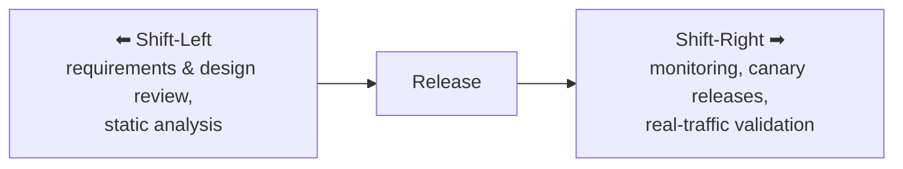

# Shift-Left & Shift-Right Testing

**Prerequisites**: You should already understand [Testing Across the SDLC](/learning-paths/foundations/testing-across-the-sdlc) and [Quality Attributes](/learning-paths/foundations/quality-attributes).
**Leads to**: After this, you'll be ready for [Defect Life Cycle](/learning-paths/foundations/defect-life-cycle) and [Severity vs. Priority](/learning-paths/foundations/severity-vs-priority).

Picture a release timeline as a straight line: requirements on the left, production on the right. Traditional testing clusters entirely in the middle-right — after code exists, before release. Shift-left and shift-right are two deliberate moves away from that middle: pulling quality work earlier, toward requirements and design, and extending it later, into what actually happens after release. Both moves come from the same realization — waiting for a finished build to start caring about quality, and stopping the moment one ships, both leave real risk uncovered.

## Why This Matters

**A team that only tests in the middle.** A team's process is disciplined but narrow: nothing gets tested until a feature is code-complete, and nothing gets watched once it ships — the team considers its job done at release. A subtle timezone-handling bug in a scheduling feature passes every pre-release test, because the test environment happens to run in the same timezone as the test data. It reaches real users spread across timezones within days of release, and nobody notices for two weeks, because nobody was watching real usage after the release — the team's attention had already moved to the next sprint.

**A team that shifts both directions.** A different team catches the same class of bug two ways it wouldn't have otherwise. Shifting left: during requirements review, someone asks explicitly how the feature should behave across timezones — a question that surfaces the ambiguity before a line of code exists. Shifting right: even after resolving that ambiguity and shipping, the team has real-user monitoring in place, and it flags an unusual pattern of failed schedule confirmations within hours of release — a genuinely new edge case that nobody predicted, caught only because someone was still watching after "done."

Neither move alone would have caught everything. Shifting left reduces how much risk ships in the first place; shifting right catches what still gets through despite that. Waiting for the middle catches neither kind of gap as early as it could.

## What Shift-Left and Shift-Right Are

**Shift-left testing** means moving testing and quality activities earlier in the timeline — toward requirements and design, before code is written — rather than treating testing as something that starts once a build exists. Much of what shift-left describes is exactly the *static, verification* work already covered in [Verification vs. Validation](/learning-paths/foundations/verification-vs-validation) and [Static vs. Dynamic Testing](/learning-paths/foundations/static-vs-dynamic-testing) — this module names the *strategy* of doing more of that, earlier, on purpose.

**Shift-right testing** means extending quality practices past release, into production — monitoring real behavior, testing with real (or realistic) traffic, and treating what happens after "done" as still within QA's concern.

| | Shift-Left | Shift-Right |
|---|---|---|
| **Direction** | Earlier — toward requirements, design, code | Later — toward and past release, into production |
| **Typical activities** | Requirements review, design review, static analysis, unit testing, early API contract testing | Production monitoring, real-user monitoring, canary releases, feature flags, chaos testing, A/B testing |
| **What it catches** | Defects and ambiguities before they're built into the product | Issues that only manifest under real traffic, real data, or real usage patterns |
| **Underlying principle** | Software Testing Principle 3 — early testing saves time and money | An acknowledgment that no amount of pre-release testing achieves exhaustive testing (Principle 2) — some things only real usage reveals |

The two aren't opposites competing for the same time budget — they address different blind spots. Shift-left reduces how much risk gets built into the software in the first place. Shift-right accepts that some risk will always get through anyway, and puts effort into catching it fast once it's live rather than waiting for a support ticket.

## When Each Applies

**Shift-left applies from the moment a feature is conceived:**
- During requirements review, the earliest and cheapest point to resolve ambiguity — the same activity described as verification
- During design review, before implementation commits the team to a specific technical approach
- Through static analysis and automated checks running on every commit, catching structural issues before a human reviewer even looks
- Through early API contract or interface testing, so integration assumptions are validated before both sides are fully built

**Shift-right applies from the moment something is live, and continues indefinitely:**
- Through production monitoring and alerting, watching for real anomalies in real usage
- Through canary releases or feature flags, exposing a change to a small percentage of real traffic before a full rollout
- Through chaos testing, deliberately introducing failures in production-like conditions to verify the system degrades gracefully
- Through A/B testing, validating that a change actually improves the real outcome it was intended to improve, not just that it works

Shift-right is not a substitute for pre-release testing, and it's not permission to ship carelessly because "we'll catch it in production." It's an acknowledgment that pre-release testing, no matter how thorough, cannot achieve exhaustive testing — some classes of issue (real traffic patterns, real data shapes, real concurrent usage) are only observable once the software is genuinely live.

## How This Works on a Real Project

A ride-sharing company is building a dynamic pricing feature. The team deliberately shifts both directions around the same release.

**Shifting left, at requirements:** Before any code is written, a requirements review — the same static, verification-style activity from earlier modules — surfaces that the pricing formula's behavior during a sudden demand spike (a concert letting out, for example) is unspecified. The team resolves it explicitly: prices can rise, but must be capped at 3x the baseline, before development starts. This is a defect that would otherwise have shipped, caught in a one-hour review instead of a production incident.

**Shifting left, at code:** Static analysis, running automatically on every commit, flags that the pricing calculation has a division that could produce a divide-by-zero error under a specific empty-demand-data condition — caught in seconds, without needing a dedicated test case.

**Shifting right, at release:** Rather than releasing to 100% of riders immediately, the team uses a canary release — exposing the new pricing logic to 2% of real traffic first. Within an hour, production monitoring flags an unexpected pattern: prices are updating correctly, but slightly more slowly than intended during rapid demand changes, a timing characteristic that only appears under real, unpredictable traffic patterns — something no pre-release load test, built from assumptions about traffic, happened to simulate. Because it's caught at 2% exposure instead of 100%, the fix ships before most riders ever see the delayed pricing.

**Shifting right, ongoing:** After full rollout, the team keeps real-user monitoring in place indefinitely, watching for pricing anomalies as a standing practice — not a one-time check, but a permanent extension of the team's testing responsibility past the release date.

Two defects were caught here that a middle-only process would have missed until production regardless: the requirements ambiguity around price caps (caught by shifting left) and the real-traffic timing issue (caught only by shifting right, and only because the team was still watching after release).

## Common Mistakes

**Mistake 1: Treating shift-right as an excuse to test less before release.**
"We'll catch it in production" is a reasonable *addition* to rigorous pre-release testing, not a replacement for it. Shift-right catches what pre-release testing structurally can't reach — it doesn't lower the bar for what should be caught earlier.

**Mistake 2: Shifting left only in name, without actually changing when QA gets involved.**
Saying "we do shift-left testing" while QA still only sees a feature once it's code-complete is the mistake called out directly in [Agile & Scrum Basics for QA](/learning-paths/foundations/agile-and-scrum-basics-for-qa) — the label without the practice.

**Mistake 3: Setting up production monitoring but never acting on what it surfaces.**
Shift-right only works if someone is actually watching and responding to what monitoring reveals — dashboards nobody looks at provide the appearance of shift-right without its benefit.

**Mistake 4: Rolling out changes to 100% of users immediately instead of using canary releases.**
Skipping a gradual rollout means any issue that only shows up under real traffic affects everyone at once, instead of the small percentage a canary release would have limited exposure to.

## Best Practices

**Practice 1: Make requirements and design review a standing habit, not an occasional extra.**
This is where shift-left has its highest return — resolving ambiguity before any code exists is close to the cheapest defect-prevention available.

**Practice 2: Use canary releases or feature flags for anything with meaningful risk.**
Limiting initial exposure turns "everyone hits this bug at once" into "2% of traffic hits this bug, and it's fixed before the rest ever see it."

**Practice 3: Treat production monitoring as part of QA's job, not just an operations concern.**
Shift-right only works when quality-minded people are actually watching what monitoring surfaces and treating anomalies as testing signal, not noise for someone else to triage.

**Practice 4: Pair shift-left and shift-right deliberately, not as competing priorities.**
They catch different categories of risk — budgeting for only one, on the assumption it covers both, leaves a predictable gap.

## Key Takeaways

- Shift-left moves testing earlier, toward requirements and design, catching defects before they're built into the product — largely by doing more of the static, verification-style work covered earlier in this path, deliberately and earlier.
- Shift-right extends testing past release, into production, catching what only real usage reveals.
- The two aren't competing strategies — they cover different blind spots that neither pre-release nor post-release-only testing can reach alone.
- Canary releases and feature flags limit how many real users are exposed to an issue that only shift-right could have caught.
- Shift-right requires someone to actually act on what production monitoring surfaces — a dashboard nobody watches provides no real benefit.

---

## What You Just Learned

- The distinction between shift-left (earlier) and shift-right (later, into production) testing strategies
- How shift-left connects directly to verification and static testing, and shift-right to the practical limits of exhaustive testing
- How a ride-sharing team caught one defect by shifting left (a requirements gap) and one only by shifting right (a real-traffic timing issue a canary release limited the blast radius of)
- Why shift-right supplements rigorous pre-release testing rather than replacing it

**Next:** [Defect Life Cycle](/learning-paths/foundations/defect-life-cycle)

## Related Topics

- [Verification vs. Validation](/learning-paths/foundations/verification-vs-validation) — The static, purpose-driven activities that shift-left is largely built from
- [Static vs. Dynamic Testing](/learning-paths/foundations/static-vs-dynamic-testing) — The mechanism-level distinction underlying most shift-left activities
- [Software Testing Principles](/learning-paths/foundations/software-testing-principles) — Early testing saves time and money (Principle 3) and exhaustive testing is impossible (Principle 2), the two principles this module directly extends into a strategy
- [Agile & Scrum Basics for QA](/learning-paths/foundations/agile-and-scrum-basics-for-qa) — Where shift-left shows up concretely, in backlog refinement and sprint planning

## Interview Questions

**Q1: What's the difference between shift-left and shift-right testing?**

*What to look for*: A clear statement that shift-left moves testing earlier (toward requirements/design) and shift-right extends it later (into production), plus recognition that they solve different problems rather than being two names for the same idea.

**Q2: Does shift-right testing mean you can test less before release?**

*What to look for*: A firm "no" — shift-right supplements pre-release testing by catching what it structurally can't reach, and treating it as permission to test less before release is a real anti-pattern the candidate should recognize.

**Q3: How would you use a canary release to reduce risk in a deployment?**

*What to look for*: An explanation of gradual exposure — releasing to a small percentage of real traffic first, monitoring for issues, and expanding only once confidence is established — not just a definition of the term.

---

## Glossary

**Shift-Left Testing**: Moving testing and quality activities earlier in the development timeline, toward requirements and design, rather than waiting for a finished build.

**Shift-Right Testing**: Extending testing and quality practices past release, into production, through monitoring, canary releases, and real-traffic validation.

**Canary Release**: A deployment strategy that exposes a change to a small percentage of real users first, limiting how many people are affected if an issue only appears under real traffic.

**Feature Flag**: A mechanism for turning a feature on or off (or for a subset of users) without a new deployment, often used to control exposure during a shift-right rollout.
