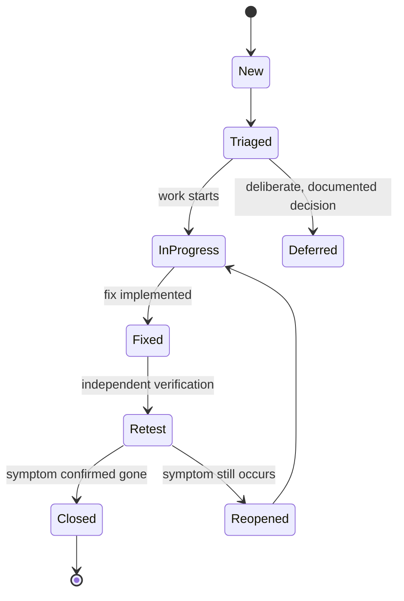

# Defect Life Cycle

**Prerequisites**: You should already understand [Shift-Left & Shift-Right Testing](/learning-paths/foundations/shift-left-and-shift-right-testing) and [Testing Across the SDLC](/learning-paths/foundations/testing-across-the-sdlc).
**Leads to**: After this, you'll be ready for [Severity vs. Priority](/learning-paths/foundations/severity-vs-priority).

A defect that's found and never tracked to closure might as well not have been found. The defect life cycle is the structure that turns "someone noticed a bug" into a reliable, auditable process — one where nothing found gets silently lost, and everyone agrees on what "fixed" actually means before it's called that.

## Why This Matters

**A team without a real defect workflow.** A small team tracks bugs informally — a message in a chat channel, a comment on a pull request, a sticky note. A tester finds a checkout bug and mentions it to a developer directly. The developer means to fix it, gets pulled onto something more urgent, and the mention scrolls out of view in the chat history. Three weeks later, the same bug reaches production, because nothing ever formally tracked it as open, so nobody was ever accountable for either fixing it or explicitly deciding not to.

**A team with a defined defect life cycle.** A different team logs every defect in a shared tracker the moment it's found, in a well-defined initial state. The same checkout bug gets logged, triaged, assigned, and its state changes visibly as work happens on it — anyone can see, at any time, exactly which defects are open, which are fixed and awaiting verification, and which are closed. When the assigned developer gets pulled onto something urgent, the defect stays visibly open in the tracker, not silently forgotten in a chat scrollback. It gets picked back up before release, because the state of "not yet resolved" was never lost.

The difference isn't effort or diligence — both teams have testers who found the bug. The difference is a structure that makes a found defect impossible to quietly lose.

## What the Defect Life Cycle Is

The defect life cycle is the sequence of states a logged defect moves through from discovery to closure. The exact state names vary by tool and team, but the underlying stages are consistent:

| State | What It Means |
|---|---|
| **New** | A defect has just been logged; nobody has reviewed it yet |
| **Triaged / Assigned** | The defect has been reviewed, given a severity and priority (see Severity vs. Priority, coming next), and assigned to someone to fix |
| **In Progress** | The assigned person is actively working on a fix |
| **Fixed / Resolved** | A fix has been implemented and is ready for verification — this is not the same as closed |
| **Retest / Verification** | QA is confirming the fix actually resolves the original defect |
| **Closed** | The fix was verified and the defect is considered fully resolved |
| **Reopened** | Verification failed — the original issue still occurs, or the fix introduced a new one — and the defect returns to an active state |
| **Deferred / Won't Fix** | A deliberate decision not to fix this defect now (or ever), documented with a reason, not silently dropped |

The distinction between **Fixed** and **Closed** is one of the most commonly skipped steps, and one of the most important. A developer marking their own fix as "done" is a claim, not a verification — the defect isn't actually closed until someone independently confirms the original symptom is gone. Skipping that step is how "fixed" bugs quietly reappear.

**Deferred** is not a failure state — it's the same deliberate, visible trade-off described in [Risk-Based Testing Fundamentals](/learning-paths/foundations/risk-based-testing-fundamentals): choosing not to fix something now, and saying so explicitly, is a defensible decision. A defect that just silently disappears from anyone's attention is not.

## When Each State Transition Happens

Understanding *when* a defect moves between states matters as much as knowing the states exist:

- **New → Triaged**: happens during a regular triage session (often daily or per-sprint), where severity and priority are assigned and the defect is routed to an owner — not left for whoever happens to notice it.
- **Triaged → In Progress**: happens when the assigned developer actually starts work, distinct from just being assigned — a defect can sit "assigned" for a while if higher-priority work is in front of it.
- **In Progress → Fixed**: happens when a fix is implemented and ready for someone else to verify — never self-closed by the person who wrote the fix.
- **Fixed → Closed**: happens only after independent verification confirms the original symptom is actually gone, ideally against the exact steps that originally reproduced it.
- **Fixed → Reopened**: happens when verification fails — the fix didn't work, or introduced a new problem. This isn't a failure of process; a life cycle that never has reopened defects usually means verification isn't being done rigorously, not that every fix works the first time.
- **Any state → Deferred**: can happen at triage or later, whenever the team makes a deliberate, documented decision not to prioritize a fix right now.

## How This Works on a Real Project

A fintech team's QA engineer finds a defect: an account balance briefly displays a stale (pre-transaction) value for about two seconds after a transfer completes, before refreshing to the correct number. It's logged the moment it's found — **New** state — with exact reproduction steps, the environment, and a screen recording, so nobody downstream has to reproduce it from a vague description.

At the next triage session, the team discusses it together. The number is only ever briefly wrong and self-corrects, and no real transaction is affected — but it's a financial figure showing incorrect data, even briefly, in a fintech product. The team agrees this needs fixing before the next release and moves it to **Triaged**, assigned to a backend developer, with severity and priority set (covered in the next module).

The developer picks it up a day later — **In Progress** — and finds the root cause: the UI renders an optimistic value from local state before the confirmed server response arrives, and the two don't always match during the brief window between them. They implement a fix that waits for server confirmation before updating the display, and mark it **Fixed**, ready for verification — deliberately not closing it themselves.

QA picks it up for **Retest**, following the exact original reproduction steps rather than a quick spot-check. The stale value no longer appears. The defect moves to **Closed**, with the verification steps documented alongside the original report — so anyone looking at this defect later has a full record: not just what was wrong, but how it was confirmed fixed.

A similar defect is found a month later, in a different screen, where a stale cached value takes noticeably longer to correct — potentially minutes, not seconds. The team decides this one needs the current sprint's full attention rather than deferral, given the fintech context — a different call than a cosmetic UI defect in a lower-stakes product might warrant, echoing [Quality Attributes](/learning-paths/foundations/quality-attributes)' point that context changes how seriously a given issue should be treated.

## Common Mistakes

**Mistake 1: Letting a developer close their own defect without independent verification.**
"Fixed" is a claim about intent; "Closed" should be a claim about confirmed outcome. Collapsing the two removes the check that catches fixes that don't actually work.

**Mistake 2: Tracking defects informally (chat messages, verbal mentions) instead of in a shared tracker.**
Informal tracking has no visible state — a defect mentioned in passing can't be triaged, can't show up in a report, and is trivially easy to lose track of.

**Mistake 3: Treating "Deferred" as equivalent to "ignored" and skipping the documentation.**
A deferral without a stated reason looks identical to negligence later, even when the original decision was sound and deliberate.

**Mistake 4: Panicking when a defect gets reopened, as if it reflects poorly on someone.**
A reopened defect means verification worked as intended — it caught a fix that didn't actually resolve the issue. Treating reopens as a blame signal discourages rigorous retesting, which is the opposite of what the process needs.

## Best Practices

**Practice 1: Log defects immediately, with enough detail to reproduce without asking the reporter later.**
Exact steps, environment, and expected vs. actual behavior turn a defect report into something a different person can act on independently.

**Practice 2: Never let the fix author also be the sole verifier.**
Independent retest is what makes "Closed" a trustworthy claim instead of a self-reported one.

**Practice 3: Run triage regularly, not ad hoc.**
A predictable cadence (daily standup, sprint start) keeps defects from sitting in "New" indefinitely, unassigned and untracked in practice even if technically logged.

**Practice 4: Document the reason for every deferral, even brief ones.**
A one-sentence reason turns a deferred defect into a visible, defensible decision instead of a gap someone discovers later and questions.

## Key Takeaways

- The defect life cycle turns "someone found a bug" into a trackable state that can't be silently lost.
- Fixed and Closed are different claims — a fix is only truly closed after independent verification confirms the original symptom is gone.
- Reopened defects are the verification process working correctly, not a failure to be avoided or blamed on someone.
- Deferred is a legitimate, deliberate state — as long as the reason is documented, echoing the same visible-trade-off principle from risk-based testing.
- Informal tracking (chat mentions, verbal handoffs) is how real defects get lost even when someone genuinely found and cared about them.

---

## What You Just Learned

- The states a defect moves through, from New to Closed, and what each one actually means
- Why Fixed and Closed are distinct states, and what breaks when they're treated as the same thing
- How a fintech team tracked a subtle balance-display defect through its full life cycle, including an independent retest against the original reproduction steps
- Why a reopened defect is a sign the process is working, not a failure

**Next:** [Severity vs. Priority](/learning-paths/foundations/severity-vs-priority)

## Related Topics

- [Software Testing Principles](/learning-paths/foundations/software-testing-principles) — Defect clustering, which shapes where defects like this tend to concentrate
- [Risk-Based Testing Fundamentals](/learning-paths/foundations/risk-based-testing-fundamentals) — The same visible-trade-off reasoning behind a documented "Deferred" decision
- [Quality Attributes](/learning-paths/foundations/quality-attributes) — Why the same class of defect can warrant different urgency depending on product context
- [Shift-Left & Shift-Right Testing](/learning-paths/foundations/shift-left-and-shift-right-testing) — Where in the timeline a defect is typically caught, and how that affects the cost of fixing it

## Interview Questions

**Q1: Walk me through the defect life cycle, from discovery to closure.**

*What to look for*: A candidate who names the real states in order and, critically, explains *why* Fixed and Closed are separate — not just a memorized list of state names.

**Q2: Who should be allowed to close a defect, and why?**

*What to look for*: A clear answer that the person verifying should not be the person who implemented the fix — recognition of why self-verification undermines the check's value.

**Q3: Tell me about a defect that got reopened. What happened, and how did the team react to it?**

*What to look for*: A real example showing the reopen was treated as the process working (catching an incomplete fix), not as a mistake to assign blame for.

---

## Glossary

**Defect Life Cycle**: The sequence of states a logged defect moves through, from initial discovery to final, verified closure.

**Triage**: The activity of reviewing newly logged defects to assign severity, priority, and ownership.

**Retest / Verification**: Independently confirming that a fix actually resolves the original defect, using the original reproduction steps, before marking it closed.

**Reopened**: A defect returned to an active state after verification found the original issue still occurs, or that the fix introduced a new problem.

**Deferred**: A deliberate, documented decision not to fix a defect immediately (or at all), distinct from a defect that's simply been forgotten.
