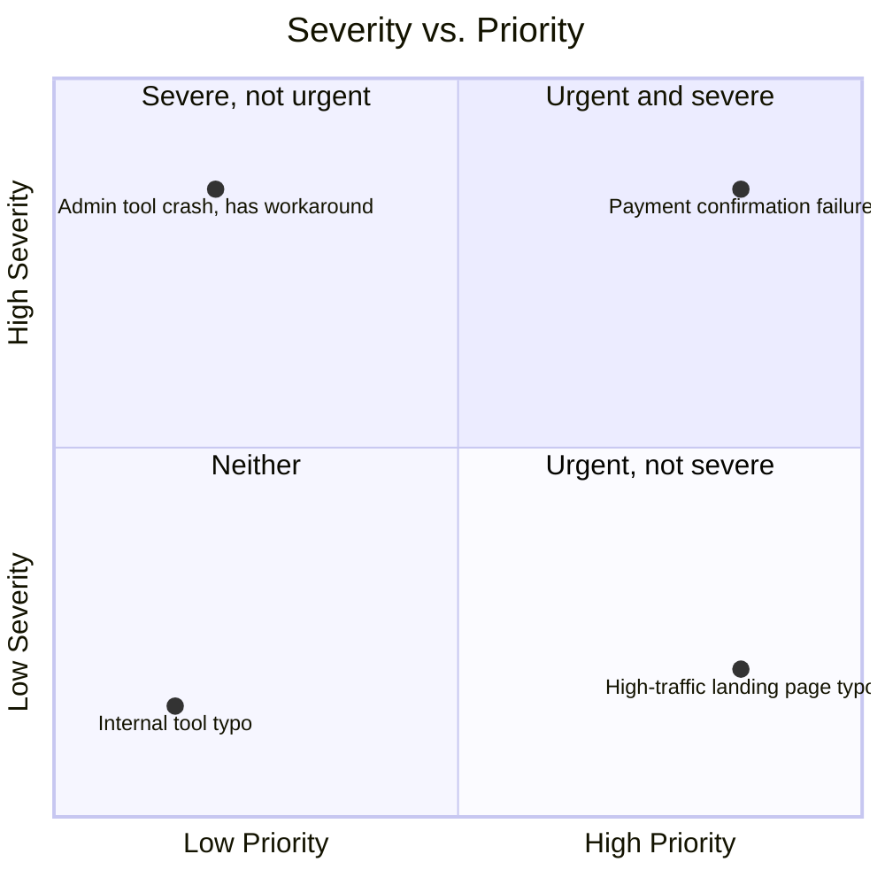

# Severity vs. Priority

**Prerequisites**: You should already understand [Defect Life Cycle](/learning-paths/foundations/defect-life-cycle).
**Leads to**: After this, you'll be ready for [Test Strategy vs. Test Plan](/learning-paths/foundations/test-strategy-vs-test-plan).

Every defect gets triaged with two separate questions: how technically bad is this, and how soon does it need attention. Those questions have different answers more often than beginners expect — and a team that treats them as the same question consistently fixes the wrong things first.

## Why This Matters

**A team that confuses the two.** A defect crashes an internal admin tool used by two employees, twice a year, during an annual reporting task. A developer, seeing "crash," assumes this must be top priority and drops current sprint work to fix it immediately — while a much smaller-looking defect, a typo in a customer-facing error message that's shown to thousands of users daily and makes the company look unpolished, sits untouched in the backlog because "it's just a typo." The team spent urgent attention on a technically severe but rarely-encountered issue, while a low-severity, high-visibility issue kept quietly damaging the product's reputation every single day.

**A team that separates them correctly.** A different team logs the same two defects and triages each one on two axes. The admin tool crash: high severity (it's a crash), but low priority — it affects two people, twice a year, and there's a manual workaround. It gets scheduled for a future sprint, not treated as an emergency. The customer-facing typo: low severity (nothing breaks), but high priority — it's seen by thousands of users daily and reflects on the brand. It gets fixed in the current sprint, ahead of the more "severe" crash. The same two defects, triaged correctly this time, get worked in the order that actually matches business impact.

Severity measures how bad something is on its own terms. Priority measures how soon it needs fixing relative to everything else. A defect can be high on one axis and low on the other — treating them as a single number is how genuinely urgent issues get buried behind technically-scarier-looking ones.

## What Severity and Priority Are

**Severity** measures the technical impact of a defect on the system — how much of the functionality is broken, and how badly. It's usually assessed by QA, based on what the defect actually does to the system, independent of business context.

**Priority** measures how urgently a defect needs to be fixed, relative to other work. It's usually assessed jointly by QA and product/business stakeholders, and it factors in things severity alone doesn't: how many users are affected, how often, whether there's a workaround, and what's at stake if it isn't fixed soon.

| | Severity | Priority |
|---|---|---|
| **Question it answers** | How badly is the system broken? | How soon should this be fixed? |
| **Who typically assesses it** | QA, based on technical impact | QA + product/business, based on urgency and impact |
| **Common levels** | Critical, High, Medium, Low | P0/Urgent, P1/High, P2/Medium, P3/Low |
| **Driven by** | What the defect does to the system | Who it affects, how often, and what's at stake |
| **Can change independently of the other?** | Rarely — technical impact is usually stable once understood | Yes — priority can shift with a release date, a big customer complaint, or a workaround being found |

A simple mental model: severity is a property of the defect itself; priority is a property of the defect *in context* — this release, this business moment, this set of competing work.

## When the Two Diverge

The interesting triage decisions are exactly the cases where severity and priority disagree — because a shared, well-understood distinction is what lets a team make the *right* call instead of defaulting to "severity decides everything":

- **High severity, low priority**: a crash in a rarely-used feature, with a known workaround, right before a release freeze for an unrelated launch — technically severe, but not urgent enough to justify disrupting the current release.
- **Low severity, high priority**: a minor visual glitch on the company's highest-traffic landing page, seen by every visitor, right before a major marketing campaign — cosmetically minor, but urgent given the visibility and timing.
- **High severity, high priority**: a payment processing failure affecting live transactions — the case where both axes agree, and there's no ambiguity about urgency.
- **Low severity, low priority**: a typo in an internal tool nobody customer-facing ever sees — safely deferred, and correctly so.

Recognizing which quadrant a defect falls into is exactly the kind of judgment call risk-based testing already trained: probability and impact, applied here as severity and priority instead.

## How This Works on a Real Project

An e-commerce team is triaging a batch of defects found during a pre-release regression pass, two days before a major sale launch.

**Defect A**: The recommendation engine on the product page occasionally shows an item that's out of stock. Severity is assessed as Low — nothing crashes, checkout still works, the user just sees an unavailable suggestion. But two days before the highest-traffic event of the year, showing an unavailable item repeatedly to shoppers actively looking to buy is a real, visible experience problem at exactly the wrong moment. Priority is set High — it's scheduled to be fixed today, ahead of several technically "worse" defects.

**Defect B**: A rarely-used bulk CSV export feature in the admin panel throws an unhandled exception. Severity is High — it's a crash, full stop. But it's used by one internal team, roughly once a month, and there's a manual export workaround available. Priority is set Low — it's logged, acknowledged, and scheduled for after the sale period, not fixed today.

**Defect C**: The payment confirmation page occasionally fails to load after a successful charge, though the charge itself completes correctly. Severity is High — payment-adjacent failures are inherently serious. Priority is also set High — regardless of how rare, any confusion around "did my payment go through" during peak sale traffic is a trust and support-volume risk the team isn't willing to carry into the sale. This one gets the most urgent attention of the three, correctly.

Two days before launch, the team has limited engineering time. Following priority rather than severity alone, they fix Defect C first, Defect A second, and explicitly defer Defect B — a fully deliberate, documented decision, not an oversight. If they'd triaged by severity alone, the low-severity Defect A (the one that actually mattered most given the timing) might never have been touched before launch.

## Common Mistakes

**Mistake 1: Assuming severity determines priority automatically.**
A "critical" bug in a barely-used feature with a workaround is not automatically more urgent than a "minor" bug affecting every user right now — context decides urgency, not technical severity alone.

**Mistake 2: Letting whoever reports a defect set its priority unilaterally.**
Priority should reflect actual business impact and urgency, assessed with product/business input — not just how alarmed the person who found it happened to feel.

**Mistake 3: Re-litigating severity every triage meeting instead of setting it once.**
Severity is a property of what the defect does technically — it shouldn't change day to day. Priority is what shifts as context changes (a release date approaching, a workaround discovered); conflating the two makes triage slower and less consistent.

**Mistake 4: Using only one field (severity or priority) in the tracker and treating it as covering both concepts.**
Some teams cut a corner by only tracking one axis, which forces every defect into a single dimension and recreates exactly the "urgent-looking but not actually urgent" mistake this module opened with.

## Best Practices

**Practice 1: Assess severity first, based purely on technical impact — before discussing urgency.**
Separating the two conversations keeps severity assessments consistent and prevents urgency pressure from inflating or deflating a technical judgment.

**Practice 2: Involve product or business stakeholders in priority decisions, not just QA.**
Priority depends on business context QA doesn't always have full visibility into — release timing, customer commitments, marketing events — so it shouldn't be a purely technical call.

**Practice 3: Revisit priority when context changes, even if severity hasn't.**
A defect correctly deprioritized last week can become urgent this week if a release date moves closer or a major customer hits it — priority is meant to be dynamic.

**Practice 4: Document the reasoning for priority calls that surprise people, especially low-severity/high-priority ones.**
"Why is a typo P0?" is a reasonable question — a one-line note (e.g. "highest-traffic page, campaign launches Monday") turns a surprising call into an obviously correct one.

## Key Takeaways

- Severity measures technical impact; priority measures how urgently a defect needs fixing relative to everything else.
- The two can diverge in either direction — a high-severity defect can be low priority, and a low-severity defect can be high priority.
- Severity is usually a QA judgment based on the defect itself; priority should involve business context and often product stakeholders.
- Triaging by severity alone risks fixing technically scary-looking defects while genuinely urgent ones wait.
- Documenting the reasoning behind a surprising priority call prevents it from looking like a mistake later.

---

## What You Just Learned

- The distinction between severity (technical impact) and priority (urgency)
- Why the two frequently diverge, and how to recognize which quadrant a defect falls into
- How an e-commerce team triaged three pre-launch defects correctly by priority rather than severity alone, including one deliberate deferral
- Why priority should involve business stakeholders, not just QA judgment

**Next:** [Test Strategy vs. Test Plan](/learning-paths/foundations/test-strategy-vs-test-plan)

## Related Topics

- [Defect Life Cycle](/learning-paths/foundations/defect-life-cycle) — Where severity and priority get assigned, during the Triage state
- [Risk-Based Testing Fundamentals](/learning-paths/foundations/risk-based-testing-fundamentals) — The same probability-and-impact judgment applied here as severity and priority
- [Quality Attributes](/learning-paths/foundations/quality-attributes) — Why the same defect can matter more or less depending on which quality dimension the product weighs most heavily

## Interview Questions

**Q1: What's the difference between severity and priority?**

*What to look for*: A clear statement that severity is technical impact and priority is urgency, plus a concrete example of a defect where the two disagree — not just a memorized definition.

**Q2: Give an example of a low-severity, high-priority defect.**

*What to look for*: A real or realistic scenario showing high visibility, timing, or business context driving urgency despite minimal technical impact — like a cosmetic bug on a high-traffic page right before a launch.

**Q3: Who should decide a defect's priority, and why?**

*What to look for*: Recognition that priority needs business/product input alongside QA, since it depends on context QA doesn't always fully have — not a purely technical, QA-only call.

---

## Glossary

**Severity**: A measure of a defect's technical impact on the system — how much functionality is broken and how badly, assessed independent of business context.

**Priority**: A measure of how urgently a defect needs to be fixed relative to other work, factoring in business impact, visibility, and timing.

**Triage**: The activity of reviewing newly logged defects to assign severity, priority, and ownership. See [Defect Life Cycle](/learning-paths/foundations/defect-life-cycle).

**Workaround**: A way for users to avoid or work around a defect's impact without it being fixed, often a factor that lowers priority even for a high-severity issue.
