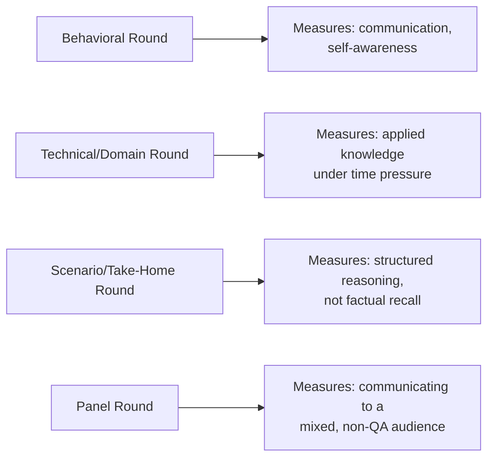

# How QA Interviews Are Structured

**Prerequisites**: You should already have completed [Foundations of Software Testing](/learning-paths/foundations/what-is-software-testing) and [Manual Testing and Test Design](/learning-paths/manual-testing/test-design-fundamentals).
**Leads to**: After this, you'll be ready for [Presenting Your Testing Work Credibly](/learning-paths/interview-preparation/presenting-your-testing-work-credibly).

Every module in this path practices a specific interview scenario. Before any of that practice is useful, you need to know what you're actually walking into: which rounds a real QA interview loop typically contains, and — more importantly — what each round is genuinely trying to find out about you, which is rarely the literal question being asked.

## Why This Matters

**A candidate who treats every round the same way.** A candidate preparing for a QA role studies a list of common interview questions and rehearses confident-sounding answers to each one, without distinguishing what kind of round they're actually in. In a system-design-style round asking "how would you test a ride-sharing app's driver-matching feature," they answer as if it were a factual recall question — naming testing types they know (functional, load, security) without ever asking a clarifying question or reasoning about the specific feature's actual risk. The interviewer isn't looking for a list of testing types; they're watching how the candidate thinks when the problem is deliberately underspecified — and the candidate never shows that, because they treated an open-ended reasoning round like a trivia round.

**A candidate who reads the round correctly.** A different candidate, facing the identical open-ended prompt, recognizes it as a scenario-reasoning round specifically, and responds accordingly — asking a clarifying question first ("is this for driver-side or rider-side testing, and is real-time matching in scope?"), then reasoning aloud through risk before naming techniques. The specific testing types they eventually mention are almost identical to the first candidate's list — the difference is entirely in *how* they got there, because they recognized what this specific round was actually measuring.

Both candidates know the same testing material. Only one of them recognized which round they were in before answering.

## The Real Shape of a QA Interview Loop

**Behavioral rounds**: past-experience questions ("tell me about a time you disagreed with a developer") evaluating communication, self-awareness, and how you actually behave under real workplace friction — not whether the story itself is impressive.

**Technical/domain rounds**: direct questions about testing technique, a specific domain (API, database, automation), or a live exercise (design test cases for this feature, write this query, debug this failing test) — evaluating whether you can actually apply the knowledge you claim to have, under time pressure, without reference material.

**Take-home or scenario/system-design rounds**: open-ended, often deliberately underspecified prompts ("how would you test X") — evaluating structured reasoning and risk judgment specifically, not factual recall. This module's own opening scenario is exactly this round type.

**Panel or cross-functional rounds**: multiple interviewers, sometimes including engineers or product stakeholders — evaluating how you communicate testing judgment to a mixed, not purely QA, audience.

| Round Type | What It Looks Like | What It's Actually Measuring |
|---|---|---|
| Behavioral | "Tell me about a time you..." | Communication, self-awareness, real workplace behavior |
| Technical/Domain | Direct technique questions, live exercises | Applied knowledge under time pressure |
| Scenario/Take-Home | "How would you test X?" | Structured reasoning and risk judgment, not recall |
| Panel | Multiple interviewers, mixed audience | Communicating testing judgment beyond a purely QA audience |

## What the Interviewer Is Really Evaluating

- **Round recognition**: does the candidate adjust their response style to the actual round type, or answer every question the same way regardless of format
- **Structured reasoning under ambiguity**: in scenario rounds specifically, does the candidate ask clarifying questions and reason aloud, rather than guessing at an assumed scope
- **Communication to the actual audience present**: does the candidate calibrate technical depth to who's in the room, especially in panel rounds

## Common Mistakes

**Mistake 1: Treating every round as a factual-recall test, regardless of its actual format.**
This module's opening scenario's entire gap traces to exactly this — a scenario-reasoning round answered as if it were a trivia question.

**Mistake 2: Never asking a clarifying question in an open-ended scenario round.**
Scope ambiguity is often deliberate in these rounds — the interviewer wants to see whether you notice and address it, not guess through it silently.

**Mistake 3: Giving the same level of technical depth in a panel round as in a pure technical round.**
A panel including non-QA stakeholders needs testing judgment translated, not just stated in QA jargon.

## Interviewer Expectations

A strong candidate identifies the round type within the first exchange and adapts their response format accordingly — asking a clarifying question in a scenario round, giving a structured STAR-shaped answer in a behavioral round, and thinking aloud in a technical round rather than working silently and announcing only a final answer.

:::note From the Field
A candidate interviewing for a senior QA role was asked, in what was clearly framed as an open-ended system-design round, "how would you approach testing our new notification system?" They immediately launched into a five-minute list of every testing type they knew, never once asking what platform, what triggers the notifications, or what the actual failure risk was. The interviewer's own notes afterward cited "never asked a single clarifying question" as the specific, decisive factor in a otherwise technically strong candidate not advancing.
:::

:::tip Senior QA Insight
A newer candidate prepares one general-purpose "good answer" style and applies it everywhere. A senior candidate — or a well-prepared newer one — spends the first ten seconds of any question silently classifying which round type it actually is, because the right *shape* of answer differs by round far more than the underlying technical content does.
:::

## Mini Challenge

**Scenario**: You're asked, with no further context, "How would you test a food-delivery app's order-tracking feature?"

**Your task**: Before answering the question itself, write down which round type this is, and the first clarifying question you'd ask.

## Key Takeaways

- A QA interview loop typically contains behavioral, technical/domain, scenario/take-home, and panel rounds, each evaluating something genuinely different.
- Scenario and take-home rounds evaluate structured reasoning and risk judgment, not factual recall — treating them as trivia is a common, costly mistake.
- Recognizing the round type within the first exchange, and adapting your response shape accordingly, is itself an evaluated skill.
- The same underlying technical knowledge needs a different *shape* of answer depending on the round.

---

## What You Just Learned

- The four common round types in a real QA interview loop, and what each is actually evaluating
- Why scenario and take-home rounds specifically reward structured reasoning over factual recall
- How to recognize which round you're in within the first exchange, and adapt accordingly
- Why the same technical knowledge needs different presentation across round types

**Next:** [Presenting Your Testing Work Credibly](/learning-paths/interview-preparation/presenting-your-testing-work-credibly)

## Related Topics

- [What is Software Testing?](/learning-paths/foundations/what-is-software-testing) — The foundational scope this entire path assumes and applies under interview conditions
- [Behavioral Interviews: The STAR Method for QA](/learning-paths/interview-preparation/behavioral-interviews-the-star-method-for-qa) — The specific structure this module's behavioral-round recognition leads into
- [Test Strategy and "How Would You Test X" Interviews](/learning-paths/interview-preparation/test-strategy-and-how-would-you-test-x-interviews) — Where this module's scenario-round recognition gets its full technique treatment

## Glossary

**Scenario/Take-Home Round**: An open-ended, often deliberately underspecified interview prompt evaluating structured reasoning and risk judgment rather than factual recall.

## Quick Revision

Remember these five points:

✓ A QA interview loop typically contains behavioral, technical/domain, scenario/take-home, and panel rounds.
✓ Scenario and take-home rounds evaluate structured reasoning, not factual recall — treating them as trivia is a costly mistake.
✓ Ask a clarifying question in open-ended scenario rounds rather than guessing at assumed scope.
✓ Recognize the round type within the first exchange and adapt your answer's shape accordingly.
✓ Calibrate technical depth to the actual audience present, especially in panel rounds.
