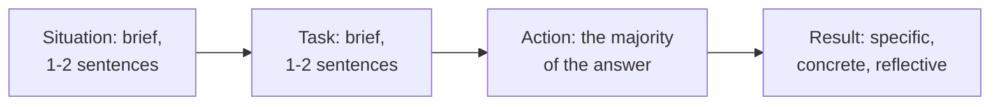

# Behavioral Interviews: The STAR Method for QA

**Prerequisites**: You should already have completed [Presenting Your Testing Work Credibly](/learning-paths/interview-preparation/presenting-your-testing-work-credibly).
**Leads to**: After this, you'll be ready for [Section 1 Review](/learning-paths/interview-preparation/section-1-review).

"Tell me about a time you disagreed with a developer" is one of the most common questions in QA interviews, and one of the most commonly answered badly — not because candidates lack real stories, but because they tell them without structure. This module closes Section 1 with the STAR method, applied specifically to the kinds of stories QA candidates actually have to tell.

## Why This Matters

**A candidate who tells an unstructured story.** Asked about a disagreement with a developer, a candidate starts describing a defect they found, then drifts into background about the project, then the developer's initial pushback, then loses the thread and ends with "...and eventually it got fixed." The interviewer has no clear sense of what the candidate specifically *did*, what their actual reasoning was, or what the concrete outcome was — a real, potentially strong story, told in a way that obscures exactly the information the interviewer needed.

**A candidate who structures the same story with STAR.** A different candidate, telling a comparable story, states the Situation and Task briefly (one sentence each), then spends most of their answer on the Action — specifically what they did, including the evidence they gathered and how they framed the conversation — and closes with a specific, concrete Result. The interviewer walks away with a clear, retrievable picture of exactly how this candidate handles real disagreement, because the structure made the useful information findable.

Both candidates had a genuinely similar real experience. Only one of them told it in a way the interviewer could actually use.

## STAR, Applied to QA-Specific Stories

**Situation**: one or two sentences of context — enough to understand the story, not a full project history.

**Task**: what you specifically needed to accomplish or decide — not what the team's overall goal was.

**Action**: the majority of your answer — what *you* specifically did, including your reasoning, not just what eventually happened. For QA-specific stories, this is where technique matters: naming the specific evidence you gathered (a reproduction, a specific defect report, a specific risk argument) rather than a vague "I pushed back."

**Result**: a specific, concrete outcome — what actually happened, and ideally what you learned or would do differently, which shows reflection rather than just a happy ending.

| Part | Typical Weight | QA-Specific Pitfall |
|---|---|---|
| Situation | Short | Over-explaining project background instead of getting to the point |
| Task | Short | Confusing the team's goal with your own specific responsibility |
| Action | Majority of the answer | Vague ("I pushed back") instead of specific (what evidence, what argument) |
| Result | Short, specific | Ending on "it got fixed" instead of a concrete, measurable outcome |

## What the Interviewer Is Really Evaluating

- **Structured communication under a real, not hypothetical, prompt**: can you organize a genuine memory clearly, on the spot
- **The specificity of the Action**: is there real testing judgment and evidence behind "I pushed back," or is it just an assertion
- **Self-awareness in the Result**: do you show any reflection, or only a favorable outcome with no acknowledgment of what you learned

## Common Mistakes

**Mistake 1: Telling the story chronologically and unstructured, without STAR's deliberate weighting.**
This module's opening scenario's entire gap traces to exactly this — a real story told in a way that buried the useful information.

**Mistake 2: Spending most of the answer on Situation and Task, leaving little room for the Action that actually matters.**
The Action is where your actual judgment shows — under-weighting it wastes the answer's most valuable part.

**Mistake 3: Giving a vague Action ("I raised my concerns") instead of a specific one ("I reproduced the issue three times, documented the exact steps, and showed the developer the specific data corruption it caused").**
Specificity is what separates a credible answer from a generic one.

## Interviewer Expectations

A strong candidate answers a behavioral prompt in under two minutes, spends the majority of that time on the Action, and closes with a specific, concrete Result — including, ideally, a brief note on what they'd do differently, showing reflection rather than just a favorable ending.

:::note From the Field
A candidate asked "tell me about a time you found a critical bug close to a release" answered in under ninety seconds: one sentence of Situation (a payment feature, two days before release), one sentence of Task (verify the fix didn't introduce new risk), a detailed Action (the specific edge case they tested, the specific defect it revealed, how they escalated it with clear severity reasoning), and a specific Result (the release was delayed six hours, the fix shipped correctly, and a regression test was added). The interviewer's feedback specifically cited the answer's structure and pacing as a signal of how the candidate would communicate under real deadline pressure.
:::

:::tip Senior QA Insight
A newer candidate treats behavioral questions as a chance to tell their best story. A senior candidate treats them as a chance to demonstrate structured thinking under a real prompt — the story's content matters less than whether its telling shows the same clarity and judgment the candidate claims to bring to actual testing work.
:::

## Mini Challenge

**Scenario**: You're asked, "Tell me about a time your test coverage missed something important."

**Your task**: Write a STAR-structured answer, explicitly labeling each of the four parts, and check that Action is your longest section.

## Key Takeaways

- STAR's four parts are not equally weighted — Situation and Task should be brief; Action should be the majority of the answer.
- The Action is where real testing judgment shows — vague actions ("I pushed back") are far weaker than specific ones (what evidence, what argument, what technique).
- A Result showing reflection, not just a favorable outcome, demonstrates self-awareness.
- STAR's real value is making a genuine memory retrievable and clear under interview conditions, not inventing a better story.

---

## What You Just Learned

- The STAR structure's four parts and their correct relative weighting for QA-specific stories
- Why the Action section deserves the majority of your answer, and what makes an Action specific rather than vague
- How to close with a Result that shows reflection, not just a favorable ending
- How a well-structured, genuine story communicates more than an unstructured one, even when the underlying experience is similar

**Next:** [Section 1 Review](/learning-paths/interview-preparation/section-1-review)

## Related Topics

- [Presenting Your Testing Work Credibly](/learning-paths/interview-preparation/presenting-your-testing-work-credibly) — The specificity discipline this module's Action section directly applies
- [How QA Interviews Are Structured](/learning-paths/interview-preparation/how-qa-interviews-are-structured) — Where behavioral rounds are identified as their own distinct round type
- [Writing Effective Bug Reports](/learning-paths/manual-testing/writing-effective-bug-reports) — The precision discipline this module's defect-related STAR stories draw on directly

## Glossary

**STAR Method**: A structured format for answering behavioral interview questions — Situation, Task, Action, Result — weighted toward a specific, detailed Action section.

## Quick Revision

Remember these five points:

✓ STAR's four parts aren't equally weighted — Situation and Task should be brief; Action should dominate the answer.
✓ A specific Action (what evidence, what argument, what technique) is far stronger than a vague one.
✓ Close with a specific, concrete Result, ideally including reflection on what you'd do differently.
✓ STAR makes a genuine memory retrievable and clear, not a better story than what actually happened.
✓ Answer in under two minutes — a structured, concise answer reads as more confident than a long, unstructured one.
